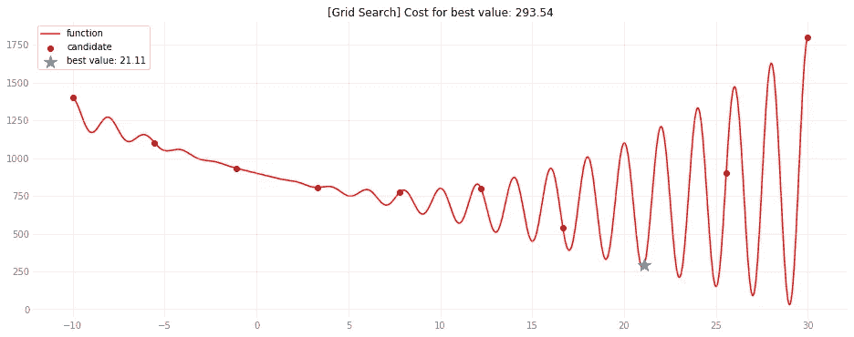
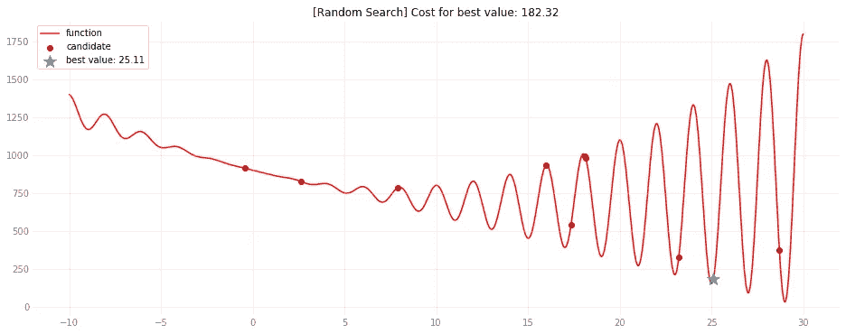
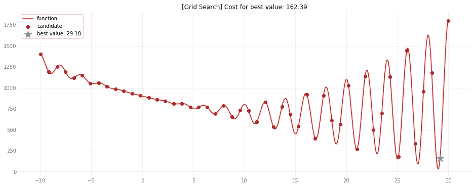
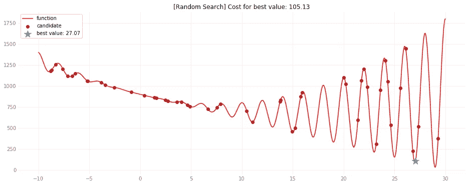
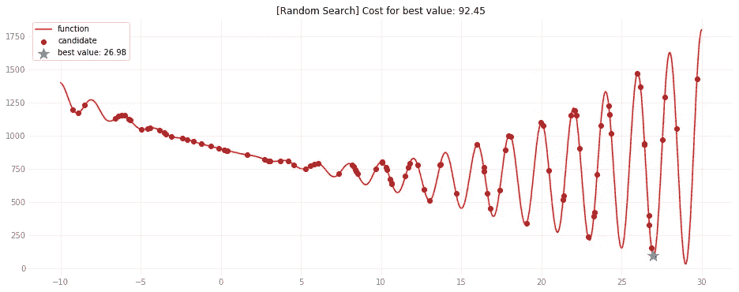
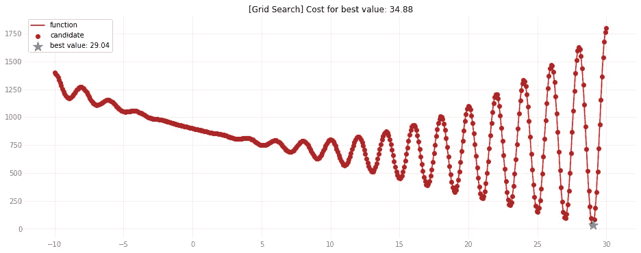
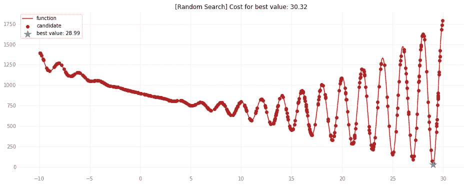

# 超参数优化的随机搜索与网格搜索

> 原文：<https://towardsdatascience.com/random-search-vs-grid-search-for-hyperparameter-optimization-345e1422899d?source=collection_archive---------7----------------------->

网格搜索是一种搜索技术，当涉及到超参数优化时，它已被广泛用于许多机器学习研究中。在探索搜索空间的其他方法中，一个有趣的替代方法是通过使用随机搜索技术来依赖随机性。


Photo by [Andrew Ridley](https://unsplash.com/@aridley88?utm_source=medium&utm_medium=referral) on [Unsplash](https://unsplash.com?utm_source=medium&utm_medium=referral)

# 介绍

机器学习研究人员想要解决的理想问题是承认一个凸目标函数，不需要超参数也不需要松弛，但足够强大，可以在看不见的数据上提供最小的误差。然而，超参数是一种必要的邪恶，它有助于将优化任务引导到搜索空间中的一个区域，该区域将对数据进行最大程度的概括。你可能听说过的一个超参数的例子是神经网络中的学习率。

再深入一点，以正则化线性模型为例。正则项被结合到目标函数中，以便实施确定的惩罚。两种众所周知的方法是对参数向量施加ℓ1-norm 和ℓ2-norm，以分别执行特征选择(套索)和控制模型的复杂性(脊)。

然而，实施处罚本身不足以充分利用正规化的好处。它们的影响需要用受控参数来优化，该受控参数被称为超参数，因为它需要在训练过程之前被设置。对于我之前提到的例子，只需要一个超参数；通常情况下，你会不得不处理一个以上的问题。

除了手动搜索超参数的良好候选值，优化超参数的最基本和最直接的方法是网格搜索(GS)技术。基本上，每个超参数的候选值列表被定义和评估。“网格”这个名称来源于这样一个事实，即所有需要的超参数中的所有可能的候选组合成一种网格。然后选择产生最佳性能的组合，优选在验证集中评估。

例如，假设α和β是将使用 GS 优化的超参数。基于一些假设的知识，我们可以猜测α和β的候选值分别为[1，2，3]和[20，60，80]。因此，我们可以通过以下方式设置值及其组合的网格:

```
 **α   
        1      2      3
   20** (1,20) (2,20) (3,20) **β  60** (1,60) (2,60) (3,60) **80** (1,80) (2,80) (3,80)
```

从我们刚刚建立的网格中，评估每个组合，并选择产生最佳性能的组合。在这个过程之后，也许我们可以发现(3，60)是我们问题的最佳选择。另一方面，全局最小值可能位于(2.57，58)。

然而，如果存在许多超参数并且搜索空间巨大，则该任务开始变得非常耗时，更不用说必须事先提供候选列表*。作为 GS 的替代，你可以通过[随机搜索](https://en.wikipedia.org/wiki/Random_search) (RS)技术来依赖随机性。*

*在文献中，Bergstra & Bengio [1]在他们的论文中表明，在几个数据集上有几个学习算法的情况下，RS 比 GS 更有趣。如果你还没有读这篇论文，花点时间读读，它真的很有趣，有更多的细节需要把握。*

*虽然 RS 很容易理解和实现，但是可以通过使用这个 [python 库](https://github.com/hyperopt/hyperopt)来使用它。除此之外，这个库还提供了我们在这篇文章中没有提到的其他功能，比如并行运行和提供其他相关算法。试试看。*

*为了应用 RS，需要预先指定以下组件: *(i)* 函数，用于衡量候选集的好坏；*(二)*搜索空间；*(三)*试验次数。*

*所选择的候选者是在试验次数内评估目标函数的最佳输出的候选者。请注意，候选集将在运行时选择，*即*不需要像 GS 要求的那样事先指定*。**

**最后，我必须提到还有其他更高级的超参数优化方法，比如贝叶斯优化。如果你的机器学习管道的下一步是超参数优化，去看看他们，但先给 GS 和 RS 一个尝试，也许你很适合使用他们。:-)**

# **密码**

**我会按照我的 jupyter 笔记本，使事情更容易显示。您可以随意运行它或者自己实现代码。请记住，一些代码片段使用在前面的代码片段中实现的代码，因此出现的顺序很重要。**

> ***这篇文章中提到的所有文件都在我的 GitHub 中。查看* [*本回购*](https://github.com/caponetto/jupyter-notebooks) 本回购*出！***

## **设置环境**

**假设你熟悉 [Anaconda](https://www.anaconda.com/) ，我已经准备了一个 *yml* 文件，这样你就可以像我一样快速设置环境，甚至是相同的库版本。这是文件的内容。**

```
**name: grid-vs-random-search
channels:
 — conda-forge
dependencies:
 — python=3.6.9
 — numpy=1.16.5
 — matplotlib=3.1.1
 — jupyter=1.0.0
 — ipython=7.8.0
 — hyperopt=0.1.2**
```

**一旦有了文件，就执行下面的命令来创建环境并安装所有必需的依赖项。**

```
****$ conda env create -f environment.yml****
```

**安装完成后激活环境。**

```
****$ conda activate grid-vs-random-search****
```

**一切就绪！让我们深入一些 python 代码。**

## **配置绘图**

**如果你使用的是 [jupyter 笔记本](https://jupyter.org/)，配置 [matplotlib](https://matplotlib.org/) 显示内嵌图像。否则，只进行导入。**

**Configuring plotting**

## **定义成本函数**

**让我们定义一个非常怪异的非凸函数作为我们的代价函数。以下是我挑选的:**

```
**ƒ(x) = 675 + (x-15)² + x² cos(xπ)**
```

**然后我们可以为它定义一个 lambda，尽管常规函数也是可能的。**

**Defining the cost function**

## **绘制成本函数**

**对我选择的函数的形状感到好奇吗？下面是非常漂亮地绘制它的代码。**

**Plotting the cost function**

**现在我展示我们的成本函数。你可以看到，有许多局部最小值使算法更难找到全局最小值，但一个好的方面是我们可以将其可视化。通常，你将不得不处理不太清楚的函数，更糟糕的是，在多维空间中。这就是为什么我们需要好的搜索算法。请注意，x 轴代表候选超参数，y 轴代表成本，因此越接近零越好。**

****

**Our weird cost function**

## **定义一些助手代码**

**我们需要更多的辅助代码。以下是我是如何实现它们的——我添加了一些注释，以便更容易理解。花点时间去理解这里要做什么。**

**Defining some helper code**

**现在一切都准备好了，让我们做一些实验。正如您在代码中看到的，GS 的候选值将是根据在我们的区间上均匀分布的试验次数的值。另一方面，对于 RS，将按照随机搜索策略动态选择候选对象。运行 GS 和 RS 特定次数的试验后，将打印获胜策略的名称。**

## **实验— 10 次试验**

**在我们的预算中有 10 个试验，让我们看看哪个搜索策略以最低的成本给我们带来价值。**

****

**Grid Search results in 10 trials**

****

**Random Search results in 10 trials**

```
**Result (10 trials): Random Search is the winner!**
```

## **实验— 50 次试验**

**在我们的预算中有 50 次试验，让我们看看哪种搜索策略能以最低的成本给我们带来价值。**

****

**Grid Search results in 50 trials**

****

**Random Search results in 50 trials**

```
**Result (50 trials): Random Search is the winner!**
```

## **实验— 100 次试验**

**在我们的预算中有 100 次试验，让我们看看哪种搜索策略能以最低的成本给我们带来价值。**

****

**Grid Search results in 100 trials**

****

**Random Search results in 100 trials**

```
**Result (100 trials): Random Search is the winner!**
```

## **实验——500 次试验**

**在我们的预算中有 500 次试验，让我们看看哪种搜索策略能以最低的成本给我们带来价值。**

****

**Grid Search results in 500 trials**

****

**Random Search results in 500 trials**

```
**Result (500 trials): Random Search is the winner!**
```

**正如你在所有实验中看到的，RS 能够找到比 GS 更好的值。随着试验次数的增加，两种策略之间的差异变得越来越小，但是 RS 提供的微小改进对于达到您所期望的性能可能是至关重要的。**

## **运行批量实验**

**有人可能会说只有四个实验可能是不可靠的，我完全同意，特别是因为我们正在处理随机的东西。那些实验只是为了给我们一些可视化的提示。因此，让我们批量执行实验，并计算每个策略赢了多少次。每批的实验次数就是试验次数。此外，我们将合计所选值的成本，以获得一些额外的见解。注意，因为 GS 是确定性的，所以对于相同次数的尝试，它将总是返回相同的结果；所以我们只测试 RS。**

**下面是运行这个实验的代码。**

**Running batch experiments**

**结果将以下列结构呈现:**

```
**<execution counter>
Grid Search:   <victory counter>     (<cost sum>)
Random Search: <victory counter>     (<cost sum>)**
```

**这是最终的结果:**

```
**10
Grid Search:	5	(2935.44)
Random Search:	5	(3692.77)50
Grid Search:	16	(8119.40)
Random Search:	34	(6885.77)100
Grid Search:	8	(17449.96)
Random Search:	92	(9118.30)500
Grid Search:	221	(17441.61)
Random Search:	279	(20750.24)**
```

**很酷的结果，不是吗？他们提出了以下见解:**

*   ****10-试验实验**:显然，如果试验次数少，这两种策略都很难，我们可以通过计算平均成本来看出这一点。在实际场景中，尽可能多地设置试验次数是一个好主意。**
*   ****500 个试验的实验**:如果试验的数量足够覆盖 GS 的整个搜索空间，两种策略变得更加等价，正如我们在图中可以看到的。尽管 RS 的成本总和高于 GS，但 RS 给出的最佳值比 GS 多很多倍。**
*   ****50 次试验和 100 次试验**:在这些试验中，RS 表现出了更好的性能，不仅因为它比 GS 赢得了更多的次数，还因为它的成本总和更低。这表明，如果试验数量相当大，但不足以覆盖 GS 的整个搜索空间，那么使用 RS 可能比 GS 更有意义。**

# **结束语**

**在本文中，我们设置并运行了实验来比较网格搜索和随机搜索这两种优化超参数的搜索策略。虽然我们的实验很简单，但它们提供了一些关于不同场景中策略行为的见解。根据我们所看到的一切，我会让您了解一些要点:**

1.  **说到研究，很难说某样东西比另一样好。这个案例也不例外。因此，我建议在优化超参数时尝试这两种策略，可能的话结合使用这两种策略。**
2.  **如果你有很多超参数，搜索空间很尴尬，可以考虑从 rs 开始。找到好的价值后，检查成本是否围绕它们有显著变化。如果是这样，您可以使用 GS 进行微调。**
3.  **独立地，如果你在研究中使用了 GS 或 RS 并得到了好的结果，花些时间研究你得到的价值，*也就是说*不要简单地接受它们。也许这些价值观会让你对你试图解决的问题有新的见解，并可能把你的研究引向新的、更有趣的道路。**

**今天到此为止。感谢阅读！🙂**

# **参考**

**[1] J. Bergstra，Y. Bengio，[随机搜索超参数优化](http://www.jmlr.org/papers/volume13/bergstra12a/bergstra12a.pdf) (2012)，机器学习研究杂志。**