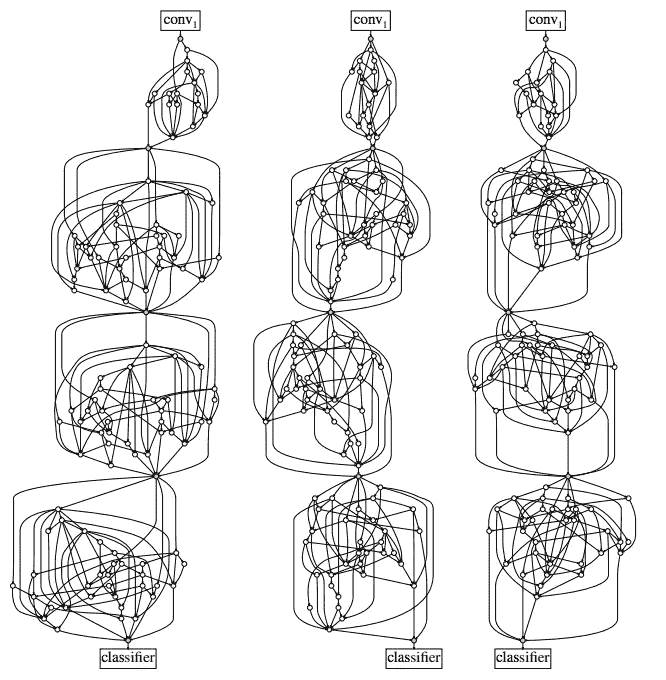
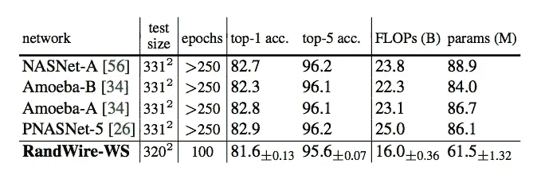

# 随机连线神经网络

> 原文：<https://towardsdatascience.com/randomly-wired-neural-networks-92098dbd5175?source=collection_archive---------14----------------------->

***这篇博文将简要解释什么是神经架构搜索，以及它如何帮助你用数据集实现更好的建模结果。下面是一个论点，说明为什么你应该忽略高级算法，而使用一个简单得多的算法，随机连线神经网络。该算法使用图论和网络科学中的随机图形生成算法，将每个节点上的相同计算固定为 3×3 可分离卷积，并专注于节点之间的数据流(概念上类似于 ResNet 和 DenseNet 等架构)。***

Exploring Randomly Wired Neural Networks for Image Recognition by Saining Xe, Alexander Kirillov, Ross Girshick, Kaiming He

神经结构搜索(NAS)描述了从特征工程→神经网络→自动神经网络设计的范式转变。有了卷积、池化和批处理规范化等构建模块，还不清楚它们是如何组合在一起的。你可以想象把这些积木组装起来，形成一个总的架构；功能强大，足以在图像分类、对象定位、语义分割和图像生成等各种应用中提取有用的特征。然而，在深度学习的当前状态下，你可能会更好地找到一个专门的架构。即使在影像分类问题的子集中，针对数据集进一步专门化的架构也有可能获得最佳结果。

***那么我们如何为我们的数据集找到神经架构呢？***

通常，NAS 算法和研究论文要么关注宏观架构，要么关注微观架构，有时两者都关注(例如 CoDeepNEAT)。微结构设计描述了设计适合宏观结构的数据流和计算模块的技术。设计宏观结构包括一些决策，例如这些模块化构建模块重复多少次，以及这些模块应该有多少种变化。宏架构设计位于超参数优化和 NAS 之间的灰色地带，需要做出决策，例如何时应用空间下采样以及阶段与阶段之间的特征映射数量，阶段描述一组保持相同空间分辨率(有时还有特征维度)的块。

几乎所有流行的 NAS 论文都是手动设计宏观架构。他们部署贝叶斯优化、进化算法、强化学习或可区分架构搜索来找到要集成到宏观框架中的微观/模块化模块。枚举所有微结构在计算上是难以处理的，因此在搜索算法上强加了许多先验。这些先验通常被编码到算法可用的离散搜索空间中。例如，在 NASNet 空间中，每个节点具有固定的输入度 2，并且在微架构中有 5 个这样的节点。

搜索空间中的这些先验/偏差支持一种假设，即基于不同操作的利用来优化配置神经架构。这种假设预测，类似于输入节点通过 3×3 卷积，然后与相同输入的零填充 2×2 最大池处理的结果连接，将是最成功的。显然，这个假设设想了一个更复杂的操作组合，然而我认为这个简单的例子传达了这个想法。

NAS 搜索空间中的这一先验反映了初始网络设计相对于 ResNet 或 DenseNet 设计的偏好。Inception / GoogLeNet 将输入块传递给单独的处理块，如 3x3 最大池和 1x1、3x3 和 5x5 卷积。然后，来自这些块的所有输出或者按元素相加，或者沿着特征轴连接，以形成微单元的输出。

ResNet 和 DenseNets 专注于处理操作之间的**布线**或数据流。

ResNet 使用简单的布线模式，实现了图像分类准确性的突破，并允许训练更深层次的神经网络。ResNet“跳过连接”从前一层(或微架构块)(l-1)获取输入，并将其向前发送到(l+1)。DenseNet 使用更密集的布线模式，将所有先前的输入发送到下一层。例如，层(l+4)将接收输入(l、l+1、l+2 和 l+3)。

**随机连线神经网络**

这篇文章的论点是，在神经架构搜索的背景下，**连线>连接不同的操作**。随机连线的神经网络对每个节点使用相同的运算，即 3×3 深度方向可分离卷积。这些网络不是专注于通过巧妙的路径连接不同滤波器大小的卷积等操作，而是在整个微体系结构中随机连接相同的操作。作者设计了随机有线网络的宏观结构。这包括对要素地图进行空间缩减采样的阶段数以及每个阶段应包含多少个结点等决策。这些网络最终看起来如下图所示:

Exploring Randomly Wired Neural Networks for Image Recognition by Saining Xe, Alexander Kirillov, Ross Girshick, Kaiming He

这些网络是使用随机图算法快速生成的，该算法使用试探法来控制整个网络中节点度(连接数)的分布。最有趣的是，其中一种算法(WS 算法)在网络科学中被用来模拟小世界网络。这描述了我们在社交网络中平均相距 6 跳的社会现象。这篇论文引用了神经科学对这种结构的启发，强调了线虫(蠕虫)的 300 个神经元连接体也具有这种小世界结构。

以下是这些网络与 NAS 方法相比的 ImageNet 性能，NAS 方法需要**巨大的**计算量:

如果你想了解随机连线神经网络论文的完整解释，以及随机图形如何转换为 DAG / CNN，请查看下面的视频！

感谢你阅读这篇关于随机连线神经网络的文章！我希望这能让你相信神经网络的连接是 NAS 未来不可或缺的一部分。此外，我希望您能采用这种算法来加速您的数据集的架构搜索并报告结果！