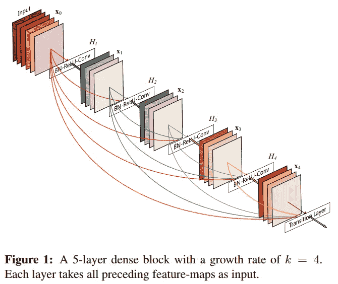
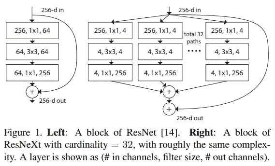
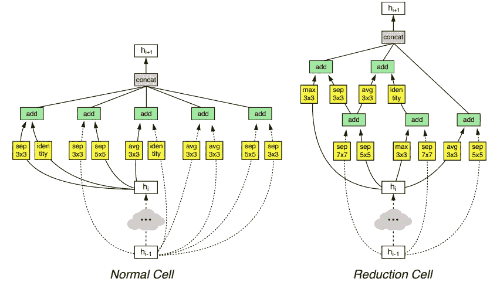
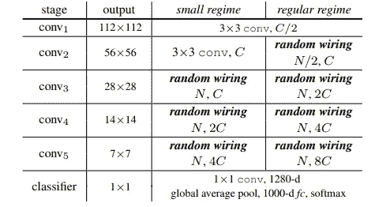
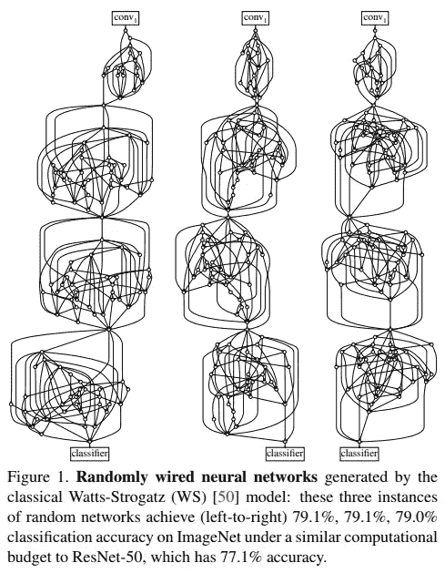

# 随机连线神经网络和最先进的精确度？是的，它有效。

> 原文：<https://towardsdatascience.com/randomly-wired-neural-networks-and-state-of-the-art-accuracy-yes-it-works-9fb3cedc8059?source=collection_archive---------7----------------------->

## 如何设计出*最好的*卷积神经网络(CNN)？

> 想获得灵感？快来加入我的 [**超级行情快讯**](https://www.superquotes.co/?utm_source=mediumtech&utm_medium=web&utm_campaign=sharing) 。😎

尽管深度学习已经存在好几年了，但这仍然是一个没有答案的问题。

设计一个好的神经网络的大部分困难源于它们仍然是黑盒的事实。我们对它们是如何工作的有一些高层次的想法，但是我们并不真正了解它们是如何实现它们所做的结果的。

# CNN 的一些线索

我们可以从一些线索入手。最近的研究为我们提供了一些 CNN 准确性提高的具体证据:

*   提高图像分辨率
*   增加网络深度
*   增加网络宽度
*   添加跳过连接(无论是密集连接还是剩余连接)

从直观的角度来看，深度学习的所有这些补充都是有意义的。提高图像分辨率可为网络提供更多数据。增加宽度和深度给了网络更多的参数。并且增加跳跃连接会增加网络的复杂性，从而增加表示能力。

Dense connections (left, [DenseNet](https://arxiv.org/pdf/1608.06993.pdf)) and skip connections with a wide network (right, [ResNeXt](https://arxiv.org/pdf/1611.05431.pdf)). Sources are linked.

为了发现更强大的网络，谷歌人工智能的研究团队开发了一种技术，让算法*搜索*好的网络。这被称为[神经架构搜索](/everything-you-need-to-know-about-automl-and-neural-architecture-search-8db1863682bf) (NAS)。

# 神经结构搜索

NAS 是*搜索*寻找*最佳* *神经网络架构*的算法。大多数 NAS 算法的工作原理非常相似。

首先定义一组可能用于我们网络的“构建块”。然后尝试通过将这些块的不同组合放在一起来训练网络。通过这种反复试验，NAS 算法将最终找出哪些数据块和哪些配置工作得最好。

事实证明，这种方法效果很好，达到了最先进的精度。它还发现了一些看起来非常奇怪的架构，你可以从下面的官方文件中看到:

NASNet blocks discovered by the NAS algorithm. [Source](https://arxiv.org/pdf/1707.07012.pdf)

NAS 的伟大之处在于，我们可以看到一些神经网络体系结构，否则我们可能根本看不到。

然而，它也有自己的局限性。由于我们是从一组固定的数据块中进行采样，因此我们不会发现任何新的数据块。跳过连接的情况也是如此:NASNet 只允许跳过 1 个下采样级别的连接，但是如果其他类型的连接也可以工作呢？

[脸书的人工智能研究团队](https://ai.facebook.com/)通过尝试*随机连线神经网络，在 NAS 上进行了新的尝试。直觉是，如果体系结构搜索的一般思想对固定的块和连接工作良好，也许用更宽的搜索空间(即随机连接)运行它将导致一些未探索的配置。*

# *随机连线神经网络*

*由于该论文的作者希望特别关注*线路*即神经网络的连接，他们对网络结构做了一些限制:*

*   *输入总是大小为 224x224 的图像*
*   *这些区块总是一个雷鲁-conv-巴特诺姆三联体。三元组中的卷积始终是一个来自[的 3×3 可分卷积，但](https://arxiv.org/pdf/1610.02357.pdf)除外。*
*   *多个张量的聚合(例如当融合与其他张量的跳过连接时)总是以相同的方式完成——通过加权求和。这些权重是可以学习的，并且总是正的。*
*   *网络的*级*总是保持不变。多重卷积块的一般 CNN 结构，随后是下采样，反复重复直到最终的 softmax 分类器，已经成为最先进的网络设计中的标准。在这些研究实验中也采用了这种范式。*

**

*General structure of state-of-the-art CNNs, also adapted for this research. [Source](https://arxiv.org/pdf/1904.01569.pdf)*

*224x224 的输入大小在 ImageNet 竞赛中是非常标准的，ImageNet 数据集用于对其他手工制作的网络以及 NAS 生成的网络进行基准测试。ReLU-Conv-BatchNorm 的三联体阻滞也很常见，并已被广泛证明在整个深层 CNN 中重复时可提供最先进的结果。*

*张量的聚合方式是一个小小的转变。大多数最先进的网络都是直接相加或无权重连接，但这是一个不应该对性能产生太大影响的小加法。上表所示的 CNN 分级设计也已成为 ResNets、DenseNets 和 NASNets 中使用的首选网络结构。*

*注意这并不完全是一个“随机神经网络”。没有完全从零开始的随机化。相反，CNN 设计的单个组件，即布线，在其他组件保持固定的情况下进行探索。*

*这是作者试图向读者传达的一个重要观点。我们还没有做完全随机的神经网络。但是我们开始对组件搜索空间做一些深入的探索——一步一个脚印。*

*有了这些约束，各种经典随机图模型*被用来生成网络的随机布线。**

*我说的随机是指**随机**。*

**

*Some of the randomly wired networks. [Source](https://arxiv.org/pdf/1904.01569.pdf)*

# *随机网络打开了深度学习探索的大门*

*本研究的意义在于其主要的探索性思想:扩展 NAS 算法的搜索空间，以发现新的、更好的网络设计。虽然研究人员自己已经发现了一些伟大的设计，但手动搜索整个搜索空间实际上是不可行的。*

*这也延伸到另一点:如果我们正在扩大我们的搜索空间，我们将需要一个算法，在这种情况下，我们的网络生成器，要真正擅长搜索。它必须知道要寻找什么，或者至少有一些通过设计向它移动的趋势，就像梯度下降工作这样的优化算法一样。*

*架构搜索是深度学习研究的下一个前沿。它允许我们使用算法，而不是试错法来发现最佳架构。*

*目前，修复一些网络组件同时搜索其他组件(在本例中为布线)是有意义的。这就把问题简化成了一件小事，更容易处理。NAS 算法应该有一定程度的随机性，因为这是我们发现真正新颖的架构的唯一方法。*

*下一步当然是进一步扩展搜索空间和我们搜索算法的随机性。这意味着扩展到越来越多的网络组件，直到整个事情都是用算法设计的。*

*当我们放开 NAS 时会发生什么？它会选择像 2x4 这样的非正方形卷积吗？它提议使用反馈回路吗？网络变得更简单还是更复杂？*

*神经结构搜索提出了一个令人兴奋的新的研究领域。希望让搜索算法变得宽松，成为一种利用随机化的方式，为我们的优势，发现创造性的和以前从未想过的架构。*

# *喜欢学习？*

*在[推特](https://twitter.com/GeorgeSeif94)上关注我，我会在那里发布所有最新最棒的人工智能、技术和科学！也在 [LinkedIn](https://www.linkedin.com/in/georgeseif/) 上和我联系吧！*