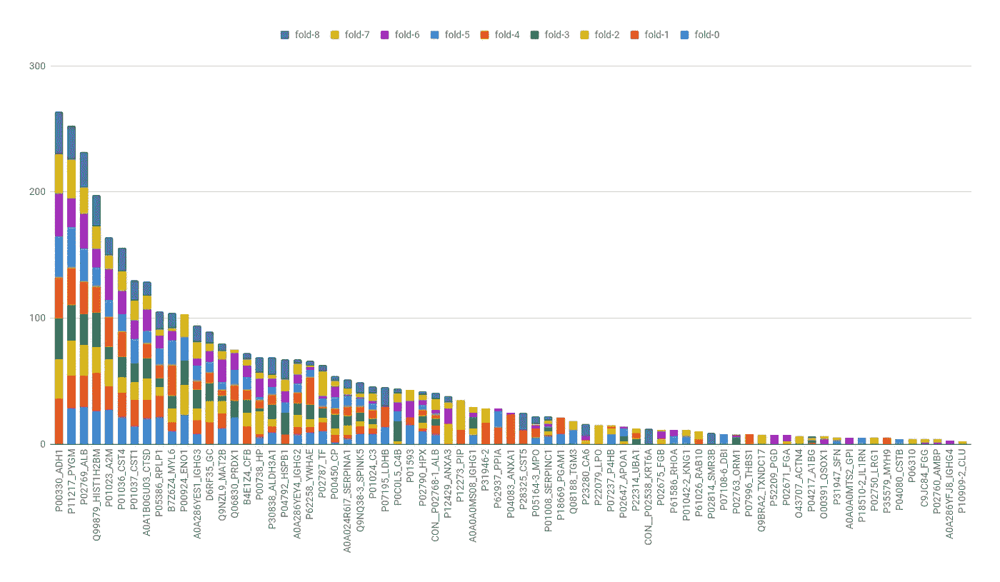
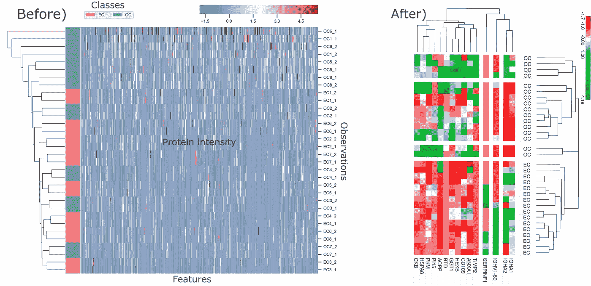
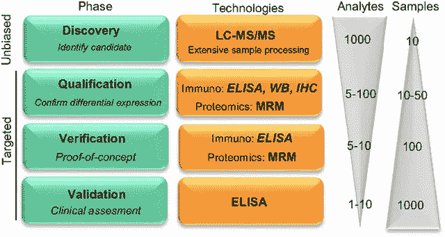
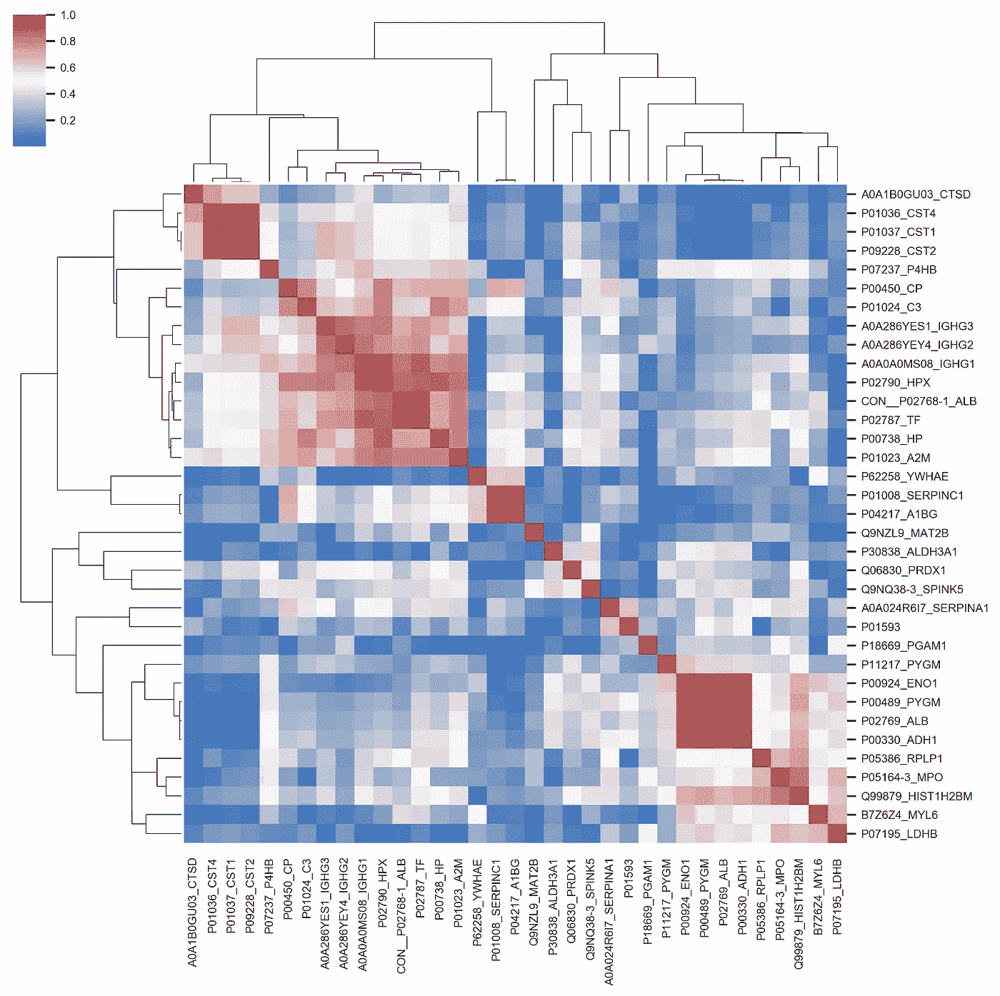
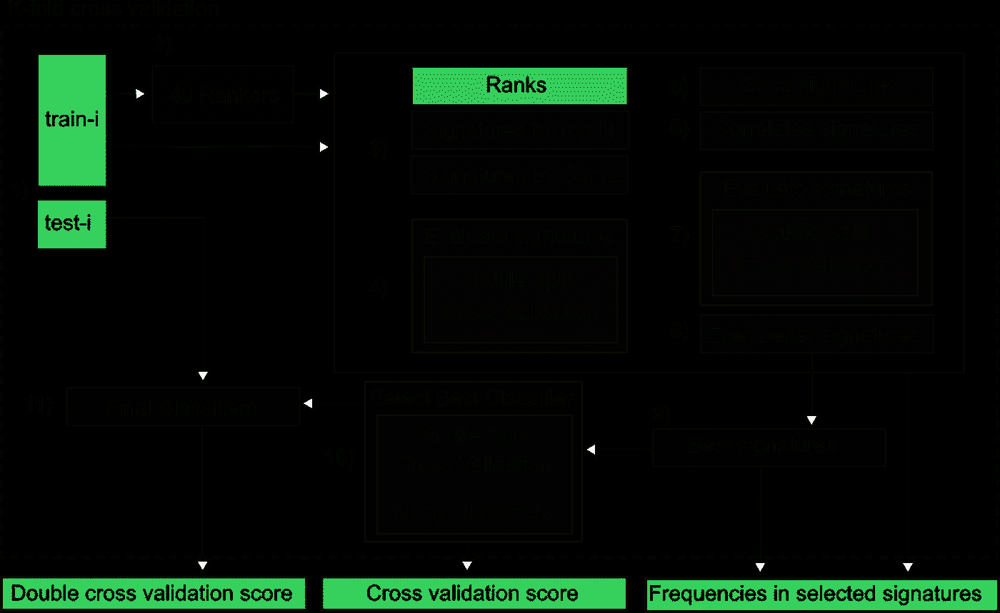
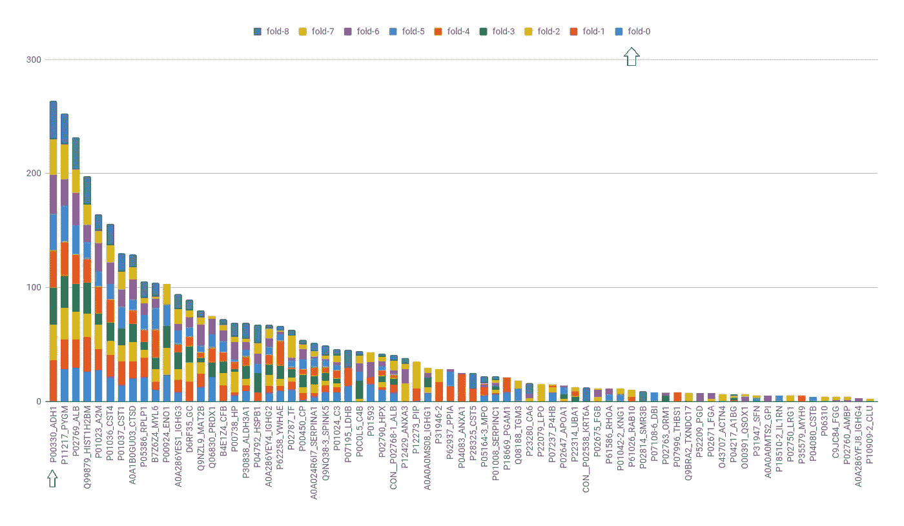
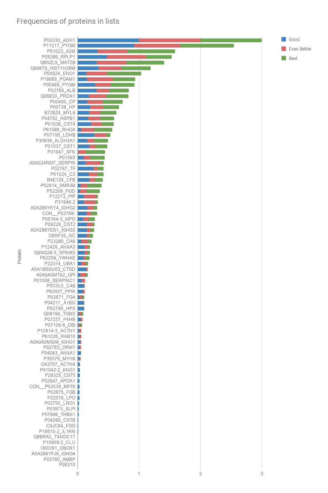
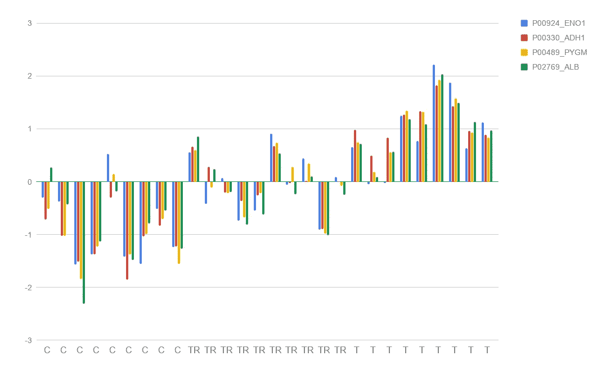
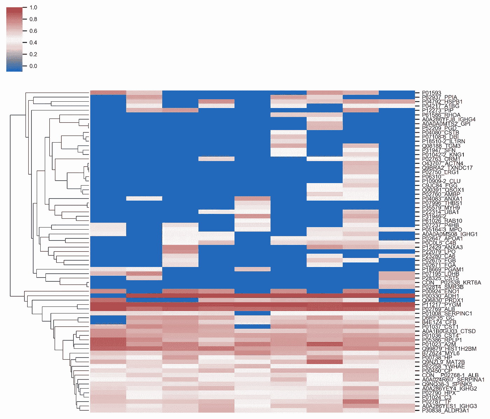

# 对特征进行排序，现在再次排序

> 原文：<https://towardsdatascience.com/rank-the-features-now-rank-again-4dafd8cde3c8?source=collection_archive---------10----------------------->

## 机器学习和生物标记

## 40 种排列你的特征的方法和我的经验使用少量观察选择生物标记候选物(特征)

在这里，我讨论了以 40 种方式对特征进行排序的方法，以及一个不稳定模型的困难情况，这是由于数据中的变量比样本多得多。

作为一个额外收获，你将了解一点应用于癌症生物学的领域，并了解该领域数据集的特征。我解释了一个蛋白质组学数据集，我们用它来验证在发现蛋白质组学中寻找生物标记候选物的方法。

你可以在这里> 找到我的研究文章 [<。
和我在这里的论文:赫伯勒，h .，&明希姆，R. (2019)。*生物学中的计算方法:癌症生物标记、蛋白质网络和横向基因转移*。圣保罗大学，圣卡洛斯。](https://scholar.google.com/citations?user=dgLjTXYAAAAJ&hl=en#d=gs_md_cita-d&u=%2Fcitations%3Fview_op%3Dview_citation%26hl%3Den%26user%3DdgLjTXYAAAAJ%26citation_for_view%3DdgLjTXYAAAAJ%3AmaZDTaKrznsC%26tzom%3D240)[http://www . teses . USP . br/teses/disponiveis/55/55134/TDE-15102019-145225/](http://www.teses.usp.br/teses/disponiveis/55/55134/tde-15102019-145225/)

## 概述

您可以阅读整篇文章或跳到以下部分:

*   **简介** : *我创建基于排名的稳定性管道的原因*
*   **发现特征的重要性** : *小定义*
*   **排名方法** : *对你的特征进行排名的方法*
*   **稳定管道** : *了解稳定方法&特点*
*   **验证和结果** : *通过候选生物标志物的使用案例了解稳定性管道结果*

生物标志物的发现对癌症研究非常重要。例如，我们可以用它们来指导药物发现的实验、新的治疗方法和可以识别是否存在肿瘤或其类型的测试。

> 收集唾液来鉴别癌症比活组织切片检查的侵入性要小得多。

非侵入性测试通常是优选的，并且可以导致更快的诊断，因为它更容易更频繁地执行。例如，如果他们家族中有口腔癌史，或者有增加患癌症几率的习惯，他们可以每年检测唾液。人们试图避免或推迟侵入性或复杂的检查。

> 我们唾液中不同数量的蛋白质可以预测结果。

**Figure 1 —** I call this **The Proteomics Paradox**.Before) Proteomics data with many more features than observations; applying feature selection is a problem because we do not have enough observations. After) the result of a feature selection process on this data set; because we need to. We use this smaller set of features on follow-up experiments so we can increase the number of observations, being able to validate the candidate features with more statistical power (see **Figure 2**). We cannot guarantee they will perform well in follow-up experiments; yet, a decision needs to be made in the first step. With the larger number of observations, we test if the selected features can discriminate the classes. With a good accuracy, we celebrate; with a bad one, we can only test the importance of these features and report if they are good candidates or not, based on the large sample. The search restart removing the bad ones.

# 介绍

想象一下，如果数据中的一个小变化导致了非常不同的特征等级。

在大样本的情况下，你会认为至少排名是相似的。如果样本很小，而且有很多特征，那就不能指望了。

> 我们不能相信这里的结果。我们的样本太小了。然而，我们需要决定什么是我们问题的最佳特征。

如果我们对所有观察运行一个排序器，然后删除一个观察并再次运行排序器，我们将得到两个不同的等级。我们选择哪一个？

如果我对所有观察值使用 T 检验、Wilcoxon 检验或 Kruskal Wallis 检验，删除一个观察值并再次运行，我们将得到不同的 p 值。**我们信任哪一个？**

查看图 1 并阅读图例可以更好地理解它。

> 因为我们的样本太小，没有正确答案！

我们解决问题的方式是利用我们所拥有的，想象结果并采取行动。我们不可能有任何统计上的自信，但我们有能力掌握和理解我们的数据。

在当前的生物标志物发现管道中，由于技术的限制，我们从许多特征和少量观察(小样本)开始。

我们先选择一小组特征，然后在后续实验中增加样本量。下图说明了这些步骤。*【分析物】*是我们的特征，“*样本”*是我们的观察。在初始阶段，我们有许多特征和一些观察，这对于运行任何机器学习或统计方法来说都是一个可怕的场景。

**Figure 2** — Example of a biomarker discovery process. In the first phases, we cannot identify sets of features to discriminate the classes with statistical confidence. Yet, we need to choose a set of features that will be used in the furthers phases, where, because of the smaller number of features, we can increase the number of samples — consequence of limitations of current Proteomics technologies. Source of the image: Del Campo, Marta & Jongbloed, Wesley & Twaalfhoven, Harry & Veerhuis, Robert & Blankenstein, Marinus & Teunissen, Charlotte. (2015). Facilitating the Validation of Novel Protein Biomarkers for Dementia: An Optimal Workflow for the Development of Sandwich Immunoassays. Frontiers in Neurology. 6.

在选择了最佳特性之后，我们可以在下一阶段增加观察的数量，例如在图中所示的验证和确认阶段。

这里的错误决定是有代价的:

> 如果我们最初选择了一组不好的特性，这意味着我们在几个月或几年的研究上浪费了数千美元！我们至少证明了他们不是好的候选人。

现在，这一挑战又增加了一个事实，即这些特征本质上是相互关联的。

**Figure 3** — Example of correlation between features in Discovery Proteomics data. Features (proteins) CST1, CST2 and CST4 are correlated and found in similar quantities in the biological samples. Note: PYGM, ENO1, ALB and ADH1 are highly correlated because they were added to the samples, as I explain later in this article.

*我们体内蛋白质的数量是相互依赖的。它们相互作用来执行过程，就像在一个公司里一样，并影响其他蛋白质的产生；同样，员工可以影响公司的成功和其他因素，并因此影响公司将雇佣多少新员工。*

正如您将在本文中看到的，像 SVM-RFE 这样的方法可能会给高度相关的特征不同的权重，这意味着相似的蛋白质会出现在排序中的遥远位置，从而导致错误的结论和决定。

为了解决这个问题，我使用不同的方法和交叉验证对这些特性进行了一次又一次的排序，并比较了它们的得分。我最终得到一个高评分特性的列表，以及通过跟踪特性的权重和等级位置计算出的**稳定性分数**。

> 军衔之间有许多不同。一种方法会说蛋白质 A 是最好的，而另一种方法会说它是最差的。

有了平均权重，并且知道当数据改变时以及在不同的等级中特征如何表现，我就可以在一定程度上有把握地决定什么是最重要的。

> 通过在生物样品中添加真实标记，我们验证了我们的方法在蛋白质组学中寻找潜在生物标记候选物的相关性。

*我在这里引用的作品是我在圣保罗大学***读博士期间，与* ***巴西生物科学国家实验室、*** *等机构合作完成的更大项目的一部分。**

****GitHub*** *资源库:【https://github.com/heberleh/proteins-stability】**

# **发现特征的重要性**

**有许多方法可以找到作为数字的特征相关性，并选择一组候选特征。我在这里解释了 *top-n selection* 方法以及对特性进行加权和排序的流行方法。**

> **我对我的特征有 40 个不同的观点(等级)。**

**统计方法和不同分类器组合到 6 种排序方法的乘积。**

## **前 N 名功能**

**选择特征以创建模型的一种常见方法是从等级中选择前 N 名。 **Scikit-Learn** 例如，有`SelectPercentile`和`SelectKBest`分别根据最高分的百分比和 k 个最高分来选择特性。**

## **特征的重要性**

**分数或权重是衡量重要性的标准。例如统计测试中的 p 值和线性回归方程中的斜率(系数)。为了创建等级，我们使用这些数字对特征进行排序。**

# **排名方法**

**我结合在 [Scikit-learn](https://scikit-learn.org/stable/) 中定义的单变量和多变量算法实现了六类排序方法。**

**第一类称为**类型 1—单变量**，由单变量方法组成，如 t 检验和[信息增益](https://scikit-learn.org/stable/modules/generated/sklearn.feature_selection.mutual_info_classif.html#sklearn.feature_selection.mutual_info_classif)。**

**其他类别基于多元模型:**

*   ****类型 2 —单一得分**:创建仅考虑一种蛋白质(对于每种可用蛋白质)的分类器，并基于在 k 倍交叉验证中计算的准确度对它们进行排序；**
*   ****类型 3 —属性的权重**:训练分类器，并根据默认的特征加权方法对特征进行排序，例如线性模型的系数—每个特征的重要性通过 coef_ attribute 或 feature_importances_ attribute 获得；**
*   ****类型 4——递归特征消除**:基于权重对特征进行排序，但是重复该过程 N 次，将最差的特征添加到排序的末尾，如针对 SVM- [RFE](https://scikit-learn.org/stable/modules/generated/sklearn.feature_selection.RFE.html#sklearn.feature_selection.RFE) 的情况所解释的；**
*   ****类型 5——稳定性选择**:根据在 bootstrap 采样方案中被选为最佳的频率对特征进行排序。该方法使用 bootstrap 创建许多训练集，对于每个训练集，该算法计算每个特征的权重，并且如果它们的权重大于平均权重，则选择它们。频繁选择的功能被认为是稳定的，并位于排名的开头—查看官方知识库了解详细信息:[https://github.com/scikit-learn-contrib/stability-selection](https://github.com/scikit-learn-contrib/stability-selection)；**
*   ****类型 6 —准确度降低**:使用所有特征计算 k 倍交叉验证准确度，然后，一次移除一个特征并重新计算准确度。与基础精度和移除特征后的精度的差异越大，该特征越相关；**
*   ****类型 7 —递归特征添加:**类似于类型 4。在这种情况下，不是从最差到最好来创建等级，而是通过从训练集中移除最好的特征并将其添加到等级的开始来创建等级，重复该过程直到所有特征都被排序。在我们的测试中，这在我们的蛋白质组学数据中表现得比 RFE 更好，我将在本文的验证部分解释这一点。**

**上述每种基于多变量的排序方法(类型 2 至 7)与不同的分类器结合使用。**

**我用 python 实现了脚本([https://github.com/heberleh/proteins-stability](https://github.com/heberleh/proteins-stability))，并从 scikit-learn 中选择了经典的机器学习工具。仅考虑实现特征权重的分类器:**

*   **线性 SVC**
*   **决策树；**
*   **随机森林；**
*   **套索；**
*   **山脊；**
*   **线性判别分析。**

****共定义了 40 个分级器**，它们是上述分级方法和分类器的组合。**

**在下一节中，我将解释这 40 个排名如何产生数百个待解释的排名，并帮助我们决定在接下来的研究中应该考虑哪些特征。**

> **如果一个大的数据集？— — —**

***这里我们有一个小数据集。您可能会想办法将这些排序方法应用到更大的数据集，例如，通过使用抽样和并行性。如果你有成千上万的观察和特征，你可以:***

1.  ***去掉你知道不好的特征，明显不好的特征；***
2.  **使用随机抽样或分层抽样来选择一组您可以处理的观察值；重复该过程，检查不同样本的要素在相同等级中的表现。**

# **稳定性管道**

**在这个项目中，我们定义了一个分析管道，它结合了对特征进行排序的方法，通过简单和双重交叉验证来识别候选签名。**

**管道的一般概念说明如下:**

****

**Assessment of Stability and Relevance of Features in a Double Cross Validation scheme — 1) The original data set is divided into train and test sets in each iteration ***i*** of the outer loop of the double cross validation (k-fold cross validation). 2) The train set is used to create 40 ranks of proteins. 3) Signatures are created by selecting the top-N proteins and by creating all or random combinations. 4) Each signature is tested in a shuffle split cross validation. 5) Signatures with good score are selected. 6) Highly correlated proteins that were removed between steps 1) and 2) take place of their reference to form new signatures. 7) All signatures are tested again in a shuffle split cross validation, now with a greater number of splits than before. 8) With the new scores, signatures are selected again by a criterion that consider the score, the standard deviation and the frequency of proteins in good signatures. 9) The first round of evaluation of signatures outputs the best signatures, formed by the signatures with the highest scores among the even better signatures. 10) The best signatures are tested again by using different classifier models, including the Bagging and Voting classifiers. 11) The best pairs (signature, classifier) of each signature is tested with the independent test set. In the end of the DCV, the independent test scores are averaged to form the DCV score.**

1.  ****识别并分离相关蛋白质**(训练集中仅保留 1 个代表)——这是减少**多重共线性**的一个步骤。您可能想要搜索线性模型、多重共线性和 VIF。关于主题[的一篇文章在这里](/multicollinearity-in-data-science-c5f6c0fe6edf)。**
2.  ****计算排名**；**
3.  ****根据等级和小组合创建签名**；**
4.  ****评估分类器并选择最好的一个** —这里我创建随机签名(多个模型)并选择平均准确度最高的分类器。这种抽样方法被称为[随机子空间](https://ieeexplore.ieee.org/document/709601)。**
5.  ****使用选择的分类器**评估签名；**
6.  ****识别*好*、*更好*和*最好*签名**；**
7.  ****对于每个最佳签名，选择最佳模型** —签名-分类器对；**
8.  ****计算排名前 10 位的蛋白质的频率**；**
9.  ****计算*好*、*更好*和*最佳*签名**中蛋白质的频率。**

**更一般地说，它创建了由一些分类器/排序器算法认为相关的特征集。然后，它通过建立分类器并使用交叉验证估计它们的预测能力来测试这些特征集。**

> **选择的特征越多，其重要性就越大。**

**这就像一个**贝叶斯方法**，我们会认为一个特征在一个高精度模型中的概率。**

**现在，流水线中有一个外环，一个 k 倍采样。这将创建不同的数据集，对于每个循环，我们可以检查这些频率如何随着数据集的变化而变化。**

**例如，如果一个特征只在第一个循环中出现在许多好的分类模型中，这意味着这个特征实际上是不相关的。**

****

**The most frequent protein in the top-10 positions is the first protein in the plot: P00330_ADH1\. Despite that, in one of the loops of a 9-fold sampling, referred as fold-0, this protein was not among the top-10\. This should be an alert to the expert that is analysing the results. If our full data set was in fact the fold-0 and we decided to select only the top-10 proteins, this interesting protein would not be selected. In fact, as I explain later, this protein must be selected because it is a true marker. It was added in the biological samples so we could track the behaviour of the computational methods and the behavior of the Proteomics quantification technique and protocol. This protocol is not much precise in the Discovery phase because we are quantifying many proteins. Reducing the number of proteins to quantify will allow it to be more precise and increase the number of observations; having as consequence better statistical confidence.**

**这里用每组特征(签名)建立分类器，并且测量它们的准确度以判断相应的签名是好还是不好。**

**等级用于选择用于创建签名的特征。例如，只考虑排名中出现的前 20 个特征。这种启发式方法减少了计算时间。**

**排名也用于计算蛋白质在前 10 位的频率。选择前 10 个特征是 Discovery Proteomics 中的一个经验法则，这 10 个蛋白质然后在我们称为靶向蛋白质组学中进行分析，它们是我们的目标，因为它是一个小集合，我们可以提高精确度和观察的数量。**

**在下面的图片中，你可以看到前 10 个定位蛋白质组中每个蛋白质的出现频率，以及*好*、*更好*和*最好*组签名。**

********

***好的*、*更好的*和*最好的*套件在制造时就考虑到了灵活性。只选择具有最大精确度的模型是不公平的，例如 95%(有数百个具有最大精确度)。因为样本数量很少，我们不应该要求太严格。**

**因此，“好”和“甚至更好”的集合代表了这种灵活性；例如，选择准确率> 90%的模型，然后选择> 93%，最后选择 95%。**

**在所有这些候选签名集上跟踪我们的特征的行为给了我们关于数据的更多信息和信心。在我们的研究中，我们在所有的分析方法中都发现了有趣的模式。**

**最后，在外循环中，最好的模型用独立的测试集再次测试——这导致了我们所说的**双交叉验证** (DCV)。这是一篇关于 DCV 的文章。**

**当我们有一个小的集合时，交叉验证(CV)的主要问题是估计过于乐观。进行 DCV 有助于我们理解简历验证的乐观程度。**

> **根据我的经验，如果我们有 50%的 DCV 误差，我们会做得很好。**

**事实上，即使我们的数据集中有已知的真实标记，当考虑最佳签名时，我们得到的 DCV 误差> 60%。这意味着，尽管签名在交叉验证时工作良好，但在用新的观察结果进行测试时，它们的表现很差。**

**因此，如果我们的目标是减少过度拟合，我们不应该选择具有最高分数的签名。相反，这是分析具有不同 CV 分数的许多模型中特征的频率的动机之一。**

# **验证和结果**

**在本节中，我将解释我们如何在 Discovery Proteomics 中用一个数据集验证我们的方法，以及如何通过我们的稳定性渠道成功地对**真正的标记(特征)进行优先排序。****

**如果我们选择 CV 分数最高的签名，我们最终会得到一个糟糕的 DCV 分数——正如我们所做的那样。出于这个原因，我们实现了分析管道，在这里我们跟踪不同视角下的特性得分。**

> **我在这个项目中展示的总体想法是，当你有少量的观察数据时，你需要掌握数据，并在不同的条件下进行分析。然后，你需要选择启发法来优先考虑你的特性，记住你不应该太严格；您应该定义不同的阈值并进行比较。**

## **真正的正面特征**

***真正积极的*特征(标记)是优先的特征，事实上对我们的问题很重要。*假阳性*可能是被优先考虑的特征，但实际上它们并不会导致我们的类别的差异。**

**我们的目标是分析发现蛋白质组学(小样本和多特征)中计算方法和质谱技术定量的行为。**

> **我们能否通过量化生物样本的蛋白质并用计算方法对其进行排序，从而从生物样本中识别出真正的标记？**

**这个问题的答案是既有又无。**

**不，因为如果你选择了错误的计算方法，他们可能无法识别真正的标记。**

**在我们的实验中，用不同的排序器对相同的数据集进行排序导致了许多分歧。在一些等级中处于顶端位置的蛋白质出现在其他等级中的最后位置。如果你选择了“错误的一群”排名者，你最终会变得极端偏见。**

**是的，因为正如我在我们的方法中所展示的，如果你运行许多方法并结合来自不同角度的信息来对蛋白质进行优先排序，就可以识别出真正的标记。**

**在这里，我向你展示了在我们的管道中计算的频率如何揭示真正的标记作为良好的候选。**

## **真实标记的量化**

**我们真正的标记物是在定量之前在生物样品中定义的。**

**我们在生物样本中加入蛋白质，每堂课的浓度相同；不同班级浓度不同。**

**有三类: **C(对照)**、 **TR(肿瘤切除)**和 **T(肿瘤)**。**

**他们参考了没有癌症的病人、切除了肿瘤的病人和有肿瘤的病人的唾液样本。这些蛋白质定量结果如下所示。**

****

**True markers’ intensities.**

**正如我们所看到的，尽管在一个类别的每个样品中加入了相同浓度的蛋白质，但是它们的定量强度不同。每个班的平均值不一样:C 班-1 左右，TR 班 0 左右，t 班 1 左右。**

## **对特征分数进行排序**

**通过计算排名分数和改变数据集，我们发现了清晰的稳定性模式，如下图所示。**

**总之，我们发现了一组在大多数情况下被选为好的蛋白质，它们在热图中以红色显示。**

****

**Heat map showing the highest 50% average scores from 40 ranks of each protein for each training dataset (column, 9 columns refer to 9-fold sampling). The blue values are low scores or proteins that were removed from the training set due to filtering by p-value. We conclude that many proteins are unstable and it is clear that we have a potential smaller set of proteins (red lines) to be assessed. In fact, with this plot we could have already eliminated the blue lines and re-started the pipeline. In the current project, we just continued with all proteins to see where it would end if this pattern was not revealed.**

**我们还发现了一组频繁出现在排名前 10 位的蛋白质。这些蛋白质及其重量用箱线图表示。箱线图也显示了排名和数据之间的差异。在 B)中，我们有一个更好的权重图，因为我们只考虑每种蛋白质的最佳分数。在 A)中，我们看到所有蛋白质在某一点上都有不好的分数。**

****

**These are proteins that appeared in at least 33% of top-10 positions in ranks. **A**) The box-plot is showing weights from all ranks. **B**) The box-plot is showing the distribution of the 50% highest values from each of the 40 ranks. All the 50% highest values from each loop are considered, meaning we have 9*20=180 scores for each protein. This plot shows us the median of the weights and how they varied among ranks. Note that even if we get only the 50% highest weights, there are proteins which weights varied from 0.4 to 1.0\. This is the instability that we try to address with our analytical pipeline; revealing to the experts that this can happen and showing them protein candidates based on their stability.**

## **特征的频率**

**在对蛋白质进行评分和排序后，管道创建并测试蛋白质签名。下图向我们展示了管道是如何选择蛋白质的。选择的蛋白质越多(横条越大)，它就越稳定和重要。**

**我们发现我们的标记蛋白，真阳性，是前 10 位中出现频率最高的蛋白之一，具有良好/甚至更好/最好的特征。**

**下图显示了在每个折叠(颜色)中，每个蛋白质在每个计算等级的前 10 个位置中被选择的频率。我们可以看到，出现在图中间的蛋白质并不经常位于前 10 位，大多数情况下，它们只在某些折叠中出现在前 10 位。这意味着，根据您从训练集中删除的每个观察结果，该蛋白质不再出现在前 10 位中，这表明如果我们选择该蛋白质用于后续实验，将会出现不稳定性和更高的风险。**

****

**Frequency in top-10 positions, in each fold of the k-fold sampling scheme. Colors represent the folds (different data sets).**

**下图与上图相似。这里，我们不计算前 10 个位置的频率，而是计算被选择形成组*好*、*更好*和*最好*的签名的频率。同样，根据频率标准，在最好的蛋白质中发现了真正的标记。**

****

**Frequency of proteins in signatures.**

# **我是不是穿太多了？**

**是的。我对这个小数据集掌握得越多，就越能适应我的模型。另一方面，我不得不。这是我唯一能想到的理解数据集的微小变化如何改变预测能力的方法。我们在这里假设我们有一组很大的观察值，但是其中可能包含一两个异常值。**

**执行一个简单的 k 倍采样向我们展示了方差。这里，我们使用一个外部 k 折叠，其中有许多 k 折叠，模拟从未考虑选择特征的新样本。如果你想估计所选特征的能力，DCV 是必要的。**

> **最后，你需要展示所有的结果。使用 DCV 误差向专家解释**假阳性**的风险。**

**DCV 方案也给管道带来了一些问题，我将在下面解释——如果您不打算按原样使用这个特定的管道，请跳过它。**

**限制:*因为在 k 倍采样的每次执行中，相关的蛋白质在管道的开始被分离，所以这些蛋白质的频率存在问题。一种标记蛋白可能会从一些训练集中删除，而不会从其他训练集中删除，从而导致频率低于应有的水平。在当前的图表中，你可以看到，即使这些蛋白质出现的次数较少，它们出现的频率也很高。发生这种情况是因为如果它的参考蛋白在一个好的信号中被选择，我将它们添加回去以创建信号——特别是用那个信号中被去除的蛋白替换参考蛋白。这并不理想，因为尽管它们高度相关，但它们可能具有不同的强度。类似的行为也发生在过滤步骤中，例如按 p 值过滤和错误发现率。一种解决方案是在外部 k 倍采样之前移除相关的蛋白质并过滤，但是这并不理想，因为在 DCV 中，我们不希望在 k 倍采样之前应用任何方法，以避免使特征选择过程产生偏差。如果在 DCV 流水线之前删除基于类信息的特征，那么一旦独立的测试集不应该成为任何处理的一部分，你就会使你的结果产生偏差。因此，需要一种更好的算法来跟踪蛋白质对，例如，总是使用相同的蛋白质作为参照。注意，当前版本是并行运行的，很难定义一个确定性的解决方案。然而，目前在管道中间添加蛋白质的方法对于当前的情况工作得很好。***

# **结论**

**我们的管道并不是解决蛋白质排序问题的完美方案。完美的解决方案是将观测次数增加到数千次。**

**因为我们不能增加样本量，所以了解数据的行为对决策非常重要。**

**可视化、重新采样、平均和计算蛋白质的频率来测量它们的稳定性和能力有助于识别和理解蛋白质和方法的行为。**

**通过向生物样品中添加真实标记物，并使用我们的 Discovery 蛋白质组学方案对所有蛋白质进行量化，我们在本地验证了我们的管道。它能够突出真正的标记，如本文中的图所示。**

**在这里，我将其命名为“局部验证”，因为需要使用不同数据集的许多其他研究来实际验证用于任何发现蛋白质组学数据的方法。**

**尽管如此，我们的方法给出了关于机器学习和统计方法的行为的控制和突出信息，以及关于每种蛋白质如何表现这些方法给出的重要性的信息。**

**理解过度拟合很重要，因此它向所有参与该项目的研究人员表明，当我们的样本量小于因子/变量的数量时，我们不应该相信数字和 p 值。**

**在了解假阳性和假阴性的所有风险，以及方法和蛋白质在我们的分析管道中的表现后，我们可以更有信心地进行决策。**

## **关于生物标志物的推荐文献**

*   **Kawahara，r .、Meirelles，G. V .、Heberle，h .、Domingues，R. R .、Granato，D. C .、Yokoo，s .……Leme，A. F. P. (2015)。综合分析选择癌症候选生物标志物进行靶向验证。Oncotarget，6(41)，43635–43652。[https://doi.org/10.18632/oncotarget.6018](https://doi.org/10.18632/oncotarget.6018)**
*   **Carnielli，C. M .，Macedo，C. C. S .，De Rossi，t .，Granato，D. C .，Rivera，c .，Domingues，R. R .，… Paes Leme，A. F. (2018)。结合发现和靶向蛋白质组学揭示口腔癌的预后信号。自然通讯，9(1)，3598。https://doi.org/10.1038/s41467-018-05696-2**
*   **德尔·坎波，玛尔塔&容布勒德，韦斯利&特瓦霍夫，哈里&韦厄斯，罗伯特&布兰肯斯坦，马里努斯&特尼森，夏洛特。(2015).促进痴呆新蛋白质生物标志物的验证:夹心免疫测定发展的最佳工作流程。神经学前沿。6**
*   **y . Cun 和 h . f . frh lich(2012 年)。乳腺癌患者分层的预后基因标记——使用蛋白质-蛋白质相互作用的先验知识的基因选择方法的准确性、稳定性和可解释性。BMC 生物信息学，13(1)，69。【https://doi.org/10.1186/1471-2105-13-69 **
*   **Christin，c .，Hoefsloot，H. C. J .，Smilde，A. K .，Hoekman，b .，Suits，f .，Bischoff，r .，& Horvatovich，P. (2013 年)。临床蛋白质组学中生物标志物发现的特征选择方法的评价。分子和细胞蛋白质组学，12(1)，263–276。[https://doi.org/10.1074/mcp.M112.022566](https://doi.org/10.1074/mcp.M112.022566)**
*   **Rifai，n .，Gillette，M. A .，和 Carr，S. A. (2015)。蛋白质生物标志物的发现和验证:通往临床应用的漫长而不确定的道路。自然生物技术，24(2006 年 9 月)，971–983。[https://doi.org/10.1038/nbt1235](https://doi.org/10.1038/nbt1235)**
*   **Sanavia，f . AIO lli，g . Da San Martino，a . biso gnin 和 Di Camillo，B. (2012 年)。通过在学习过程中整合生物学知识来提高生物标志物列表的稳定性。BMC 生物信息学，13(补编 4)，S22。https://doi.org/10.1186/1471-2105-13-S4-S22**