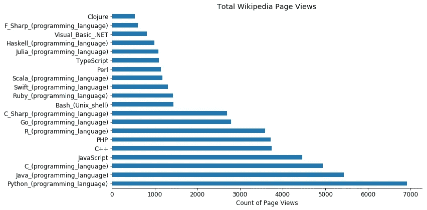
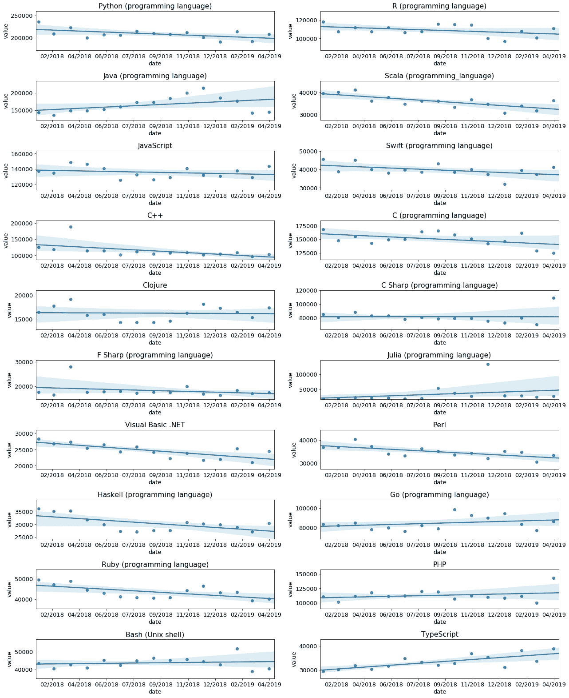

# 通过维基百科页面浏览量对编程语言进行排名

> 原文：<https://towardsdatascience.com/ranking-programming-languages-by-wikipedia-page-views-f810a04ec55b?source=collection_archive---------20----------------------->

## 在 python 中使用 API 和绘图的演示

对编程语言的流行程度进行排名有许多不同的方法。Tiobe Index 是一个流行的网站，它根据流行程度对编程语言进行排名。我还看过一些文章，人们通过查看工作列表的数量或堆栈溢出问题的数量来对编程语言的受欢迎程度进行排名。

今天，我将利用[维基媒体应用编程接口](https://wikimedia.org/api/rest_v1/#/Pageviews%20data)，根据 2018 年初以来的总页面浏览量，对一系列编程语言进行排名。

幸运的是，python 自带了方便的内置请求库，这使得从 API 获取数据变得非常容易。我定义了一个简单的函数来从[页面视图 API](https://wikimedia.org/api/rest_v1/) 获取页面视图数据。

**API 请求函数:**

```
import requests
import numpy as np
import pandas as pddef wikimedia_request(page_name, start_date, end_date = None):
    '''
    A fucntion that makes requests to the wikimedia pagecveiws APIParameters
    ----------
    page_name : string
    A string containing the name of the wikipeida page you would like pageviews for

    start_date : string
    a date string YYYY/MM/DD indicating the first date that the request should return

    end_date : string
    a date string YYYY/MM/DD indicating the last date that the request should return. defaults to system date
    Returns
    -------
    df : pandas DataFrame
    A dataframe with the article name and the number of pageviews.
    '''

    # get rid of the / in the date
    sdate = start_date.split("/")
    # join together the text that was split
    sdate = ''.join(sdate)
    # if an end date is not specified
    if end_date == None:
        #get the current date
        end_date = str(datetime.datetime.now())[0:10].split("-")
        edate = ''.join(end_date)
    else:
        # use date from end_date argument
        edate = end_date.split("/")
        edate = edate[0] + edate[1] + edate[2]
    # use these elements to make an api request
    r = requests.get(
        "[https://wikimedia.org/api/rest_v1/metrics/pageviews/per-article/en.wikipedia.org/all-access/all-agents/{}/daily/{}/{](https://wikimedia.org/api/rest_v1/metrics/pageviews/per-article/en.wikipedia.org/all-access/all-agents/{}/daily/{}/{)}".format(page_name,sdate, edate)
    )
    # get the json
    result = r.json()
    # convert to dateframe
    df = pd.DataFrame(result['items'])
    # the wikimedia api returns 2 extra zeros at the end of the timestamp for some reason
    df['timestamp'] = [i[:-2] for i in df.timestamp]
    # convert to datetime
    df['timestamp'] = pd.to_datetime(df['timestamp'])
    # set timestamp as index
    df.set_index('timestamp', inplace = True)
    # return the article and views columns
    return df[['article', 'views']]
```

一旦定义了这个函数，就可以很容易地与 list comprehension 结合使用，为多个页面创建页面视图的数据框架。我定义了一个我感兴趣的 20 种编程语言的列表(诚然这是一个有点随意的列表，这篇文章主要是为了演示一种技术)，然后就这么做。

```
names = ['Python (programming language)', 'R (programming language)', 'Java (programming language)', 
         'Scala (programming_language)', 'JavaScript', 'Swift (programming language)', 'C++', 
         'C (programming language)', 'Clojure', 'C Sharp (programming language)', 'F Sharp (programming language)',
        'Julia (programming language)', 'Visual Basic .NET', 'Perl', 'Haskell (programming language)',
        'Go (programming language)', 'Ruby (programming language)', 'PHP', 'Bash (Unix shell)', 'TypeScript']dfs = pd.concat([wikimedia_request(x, start_date) for x in names])
```

我个人喜欢 python 列表理解，因为它们允许代码简洁、可读。本文中的大部分内容在其他语言中需要更多的代码。

# 图形流行度:

现在我有了编程语言的数据，我可以使用 pandas 和 matplotlib 创建一个简单的图，看看自 2018 年初以来，哪些语言的搜索量最多。

```
means = dfs.groupby('article').mean()['views']
means.sort_values(ascending = False).plot(kind = 'barh', color ='C0', figsize = (12,6))
plt.title('Total Wikipedia Page Views')
sns.despine()
plt.xlabel('Count of Page Views')
plt.ylabel("")
plt.show()
```



*   在大多数语言排行榜上，python、java、javascript 和 C 争夺榜首
*   从我的数据来看，python 是最受欢迎的
*   Python 的使用在过去几年里一直在增长
*   这对我有好处，因为 python 是我使用的主要语言

我还对每种语言的页面每月搜索量的趋势感兴趣。哪些语言在兴趣上呈上升趋势？哪些语言呈现兴趣下降趋势？

我想制作简单的回归图来评估语言兴趣的时间趋势。这在 python 中有点难做到，因为 seaborn 的 regplot 不接受 datetime 对象。我改编了这个[堆栈溢出](https://stackoverflow.com/questions/29308729/can-i-plot-a-linear-regression-with-datetimes-on-the-x-axis-with-seaborn)答案的代码，用 python 创建了时间序列回归图。

```
def tsregplot(series, ax = None, days_forward = 10, color = 'C0'):
        '''
    A fucntion that makes requests to the wikimedia pagecveiws APIParameters
    ----------
    series : Pandas datetime index Series
    A pandas Series with datetime index

    ax : matplotlib axes object
    A matplotlib axes obect

    days_forward : int
    An integer indicating how many days to extend the regression line. This is set at 10 by default so that all points can show. increasing it can be used to forecast regression line foreward

    color : string
    A matplotlib color string 

    Returns
    -------
    ax : matplotlib axes object
    returns a matplotlib axes object with regplot
    '''
    series = series.reset_index()
    series.columns = ['date', 'value']
    if ax == None:
        series['date_ordinal'] = pd.to_datetime(series['date']).apply(lambda date: date.toordinal())
        ax = sns.regplot(
        data=series,
        x='date_ordinal',
        y='value',
        color = color
        )
        ax.set_xlim(series['date_ordinal'].min() - 2, series['date_ordinal'].max() + days_forward)
        ax.set_ylim(series['value'].min() - 1000, series['value'].max() + 1000)
        ax.set_xlabel('date')
        new_labels = [date.fromordinal(int(item)) for item in ax.get_xticks()]
        ax.set_xticklabels(new_labels)
    else:
        series['date_ordinal'] = pd.to_datetime(series['date']).apply(lambda date: date.toordinal())
        ax = sns.regplot(
        data=series,
        x='date_ordinal',
        y='value',
        ax = ax, 
        color = color
        )

        ax.set_xlim(series['date_ordinal'].min() - 5, series['date_ordinal'].max() + days_forward)
        ax.set_ylim(series['value'].min() * 0.9 , series['value'].max()* 1.1)
        ax.set_xlabel('date')
        new_labels = [date.fromordinal(int(item)).strftime("%m/%Y") for item in ax.get_xticks()]
        ax.set_xticklabels(new_labels)
        return ax
```

我可以创建一个简单的 for 循环，为 20 种语言中的每一种绘制时间序列回归图:

```
fig, ax = plt.subplots(10,2, figsize = (16, 20))
ax = ax.ravel()
counter = 0
for i, j in zip(dfs.article.unique(), names):
    string = i
    selected = dfs.query("article == '{}'".format(string))
    tsregplot(selected['views'].resample('M').sum()[:-1], ax = ax[counter])
    ax[counter].set_title(j)
    plt.tight_layout()
    counter += 1
plt.savefig('trendplots.png')
```



**需要注意的几件事:**

*   基于维基百科的页面浏览量， **python 的兴趣实际上一直在下降**。
*   根据维基百科的页面浏览量，对朱莉娅感兴趣的人可能会增加，但这看起来更像是噪音。
*   基于维基百科页面浏览量，对 Java 的兴趣在增长，对 Scala 的兴趣在萎缩。 [Scala 是 Java](https://medium.com/skedulo-engineering/scala-programming-a-skeptics-journey-ac680053780f) 的一个更简单、更现代的替代品。这让我有点吃惊。
*   人们对打字稿的兴趣急剧增长，这已经在[的许多文章](https://medium.com/javascript-scene/the-typescript-tax-132ff4cb175b)中有所记载
*   根据维基百科的页面浏览量，人们对围棋的兴趣一直在适度增加。GO 经常被认为是服务器语言的 python 杀手。我自己也玩过一点围棋，但并不觉得它对我的工作(主要是数据科学)非常有用。

**结论:**

有许多不同的方法来排列编程语言。我目前找不到任何其他人使用维基百科页面浏览量来对编程语言进行排名(是的，有人可能已经这样做了，但这还不足以找到关于它的文章)。

我认为维基百科的页面浏览量是衡量人们对编程语言或其他公众感兴趣的话题的一种非常合理的方式。当我对一门新的编程语言感兴趣时，维基百科通常是我首先查看的地方。我认为也可以有把握地假设许多其他人也这样做。

[**代码可以在这里找到**](https://github.com/pysr1/wikimediaProgrammingLanguages)