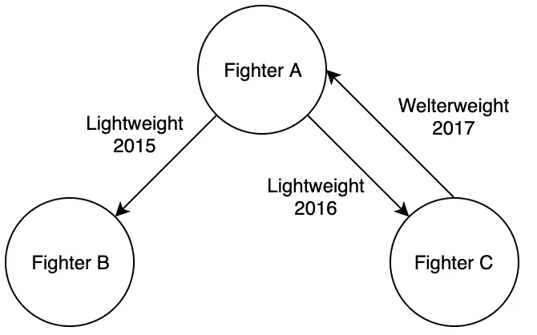
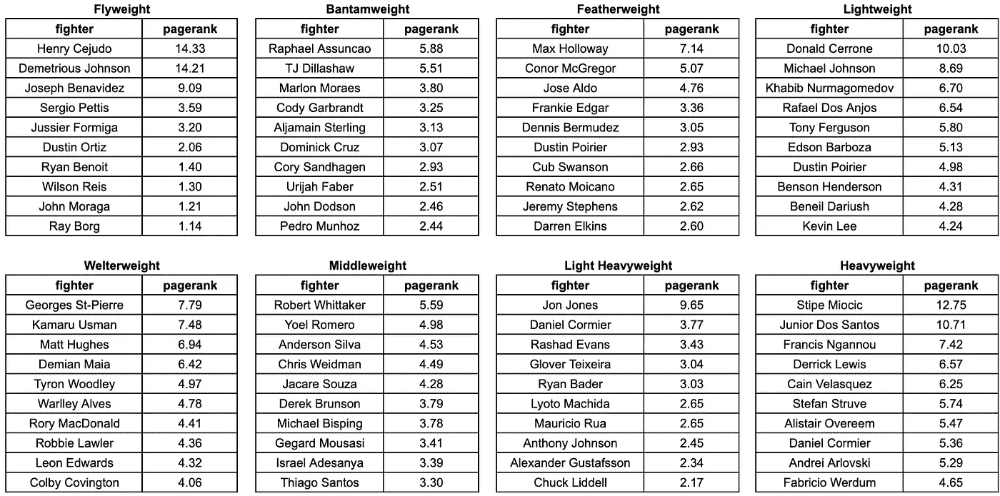
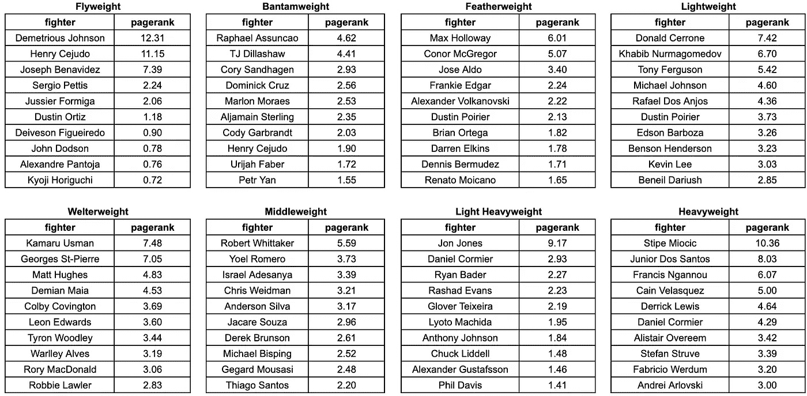

# 使用 PageRank 和 Neo4j 排名最佳 UFC 拳手

> 原文：<https://towardsdatascience.com/ranking-the-best-ufc-fighters-using-pagerank-and-neo4j-5385805b4515?source=collection_archive---------16----------------------->

综合格斗迷和专家们喜欢争论哪些拳手应该被认为是有史以来最伟大的拳手。然而，很多时候，这些排名是战士记录、个人偏见、Reddit 键盘战士的分析和直觉的主观混合。有没有更数据驱动的方式来集结战斗机排名？

在这篇文章中，我将展示如何使用 PageRank 算法(最初由 Google 开发，用于对网页进行排名)和 Neo4j 来对每个 UFC 重量级的最佳拳手进行排名。

## 获取数据

UFC 在 http://ufcstats.com 发布自 1993 年以来所有赛事的比赛结果。为了获得这些数据，我编写了一个 Python scraper 来抓取站点并保存结果。在这篇文章中，我提取了截至 2019 年 9 月 14 日(UFC 战斗之夜 158)的所有战斗数据。更深入的描述和使用例子可以在我的 github [这里](https://github.com/swang2016/ufc_scraper)找到。

当新的 UFC 事件发生时，scraper 检索所有历史战斗结果并用新的结果更新已经保存的数据。虽然没有在此分析中使用，但战斗中的统计数据，如着陆打击和战士属性，如到达，身高和出生日期，也可以使用刮刀。

以下是本文将使用的部分数据:

如上所示，与此分析最相关的四个字段是战士、对手、结果和部门。

## 设计图形数据模型

在将数据加载到 Neo4j 之前，让我们考虑一下我们希望如何在图形中表示数据:

*   每架战斗机将被分配到一个节点。
*   边将被定向，这样如果战士 A 输给战士 B，将会有一条边从战士 A 传到战士 B。
*   比赛的划分和日期将被设置为边的属性。如果战斗机 A 在 2019 年与战斗机 B 在轻量级比赛，那么这些部门和日期属性将位于连接这些战斗机的边上。
*   如果格斗者多次面对面，那么每次格斗都会有不同的边。

我们的图形数据模型的可视化表示如下:

简单地说，上图显示战斗机 A:

*   在 2015 年的一场轻量级比赛中输给了拳手 B
*   2016 年在一场轻量级比赛中输给了战斗机 C
*   2017 年在次中量级赢得了与战斗机 C 的复赛

## 将数据加载到 Neo4j

有了我们的数据模型草图，我们现在可以开始将数据加载到 Neo4j 中。为此，我们将利用 [Py2neo](https://py2neo.org/v4/) ，它允许 Python 与 Neo4j 交互。这使得从 Python 到 Neo4j 的数据工作流更加简单，并且可以将 Cypher 查询结果从 Neo4j 提取回 Python。

下面的要点显示了用于将比赛结果数据从 pandas 数据帧加载到在默认设置下运行的本地 Neo4j 实例中的代码:

在上面的代码中，我们只查看 fights 数据帧的 results 列中带有“W”的行，因为输的行只是赢的行的镜像(fighter 和 counter 对调)。对于每一场战斗，如果没有节点存在，我们为战斗者和他/她的对手创建节点，或者使用 Cypher 的`MERGE`子句将它们与已存在的节点匹配。再次使用`MERGE`,我们创建了战斗的输家和赢家之间的有向边关系。战斗机名称、部门、日期和方法等属性作为参数传入，这些参数被分配给图的节点或边的属性。

一旦加载了数据，我们就可以在 Neo4j 的浏览器中查看可视化的图表。以下是一个查询的结果，显示了康纳·麦格雷戈的所有对手，以及他们如何对付康纳和对方:

## PageRank 的一个非常简短的解释

最初由拉里·佩奇和谢尔盖·布林开发的 [PageRank](https://en.wikipedia.org/wiki/PageRank) 被用于谷歌的搜索引擎，对链接网页的相关性进行排名。在有向图中使用网页作为节点，链接作为边，PageRank 的大致思路如下:

*   有许多其他页面链接到它的页面将有更高的相关性
*   拥有来自高相关性页面的链接增加了相关性
*   页面将相关性传递给它们链接到的邻居

以最初的网页排名用例为例，像 Twitter 这样的网站会有很高的 PageRank，因为有许多其他网站链接到它。同样，从 PageRank 的角度来看，一个带有 Twitter 等热门网站链接的网站也具有很高的相关性。下图展示了这一想法:

Source: Wikipedia

节点 B 具有最高的 PageRank，因为它不仅有许多链接到它的节点，还因为它有来自具有相对高相关性的节点的链接。尽管节点 C 只有一条指向它的链路，但它有很高的 PageRank，因为这条链路来自网络中最重要的节点 B。节点 A、D 和 F 的网页级别较低，因为它们只有几个相对不重要的节点与之链接。

理解了上面的例子，我们就可以看到 PageRank 也可以翻译成 UFC 战士了。具有更多胜利(更多边传入)和战胜高排名战士(来自重要节点的传入边)的战士将具有更高的 PageRank 排名。

虽然简短，但对 PageRank 的解释有望提供算法如何工作的一般概念。对于那些有兴趣了解更多的人，这个[视频系列](https://www.youtube.com/watch?v=fL41WSVDunM&list=PLLssT5z_DsK9JDLcT8T62VtzwyW9LNepV&index=5)的视频 5-10 提供了一个很好的解释。

## 将 PageRank 应用于 UFC

方便的是，Neo4j 已经提供了 PageRank 的实现，所以我们可以很容易地将该算法应用于我们的 UFC 图。再次使用 Py2neo，下面的代码计算每个师的战斗机 PageRank 分数:

下面我们可以看到 PageRank 是如何对男女各个组别的前 10 名最佳拳手进行排名的:

Men’s top 10 PageRank scores by division

Women’s top 10 PageRank scores by division

## 调整 PageRank 分数

虽然 PageRank 排名看起来基本正确，但也有一些情况下粉丝可能会觉得有问题。例如，目前的轻量级冠军和不败拳手哈比布·努尔马戈梅多夫在历史排名中排名第三，尽管他击败了排名第二的迈克尔·约翰逊。约翰逊自己的排名似乎太高了，因为他在轻量级比赛中输了 8 次，所有这些都是由排名低于他的拳手造成的。此外，将唐纳德·赛罗内列为有史以来第一轻量级拳手是有问题的，因为他从未赢得过金腰带，也输给了许多排名低于他的拳手。

同样，在重量级比赛中，一些人可能会对前冠军丹尼尔·科米尔排名低于竞争者德里克·刘易斯四位提出异议，尽管科尔米耶此前击败了刘易斯和排名第一的斯蒂佩·米奥西奇。

这些差异从何而来？回想一下，PageRank 在计算分数时会考虑节点的传入边数。因此，总胜率越多(进洞边数越多)的拳手，他们的 PageRank 分数将会提高。因此，看起来 PageRank 的排名过于看重胜利的数量，或许也稍微低估了失败的数量。

最明显的例子是在轻量级比赛中，目前的冠军 Khabib Nurmagomedov 的记录是 12–0–0(W-L-D ),但仅排名第三，而排名第一的 Donald Cerrone 的记录是 17–6–0。Cerrone 比 Nurmagomedov 赢的多，主要是因为在 UFC 轻量级比赛中打得多(Nurmagomedov: 12，Cerrone: 23)。因此，尽管是冠军，尽管击败了排名很高的拳手，Nurmagomedov 的 PageRank 分数相对于 Cerrone 的有所下降，因为他的总比赛次数较少。

同样，迈克尔·约翰逊的第二总排名看起来很奇怪，因为约翰逊的记录是 9-8-0，其中包括输给努尔马戈梅多夫。事实上，约翰逊已经战胜了几个排名很高的轻量级选手，包括托尼·弗格森(第 5 名)、埃德森·巴尔沃萨(第 6 名)和达斯汀·普瓦里耶(第 7 名)，这有助于提高他的 PageRank 得分。然而，他在轻量级比赛中仅有 0.50 的战绩让人质疑他的第二名排名，并表明损失并没有得到应有的重视。

基于上面的观察，我们需要以某种方式将拳手的记录纳入排名，这样胜率高或输球少的拳手的 PageRank 分数就会提高。

***个性化页面排名***

一种可能的方法是使用一种叫做[个性化页面排名](https://www.youtube.com/watch?v=URaS1u-Murc)的页面排名算法。非常概括地说，个性化页面排名有利地偏向网络中的某些节点，从而增加这些节点的得分。但是，指定哪些节点应该接收偏置可能有点随意，并且可能会根据选择的节点而显著改变结果。例如，下表显示了轻量级部门的个性化页面排名，使用两种不同的标准来选择有偏向的节点:

Left: Personalized PageRank rankings with biased nodes of Khabib Nurmagomedov and Tony Ferguson. Right: Personalized PageRank rankings with biased nodes of Khabib Nurmagomedov, Tony Ferguson, and Gregor Gillespie

左边的表格使用偏向节点选择标准，即≥ 10 次战斗和≥ 90%的胜率，而右边的表格使用≥ 6 次战斗和≥ 90%的胜率。正如我们所看到的，第二个选择标准增加了一个额外的有偏向的节点，这导致了一个非常戏剧性的变化；Gregor Gillepsie 曾在左侧表格中排名第 60 位，当被列入有偏见的节点时，他突然上升到第 3 位。鉴于这些结果，选择有偏向的节点用于个性化 PageRank 可能不是最好的主意，因为 a)选择标准可以是任意的，b)结果根据选择的节点而显著变化。

对于感兴趣的人，这里是 Neo4j Cypher 查询，用于返回个性化的 PageRank 分数:

***非二进制偏置节点选择***

上述问题的一个潜在解决方法是对每个节点应用一个权重，可能是战士的胜率或 1/损失，并使用这些权重来计算每个节点的偏差。因此，不是二元选择是否偏置特定节点，而是每个节点基于它们的胜率或损失率接收不同程度的偏置。

不幸的是，Neo4j 目前还不支持这一功能，尽管根据 Neo4j 的 github 上的这个[公开问题](https://github.com/neo4j-contrib/neo4j-graph-algorithms/issues/271)，它似乎正在工作中。我可能会写一个后续在未来当这是补充。

***按胜率加权 page rank***

将拳手的记录纳入排名的最简单的方法是简单地将每个拳手的 PageRank 乘以他们的 win %。虽然并不完美(失败会对战斗较少的战士产生更大的影响)，但这将有助于平衡这样一个事实，即一些战士赢得更多，主要是因为总体上有更多的战斗，同时也增加了失败的影响。

使用该方法得到的修正排名(PageRank * Win %)如下表所示:

Men’s rankings: PageRank * win %

Women’s rankings: PageRank * win %

虽然很主观，但对以上修订排名的评估感觉更好。在轻量级比赛中，Khabib Nurmagomedov 和 Tony Ferguson 分别排名第二和第三，而迈克尔·约翰逊跌至第四。虽然唐纳德·塞罗内仍然保持第一名的位置，但塞罗内和努尔马戈梅多夫之间的差距已经明显缩小。在重量级比赛中，前冠军丹尼尔·科米尔从第八名上升到第六名，虽然在我看来还是有点低(应该比排名第五的德里克·路易斯高)，但这是一个更合理的排名。

## 结论

在这篇文章中，我们展示了如何使用 PageRank 对 UFC 战士进行排名，并找出每个组别中的最佳选手。虽然不完美(大多数排名都不完美)，但 PageRank 似乎在战士排名方面做得相对不错。

一个潜在的进一步改进是考虑战士的年龄。一些伟大的战士继续战斗，直到过了他们的巅峰时期，并遭受损失，这降低了他们的 PageRank 分数，增加了击败他们的人。很好的例子是中量级伟大的安德森·席尔瓦，他在过去的五场比赛中取得了 1 胜 4 负的成绩，以及轻量级传奇人物 BJ·佩恩，他在过去的五场比赛中取得了 0 胜 5 负的成绩。在一个伟大的斗士暮年打败他，不应该等同于在他全盛时期打败他。如果我们想找到最好的全盛时期的拳手，考虑年龄似乎是必要的。

也就是说，也许知道什么时候挂掉他们也是一个伟大的战士变得伟大的原因。

对于那些想自己探索数据的人来说，所有代码和数据都可以在我的 [github](https://github.com/swang2016/ufc_scraper) 上找到。

对于 UFC/MMA 的粉丝来说，这些排名和你自己的相比如何？