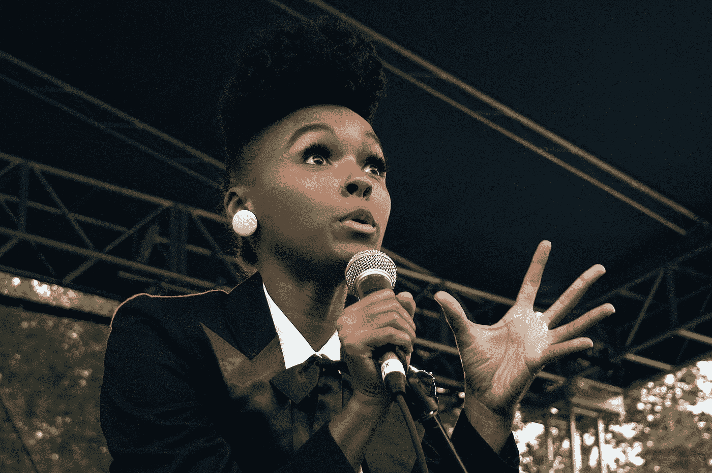
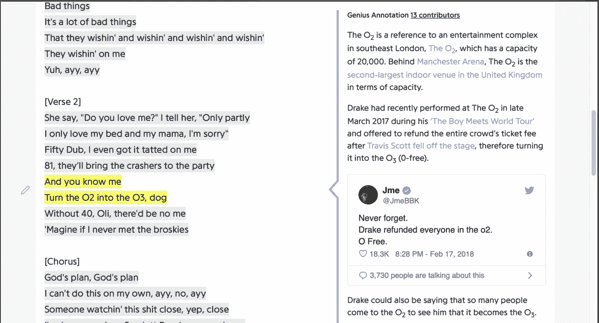
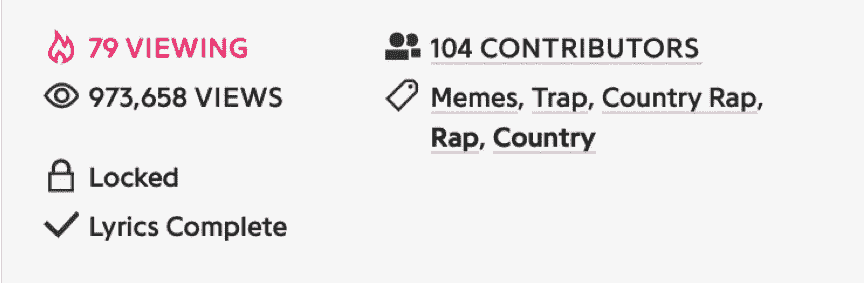
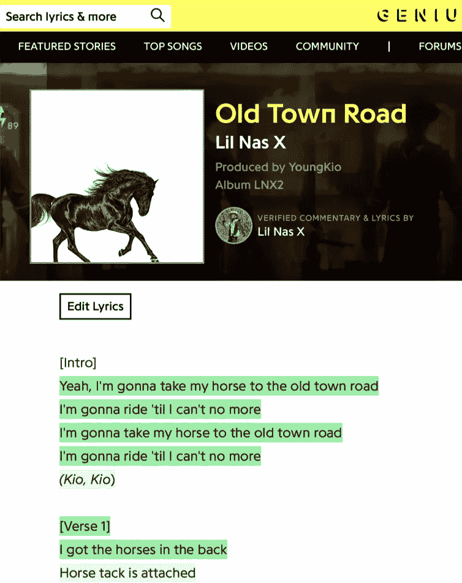
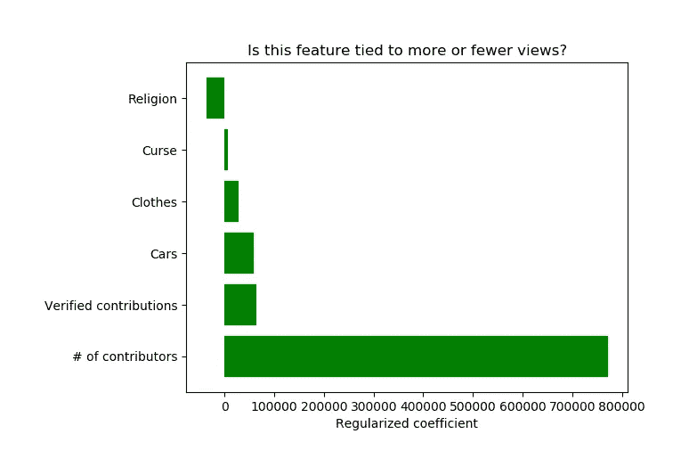
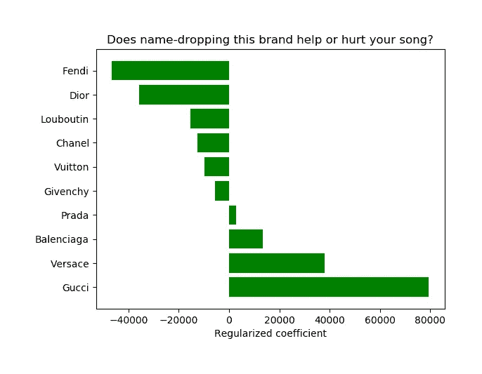
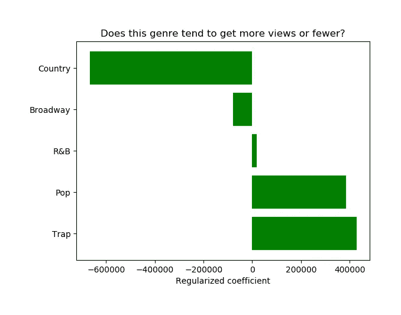

# 说唱(机器)天才

> 原文：<https://towardsdatascience.com/rap-machine-genius-935db7a260b?source=collection_archive---------36----------------------->

## 一个有抱负的说唱歌手应该关注哪些话题才能在 Genius.com 走红？简单回归分析

## 最大化观点的创造性咨询

[Janelle Monae, by Shawn Anderson](https://www.flickr.com/photos/drakelelane/3899105761/in/photolist-6WxWip-9JtEyZ-cuQKy3-cuQJCC-cuQFgf-cuQCeC-cuQGe1-cuQEH5-cuQJ7h-cuQCNW-9Vi5aZ-9VkUed-dej5ou-8ZdrB6-oq4yCb-8ZdrxT-dej61W-298Y8zH-9XUAgh-8F1KLK-g4d5oH-5nhcsF-g4d2HH-NquJds-bBowk5-8ZdsaZ-8ZdrGi-8ZdrrF-g4dsEV-9XUAhb-9XRGJT-8Zds5F-g4dfq7-89aU5D-g4dwvF-9MSj9u-g4egnJ-92pRr8-8Zguyj-g4eHUG-pRt9nS-g4eA14-29qKsp9-2axQNiK-29qKsyh-29aR7vR-29aR7qv-8F1KY2-g9bF72-9kf89H/) ([Creative Commons license](https://creativecommons.org/licenses/by-nc/2.0/))

# 1.主要前提

## a.激励性问题

对于[我的回归项目](https://github.com/natdennett/rap_machine_genius)，我从以下前提开始:假设我的朋友 Janelle 是一名有抱负的说唱歌手，她筹集的资金只够下周举行一次录制。这是她走红的机会，但她需要帮助决定录制哪些歌曲。在工作室的有限时间里，Janelle 应该做关于她的宗教信仰的那个，还是关于高级时装的那个？她能在不咒骂或吹嘘她希望拥有的豪车的情况下获得关注吗？

## b.衡量一首歌的受欢迎程度

当然，如今衡量一首歌曲成功与否的最佳指标必须包含音乐流数据，因为这是目前大多数人听音乐的方式。但听众分散在多个服务中，包括 Spotify、Apple Music、Tidal、YouTube 等。即使假设他们公开了他们的数据，也很难将它们收集并汇编成一个单一的数据集。

## c.警告

人们听一首歌的原因有很多，与歌词无关:也许他们已经喜欢上了这个艺术家，也许节拍非常适合跳舞，也许旋律非常吸引人。但没关系——我在这里的目的不是建立一个模型来预测准确的点击量，而是梳理出话题和流行度之间的一些关系。

# 2.网页抓取

## a.Genius.com

我决定从歌词网站 Genius.com 收集信息。这是一个网站，提供一首歌的原始歌词，加上解释歌词意义的众包注释。假设你正在听德雷克的《上帝的计划》，歌词“把 O2 变成 O3”让你挠头。你可以访问这首歌在 Genius.com 的页面，了解 Travis Scott 在伦敦 O2 arena 与 Drake 一起表演时从舞台上摔了下来。整个人群都退了款，把 O2 变成了“O-free”

为了方便起见，Genius.com 公开了页面浏览量。当然，歌词特别复杂、引用模糊的流行歌曲在那里吸引的浏览量可能比你根据其受欢迎程度预计的要多。但接下来，我会把一首歌在 Genius.com 的浏览量作为一首歌受欢迎程度的代表。

## b.Selenium Chrome 驱动程序抓取的数据

下一步是收集数据。我用 Selenium Chrome 驱动程序抓取了被赋予说唱标签的前 1000 首歌曲的页面链接。

然后我访问了列表中的每一页，收集了以下数据:歌词本身、浏览量、与歌曲相关的标签以及为解释歌曲歌词而贡献注释的人数。

我还跟踪艺术家、歌曲作者或制作人是否提交了歌词的解释。该网站称之为“经过验证的评论”,并用绿色而非灰色标记这些注释(见下文)。

## c.特征工程

一旦我获得了 1，000 首歌曲中每一首歌曲的信息，我就使用一个简单的词袋模型来计算某个词在一首歌曲中出现的次数，然后根据歌曲中的词数对该计数进行归一化。例如,“服装”主题的特色是品牌名称，如“古驰”、“芬迪”、“普拉达”、“路易威登”、“迪奥”等。“诅咒”主题包含了 FCC 68 个禁用词中的大多数，“汽车”主题包含了特别著名的豪华汽车的品牌名称，如“布加迪”、“保时捷”和“法拉利”，而“宗教”主题包含了“上帝”、“主”、“耶稣”、“魔鬼”和“信仰”等词。

# 3.探索性数据分析

也许不出所料，大多数歌曲的歌词都很直白:除了 83 首以外，所有歌曲都带有某种诅咒的字眼。

快速的理智检查表明，我的话题确实找到了正确的歌曲:“衣服”指标中得分最高的歌曲是 Migos 的 [*【范思哲】*](https://genius.com/Migos-versace-lyrics)[*Lil Pump 的*](https://genius.com/Lil-pump-gucci-gang-lyrics)和 Kreayshawn 的*古驰古驰*。《汽车总动员》也是如此:最佳射手是艾斯胡德的布加迪和美联社的 Yamborghini High。《诅咒》中出现了一些脏话，看到 Kanye West 在“宗教”指标上名列前茅，我并不感到惊讶。

# 4.建模

在确保数据相对干净，功能按照我预期的方式运行之后，我使用普通的最小二乘法建立了一个简单的线性回归模型，以页面浏览量为目标。然后，我应用了一个标准的缩放变换，接着是岭正则化，这样我就可以并排比较各种特征的系数。

## a.最大特点:观众参与

让我们从两个最强的结果开始，它们具有高系数*和*低 p 值。越多人对一首歌的页面做出贡献，这首歌的页面浏览量就越多。拥有一个“经过验证的”投稿人对页面浏览量也有积极的影响。

## b.话题强度

就主题而言，唯一对页面浏览量有负面影响的是“宗教”类别。这是否意味着坎耶·韦斯特是对的？在*中，耶稣行走* (2004)，韦斯特斥责道:

> *他们说你可以说唱任何东西，除了耶稣*
> 
> 这意味着枪支、性、谎言、录像带
> 
> 但是如果我谈论上帝，我的唱片就不能播放了，嗯？

没那么快。p 值有些高:0.23。相比之下，“汽车”功能对查看次数有积极影响，但其 p 值为 0.06，非常接近 0.05 的标准统计意义阈值。咒骂和奢侈服装有正系数，但它们也有较高的 p 值(分别为 0.842 和 0.358)。

# 5.结论

## a.主题

那么，我会给我的朋友詹妮尔什么建议呢？我会建议她在宗教方面坚持己见。当然，系数是负的，但说唱歌手谈论他们的信仰并不常见，所以这可能有助于她脱颖而出。同样的，她不应该觉得为了适应而不得不诅咒。不过，她可能会发现谈论豪华车对她有利。她可以说唱她有多不在乎他们，并且仍然从这种观察到的提升中受益！

## b.观众参与度

一旦这些歌曲向公众发布，我会请我的朋友们为 Genius 添加注释，因为这似乎会增加浏览量。Janelle 也应该自愿做出“经过验证”的贡献！这将提升观点，也确保人们明白她想说什么。

PS:作为一个额外的奖励，只是为了好玩，这里是各种服装品牌和流派标签在页面浏览量上的相对效果。

