# 用 Azure 实现快速计算机视觉原型

> 原文：<https://towardsdatascience.com/rapid-computer-vision-prototyping-with-azure-f051cc7462b7?source=collection_archive---------16----------------------->

*本帖由亚历克斯·阿库洛夫和* [*瑞安·佩曼*](https://medium.com/u/1e31d60df1b1?source=post_page-----f051cc7462b7--------------------------------) *合著，来自 Omnia AI，德勤加拿大的 AI 实践*

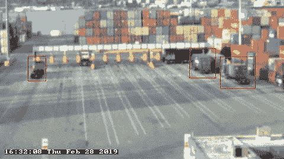

*Object-detecting trucks using a computer vision model on Azure Custom Vision*

想象一下，快速构建和部署一个最先进的对象检测模型，而无需编写一行代码。计算机视觉工具和软件已经走过了漫长的道路，使这成为现实。

几年前，你必须知道如何编码，熟悉深度学习框架，并有耐心解读错综复杂的研究论文。在本文中，我们将向您展示如何在几分钟内构建一个对象检测原型模型，并解释新兴工具如何帮助“民主化”计算机视觉解决方案的创建。

> Azure Custom Vision 让您无需编写一行代码即可构建和部署对象检测模型。

所有主要的云提供商都在竞相提供预构建的计算机视觉模型。从场景检测和内容审核到文本提取和情绪智能，这些现在都可以轻松实现。

然而，当谈到超越常见用例的界限时，AWS 和 Google 会向您介绍他们各自的数据科学笔记本环境。我们发现 Azure 采取了不同的方法。它的定制视觉产品让您无需编写一行代码即可构建和部署对象检测模型。对于想要测试他们的计算机视觉想法的团队来说，这意味着温和的学习曲线和快速的原型制作。

但是首先，这个想法应该解决一个适合计算机视觉的问题。

## 确定要解决的业务问题

计算机视觉模型应该为决策提供信息。在商业上，没有为了 AI 而 AI 的地方。总体业务目标是什么？阻碍我们实现目标的问题是什么？是否有图像或视频可以用于深度学习应用？这些是在识别计算机视觉的商业应用时要问的一些关键问题。

我们的目标是展示 Azure Custom Vision 的功能。为此，我们选择了一个监测港口作业中卡车到码头交通的样本问题。

在这一过程中，集中运营协调员必须通过实时视频传输(见下面的视频传输示例图像)持续监控航站楼交通，以确保航站楼车道不会拥堵到卡车涌入附近高速公路、扰乱当地交通的程度。

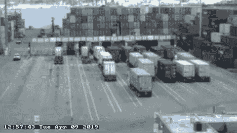

*Terminal gate video feed (*[*Source*](https://www.portvancouver.com/port-dashboard/webcams/)*)*

从协调者的角度来看，不断地检查几十个监视器中的一个来捕捉偶尔发生的拥塞是一项相当费时且平凡的任务。协调员是非常忙碌的人，在一个 24/7 的高压环境中工作，检查许多供应链事件的视频，如事故、火灾和非法侵入。

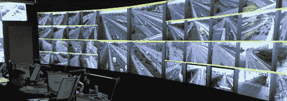

*Typical supply chain operations center*

为了帮助协调员专注于更关键的任务，让我们尝试通过在 Azure Custom Vision (ACV)上训练计算机视觉模型来证明自动化终端拥堵监控是可能的。

该过程可以分为 5 个步骤:

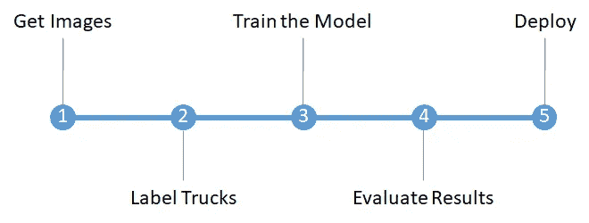

Machine Learning process for Computer Vision

# 1.获取图像

温哥华港在他们的网站上发布了他们的终端网络视频。为了训练一个高精度的模型，我们需要标记至少 100-150 幅图像。手动保存 100 多张网络摄像头图像是一项单调乏味的工作，所以让我们使用一个简短的 python 脚本来加快速度。注意，这是本文中我们使用代码来节省时间的唯一地方。

```
import urllib.request as r, time

*# Direct link to the terminal webcam feed*
imgURL = '''http://www1.pacificgatewayportal.com/webcams/Photos
/CentermMainGates/CentermMainGates_New.jpg?1430944227172'''

for i in range(100):
    r.urlretrieve(imgURL, f"images_{i}.jpg")  *# Scrapecurrent image*
    time.sleep(30)  *# Wait 30 seconds*
```

# 2.标签图像

接下来，我们去 [www.customvision.ai](http://www.customvision.ai) ，创建一个账号和一个新项目。一旦完成，我们使用界面上传我们上面刮的图像。点击*添加图片*并导航至您想要上传的文件夹。

接下来，可以开始标记的任务。ACV 提供的界面是直观的，能够围绕你想要检测的每个对象绘制矩形边界框。多个 label 标签可以应用于每个边界框。在这种情况下，我们需要的唯一标签是*卡车*，但是在您的用例中可能有更多种类。

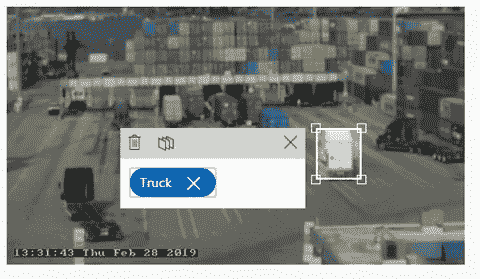

Process of labeling trucks

一般来说，对于一个有效的概念证明模型，建议每个标签至少标记 50 个图像。如果您的用例需要检测多种类型的对象，请确保您有足够的训练图像来捕捉不同的场景。

贴标签需要时间，但是如果您有一个想要原型化的定制业务问题，这是不可避免的。我们喜欢 Azure Custom Vision 的地方在于，该功能内置于解决方案中，使用起来非常直观。

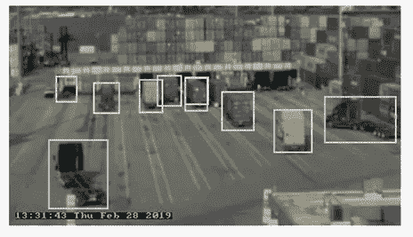

What a labeled image looks like

# 3.训练模型

这是最简单的部分。使用一次点击，我们在 Azure Custom Vision 中训练一个神经网络，根据标记的样本在图像上检测卡车。该过程需要几分钟到几个小时，具体取决于训练图像数据集。

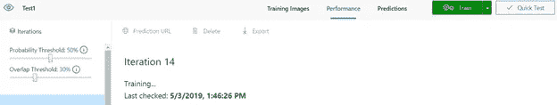

Complexity of Computer Vision model training is hidden from the user

# 4.评估模型

所以我们已经训练了一个模型，但是我们怎么知道它是好的呢？理想情况下，给定终端门的图像，模型应该检测图像中的每辆卡车。在这种情况下，*检测*意味着以一定的置信度将图像的矩形部分识别为卡车。

我们可以通过使用*快速测试*选项，用新的图像来尝试:

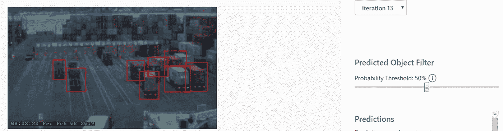

Quick Test allows us to immediately view model output

自定义视觉提供了一个方便的滑块来更改模型应该使用的最小置信度。如果我们将阈值滑动到 13%，模型将检测到更多的卡车，但假阳性的数量也会增加。这里需要达到一个平衡，在这种情况下，我们决定使用 50%的阈值。

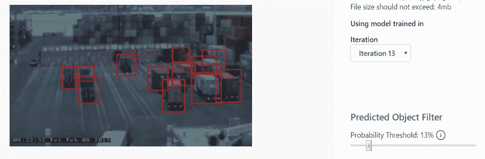

Lowering probability threshold increases false positives

这还不错，但是模型没有检测到每辆卡车。更具体地说，在图像中的 14 辆卡车中，该模型至少有 50%的信心找到 8 辆。仅基于这张测试图，模型的*召回*为 8/14 = 57%。我们也可以说模型的*精度*是 8/8；也就是说，模型检测到的 100%的卡车实际上都是卡车(即没有误报)。

Azure Custom Vision 为模型的每次迭代提供了查全率和查准率。平均精度(mAP)是一个更复杂的描述方法，所以如果你感兴趣，我们将[链接到一篇文章](https://medium.com/@jonathan_hui/map-mean-average-precision-for-object-detection-45c121a31173)。作为参考，地图上的一般物体检测任务用最先进的模型[徘徊在 60%](https://medium.com/zylapp/review-of-deep-learning-algorithms-for-object-detection-c1f3d437b852) 左右。

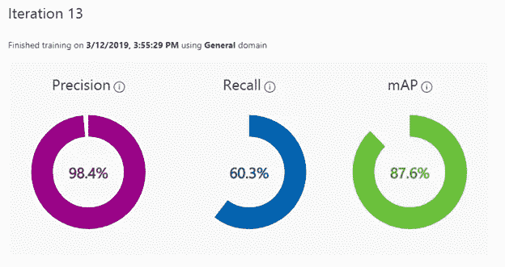

*Key indicators to evaluate model’s performance*

# 5.部署

一旦我们在 Azure Custom Vision portal 中训练了模型，它就已经通过 API 部署和可用了。从门户外部进行 API 调用将需要“设置”菜单中可用的预测端点和键。

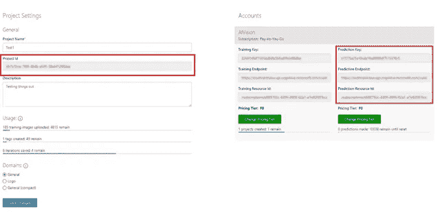

Information needed to send request to model API node

微软还提供了一个有用的 [API 测试工具](https://southcentralus.dev.cognitive.microsoft.com/docs/services/450e4ba4d72542e889d93fd7b8e960de/operations/5a6264bc40d86a0ef8b2c28f/console)，可以让你快速查看模型的原始输出——一个 JSON 字符串。

我们完了。

# Azure Custom Vision 等工具真正大放异彩的地方

通过几个步骤和最少的代码，我们使用 Azure Custom Vision 创建了一个计算机视觉概念验证模型。虽然 ACV 肯定可以用于创建生产规模的解决方案，但在模型控制和定制方面有一些限制。如果你需要完全控制过程的每一个方面，那么不可避免地要使用深度学习 ML 框架。

我们认为，使用像 ACV 这样开箱即用的无代码工具的最重要价值在于，让人工智能概念证明启动并运行，以测试解决方案的可行性。虽然 Azure 是目前唯一一家提供无代码工具来创建 CV 模型的主要提供商，但鉴于该领域的巨大竞争，预计其他 PaaS 提供商也会效仿。

> 使用像 ACV 这样的工具的最大价值在于快速测试一个人工智能解决方案是否可行

这对企业来说是个好消息，因为它通过降低测试 CV 解决方案的成本，有效地降低了人工智能采用的门槛。考虑到世界上“数以百万计”的组织，根据谷歌主管杰夫·迪恩的说法，[“有一个可以用机器学习解决方案解决的问题”](https://www.economist.com/special-report/2018/03/28/ai-providers-will-increasingly-compete-with-management-consultancies)，像这样的工具只能帮助推动人工智能的采用。

当然，有效的工具只是硬币的一面。创建人工智能解决方案的另一个必要因素是拥有理解数据科学和底层模型如何工作的合适人才，不管使用什么工具。不幸的是，T2 仍然严重缺乏人才。这是为什么你会看到专业服务公司等非传统参与者提供人工智能和分析服务来满足需求的部分原因。

事实上，这正是我们在德勤加拿大人工智能实践 Omnia AI 所做的事情:我们帮助组织使用 AI 来解决他们迫切的问题。像 ACV 这样的新兴工具可以在这一过程的早期发挥重要作用。