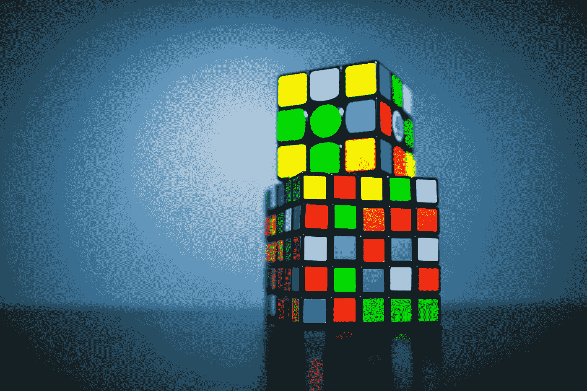

# 进步快还是理解浅？

> 原文：<https://towardsdatascience.com/rapid-progress-or-shallow-understanding-663bdedc80c1?source=collection_archive---------12----------------------->

这是我对人工智能工具 Tensorflow 的体验的高度总结。如果你是第一次学习这个领域，我建议你从这个快速发展的领域的介绍开始。

如果有一件事我们都讨厌，那就是格式化书目。是的，你可能认为赞扬他人的工作很重要，是的，有条理很令人满意，但是真的有人关心准确无误的单词*斜体*吗？当然，你可以通过使用自动在线工具来完全避免这个问题，但是这种便利是有代价的吗？现在更容易的道路值得不去克服挑战为未来做准备吗？尽管这个例子很简单，但同样的问题困扰着生活中许多其他[更复杂]的情况。

The day before the deadline, trying to plump up the bibliography with non-Wikipedia links… Photo by [Tim Gouw](https://unsplash.com/photos/1K9T5YiZ2WU?utm_source=unsplash&utm_medium=referral&utm_content=creditCopyText) on [Unsplash](https://unsplash.com/search/photos/frustration?utm_source=unsplash&utm_medium=referral&utm_content=creditCopyText).

最近，我在研究人工智能算法时遇到了这个难题。我应该迅速尝试探索许多不同的主题，以实现该领域的各种应用，还是应该确保在更深的层次上熟悉这些概念？使这个决定变得更加困难的是，我想获得使用行业标准工具(如 Tensorflow 框架)的经验，这些工具可以在高层次上加速开发。在 Tensorflow 的帮助下，我在过去几周完成的项目是我刚开始接触人工智能时的五倍，但这种经历值得吗？

## 用人工智能赶时髦

我用 Tensorflow 做的第一个项目和我创建的一个比较老的项目类似(没有高层框架的帮助)；在尝试建立 Tensorflow 遇到一些挫折后，我建立了一个计算机视觉算法，将图像分类为不同类型的衣服。也许，你认为这很简单，但你真的知道最新款的羊毛衫、运动夹克和商务休闲背心之间的区别吗？

I can’t tell Armani from a beluga whale, but have you met my AI friend? Photo by [Hunters Race](https://unsplash.com/photos/MYbhN8KaaEc?utm_source=unsplash&utm_medium=referral&utm_content=creditCopyText) on [Unsplash](https://unsplash.com/search/photos/suit?utm_source=unsplash&utm_medium=referral&utm_content=creditCopyText).

相比之下，我之前创建了另一个分类算法[，但是是针对手写数字而不是服装。](https://medium.com/dataseries/the-largest-hurdle-with-ai-9e25ca15b698)因此，我可以将我的旧项目的各个方面与 Tensorflow 的功能进行比较，我惊讶地发现这个框架是如此容易使用。我可以在 Tensorflow 中使用预构建的函数，而不是从头开始编写我使用的每个函数。

例如，我以前必须用数学公式定义一个激活函数，而我只是从 Tensorflow 的许多现有函数中选择一个。此外，该框架还帮助我设置了要使用的数据，而不是我必须下载、转换和处理成千上万的图像来训练算法。虽然这些功能确实很方便，但我只是因为之前的项目(更注重实践)才明白它们是如何工作的。最终，我为快速成功地创建了算法感到兴奋，但也担心这种新的简单性是否更好。

## 做着同样的事情…但方式不同

然后，我决定探索一种称为卷积神经网络(CNN)的算法来对手写数字进行分类，我已经用其他算法完成了这一工作。从本质上讲，CNN 的主要优势在于它在处理图像之前简化了图像，使得识别数字的主要特征更加容易。把它想象成试图解一个 3x3 的魔方；如果你不断从边缘抽离，事情会简单得多...

While the one on top entices me more than the one underneath, I’m not solving anything until the cube is 1x1\. Photo by [Olav Ahrens Røtne](https://unsplash.com/photos/jvBXiynINGE?utm_source=unsplash&utm_medium=referral&utm_content=creditCopyText) on [Unsplash](https://unsplash.com/search/photos/rubiks-cubes?utm_source=unsplash&utm_medium=referral&utm_content=creditCopyText).

在这里，我发现这个项目比我的服装分类器更具挑战性，因为我以前从未使用过 CNN 算法。然而，Tensorflow 针对 CNN 的特定功能使我能够快速理解算法的过程。

具体来说，Tensorflow 使得为 CNN 创建*最大池*和*缩减采样*层变得很容易，这是简化给定图像的关键步骤。我不再担心单独的计算，而是更加关注算法的结构以及这些层之间的相互作用。也就是说，我并没有获得多少实践经验来弄清楚如何最有效地对这些层及其功能进行编码。最终，我会很高兴与 CNN 的一些更自下而上的方面合作，并尝试在没有 Tensorflow 的帮助下重建一些计算，这就是为什么我想在一个不同的项目中重新讨论这个主题。

## 如果你不能理解人，让人工智能帮你做

有了这次简化数据的经历后，我创造了我最喜欢的项目:一种试图理解人类情感的算法。最后，我可以用我的秘密工具来为生物学争取额外的 5%了！

Students celebrating the wonder of AI to help negotiate marks… Photo by [Vasily Koloda](https://unsplash.com/photos/8CqDvPuo_kI?utm_source=unsplash&utm_medium=referral&utm_content=creditCopyText) on [Unsplash](https://unsplash.com/search/photos/school?utm_source=unsplash&utm_medium=referral&utm_content=creditCopyText).

事实上，它只看电影评论来预测观众是否对这部电影满意。起初，我真的被计算机理解人类情感的可能性惊呆了。然而，这个问题的解决方案比我想象的要简单；该算法使用人们在评论中使用的词语来决定他们对这部电影是否满意。

举例来说，想想你是如何通过文本来判断你朋友的情绪的。他们有笑脸表情符号还是用大写的彩色名词？同样，该算法将人们在评论中使用的词语分为正面或负面，以预测他们对这部电影的感受。在发现这个简单的过程后，我更加理解了现实世界应用程序的影响。从商业上来说，了解顾客的感受让他们更快乐是非常好的，即使用来了解这些情绪的方法更加复杂。

## 我认为你的文章有点抄袭的味道

人工智能的这种实用潜力让我欢欣鼓舞，我想研究更复杂的人工智能算法。这就是为什么我用 Tensorflow 创建了我的第一个递归神经网络(RNN)。我还想在项目中融入一些随机的乐趣，所以我建立了一个模仿莎士比亚戏剧的算法。显然，唯一比用一篇写得很好的文章打动你的英语教授更好的事情是用一篇写得很好的文章打动你的计算机科学教授，这篇文章是用人工智能写成的莎士比亚式英语。

Your computer science professor after reading an AI’s Shakespearean essay. Photo by [Ben White](https://unsplash.com/photos/qDY9ahp0Mto?utm_source=unsplash&utm_medium=referral&utm_content=creditCopyText) on [Unsplash](https://unsplash.com/search/photos/school?utm_source=unsplash&utm_medium=referral&utm_content=creditCopyText).

在整个项目中，我了解了 RNNs 背后的基础知识，以及它们与常规神经网络的不同之处。从根本上说，RNN 的主要优势是它从过去的结果中学习来创造新的结果，或者在问题的背景下，它使用以前的字母来预测新的结果。

此外，这是我开始利用 Tensorflow 的多样化功能的时候。首先，我尝试了不同的优化器来调整 RNN 的学习能力。很明显，我知道了常规梯度下降是多么耗时，随机梯度下降(SGD)通过使用小批量数据减少了计算，自适应矩估计(Adam)避免了陷入良好的设置，而不是找到最佳设置。同样，我试验了不同的激活，发现二元阶跃函数很容易计算，sigmoid 函数很适合分类算法，softmax 函数适合概率问题。

尽管能够快速尝试这些不同的函数并比较结果，我还是不能像我希望的那样强烈地理解 RNNs 的基础知识。当然，我知道该使用哪些函数，以及为什么它们对手头的问题有利，但是我并没有通过实验对 RNNs 工作背后的细节有很深的理解。为了解决这一限制，我需要更深入地研究 RNNs 背后的理论，这在 Tensorflow 已经为您预打包了一切的情况下是有问题的。

## 可可的人知道他们的工作有点疯狂…

有了 Tensorflow 的经验，我终于开始了我从事的最大的人工智能项目。使用 [COCO 图像数据集](http://cocodataset.org/#overview)(成千上万不同主题的图像集合)，我创建了一个 RNN，它可以自动为图像生成标题。类似于莎士比亚的 RNN 使用每个字母来预测下一个，这个算法使用标题中的每个单词来预测下一个。而且这一次甚至没有抄袭去世已久的作家，大部分！基本上，它看的是这样一幅图像:

Photo by [Jeremy Bishop](https://unsplash.com/photos/_CFv3bntQlQ?utm_source=unsplash&utm_medium=referral&utm_content=creditCopyText) on [Unsplash](https://unsplash.com/search/photos/surfing?utm_source=unsplash&utm_medium=referral&utm_content=creditCopyText).

然后描述说“一个在海浪上的古怪家伙，伙计。”然而，关键的挑战是在成千上万张图像上有效地训练这种算法。

甚至在我开始之前，我已经陷入了为算法下载和处理千兆字节的训练图像的挑战中。这种计算密集型的过程主要是硬件问题，因为 Tensorflow 已经证明了将图像转换为正确的数据格式的功能。有了这个障碍，开发算法主要是重复我在以前的项目中采取的步骤，然后等待…一小时又一小时的等待。虽然，最后，我还是很乐意尝试一个更大规模的项目。

## 我不确定 Tensorflow 就是不太流畅…

What your puns flow like with Tensorflow. Photo by [Matt Hardy](https://unsplash.com/photos/6ArTTluciuA?utm_source=unsplash&utm_medium=referral&utm_content=creditCopyText) on [Unsplash](https://unsplash.com/search/photos/flow?utm_source=unsplash&utm_medium=referral&utm_content=creditCopyText).

我和 Tensorflow 的故事到此结束。总之，我用这个高级框架在短短几周内创建了五个不同的项目。通过这个，我获得了多类神经网络的经验，这些神经网络中不同功能的优势，以及人工智能的众多应用。总的来说，我很感激能够快速通过这些挑战，但我确实觉得还缺少一些东西。现在，虽然我对人工智能领域的多个方面有了更多的了解，但我确实认为这些知识有点仅限于 Tensorflow 框架，而不是一般化。总的来说，拥有 Tensorflow 的易用性很有趣，但我绝对重视在没有高级框架帮助的情况下创建我的第一个人工智能项目。这是我能够欣赏在一个项目上投入大量工作来从零开始创造它所花费的时间和努力的唯一方式。

# 关键要点

1.  进步快很方便，但是做了就很难对概念有深刻的理解。
2.  有了以前的实践知识，我能够在创建服装分类器时欣赏 Tensorflow 的新的简单性。
3.  我可以很容易地专注于 CNN 自上而下的架构，但我没有学习 Tensorflow 的自下而上计算的自动化。
4.  很难衡量复杂的人类情绪，但检查相关因素就容易多了，比如一个人高兴或悲伤时的语言。
5.  如果有一件事 Tensorflow 可以帮助初学者，那就是如何将数据处理成可用的形式。

如果你想亲自体验 Tensorflow 的快乐(和挫折…)，这里有几个教程可以帮助你开始:

*   [衣物分类](https://www.tensorflow.org/tutorials/keras/basic_classification)
*   [建一个 CNN](https://www.tensorflow.org/tutorials/estimators/cnn)
*   [评论影评](https://www.tensorflow.org/tutorials/keras/basic_text_classification)
*   重现(或抄袭……)莎士比亚
*   [字幕图像](https://github.com/tensorflow/tensorflow/blob/r1.13/tensorflow/contrib/eager/python/examples/generative_examples/image_captioning_with_attention.ipynb)