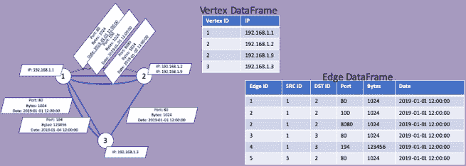
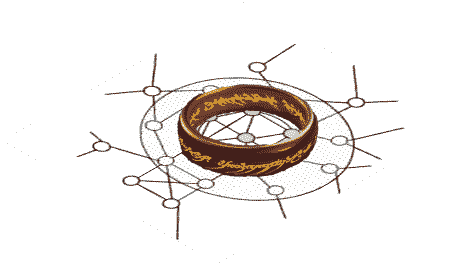
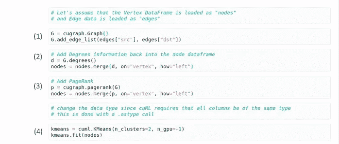
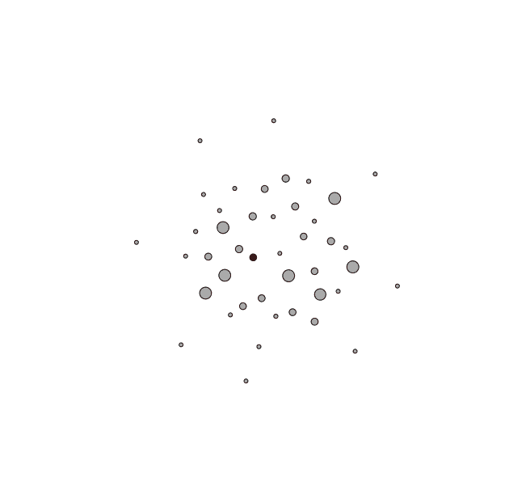
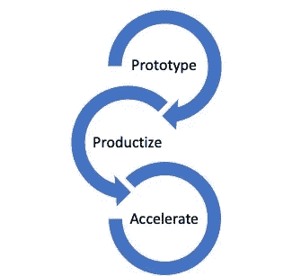
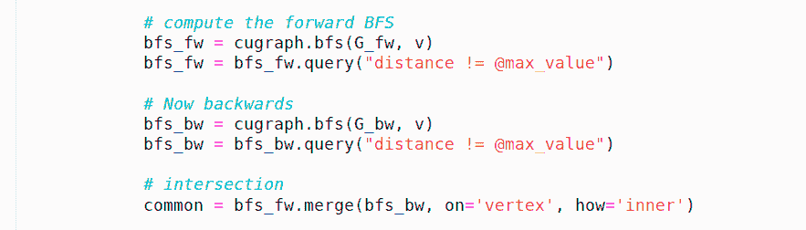
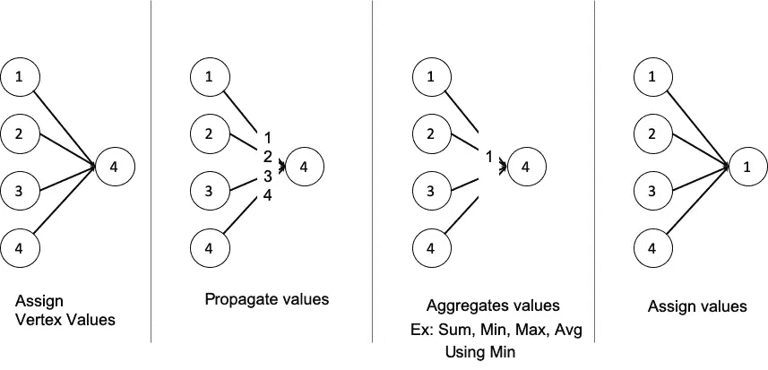

# RAPIDS cuGraph——1.0 及更高版本的愿景和旅程

> 原文：<https://towardsdatascience.com/rapids-cugraph-the-vision-and-journey-to-version-1-0-and-beyond-88eff2ce3e76?source=collection_archive---------12----------------------->

RAPIDS cuGraph 的愿景是*让图形分析无处不在，让用户只从分析的角度思考，而不是技术或框架*。这是我们 cuGraph 团队中的许多人已经努力了近二十年的目标。许多早期的尝试集中于解决一个问题或使用一种技术。那些早期的尝试为最初的目标工作，但是随着范围的改变(例如，转移到用静态图解决方案解决动态图问题)倾向于中断。限制因素通常归结为计算能力、易用性或选择不适合所有问题的数据结构。NVIDIA GPUs、CUDA 和 RAPIDS 完全改变了范式，加速统一图形分析库的目标现在已经成为可能。

最新的 NVIDIA GPU(RAPIDS 支持 Pascal 和更高版本的 GPU 架构)的计算能力使图形分析比 NetworkX 平均快 20 倍。此外，GPU 内部的内存速度允许 cuGraph 快速切换数据结构，以最大限度地满足分析需求，而不是局限于单一数据结构。cuGraph 正在与静态和动态图形数据结构的几个框架一起工作，以便我们总是有任何图形问题的解决方案。由于 Python 已经成为数据科学事实上的语言，允许在 Python 中进行交互和运行图形分析的能力使得 cuGraph 变得熟悉和平易近人。RAPIDS 将上面提到的所有图形分析优点与执行高速 ETL、统计和机器学习的能力结合在一起。更好的是，RAPIDS 和 DASK 允许 cuGraph 扩展到多个 GPU，以支持数十亿边图。

RAPIDS 的每个版本都附有一个或多个关于该版本特性的精彩博客(例如，参见 0.8 版博客[ [1](https://medium.com/rapids-ai/rapids-release-0-8-same-community-new-freedoms-9f82b09db3ad) ]或[Hadoop 后的生活](/life-after-hadoop-getting-data-science-to-work-for-your-business-c9ab6605733f))。这篇文章略有不同。虽然将讨论当前的功能，但主要焦点是展示 cuGraph 的愿景以及我们设想用户将如何与库进行交互。cuGraph 团队一直在努力提供一组丰富的初始特性。在过去的三个版本中(RAPIDS 是第一个包含 cuGraph 的版本)，该团队提供了十几个算法。最初的目标是简单地发布 graph analytics，并通过熟悉的类似 NetworkX 的 API 提供。这在短期内很好，因为它提供了一条转向急流的捷径。然而，cuGraph 的开发将慢慢转向改进易用性、互操作性以及与 RAPIDS 其他部分的集成。这并不是一件容易的事情，因为 cuGraph 生态系统中还有很多东西需要添加。不要担心，推出新分析的目标将继续下去，因为有一个非常长的算法列表要发布。

**属性图和高级工作流:cuDF、cuML 和 cuGraph 之间的联系**

术语“*属性图*”自 2010 年以来一直在文献中讨论[2，3，4]，最常用于在关系数据库中定义图的上下文中——我实际上在 2010 年之前构建了一个数据库支持的图系统，所以这个概念比文献更古老。更正式地说，属性图是一个有向多重图，其中每个顶点和边可以有多个属性。多重图意味着任意一对顶点之间可以有多条边。考虑一个网络，其中顶点代表服务器，每个服务器可以有多个 IP 地址(属性)。任何一对服务器之间都可以有多条边，每条边代表一个具有时间、端口和协议信息的不同连接。请参见下图。

A Multigraph with its DataFrame Representation

在 RAPIDS 中，属性图可以表示为数据框的集合。在简单的情况下，一个数据框用于顶点信息，另一个用于边，如上图所示。然而，多于两个数据帧也是可能的(并且是常见的)。一旦填充了属性图，就可以提取各种子图。例如，我们可以提取一个边仅通过端口 80 的子图:*edge _ df = edges . query(' port = = 80 ')****。*** 此外，我们可以使用 *group_by* 函数将所有的边卷成一条边。能够捕获所有属性并生成数据的不同视图的好处是属性图模型的强大。

Data Frame to rule them all

数据帧的概念是 RAPIDS 的核心——不仅仅是 RAPIDS 利用 Apache Arrow [ [5](https://arrow.apache.org/) ]规范通过允许零拷贝数据移动来确保流程之间的互操作性。数据帧的概念允许 RAPIDS 的所有组件交流、理解和共享数据。这是将它们结合在一起的核心概念。考虑类似上面的属性图，除了假设节点上有更多的属性——这可以是网络、社会或产品信息——并假设我们希望用图度量进一步丰富节点数据。我们可以(1)从边数据框构建一个图，然后(2)计算每个顶点的度数信息并将其添加回节点数据框。同样，(3)可以计算 PageRank 分数并加回。最后，我们可以(4)然后采用新丰富的节点数据框架，并对数据运行来自 cuML 的 K-Means，并查看数据如何聚类。这凸显了数据在 cuDF、cuML 和 cuGraph 之间移动的便利性——这都要归功于数据框架的强大功能。

在 Python API 层，RAPIDS cuGraph 完全支持数据帧，所有函数都接受并返回一个数据帧。CuGraph 还支持属性图，并正在努力更好地将这一概念集成到算法中。

**技术和框架——静态、动态以及介于两者之间的一切**

关于哪种技术是最好的:以顶点为中心的[6]还是以图形为中心的[7]，在图形研究界已经争论了很多年。即使在 cuGraph 团队内部，我们也在争论哪种方法更好。但是 cuGraph 是关于分析的。cuGraph 没有选择一种技术，而是选择提供一组技术。对于任何分析，只要能提供最佳性能和可扩展性的技术都会被使用。此外，随着分析的定期更新和改进，底层技术也可能被替换掉。由于分析是通过定义良好的 API 公开的，因此任何变化(除了性能)对用户都是透明的。

在接下来的几个版本中，以下框架[ [8](https://news.developer.nvidia.com/graph-technology-leaders-combine-forces-to-advance-graph-analytics/) ]将被整合到通过 cuGraph Python API 公开的 cuGraph 和分析中:

*   来自德克萨斯 A&M 的蒂姆·戴维斯实验室的 GraphBLAS
*   加州大学戴维斯分校约翰·欧文斯实验室的枪岩
*   乔治亚理工学院的大黄蜂[ [11](https://github.com/hornet-gt/hornet)
*   NVIDIA 的 NV graph[[12](https://developer.nvidia.com/nvgraph)]

其中一些技术提供了动态数据结构，特别是动态压缩稀疏行(CSR)结构。有许多地方需要动态结构。最明显的是分析图表随时间的变化。随着数据的流入，可以监控和报告网络结构的变化。同样重要的是在分析中使用动态结构。在许多情况下，结果集的大小是未知的*先验的* —例如稀疏矩阵乘法(SpGEMM)。能够即时折叠、扩展、添加和缩小图表或结果是一项强大的技术。

**定制分析:原型、原语和批量同步并行**

cuGraph 开发人员正致力于提供一个完整丰富的分析集(参见路线图部分)。每项分析都将定期重新审查和更新，以确保最佳性能。但是，在某些情况下，我们希望在完全优化之前先试用分析。在接下来的几个版本中，我们将推出一个包含样本代码和实验分析的“ *proto* ”模块。应该强调的是，它是实验性的。如果对该模块中的任何分析感兴趣，那么可以将其移到 cuGraph proper 中并进行优化。计划是我们将尝试分析，如果可行，然后花时间来改善分析。每份分析报告都将被定期审查和更新。更新可以通过更好的数据结构和数据移动，或者通过替换算法。该团队不断监测研究和最新技术。和以前一样，用户看到的只是更好的性能和/或可扩展性。

除了为 cuGraph 开发人员提供一个游戏区，用户还可以创建自定义分析。为了帮助促进算法开发，cuGraph 将提供一个原语集合。这些原语可以是现有的图形分析或低级功能。目标是最终将所有 graphBLAS 半环函数公开为图形原语。在 0.9 版本中，最初的原型分析之一是使用向前向后修剪方法计算强连通分量的例子。FW-BW-TRIM 执行向前的 BFS，然后向后的 BFS，然后寻找两者之间的公共集(交集)以形成一个组件。由于 BFS 算法已经是 cuGraph 的一部分，用于查找组件的原型分析在下面的代码片段中突出显示。

Prototype of Forward-Backward-Trim Strongly Connected Components

使用原语是构建定制分析的一种方法，另一种是通过使用数据帧和批量同步并行(BSP)编程模型。BSP [13，14]并不新鲜，它是由莱斯利·瓦里安开发的，并于 1990 年首次发表。这与 Pregel 在关系数据库中用于图形处理的基本模型相同。该过程包括设置一个值，例如每个顶点一个值，然后在所谓的“超步骤”中传播该值然后，以用户定义的方式聚集比例值，并将其指定给相关顶点。BSP 的优势在于它易于创建自定义分析，允许传播复杂的多列数据，并允许定义自定义聚合函数。缺点是速度慢。

Simplified BSP Example Looking just at Vertex 4

**升级到 1.0 版本**

急流 cuGraph 正在快速移动，并沿着多条路径运行。是的，我们打碎了东西。升级到 1.0 版意味着我们有了稳定的基础和不变的 API。我们还没有到达那里，但是我们正在接近那里。随着更多的技术进入 cuGraph，这些特性和原语是如何暴露的还没有完全具体化。此外，我们的目标不是拥有多个独立的基于技术的子路径，而是一个统一的视图。在 API 层之下，算法可以在不同的技术之间转换。为了帮助 cuGraph 更接近目标，该团队将推出一个完整的版本 0.11，专注于代码重构、组织和 API 更新。希望一个发布周期就足以重构代码，这样我们就有了一个坚实的基础来升级到 1.0 版本。

路线图总是不断变化的，所以把它当作一组目标，而不是硬性的截止日期:

***发布 0.9***

*   多 GPU PageRank
*   单 GPU 强连接组件

***发布 0.10***

*   大黄蜂集成
    —卡茨中心性
    — K 核
*   Gunrock integrated
    —子图匹配【15】
*   GraphBLAS 集成
    — K 形桁架
*   nvGRAPH
*   附加原语
*   基础工程

***发布 0.11***

*   我们正在进行一个发布周期，专注于一个主要的代码重构，以便所有的 API 都保持一致并更新到 C++。这将使我们为 1.0 版本做好准备。

***发布 0.12***

*   OpenCypher —简单查询
*   GraphBLAS 半环原语

***未来版本…***

哪个版本将是 1.0 版，目前还不知道，但 cuGraph 将准备就绪。

**结论**

RAPIDS cuGraph 专注于创建统一的图形分析功能，能够扩展到不同规模的问题，并根据分析需求利用不同的数据结构，同时提供数据科学家熟悉的易于使用的 API。我们当前的 1.0 版本路线图旨在为该功能奠定坚实的基础，我们打算在 1.0 版本之外进一步推进这一愿景。

如果你喜欢 cuGraph 正在做的工作，请在 GitHub 上给我们一颗星:[https://github.com/rapidsai/cugraph](https://github.com/rapidsai/cugraph)。

如果有什么你认为 cuGraph 应该继续努力的，那么就添加一个问题:[https://github.com/rapidsai/cugraph/issues](https://github.com/rapidsai/cugraph/issues)或者在谷歌讨论页面上开始讨论:[https://groups.google.com/forum/#!forum/rapidsai](https://groups.google.com/forum/#!forum/rapidsai)。

因为 RAPIDS 都是开源的，所以请跳进去写一些代码。

***参考文献***

1.  [https://medium . com/rapids-ai/rapids-release-0-8-same-community-new-freedom-9 f 82 b 09 db 3 ad](https://medium.com/rapids-ai/rapids-release-0-8-same-community-new-freedoms-9f82b09db3ad)
2.  RDF*和属性图的协调。技术。众议员，[http://arxiv.org/abs/1409.3288](http://arxiv.org/abs/1409.3288)(2014)
3.  罗德里格斯，硕士，纽鲍尔，p:从点和线的建设。Bul。我是。社会主义者信息。Sci。技术。36(6), 35–41 (2010)
4.  伦佐的安格斯。"属性图数据库模型."AMW (2018 年)。
5.  [https://arrow.apache.org/](https://arrow.apache.org/)
6.  田，y .，巴尔明，a .，科尔斯顿，S. A .，塔蒂孔达，s .，，麦克弗森，J. (2013)。从像顶点一样思考到像图形一样思考。*VLDB 基金会会议录*，7(3)，193–204。
7.  Bader，d .，Bulu，a .，Gilbert，j .，Gonzalez，j .，Kepner，j .，& Mattson，T. (2014 年 7 月)。图爆破工作及其对亿亿级的影响。*在 SIAM exa scale 应用数学挑战与机遇研讨会上* (EX14)
8.  [https://news . developer . NVIDIA . com/graph-technology-leaders-combine-forces-to-advance-graph-analytics/](https://news.developer.nvidia.com/graph-technology-leaders-combine-forces-to-advance-graph-analytics/)
9.  http://faculty.cse.tamu.edu/davis/GraphBLAS.html
10.  [https://gun rock . github . io](https://gunrock.github.io)
11.  [https://github.com/hornet-gt/hornet](https://github.com/hornet-gt/hornet)
12.  [https://developer.nvidia.com/nvgraph](https://developer.nvidia.com/nvgraph)
13.  Leslie G. Valiant，并行计算的桥接模型，*美国计算机学会通讯*，33 卷 8 期，1990 年 8 月
14.  麦科尔，W. F. (1994)。可扩展并行计算:一个宏大的统一理论及其实践发展。*《IFIP 世界大会议事录》*(第一卷，第 539-546 页)
15.  [http://www . hpdc . org/2016/Posters/poster/O13-hpdc 16 _ Posters _ paper _ 17 . pdf](http://www.hpdc.org/2016/posters/poster/O13-HPDC16_Posters_paper_17.pdf)