# 老鼠城:可视化纽约市的老鼠问题

> 原文：<https://towardsdatascience.com/rat-city-visualizing-new-york-citys-rat-problem-f7aabd6900b2?source=collection_archive---------3----------------------->

## 你的邻居也是老鼠的热点吗？

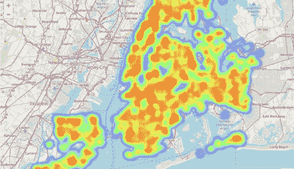

Check out the interactive rat sighting map here: [https://nbviewer.jupyter.org/github/lksfr/rats_nyc/blob/master/rats_for_nbviewer_only.ipynb](https://nbviewer.jupyter.org/github/lksfr/rats_nyc/blob/master/rats_for_nbviewer_only.ipynb)

# 介绍

如果你曾经在纽约待过很长时间，你很可能会遇到老鼠。不管你是在等地铁还是在华盛顿广场公园散步，你碰到老鼠的几率都很大。如果你来自纽约，这些对你来说都不陌生。为了让其他人更好地理解这个问题有多严重，这里只是收集了一些快速的事实:

*   有一篇[维基百科文章](https://en.wikipedia.org/wiki/Rats_in_New_York_City)详细介绍了这个问题。你所在的城市有没有关于老鼠的维基百科文章？
*   根据这篇[文章](https://rss.onlinelibrary.wiley.com/doi/epdf/10.1111/j.1740-9713.2014.00764.x)用统计方法捕捉的老鼠数量，纽约市大约有 200 万只老鼠。
*   纽约市鼓励市民在看到老鼠时拨打 311。该市非紧急热线对老鼠的重视表明了这个问题的重要性。

众所周知，老鼠会传播致命疾病，因此对公众健康构成了严重威胁。除此之外，他们也是众所周知的负责电缆断裂，可能会导致火灾。因此，如果你住在纽约市，你肯定会想避开老鼠密集的街区甚至更小的区域。与此相反，纽约市最有可能希望在这些特定区域加大灭杀力度。问题是:你如何识别这些区域？

# 鼠迹的发展

在回答这个问题之前，让我们来看看这个问题在过去几年的历史。对于这篇文章，我依赖于纽约市提供的[这个](https://www.kaggle.com/new-york-city/nyc-rat-sightings)数据集，详细列出了从 2010 年 1 月到 2017 年 9 月的所有老鼠目击事件。在这段时间里，有 101，914 起报告的老鼠目击事件。虽然这已经是一个很高的数字，但实际看到老鼠的数量可能要高得多。仅在纽约期间，我就目睹了几次我没有报告的老鼠目击事件。然而，我们可以看看这些年来老鼠出现的数量的发展，看看这个城市消灭老鼠的努力是否有成效。

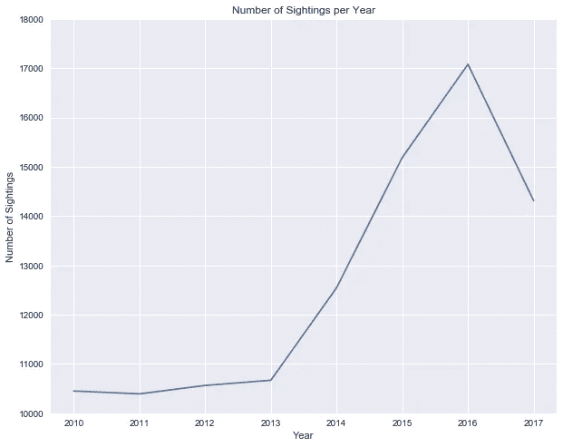

正如我们所看到的，2013 年，老鼠的数量有了转机，开始显著增加。2010 年有 10，452 起老鼠目击事件，而 2017 年有 17，080 起。这大约增加了 63%！尽管 2017 年似乎有所下降，但人们必须记住，2017 年的数据集截至 9 月，不包括 10 月、11 月和 12 月。数据似乎表明，老鼠数量增加了，或者老鼠进入了它们能够更频繁地与人类接触的区域。不管怎样，这都是一个令人担忧的发展。

让我们按社区来分析一下，看看在纽约市哪个地区老鼠最多。

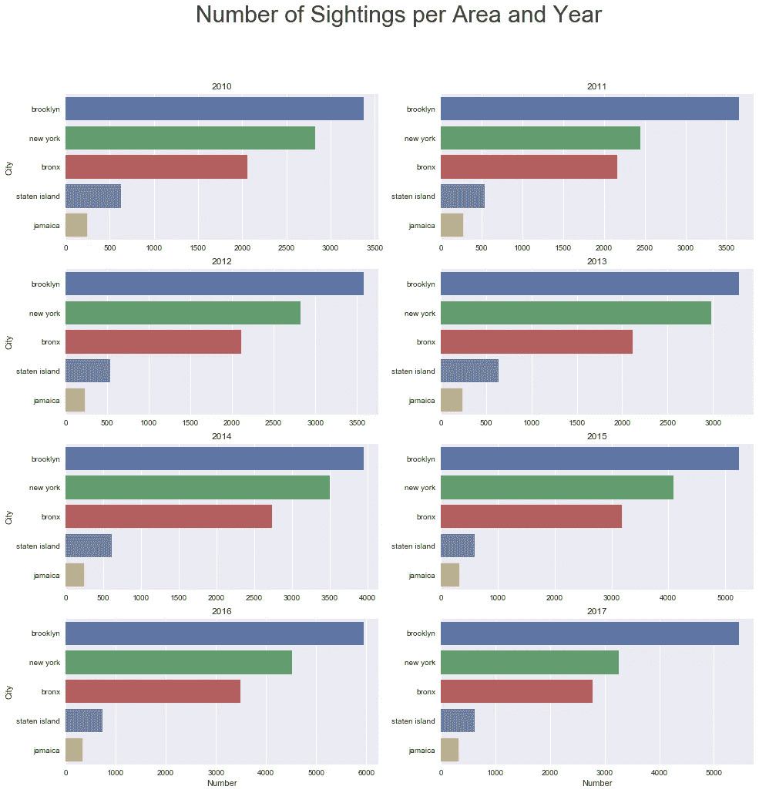

显然，至少自 2010 年以来，布鲁克林一直是老鼠出没最多的地区。注:这里的纽约是指曼哈顿。另外，对于没有去过纽约的人来说:牙买加不是指加勒比海的牙买加岛，而是指牙买加皇后区。

在跳到我们的地图可视化之前，了解更多关于目击地点类型的信息也是很有趣的。大多数老鼠可能只在有很多机会隐藏和很少人类活动的地方被发现，例如建筑工地。对吗？不对。看一看:

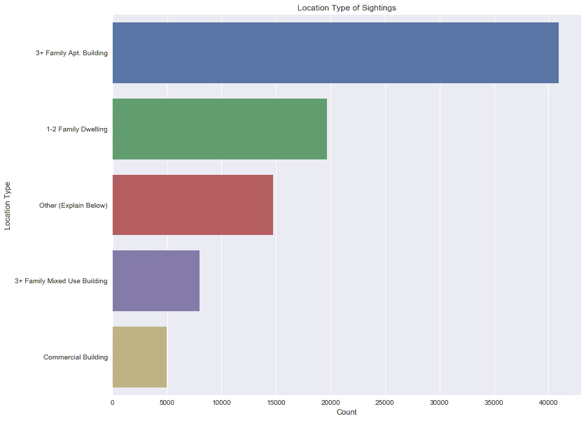

大多数老鼠目击报告发生在 3+家庭公寓大楼。建筑工地在这份名单上仅排在第七位。另一个有趣而可怕的统计数据是，在大约 7 年的时间里，有 82 起医院里发现老鼠的报告。

# 地图可视化

对于我的热图可视化，我依赖于 2017 年报告的老鼠目击事件，因为这些是该地区潜在老鼠活动的最新指标。

## 曼哈顿下城

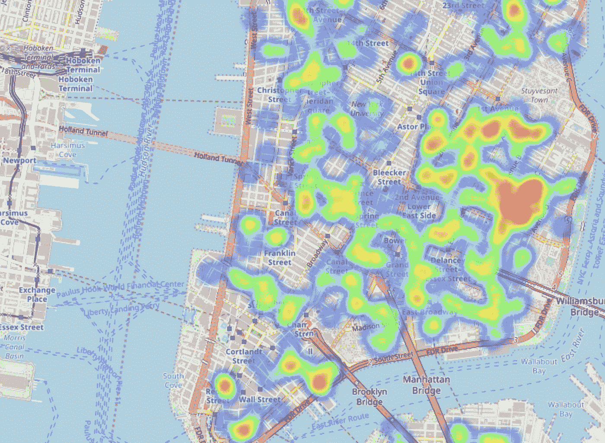

为了可视化鼠迹的密度，我使用 Python 包 follow 在传单地图上创建了热图。在曼哈顿下城看一看，似乎有一些老鼠热点，尤其是在东 2 街至东 6 街和 B 大道至 d 大道的区域。总体而言，汤普金斯广场公园周围的区域显示出非常高的老鼠目击密度。

## 市中心区

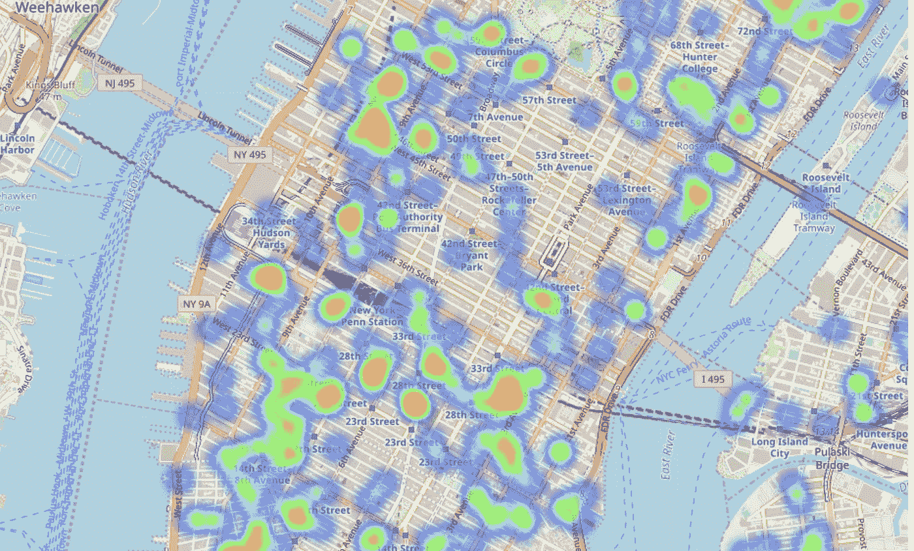

总的来说，市中心似乎没有曼哈顿下城那么拥挤。这里的热点包括 23 街和 28 街之间的区域以及地狱厨房的某些部分。

## 上东区和上西区

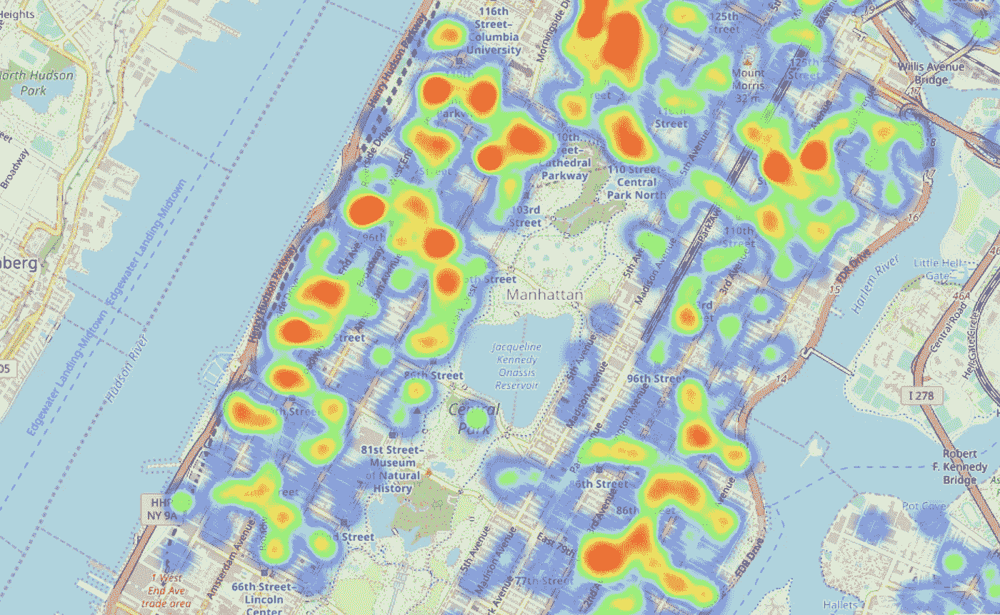

在这里，上西区似乎明显比上东区鼠患更严重。具体来说，100 号街以上和哥伦比亚大学以东的区域显示出高密度的鼠迹。

## 哈莱姆

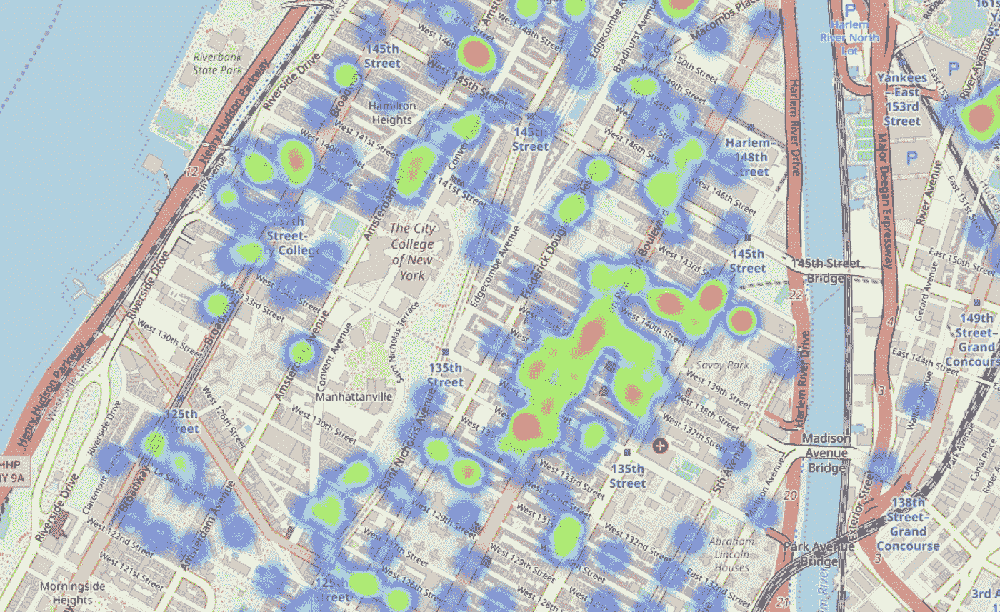

除了西 133 街和 142 街之间的 Adam Clayton Powell Jr .林荫大道周围的区域，哈莱姆区一般不会出现具体的鼠迹。

## 布朗克斯区

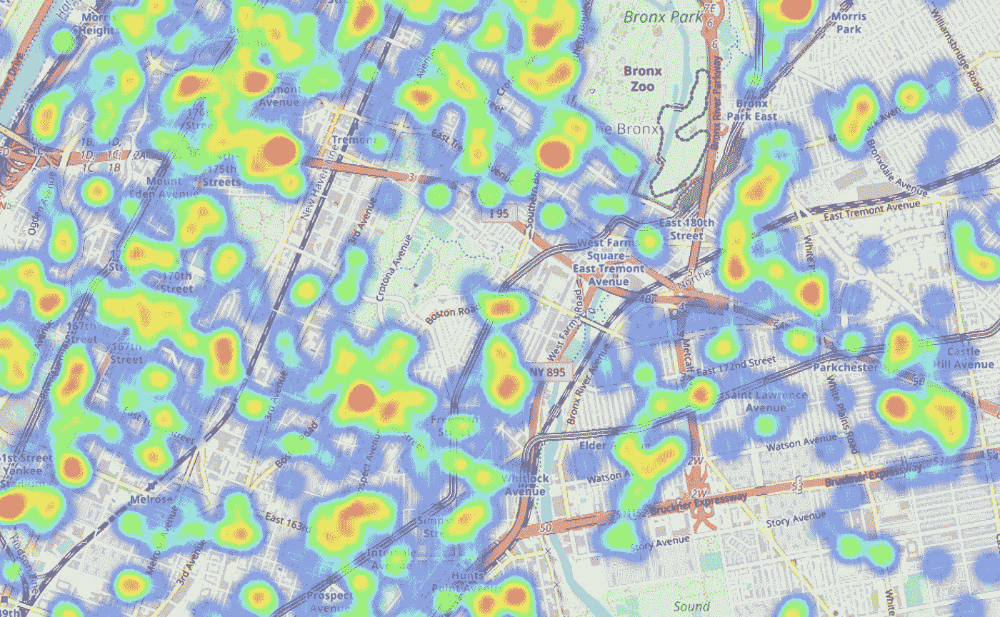

布朗克斯区的老鼠出没密度相对较高。有趣的是，在布朗克斯区的西部似乎比东部更容易看到老鼠。

## 布鲁克林区

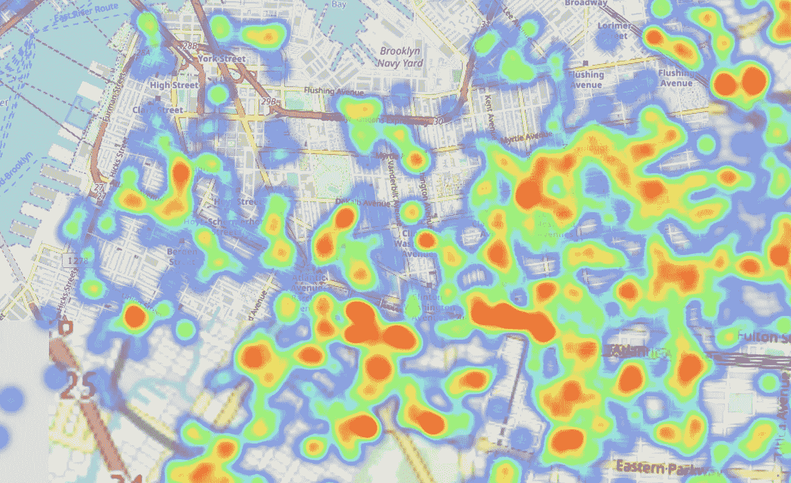

虽然在布鲁克林高地和威廉斯堡看到的老鼠相对较少，但特别是贝德福德-斯图文森和皇冠高地的部分地区似乎是大量老鼠的家园。

## 昆斯区

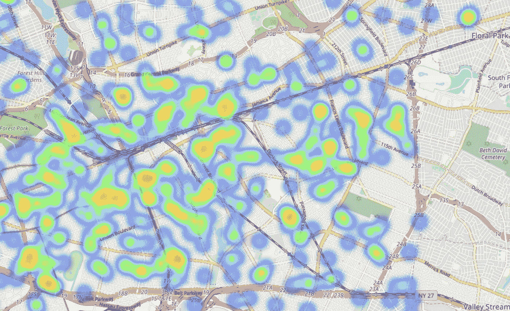

皇后区也没有显示出非常具体的模式。然而，如之前柱状图所示，老鼠密度最高的地区是牙买加。

## 结论和更详细的探索

如你所见，老鼠是纽约市的一个大问题。了解大量人口在哪里是试图减少他们的数量和降低他们造成的公共健康风险的第一步。

如果你有兴趣了解你自己的街道或你下次来纽约时要住的酒店所在的区域，请[点击这里](https://nbviewer.jupyter.org/github/lksfr/rats_nyc/blob/master/rats_for_nbviewer_only.ipynb)。我在 nbviewer 上托管了一个笔记本，可以让你交互使用热图。

参考资料:

[1]奥尔巴奇，乔纳森，[纽约市的老鼠真的和人一样多吗？](http://onlinelibrary.wiley.com/doi/10.1111/j.1740-9713.2014.00764.x/abstract) (2014)，威利在线图书馆

[2]纽约市，[纽约市老鼠目击事件](https://www.kaggle.com/new-york-city/nyc-rat-sightings) (2017)，卡格尔

[3]布拉德利，瑞安，[纽约的老鼠路径；城市里的动物如何到达它们要去的地方。](https://www.nytimes.com/2015/04/26/magazine/the-rat-paths-of-new-york.html) (2015)，纽约时报杂志

[4] Frye，M. J .等人，[纽约市挪威鼠体外寄生虫和相关病原体的初步调查](http://jme.oxfordjournals.org/content/early/2015/02/27/jme.tjv014)，《医学昆虫学杂志》