# 根据“酒吧分数”对伦敦房产进行评级:伦敦房产市场的另一个视角

> 原文：<https://towardsdatascience.com/rating-london-properties-by-their-pub-score-an-alternative-lens-on-the-london-housing-market-ed5524304014?source=collection_archive---------7----------------------->

# 我想很快买栋房子。

这是这个项目的亮点。我开始在各种房地产网站上寻找，虽然网站上的信息很棒，但我觉得如果我能掌握用于填充这些网站的数据，我就能以一种更数据驱动的方式来寻找房子。

本文共分五个部分:

1.  获取住房数据
2.  电子设计自动化(Electronic Design Automation)
3.  可视化数据
4.  在地图上绘制数据
5.  计算有趣的指标，比如从每个房子工作的时间，以及每个房子的酒吧分数


出于各种原因，在整篇文章中，我不打算命名我想从中获取数据的站点，所以我将它称为“站点”。

# 步骤 1:获取并清理数据

这将是一项网络搜集工作，看起来绝不容易。由于网站的结构，每次您进行属性搜索时，您被限制在每页 25 个属性。更重要的是，如果你的搜索区域太大，你可以选择的页面数量被限制在 42 个(这在类似的项目中出现过几次——如果有人知道为什么，我会很感兴趣！)

有趣的事实——数字 42 是“生命的意义是什么”这个问题的著名答案在银河系漫游指南中。但这是为什么呢？有趣的是(或者不是)，数字 42 有 ASCII 码*，在编程中是“全部”或“一切”的意思。

因此，我最初只限于在一个区域内寻找房产——Bermondsey。我想利用我的 LISA，所以房产的价值必须小于 450，000，这将我的搜索范围缩小到一个不错的数量。

一个简单而有效的组合，美丽的汤和请求，我有一个在我的搜索标准内的每个属性的链接列表。然后我遍历链接列表，再次使用 Beautiful Soup 和 Requests 来解析来自所述链接的信息。为了不给网站带来太多压力，我在每次请求之间留出了 5 秒钟的延迟。获取价格的简单代码如下所示:

```
def get_soup(url, params=None):
    r = requests.get(url, params=params)
    c = r.content    
    soup = BeautifulSoup(c, 'html.parser')
    return(soup)descriptions = []for index, row in listing_df.iterrows():
    url = row['property_link']
    time.sleep(5)
    soup = get_soup(url)
    price.append(soup.find('div', attrs={'class':'propertyHeaderPrice'})
```

这太棒了，非常有用——我可以获得详细信息，如添加的日期、房间数量、物业类型、价格、最近的车站等。

将它保存为一个 csv 文件/到一个数据库中，将这个脚本放到一个调度器中，你就可以开始了。

然而，我不满足于只获得伦敦某个特定地区的数据，哦，不。我想要所有的数据，主要是为了在一段时间内获得某种伦敦平均房地产价格跟踪器，以及比较整个伦敦的各种指标。

问题是双重的:

*   我不能简单地搜索整个伦敦，因为这将产生太多的结果来迭代，我将无法获得超过 42 页的价值
*   我不想逐一查看伦敦的每一处房产。网站上列出了“伦敦”某个区域内大约 25，000 处房产，我不想通过提交 25，000 个 get 请求就让他们的网站瘫痪。

我开始思考如何将搜索过程分解成更小的块，以便能够在不到 42 页的页面中查看每个块的所有属性。我最初的想法是行政区，尽管已经运行了一个脚本来获取每个行政区的属性数量，但是相当多的行政区有太多的属性。

然后我查看了地区，所以您的邮政编码的第一个字母在空格前，例如 SE8、EC2V、E1 等。原来只有 CR0(克罗伊登中心)的房产太多了，所以我觉得这是可以接受的(不确定我是不是反正要住在克罗伊登……)。

第二个问题是提交 25，000 个请求，所以我试着从一次显示 25 个属性的摘要页面中获取尽可能多的每个属性的关键信息。如果成功，这将把请求的数量减少到 1000 左右。

大多数关键信息都在那里，除了经度和纬度。幸运的是，该网站有一个“查看地图”功能，我认为必须有坐标，以准确地绘制每个属性。这个 map 视图一次允许 500 个属性，这不成问题(除了 Croydon ),而且在页面源代码的某个地方包含了机器可读的格式。这意味着，对于每个地区，我所要做的就是遍历结果的每一页以获得大部分细节，然后稍微更改 URL 以访问地图源代码，在 Beautiful Soup 和 JSON 的一点帮助下，我可以从中解析坐标。

幸运的是，每个属性都有一个唯一的标识符，所以两个数据集很容易匹配。

但是克罗伊登呢。虽然不确定我是否想住在克罗伊登，但我内心的完美主义者想要一个完整的数据集。结果发现只有不到 42 页，所以获取大部分数据相对简单。然而，地图上一次只允许显示 500 个属性，这就产生了一个问题。幸运的是，在放大/缩小时检查了 url，我意识到我可以在请求地图 url 时使用 viewport 参数，有效地将 Croydon 一分为二。经过大量的工程设计后，克罗伊登又重操旧业。

在调度器上完成这个任务后，我所要做的就是等待(这个过程总共运行了大约 1 小时 15 分钟)。

# 第二步:EDA

获得并清理数据后，它看起来像这样:

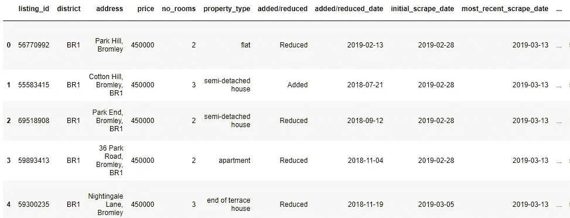

这一切都很好，但如果你像我一样，你是一个视觉型的人，所以我决定制作一些图表。

# 第三步:最初的观想

**Matplotlib**

一旦你掌握了它的窍门，Matplotlib 就非常棒，可以合理有效地用来制作一些基本的图表，例如:

*   直方图

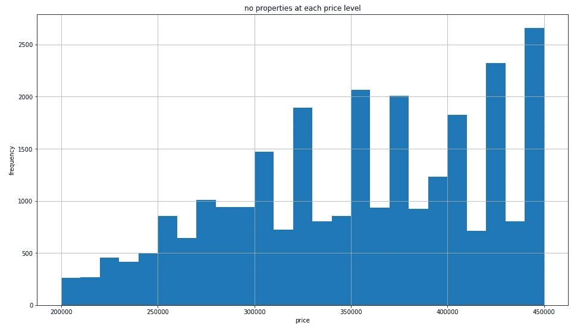

*   条形图

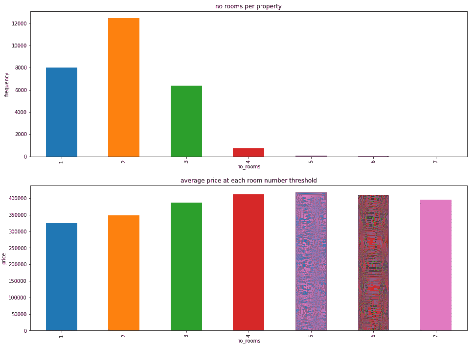

*   折线图

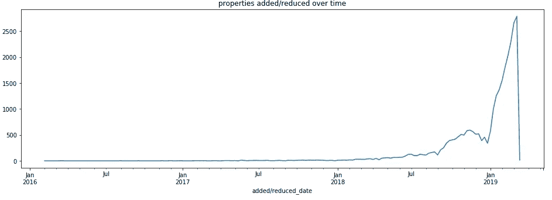

查看这些图表，有一些有趣的地方，例如在我的搜索范围内，伦敦的两张床的房产比任何其他大小的房产都多，而且似乎有一些围绕房产价格整数的聚类。

再做一点工作，你就可以画出每个地区每个房间大小的房屋数量/百分比:

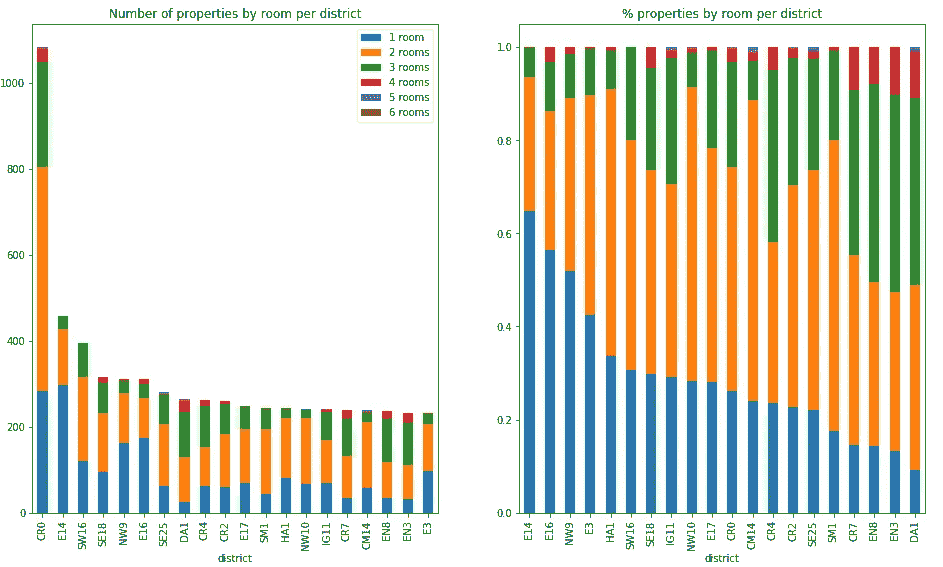

我想了解的事情之一是每种房屋类型的价格如何变化，如套房、公寓、联排别墅等。在绘制该图时，似乎有相当多的房屋类别:

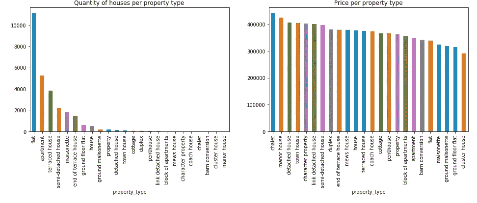

这需要我构建一个映射函数来映射到父属性类型。我拥有的财产类型有:

```
property_types_to_match = ['apartment',
 'barn conversion',
 'block of apartments',
 'chalet',
 'character property',
 'cluster house',
 'coach house',
 'cottage',
 'detached house',
 'duplex',
 'end of terrace house',
 'flat',
 'ground floor flat',
 'ground maisonette',
 'house',
 'link detached house',
 'maisonette',
 'manor house',
 'mews house',
 'penthouse',
 'property',
 'semi-detached house',
 'terraced house',
 'town house']
```

我决定我想匹配的是:

```
['apartment',
 'duplex', 
 'house',
 'maisonette',
 'other']
```

首先，我很好奇在我的价格范围内有没有“庄园”或“小木屋”。第二，幸运的是，pandas 有一个方便的“map”函数，我将一个属性类型字典放入其中，以映射父属性值。按母公司分组，并绘制价格和数量图，我们可以看到，套房是最便宜的房屋类型，而“其他”类别是最贵的。这里出售的公寓也比伦敦其他任何类型的房产都多:

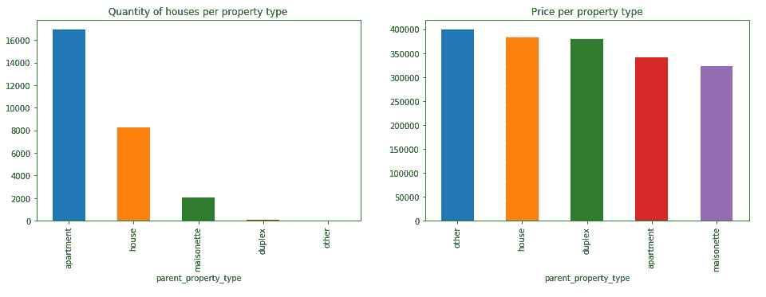

这些类型的图表非常适合显示一些高级趋势，但我想看看是否有更好的方式来呈现数据。

我的下一个想法？

**人人都爱地图**

# 第四步:地图

输入 leav 和 geopandas。每个在映射数据中有不同的位置:

*   Folium 使您能够创建基于缩放级别进行聚类/去聚类的交互式地图
*   Geopandas 允许您按地理区域绘制数据框中的数据

我们先来看看**叶子:**

不可否认，安装叶子有点麻烦，但绝对值得。安装完成后，使用下面的三行代码导入它的一些特性:

```
import folium
from folium.plugins import MarkerCluster
from folium.plugins import FastMarkerCluster
```

从这里开始，创建地图非常简单，因为您有一个带坐标的数据框架:

```
# simple marker map
london_map = folium.Map(location=[51.4986, -0.0691],
                    zoom_start = 10)
for index, row in london_df.iterrows():
    folium.Marker([row['latitude'], row['longitude']], popup=row['address'])).add_to(london_map)# standard cluster map
london_cluster_map = folium.Map(location=[51.4986, -0.0691],
                    zoom_start = 10)
london_cluster_map.add_child(MarkerCluster(london_df[['latitude','longitude']].values.tolist()))# fast cluster map
london_fast_cluster_map = folium.Map(location=[51.4986, -0.0691],
                    zoom_start = 10)
london_fast_cluster_map.add_child(FastMarkerCluster(london_df[['latitude','longitude']].values.tolist()))
```

简单的标记图只是在每个属性位置绘制一个标记，而标准和快速聚类图引入了某种按位置的聚类。区别在于功能——标准聚类图允许您包含弹出窗口等。而快速聚类图不会。话虽如此，对于超过 25，000 个点，标准聚类图的绘制时间太长，所以我选择了快速聚类图，对于伦敦，它看起来有点像这样:

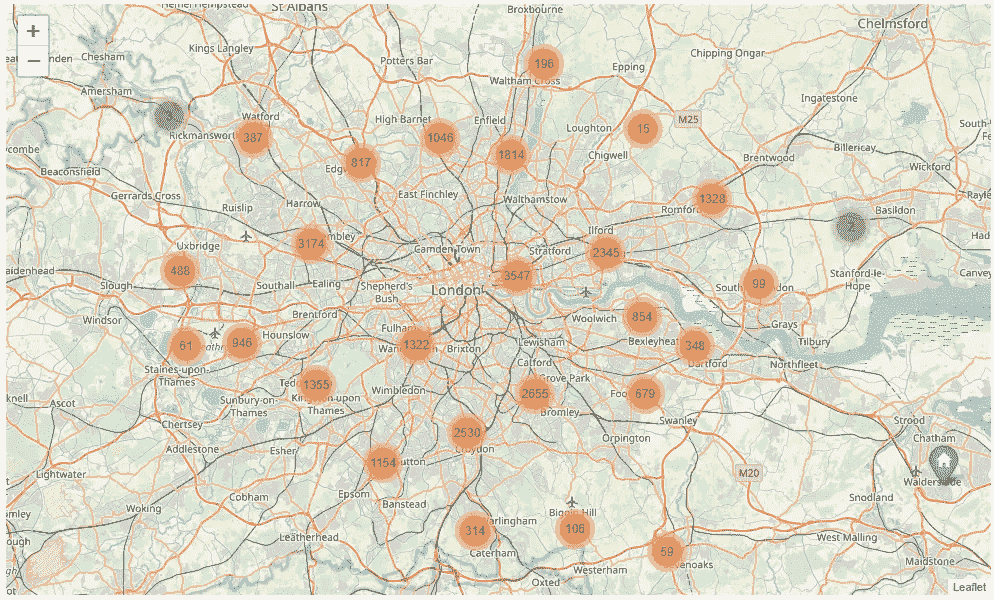

不幸的是，我不知道如何将交互式地图嵌入到媒体文章中，所以静态图像就可以了。放大后，看起来像这样:

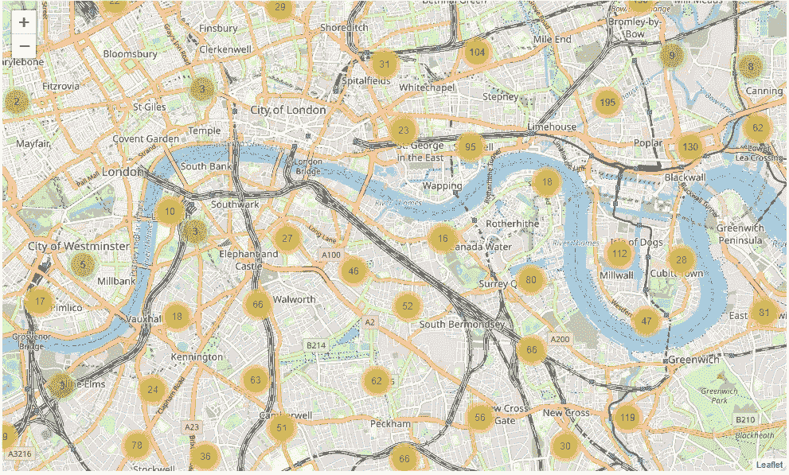

你必须承认，如果你像我一样是一个数据呆子，这很酷。任何形式的交互都让我着迷——也许这就是我在编码生涯开始时对 Excel 感兴趣的原因。

好了，现在我们来看一下**地质公园**

为了充分利用 geopandas 包，我需要获得伦敦各区的形状文件。幸运的是，来自英国伦敦政府数据网站的数据([https://data . London . gov . uk/dataset/statistical-GIS-boundary-files-London](https://data.london.gov.uk/dataset/statistical-gis-boundary-files-london))和其他各种开放数据集的组合使这一数据很容易获得。

同样，奇怪的是，安装 geopandas 有点痛苦，但一旦完成，只需导入它并读入您的形状文件:

```
import geopandas as gpddistrict_shape_file = 'london_postal_districts.shp'
map_df = gpd.read_file(district_shape_file)
```

这将为您提供一个标准的熊猫数据框架，但会识别形状文件中的几何图形，并为您提供如下内容:

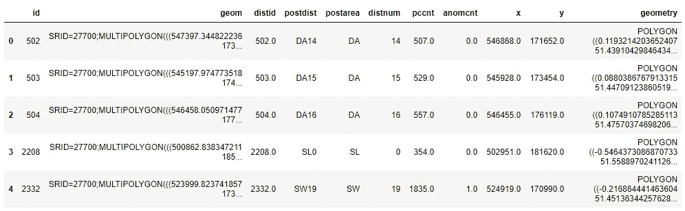

我们需要做的下一件事是与您的其他数据集的按地区分组版本相结合，下面是一个示例:

```
map_df = map_df.set_index('postdist')mean_district_price = london_df.groupby('district')['price'].mean()
mean_district_price_df = pd.DataFrame(mean_district_price)
mean_district_price_df = mean_district_price_df.reindex(district_list, fill_value=mean_district_price_df['price'].max())map_df = pd.concat([map_df, mean_district_price_df], axis=1)
```

太好了，我们准备好开始策划了。如果您简单地使用下面的' map_df.plot()'，您将得到这些地区的轮廓，这是令人放心的:

```
fig, ax = plt.subplots(figsize=(16,9))map_df.plot(ax=ax)
ax.set(title='districts')plt.show()
```

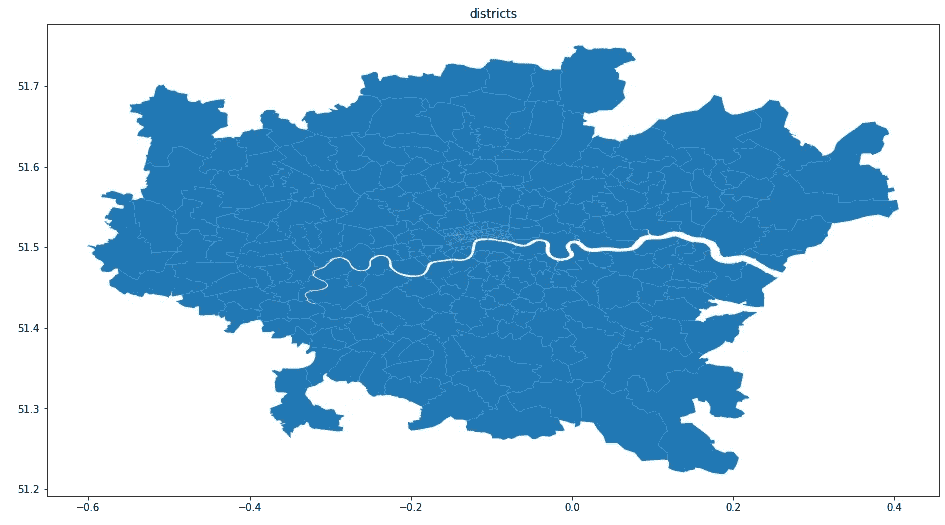

绘制每个区的房产数量告诉我们与 matplotlib 图表中的数据相同的信息——克罗伊登比其他任何区都有更多的房产:

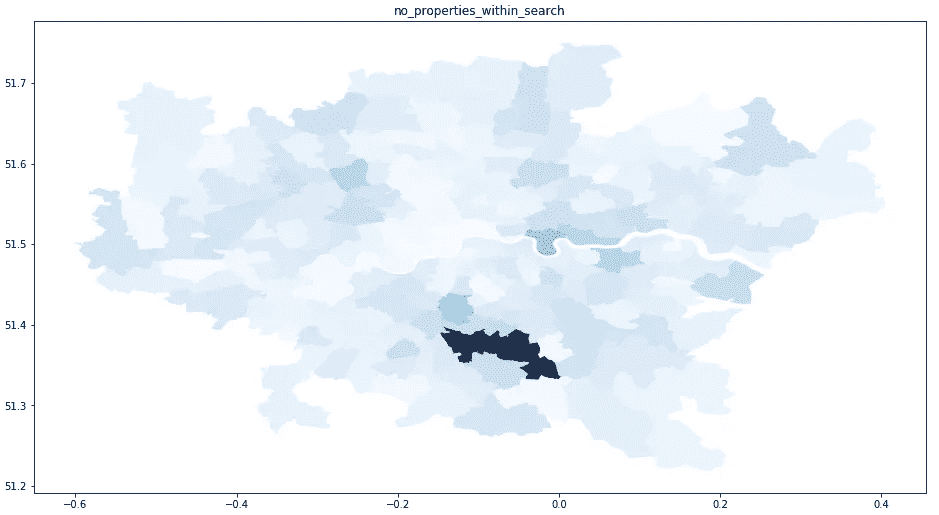

这本身并不是一个非常有趣的情节。

在我看来，有趣的情节是:

*   每个区的平均房价，这告诉我，在这个城市或里士满的任何地方，我都买不起:

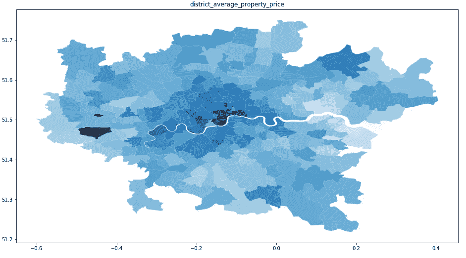

*   挂牌出售的房产数量与各区内的房产总数之比，显示了各区内的住宅房产开发水平:

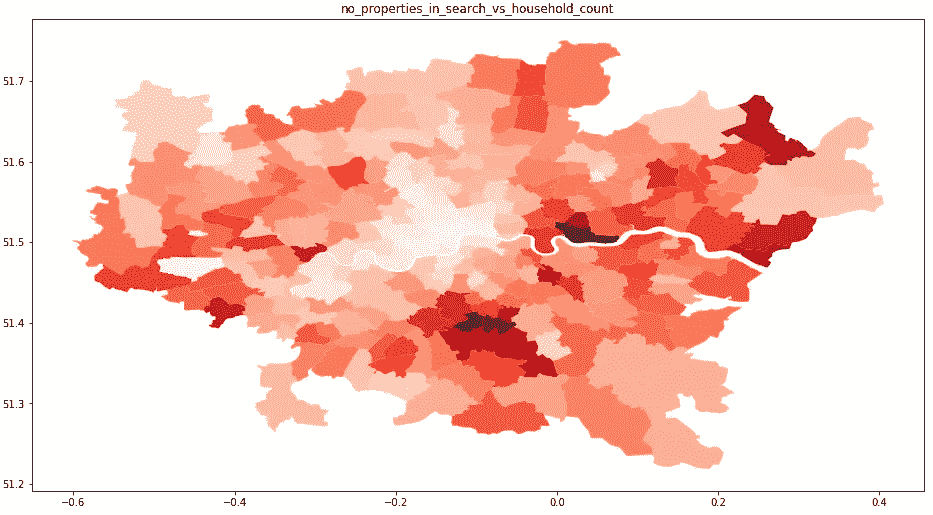

酷，现在我有了一些很酷的图表和地图，接下来呢…

当我评估一所房子是否在一个好的位置的时候，我寻找什么其他的东西？

# 第五步:用更多的数据重复

**交通联系。**

太好了，到 TFL 网站，那里有一个文件包含网络上所有电台的纬度/经度。接下来，我想尝试找到离我的数据集中的每个属性最近的三个站点，以及它们离属性的距离。

首先，我看了看距离:

由于地球的曲率，我不得不使用哈弗辛公式(【https://en.wikipedia.org/wiki/Haversine_formula】)来计算两组坐标之间的实际距离。

这在 python 中的快速实现如下所示:

```
def haversine(lon1, lat1, lon2, lat2):
    # convert decimal degrees to radians 
    lon1, lat1, lon2, lat2 = map(radians, [lon1, lat1, lon2, lat2]) # haversine formula 
    dlon = lon2 - lon1 
    dlat = lat2 - lat1 
    a = sin(dlat/2)**2 + cos(lat1) * cos(lat2) * sin(dlon/2)**2
    c = 2 * asin(sqrt(a)) 
    r = 3956 # Radius of earth in miles= 3956\. kilometers = 6371
    return c * r
```

现在，对于下一点，我知道有一种更快、更有效的方法来计算最近的 3 个站，但我不太清楚，所以我有效地在站和属性之间做了一个相当大的交叉连接:

```
no_properties ~ 25000
no_stations ~ 400
no_calculations = 400 * 25000 = 10,000,000
```

这就是 1000 万次计算，在我的机器上大约需要 12-13 分钟才能完成。如果有人有更有效的计算方法，请告诉我！

无论如何，在计算了到每个站点的距离后，我取了 3 个最小值，瞧，你得到了到三个最近站点的距离。

为了扩充这个数据集，我还使用 Google Distance Matrix API 来获取每个酒店的上下班出行时间。Google 让你免费拥有一定额度的积分，太棒了！对 API 的请求如下所示:

```
coords = list(zip(london_df['listing_id'],london_df['latitude'].tolist(),london_df['longitude'].tolist()))
responses = []
for id, lat, long in coords:
    url = '[https://maps.googleapis.com/maps/api/distancematrix/json'](https://maps.googleapis.com/maps/api/distancematrix/json')
    params = {'units':'imperial',
              'origins':str(lat) + ',' + str(long),
              'destinations':work_lat,work_long,
              'mode':'transit',
              'arrival_time':epoch_time,
              'key':google_routes_API_key}
    r = requests.get(url, params=params)
    response_json = r.json()
    responses.append(response_json)
responses_dict = dict(zip(london_df['listing_id'].tolist(),responses))
```

好的，传输指标达到。接下来呢？

**酒馆。**

每个人都喜欢好的酒吧，特别是当它有很好的啤酒/葡萄酒可供选择时，当它近到足以让你蹒跚而归，但又足够远到当你想睡觉时不会让你睡不着。

我偶然发现了整个英国的 POI 数据集，其中包含了英国几乎所有景点的纬度和经度，包括酒吧、文具店、电影院等。这是一座金矿，所以我仔细检查并提取了“酒吧/餐馆”类别中的所有兴趣点。我知道这包括餐馆，这有点令人沮丧，因为我真的不在乎我是否离芥末/nandos 那么近。但也只能这样了。

幸运的是，和 lat/long 一样，数据集也包含邮政编码，所以我接着检查并找到了包含在我有数据的地区内的所有酒吧(总共 298 家)。这相当于 1400 家酒吧。

对于每个酒吧，我想找到一个衡量“酒吧有多好”的标准——重新输入谷歌。谷歌有一个“地点”API，允许你输入世界上任何一个地方的名称/地址，它会尝试返回它在极其庞大的谷歌地图数据库中拥有的关于所述地方的各种数据。该查询如下所示:

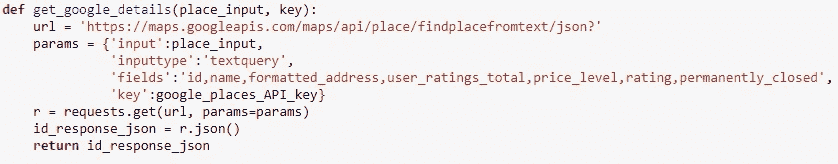

不幸的是，我的数据集在不同的列中有一些缺失的/NaN 值，所以需要进行一些清理。例如，如果酒吧在 name 列中有一个 NaN 值，我就用母公司的名称来替换它，比如' Wetherspoons '或' O 'Neils '等。然后，我通过 places API 运行这些酒吧，并能够获得我的数据集中 99%的酒吧的各种指标，其中最重要的是平均评论评级、评论数量和价格水平。

我决定需要计算三个测量值来获得每栋房子的“酒吧分数”。这些是:

*   附近酒吧的质量
*   邻近的酒吧
*   附近酒吧的数量

我还决定查看每所房子 1 英里内的酒吧，因此再次使用哈弗辛公式在酒吧和房子之间进行了相当大的交叉连接，以获得距离。然后，我只将每家酒店 1 英里范围内的酒吧作为单独的数据集，从中获取每家酒店的酒吧指标。

**酒馆质量评分。**

这只是简单地计算出每家 1 英里范围内酒吧的谷歌评分平均值。然后对所有酒店进行标准化，这样，靠近最低评级酒吧的酒店得分为 0，靠近最高评级酒吧的酒店得分为 1。

**酒吧接近度得分。**

这有点棘手。我认为 300 米是远离酒吧的最佳距离，因为它在磕磕绊绊的距离内，但应该足够远，不会听到任何深夜噪音。为了计算分数，我从每个距离测量中取 300 米，因此如果一个酒馆在 300 米之外，它将得到 0 分。然后我取了这个值的模，确保 300 米内的所有酒吧和更远的酒吧受到相同的惩罚。然后对每栋房子 1 英里范围内的酒吧进行平均，并对我的数据集中的所有酒店进行标准化。

**酒馆数量评分。**

这可以简单地计算为每栋房子 1 英里内的酒吧数量，并根据数据集中的所有属性进行归一化。

**酒吧总分。**

为了将这些计算出来的指标汇总成一个“pub 分数”,我必须考虑哪个值对我来说最重要。靠近一家评级最高的酒吧比靠近 5 家评级很差的酒吧好吗？我假设是的。

因此，我决定重要性的顺序是质量，接近度，数量。

为了计算得分，我使用了 2 个质量权重、1 个接近度权重和 0.5 个数量权重，并将它们汇总如下:

*(2 倍标准化质量)+ (0.5 倍标准化数量)——(标准化接近度)*

出于兴趣，我还使用了 rank 函数，这样我就可以根据 pub 分数查看数据集中排名最高和最低的属性。

为了将这些数据可视化，我将它们全部转储到一个 geopandas 数据框架中，并使用了方便的 shapely 函数" *point"* "，该函数将经纬度坐标转换为实际的可绘图点。我还决定要根据总分的值改变颜色，所以我使用了 matplotlib.colors 中非常方便的 LinearSegmentedColormap 函数和“plot”函数的“cmap”参数。好了，描述它没有用，下面是代码:

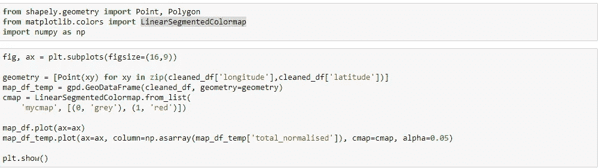

由此产生了以下情节:


当与先前导入的地区地图文件结合使用时。这表明，Streatham/Dulwich/Croydon 周围的地区是购买房产的最佳地点，如果你只关心酒吧的话…

我还绘制了数据集中一些地区的分布图，这些分布图显示，中央克罗伊登的房产得分差异很大，而诺丁山(W2)等地的房产得分似乎更高。这里，n 对应于数据集中每个区内的房产数量:

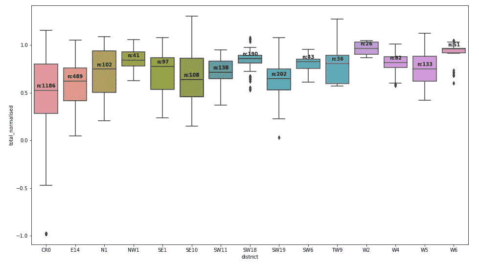

**下一步:**

*   研究如何更有效地找到最近的“x”点
*   查看学校/集水区的数据，以及这些数据与价格的关系
*   研究用 python 绘制旅行时间等值线——任何想法都很好！

希望你觉得这很有趣！