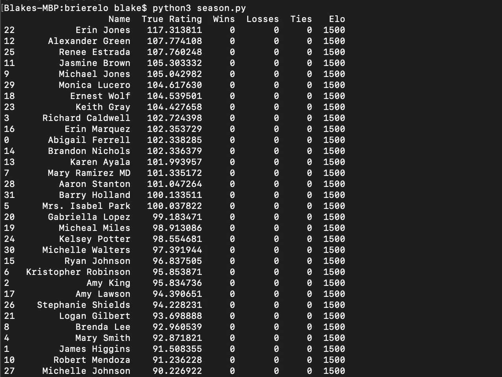
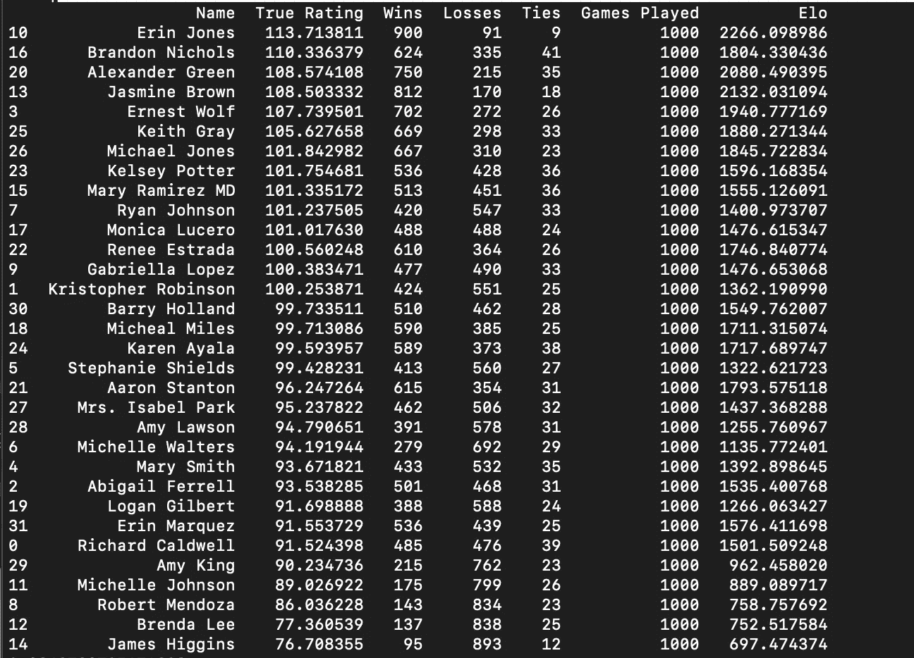
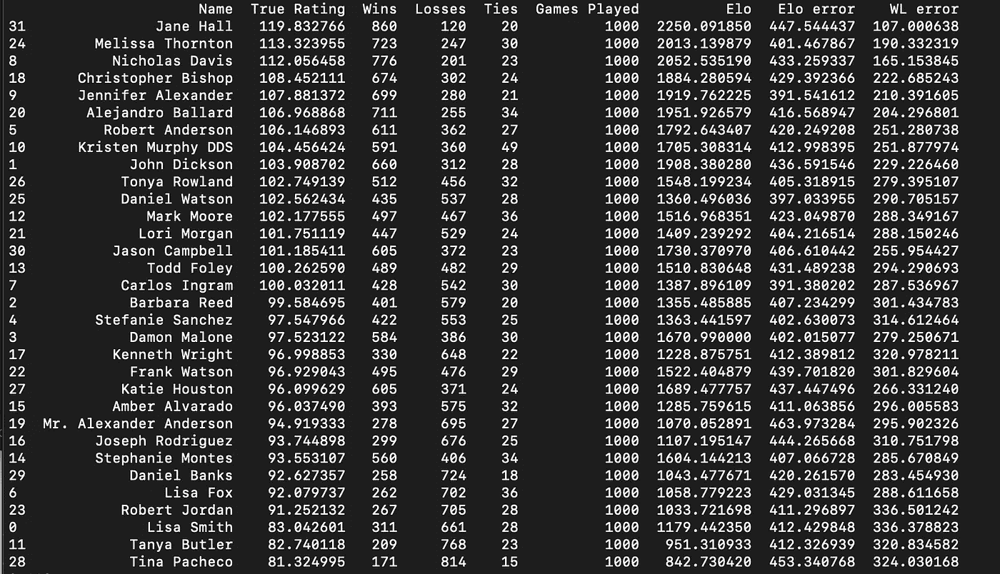
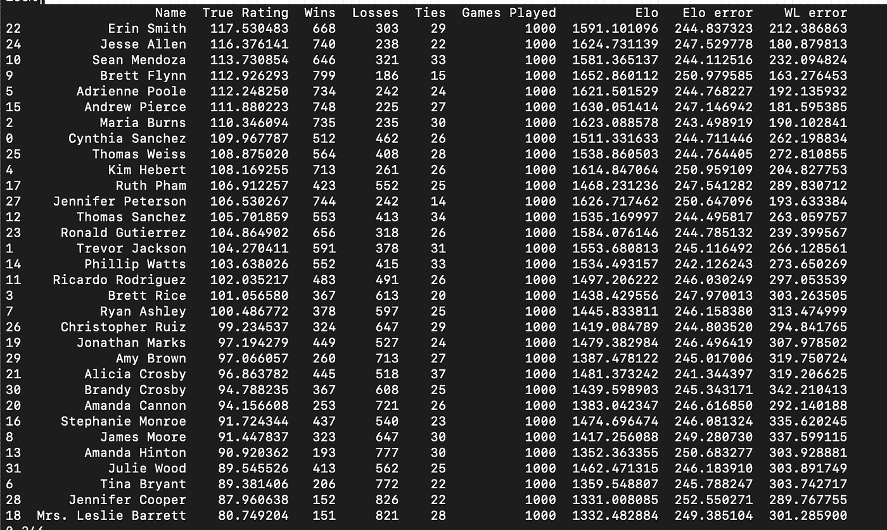
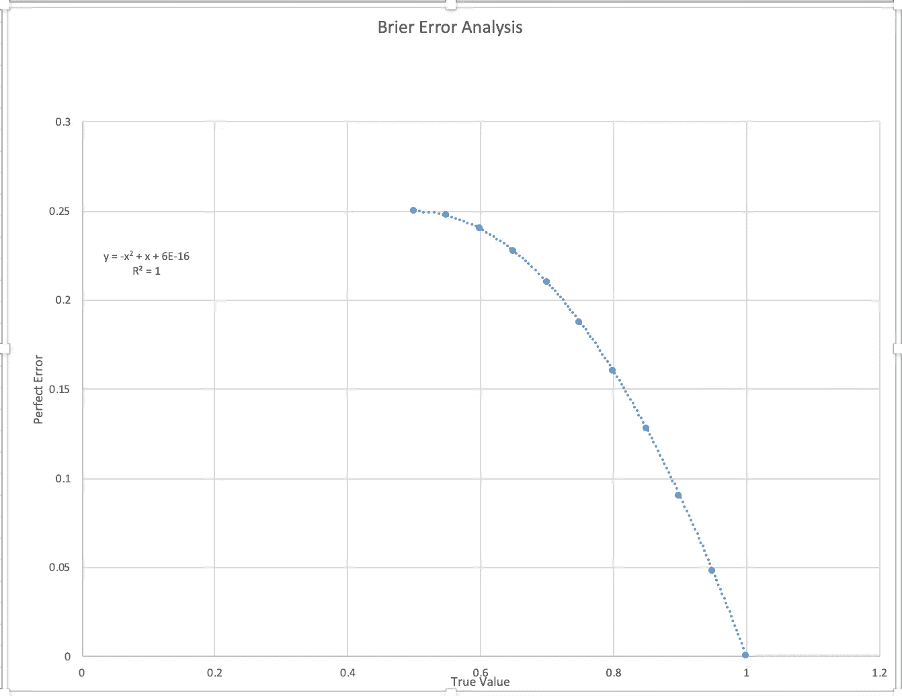

# 给运动队评分——Elo 与输赢

> 原文：<https://towardsdatascience.com/rating-sports-teams-elo-vs-win-loss-d46ee57c1314?source=collection_archive---------7----------------------->


Photo by [Ariel Besagar](https://unsplash.com/photos/HkN64BISuQA?utm_source=unsplash&utm_medium=referral&utm_content=creditCopyText) on [Unsplash](https://unsplash.com/search/photos/trophy?utm_source=unsplash&utm_medium=referral&utm_content=creditCopyText)

## 哪个更好？

# 介绍

在任何一项运动中，有许多方法可以决定谁是最好的团队或运动员。可以看看最近 5 场。最近 10 场比赛。你可以使用分数差。您可以根据哪些团队“感觉”最好来对他们进行评级。你可以看看花名册，看看哪个队有汤姆·布拉迪或詹姆斯。无论是权力排名，部门排名，还是其他什么——有科学的方法来评估团队，也有不科学的方法。以下是科学地决定一个好的分级系统的尝试。

# 什么是 Elo 评级？

首先，我觉得我打不过 [538 对 Elo](https://fivethirtyeight.com/methodology/how-our-nfl-predictions-work/) 的透彻描述。维基百科的[页面](https://en.wikipedia.org/wiki/Elo_rating_system)也挤满了有用的信息。不过，我会简单介绍一下。

Elo 评级系统是一个非常简单却非常有效的评级系统。它最初是为国际象棋开发的，但没有什么是国际象棋特有的。Elo，以其原始形式，可以用于任何面对面的游戏。掰手腕、拼字游戏、乒乓球，应有尽有。人们也可以把团队，比如篮球队，看作是互相对抗的“玩家”。

每个玩家或团队都有自己的 Elo 等级。惯例是新玩家从 1500 分开始，但是 1500 分有点武断。当两名玩家玩游戏时，他们会在游戏开始前自动“下注”他们的 Elo 点数。这个赌注的大小被称为 K 值。胜者在比赛结束后获得分数，败者在比赛结束后失去分数。奖励的点数取决于初始评分的相对差异。举例来说，如果一个 1700 技能的玩家击败了一个 1300 技能的玩家，没有多少点数被奖励——这个结果是意料之中的。另一方面，如果 1300 级玩家击败 1700 级玩家，则几乎整个下注点数池都被奖励给 1300 级玩家，并从 1700 级玩家中扣除。

K 值或下注点数取决于游戏。在像棒球这样的运动中，K 值会很小。即使是最好的棒球队也很难赢得超过 70%的比赛。此外，他们在 MLB 打了 162 场比赛。所以，如果 MLB 最好的球队连续输了三场比赛，这可能没什么大不了的，他们仍然可能是联盟中最好的球队。你不想要一个大的 K 值，否则 Elo 评级会对连败反应过度。然而，在 NFL 或大学篮球赛中，最好的球队有望赢得 80%以上的比赛。在 NFL，也有一个小样本量。在这种情况下，允许更不稳定的 Elo 评级是可取的——一个 3 连败的球队可能不是联盟中最好的球队。此外，在短暂的一季中，您希望收视率快速调整。

如果我们对预测比赛结果感兴趣，Elo 评级是强有力的预测工具。它们甚至比输赢记录更有预测性，接近预测市场。这是假设你有一个好的 K 值。一旦你对 Elo 评级有所了解，你就能猜出好的 K 值。这篇文章的目的是给你一个达到最佳状态的科学方法。

# 一项实验

我声称 Elo 分数比输赢记录更能描述一个球员或球队的技术。我们不要认为这是理所当然的。首先，为了证明这一点，我将设计一个抽象的游戏，其中一些玩家比其他人更好，让他们互相玩。玩家将有一个输赢记录和一个 Elo 等级。然后，我们将能够在友好的环境中比较这些评级。在以后的文章中，我将使用容易获得的运动数据，看看这个过程在现实世界中是否可行，而不仅仅是一个友好的实验。这个实验的代码可以在我的 Github 页面上找到。

## 友好、可控的示例

在现实世界中，有一些 Elo 没有考虑到的复杂问题。比如一支球队会在休赛期选秀球员，变得更好或者更差。如果一个明星球员被交易或者受伤了，Elo 是不知道的。所以让我们设计一个没有混乱复杂情况的游戏。

## 运动球

有一种新游戏叫做运动球，一个由所有最好的运动球运动员组成的大联盟刚刚成立。来自世界各地的球迷都会去看他们最喜欢的运动球队。大联盟运动球有 32 名球员，球员总是在他们来自的城市之间的中点打球(以抵消主场优势)。虽然售票处不喜欢这一举措，但计算 Elo 收视率的人喜欢。

为了模拟真实能力，每个玩家都会有一个“真实等级”。当两名运动员比赛时，一个随机变量将被添加到真实评分中，这样较弱的队伍可以击败较好的队伍。否则，这将是一个无聊的实验。随机变化基本上是一种模拟运气和玩家当天感受的方式。

最后，为了模拟随时间的变化，每个玩家的真实评分将在每场比赛后随机调高或调低。赛季输赢记录将无法适应这些变化，但 Elo 将能够做到。这给了 Elo 一个在现实世界中也会有的优势。在 1000 个游戏赛季结束时，我们将比较真实评级、输赢记录和 Elo 分数。

## 密码

让我们首先创建一个玩家类来跟踪所有这些属性。

```
class Player(object):
    """Player Object"""
    def __init__(self, name, rtg, elo, nudge):
        super(Player, self).__init__()
        self.name = name # true rating
        self.rtg = rtg # elo rating
        self.elo = elo # wins, losses, ties
        self.wins = 0
        self.losses = 0
        self.ties = 0
        self.games_played = 0 # how much to nudge ratings
        self.nudge = nudge def nudge_rating(self):
        # decide to nudge up or down
        direction = random.randint(0,1)
        if direction == 0:
            self.rtg += self.nudge
        else:
            self.rtg -= self.nudge def add_win(self):
        self.wins += 1 def add_loss(self):
        self.losses += 1 def add_tie(self):
        self.ties += 1 def played_game(self):
        self.games_played += 1
```

我喜欢设置一个 settings.py 文件，方便调整参数。因此，让我们为我们的实验创建一些基本设置。

```
season_settings = {
    # the way it's coded, it must be even number of players
    'num_players':32,
    'num_games':1000,
    # average ratings for the teams
    'avg_rtg':100,
    # standard deviation of ratings (higher -> more difference in player skill)
    'std_dev': 5,
    # game by game variation amount:
    'game_var':7.5,
    # after each game, how much does the true rating change?
    'rtg_nudge':0.2
}
elo_settings = {
    'init_elo': 1500,
    'K': 2,
    'beta':400
}
```

我事先运行了几次，决定了一个合理的 K 值。本文的目的不是解释 Elo，而是最大化 Elo 的有效性。我鼓励你复制我的 Github repo，自己玩这些价值观。如果你想知道更多关于 beta 和 K 值的信息，我鼓励你阅读我上面给的链接。一旦我们决定了设置，我们可以创建一个联盟:

```
# array to store players
league = []
# table to track wins/losses
table_array = []# create league
for p in range(season_settings['num_players']): # initialize players
    player_name = fake.name() # assign random initial true ratings
    player_rtg = random.gauss(season_settings['avg_rtg'], season_settings['std_dev'])
    player_elo = elo_settings['init_elo'] nudge = season_settings['rtg_nudge'] player_entry = [player_name, player_rtg, 0, 0, 0, player_elo]
    table_array.append(player_entry) new_player = Player(player_name, player_rtg, player_elo, nudge)
    league.append(new_player)league_table = pd.DataFrame(table_array, columns=['Name', 'True Rating', 'Wins', 'Losses', 'Ties', 'Elo'])league_table = league_table.sort_values(by='True Rating', ascending=False)
```

注意:我使用了 [faker](https://github.com/joke2k/faker) 包来创建假名字。现在我们有 32 名技能分布正常的球员:



所以是时候打第一季的 Sportsball 了！我不会给出所有代码，但我会展示我用来运行比赛的 for 循环:

```
for i in tqdm(range(season_settings['num_games'])): # create random matchups (pops from league list)
    matchups = create_matchups(league) # reset league
    league = [] # play games
    for matchup in matchups:
        p1 = matchup[0]
        p2 = matchup[1]
        p1_score, p2_score = play_game(p1, p2)
        p1, p2 = update_players(p1, p2, p1_score, p2_score)
        league.append(p1)
        league.append(p2)
```

注意:我还使用了 [tqdm 包](https://pypi.org/project/tqdm/)来显示进度条。我再次鼓励你去我的 [Github](https://github.com/btatkinson/sportsball-elo) 看看所有的代码。下面是结果！(Sportsball 还没有季后赛，因为经理们无法就条款达成一致)。



恭喜艾琳·琼斯！她以最好的真实收视率开始了这一季，以最好的真实收视率结束了这一季。最熟练的玩家赢得最多！无意冒犯艾琳，但我们真的不在乎。更有趣的例子可能是布兰登·尼科尔斯，他在赛季开始时排名第 12，结束时排名第 2。他的 Elo 和他的获胜次数都表明他并不是一直以来都是第二好的。也许他在赛季末有了很大的进步？

突然间，我们进退两难。我们如何知道评级系统有多好？我们可以利用赢/输栏(平局判一半赢)和真实评分的相关性，来了解使用赢/输记录反映真实评分的效果。相关性为 88.2%。然而，这并不完美。如果布兰登·尼科尔斯在赛季末大幅提高，输赢记录不会准确反映真实的评级(显然不会)。Elo 评级显然还没有赶上布兰登的真正技能。它仍然认为茉莉布朗是第二好的。哈！是否应该提高 K 值，让 Elo 调整得更快？嗯嗯…

而且，如果你好奇的话:Elo 和 True Rating 的相关性是 88.6%。这远不是 Elo 比输赢更好的决定性证据。事实上，当我多次运行这段代码时，输赢有时关联得更好。然而，这种高度的相关性确实表明 Elo 是一种不错的球员评级方法。

因此，我们需要一种方法来对评级系统进行评级。就像收视率调查一样。这让我想到了一个神奇的附加物，荆棘得分。

# 什么是 Brier 分数？

Brier 评分是一种简单的预测评分方法。和 Elo 一样，我也不是最能解释的人。它们是我最喜欢的书之一《超级预言》的核心组成部分。我会尽我所能给出一个简短的概要。

假设我在预测天气。我认为有 30%的可能性会下雨。然后下雨了。说“这是一个可怕的预测”很有诱惑力，也很人性化。人类(我对此也有罪恶感)经常假设，如果有人站在错误的那一边，他们就是错的。每当有人说某件事有 65%的可能性，而它没有发生，就感觉那个人错了。但是那个人可能是完全正确的。事实上，有人可能会说有 5%的可能性会下雨，然后就下雨了，那个人仍然是对的。我保证我不是天气预报员或天气预报员辩护者。我们只是生活在一个不可预测的世界里，不可能的事件会发生。幸运的是，我们是体育球分析师，我们有一个 1000 场比赛的赛季来找出我们的错误！

Brier 分数基本上概括了预测误差。一个好的预测者会有一个最低的 Brier 分数。我将举维基百科上关于降雨预报的例子来说明:

*   如果预测是 100%并且下雨，那么 Brier 得分是 0，这是可以达到的最好得分。
*   如果预报是 100%并且不下雨，那么 Brier 得分是 1，这是可达到的最差得分。
*   如果预测是 70%并且下雨，那么欧石南得分是(0.70−1)^2 = 0.09。
*   如果预测是 30%并且下雨，那么欧石南得分是(0.30−1)^2 = 0.49。
*   如果预测是 50%，那么不管是否下雨，欧石南的得分是(0.50−1)^2 = (0.50−0)^2 = 0.25)。

所以，这里有一个权衡。我可以选择对我的降雨预报非常保守。我可以说每天有 50%的机会下雨。在这种情况下，无论发生什么，我的 Brier 误差是每次预测 0.25。那完全没用。因此，任何高于这个值的误差都是不好的，在某些情况下，与预测相反可能会更好。

Brier 分数的优势在于，它惩罚了过于自信的预测者。当结果接近确定时，你会因为预测“我确定某事”而获得奖励，当结果不确定时，你也会因为预测“它可能会发生，我不确定”而获得奖励。

Brier 分数也有弱点，我将在以后的文章中详细阐述。假设我在沙漠里，那里几乎不下雨。然后我每天预测 0%就能有一个合理的 Brier 分数。一方面，这感觉像是欺骗。一到两次下雨，我会有一个巨大的误差(每天 1)。这是一项严厉的处罚。另一方面，预测(我在沙漠中)需要一定程度的知识，所以小一点的荆棘是有道理的。理想情况下，如果我是一个不错的预报员，我会在下雨前增加我预测降雨的机会…显然…

## 布赖尔和艾洛的自然结合

Elo 评级自然会给出玩家赢得游戏的百分比几率。这是内在计算的一部分。同样，输赢记录也可以做到这一点。如果一个玩家或团队赢得了 76%的比赛，那么期望他们在 76%的时间里赢得随机比赛似乎是合理的。因此，我们可以计算两者的误差。由于 Elo 评级考虑到了对手的实力，也应该随着时间的推移而调整，我们预计 Elo 的表现将优于输赢记录。但是让我们看看！

## 代码更改

我认为追踪错误最简单的方法是添加 Brier 错误和赢输错误作为玩家类变量。在每场比赛后，每个玩家的输赢预测和 Elo 预测都将与结果进行比较，并计算 Brier 误差。然后它将被添加到球员的赛季总误差中。在赛季结束时，所有球员的所有赛季误差将被加在一起。然后我们将除以游戏数量和玩家数量，得到每场游戏的误差。让最好的评级系统胜出。



## 结果

哇！那是意想不到的。输赢记录更能预测结果！Elo 的精确误差值为 0.41/场，W-L 记录方法的精确误差值为 0.27/场。与我们之前的 50/50 基准相比，这真的很糟糕！这意味着我们真的需要校准 Elo。让我们试着调整 K 值来提高 Elo。



事实证明 Elo 的收视率对每场比赛都反应过度了。我将 K 值改为 0.5，将 Beta 值改为 400，这使得 Elo 评级经常打破输赢记录。总而言之，Elo 误差平均约为 0.244，W-L 记录平均约为 0.262。

然后我开始玩季节长度。在更长的赛季，如 10，000 场比赛，有一个非常小的 K 值要好得多。在超长赛季中，Elo 似乎会跑掉，变得不准确。然后我把赛季长度改成了 10 场和 100 场，Elo 常规以高 K 值(比如 5)击败 50/50 预测和 W-L 纪录。

## 我不满意

0.24 听起来很糟糕，事实也的确如此。然而，如果你完美地预测了 70%的获胜概率，那么你的误差是 0.21。如果你完美地预测了 90%的获胜概率，那么你的误差是 0.09。欧石南的分数并不能很好地评估那些自然接近胜负的预测。

事实证明，可能有一种更好、更流行的方法来计算预测误差。敬请期待！



As your accurate predictions increase in likelihood, your Brier scores increase naturally. I apologize for the ugly Excel graph.

正如你所看到的，对于任何实际上胜负难料的游戏，即使有完美的预测准确性，你的 Brier 分数也不会比 0.25 好多少。完美的 Brier 分数可以通过一个显而易见的等式找到(除了我不得不画出它来看):-x + x。

## 我学到的是:

*   欧石南分数在识别坏预测方面很棒。然而，当我模拟接近掷硬币的游戏时，他们会很纠结，因为最好的分数可能接近 0.25。
*   当游戏结果的变化较小时，例如一个团队可以赢得 95%的时间，输赢记录似乎比 Elo 表现得更好。
*   当有更多真正的技能移动性(rtg_nudge 设置)时，Elo 的表现优于预期的赢输。
*   在超长赛季中，Elo 失去了控制。这不一定是对 Elo 的抨击，这是实验中的一种错误——由于随机漫步数学，某些比赛的实际获胜预期超过 100%。
*   为了在极端情况下快速获得准确性(例如，当最好的队和最差的队比赛时)，你必须提高你的 K 值。提高 K 值会损害中层团队的准确性。所以有一个权衡——要么在不均衡的比赛中准确，要么在胜负难分的比赛中准确。

总而言之，我觉得我学到了很多东西。

未来的职位和目标:

*   通过各种手段提高 Elo。胜利的边缘，保持稳定，等等。
*   测试同时使用盈亏和 Elo 的回归
*   也许使用盈亏差额作为另一个基线工具
*   对真实数据进行操作

等不及了！