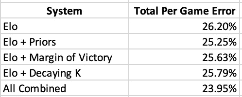
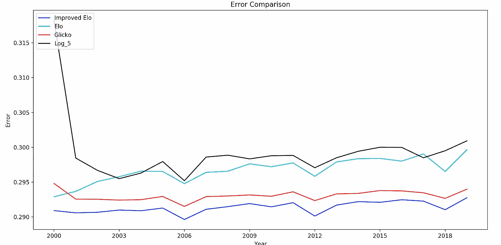
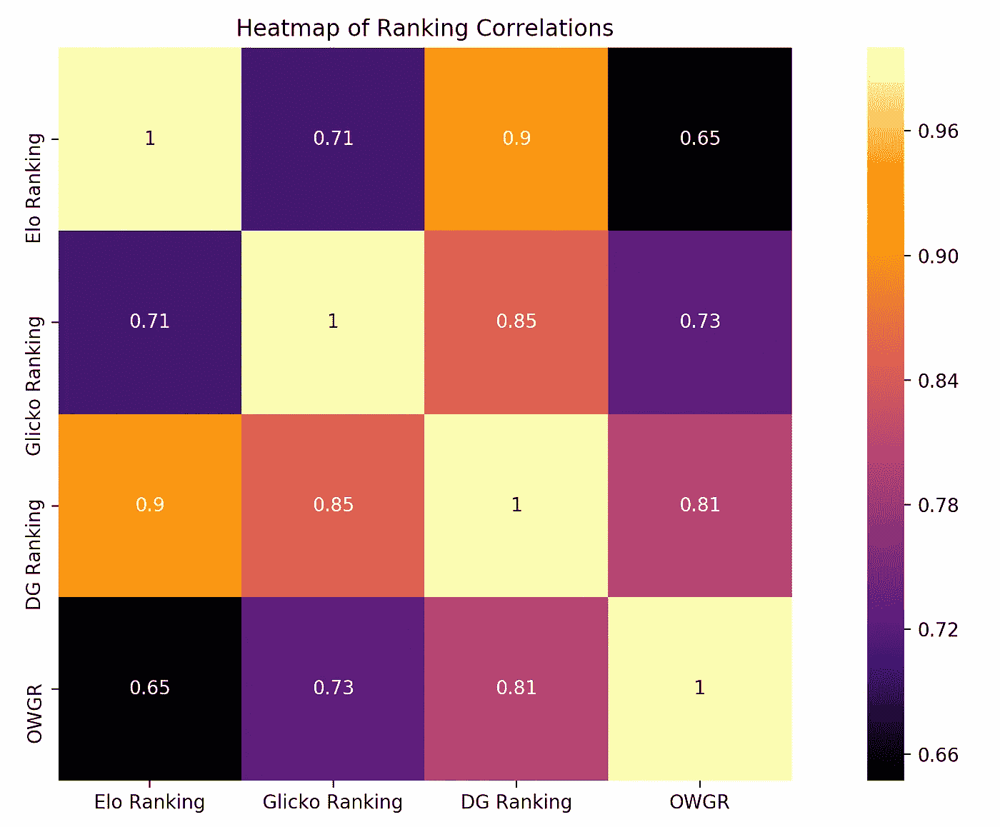
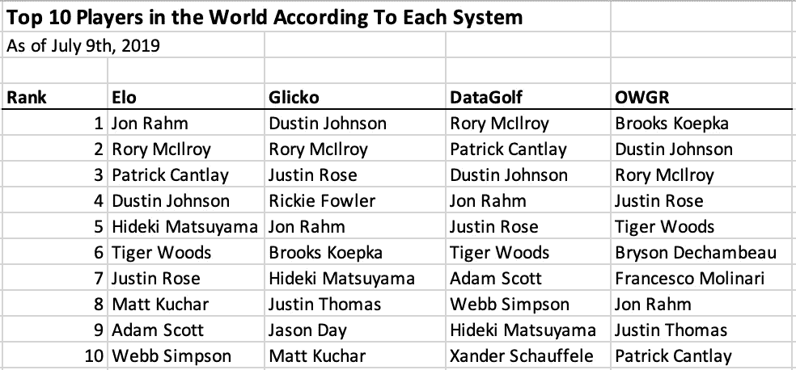

# 给运动队评分——最大化一个通用系统

> 原文：<https://towardsdatascience.com/rating-sports-teams-maximizing-a-generic-system-772144574a07?source=collection_archive---------10----------------------->

Photo by [Markus Spiske](https://unsplash.com/@markusspiske?utm_source=unsplash&utm_medium=referral&utm_content=creditCopyText) on [Unsplash](https://unsplash.com/search/photos/basketball?utm_source=unsplash&utm_medium=referral&utm_content=creditCopyText)

## 仅仅从一条分数线我们能得到多少信息？

# 介绍

我的第一篇媒体文章是关于预测运动结果的基本方法。它使用简单的盈亏记录作为基线。例如，如果芝加哥小熊队今年赢得了 58%的比赛，你会期望他们未来赢得 58%的比赛。那篇文章表明，由一位名叫 Arpad Elo 的物理学教授在 20 世纪 40 年代发明的一个简单的系统可以胜过单独使用输赢记录。

有一些好消息:现在不再是 20 世纪 40 年代，我们可以获得大量的数据和计算能力。此外，许多人(特别是 [538](https://fivethirtyeight.com/methodology/how-our-nba-predictions-work/) 和哈佛教授[马克·格利克曼](http://www.glicko.net/))为改进通用评级系统做出了许多贡献。因为我对模特、运动等感兴趣。我已经决定汇编和比较这些评级系统。

# 为什么？

我对创建运动模型感兴趣，我认为任何模型中最基本的输入是对整体技能的估计。如果你只是用输赢来代表整体技能，你是在给自己设限，因为随着比赛越来越多，你依赖你的模型来推断赛季输赢记录有多重要。这导致使用多个输入(如过去 5 场比赛的记录，过去 10 场比赛的记录等)来尝试评估技能。我认为创建模型时最好的第一步是最大化(在合理的范围内)对整体技能的单一评估。最坏的情况下，它可以作为一个很好的基线。

# 丰富

1.  **数据** —在上一篇文章中，我用 Python 的随机库生成了假球员和假分数。不再！在这个故事中，我使用了 2003 年的真实大学篮球数据和 2000 年的真实 PGA 和欧洲巡回赛(高尔夫)数据。大约有 87，500 场大学篮球赛和 1，700 场高尔夫锦标赛。
2.  在上一篇文章中，我使用了最基本的 Elo 形式。不再！我给 Elo 增加了大约四个特性来改进它。还记得我之前提到的格利克曼教授吗？他有自己的系统，我们也试试那个。这两个系统都可以对高尔夫球员个人或篮球队进行评级。
3.  基线(Baseline)—如果我们在改善其他一切，为什么不同时改善我们的基线呢？之前我只是用一个球队的输赢百分比来预测比赛结果。虽然把自己和不如自己的对手相比感觉很好，但这不是一种非常科学的做事方式。相反，这一次，我将使用 [Log5 方法](https://en.wikipedia.org/wiki/Log5)，它包含了两个团队的胜率。我稍微修改了一下，如果两个队都是不败的或者两个队都是零胜，它保证返回 50%的胜率。
4.  **错误跟踪**——上一篇文章没有一样是令人满意的！我们将使用[交叉熵损失](https://en.wikipedia.org/wiki/Cross_entropy)(也称为对数损失)而不是 Brier 分数。为什么？我的最佳答案是，因为这样更容易判断你的评级系统是否在改进，或者你只是在猜测。你会因为过于自信而受到更多的惩罚，因此它会迫使你的系统稍微保守一点。我发现这也是一个更受欢迎的误差函数，但我想这不是使用它的具体原因。

# 系统

Question: Which system is best?

## **1)日志 5**

直截了当的说，Log 5 就是一个简单的配对比较公式，比较两队的胜负。

## 2) Elo 评级

同样，非常简单。如果你不知道 Elo 是什么，我推荐[我的第一篇文章](/rating-sports-teams-elo-vs-win-loss-d46ee57c1314)或者 538 个讲解者之一的[。](https://fivethirtyeight.com/features/introducing-nfl-elo-ratings/)

## 3)改进的 Elo

终于来了个新人！我从四个方面改进了 Elo:

1.  **胜率:**胜率很简单，更大的胜率意味着更多的 K 奖励(你的等级提升更快)。这在阿拉巴马橄榄球赛这样的情况下尤其有用。如果他们每场比赛都赢了 20+分，改进的 Elo 系统可以更快地调整其评级，以迅速将阿拉巴马州评为所有球队中的顶级。是的，实现有点复杂，我稍后会进一步解释。另一方面，这也适用于一场比赛输了 20 多分的球队。
2.  **衰减的 K 值:**从高 K 值开始考虑赛季初期的不确定性是有道理的。这使得收视率在赛季初调整得更快。随着赛季的进行，随着收视率有更多的数据可以确定，K 值会下降。如果一个赛季的主导球队在赛季后期遭遇三连败，收视率不会反应过度，因为 K 值较低。在我的实现中，我使用指数衰减，但是可能有更好的函数。
3.  **前科:**这只是季前赛排名的一个花哨词。经常被诽谤的季前赛排名包含信息，尽管有时是坏信息。该模型想知道是否每个人都认为肯塔基篮球队和杜克篮球队整个赛季都可能进入大学篮球队的前 10 名。这给了它一个向真实排名靠拢的良好开端。有了这个开端，就不太需要用超高的 K 值来启动收视率了。显然，季前赛排名对于像 NFL 这样的短赛季运动和像 MLB 这样的长赛季运动更有用。赛季越久，季前赛排名就越不重要。在大学篮球赛季，我发现最好每年保持一支球队 70%左右的收视率。
4.  **自相关预防:**还记得我说过实现胜利边际是复杂的吗？标准 Elo 的一个优势是它是平衡的，不会随着时间的推移而失控。基于胜率提升奖励 K 值打破了这种平衡。自相关预防项(ACP 项)使我们改进的系统保持平衡。

## **4)格里科**

如果我告诉你…有一个完全不同的评级方法可以尝试？这个是我之前提到的格利克曼教授在 1995 年发明的。值得[阅读论文](http://www.glicko.net/glicko/glicko.pdf)本身，但我会尽力总结。Glicko 引入了两个主要组件。第一，它引入了不确定性。这是非常有用的。Elo 评级系统中的总体评级仅由一个数字表示。让我们以一个评级为 1750 的玩家(或团队)为例。问题是你不能 100%确定，在一个随机的日子，在随机的条件下，在最后一场比赛后的两个星期，玩家的准确等级是 1750。相反，你可以非常确定玩家的“真实”评级在 1650 到 1850 之间。在 Glicko 系统中，在这种情况下，*评级偏差*项将为 50。它将表示玩家的真实能力在 1750 的 100 分(两个评级偏差)内的 95%置信区间。

不确定性也可以修改。如果一个球员已经 3 个月没有比赛了，我们可以增加不确定性。如果一名球员的比赛成绩非常不稳定，格利克会保持很高的不确定性。

另一个介绍是“评级期”的概念。作为一个温和的剧透，我凭经验发现，在某些体育项目中，评分周期比其他项目更有效。Glicko 将一个评级周期内的所有匹配视为同时发生。这在高尔夫球比赛中很有用，当你同时与 100 多名其他选手比赛时。这不仅减少了计算时间，而且通过使用所有其他球员作为参考，Glicko 能够确定一轮得分的上下文。另一方面，在大学篮球中，它的效果就不那么好了。我发现三场比赛的收视率是最好的。篮球用一个收视率周期没多大意义。根据你如何将过去的游戏分成三组，你可能会得到不同的评分。你还在等待三场比赛来更新排名，所以你经常忽略最后一场或最后两场比赛来影响你的排名。

实现说明:我使用的是 Glicko 2，但我称它为 Glicko。我大量引用了 Github 用户 sublee 的这个实现。

# 大学篮球成绩

Error per game, averaged from 2003–2019\. Less is better!

在上面的图表中，我展示了我尝试的评级系统中每场比赛的误差。周误差是从 2003 年到 2019 年所有赛季的那一周所有比赛的平均值。首先:哇！改进的 Elo 在微调时表现非常好。至关重要的是，它在赛季后期与其他评级系统保持着明显的差距。在运动模型中，当你为小数位而战时，那真的令人印象深刻！值得注意的是，它甚至在没有季前赛排名的情况下击败了格利克，这也是我可以在格利克系统中实现的。无论如何改进的 Elo 似乎更好！

在我看来，最奇怪的发现是我在赛季初改进的 Elo 实现的有效性。赛季初期的误差小于赛季后期的误差。我认为这主要是由于传统的优秀球队在赛季初与纸杯蛋糕对手“热身”。如果肯塔基打无名定向学校，改进的 Elo 将预测肯塔基赢的概率为 90%+并且当他们最有可能真的赢时，误差将非常低。

除了蛋糕时间表，可能还有其他解释。与漫长的休赛期相比，球队在赛季中发展和改变技能更多吗(因此更难预测)？休赛期花名册更替对球队能力的影响有多大？我认为误差随赛季的演变值得进一步探讨。赛季中的伤病，联盟与非联盟的比赛，以及研究教练的影响都将是有趣的方向。

第二个结果是，经过多次调整，我无法让格利克接近击败改进的埃洛。这令人惊讶，因为这应该是一个更好的系统！策划完这个，我才意识到格利克在大学篮球宇宙中的不足。不过，我们先不要把它扔掉！

此外，我隔离了 Elo 的单个改进，以表明它们都做出了贡献:

Improvement Isolation

个人的改进我没有完全优化，重点是他们都有所贡献。同样令人印象深刻的是，作为一个整体，它们看起来是一样的，甚至比它们各部分的总和还要好。我有点期待衰减 K 和先验是同一个问题的两种解决方案，但事实证明，它们甚至在一起都很有用。我用的代码，sans data，可以在这里找到[。](https://github.com/btatkinson/improving_elo)

# 高尔夫成绩

*注意#1:在 2019 年 7 月 9 日更新之前，我正在展示高尔夫 Glicko 的结果，这些结果比他们应该得到的要好。我允许一些数据泄漏来改善结果。*

Each system was optimized as much as possible within reason.

*注意#2:如果你想知道我是如何在高尔夫中使用 Log 5 的，我是通过对锦标赛中每场比赛的结果求和来完成的。因此，在一场 144 人的锦标赛中，每名玩家要参加 143 场比赛。*

这次两个主要系统之间的结果非常接近！Glicko 以显著优势击败常规 Elo，甚至接近改进的 Elo。与改进的 Elo 相比，Glicko 以更少的计算和更少的参数调整获得了它的分数。就像我前面提到的，Glicko 在很多玩家同时玩游戏的情况下更有用。

在研究这篇文章时，我没有看到像 Glicko 这样的贝叶斯排名系统在短赛季的一对一比赛中有缺点。当然，我不能排除我可以做些调整来提高格利克在那里的表现。微软在他们大部分与 Glicko 密切相关的游戏中使用了 [TrueSkill](https://www.microsoft.com/en-us/research/project/trueskill-ranking-system/) 和 [Trueskill 2](https://www.microsoft.com/en-us/research/publication/trueskill-2-improved-bayesian-skill-rating-system/) 。这是有意义的，因为许多在线游戏多人比赛涉及两个以上的玩家。从我的实验来看，游戏设计师在面对面游戏中使用 Elo 版本可能会更好。

# 结论

总而言之，我完成了我想完成的事情。我比较了两种截然不同的运动项目的通用评分系统，发现两者的结果都不一样。一般来说，大多数进一步的改进将是微小的小数点或特定运动的变化。真是浪费时间，对吧？嗯，我打算将来也这么做。

当然，不言而喻，我们可以在格里克的基础上有所提高。马克·格利克曼也做了自己的改进(比如 2010 年的[格利克助推系统](http://www.glicko.net/glicko/glicko-boost.pdf))。也有基于 Glicko 系统的改进系统，如[斯蒂芬森系统](https://rdrr.io/cran/PlayerRatings/man/steph.html)，[赢得了 2012 年 Kaggle 比赛](https://www.kaggle.com/c/ChessRatings2)。那些专注于国际象棋，但它们提供了从这里走向何方的线索。

最后，我想比较现实世界中已建立的排名系统与我在这里描述的系统之间的相关性。如果这些系统产生的排名与我自己的大相径庭，所有这些都是毫无用处的。为了简洁起见，我将只集中比较四个高尔夫排名系统。一，官方的世界高尔夫排名。这不是最好的系统，但已经使用了很长时间，任何高尔夫球迷都很熟悉。它把赢得高尔夫锦标赛和在大型锦标赛中表现出色看得比它应有的更重(因此它喜欢 4 次主要冠军布鲁克斯·科普卡)。另一个排名系统“DG 排名”，是由 [datagolf.ca](https://datagolf.ca/datagolf-rankings) 创建的排名。数据高尔夫做了伟大的工作，我认为即使非高尔夫球迷也会喜欢看到他们创造的一些可视化。他们的总排名通常接近拉斯维加斯的赔率，是一个很好的参考，以了解高尔夫球员在任何特定时间的比较。

如你所见，这两个排名系统与 DataGolf 的排名有 85%或更多的关联！Elo 和 Glicko 也有很大的不同。由于它们不同，但提供了相似的预测精度，它们可能被组合起来形成一个更好的模型🤔。

