# DIY 雷伊·达里奥 ETF:如何用风险平价投资组合构建自己的对冲基金策略

> 原文：<https://towardsdatascience.com/ray-dalio-etf-900edfe64b05?source=collection_archive---------6----------------------->

*查看我们的* [*开源 Live Book*](http://www.openquants.com/book) *项目获取本文使用的代码。*

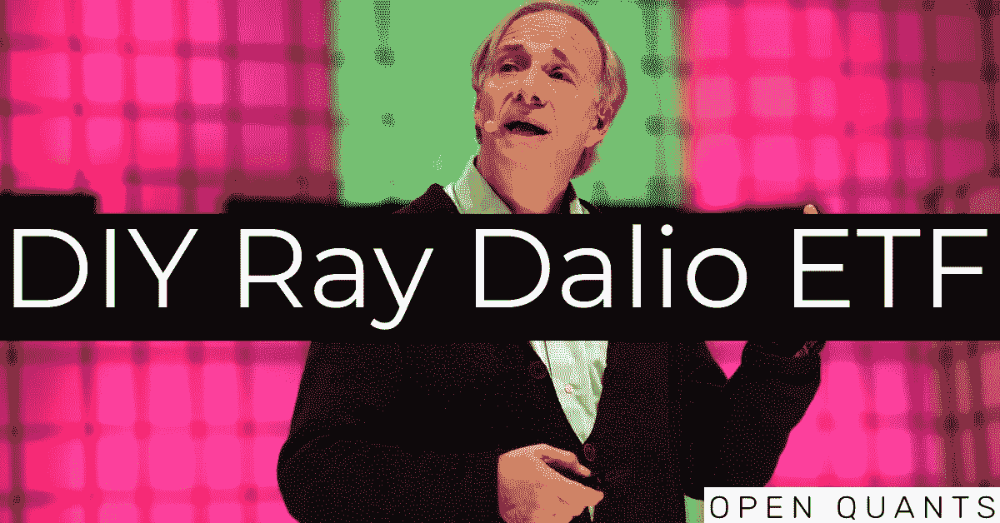

7 November 2018; Ray Dalio, Bridgewater Associates on Centre Stage during day two of Web Summit 2018 at the Altice Arena in Lisbon, Portugal. Photo by David Fitzgerald/Web Summit via SportsfilePhoto by David Fitzgerald /Sportsfile. Image adapted by OpenQuants.com.

本月早些时候，彭博发表了一篇关于美国推出新的风险平价 ETF 的新闻文章。 *RPAR 风险平价 ETF* 计划基于风险在资产类别之间进行分配。根据彭博的说法，该基金将是美国第一个遵循这种量化方法的基金，将更多的资金分配给波动性较低的证券。

> (RPAR 风险平价 ETF)有点像 Bridgewater，但他们只是为世界上最富有的机构做这件事。这里的想法是建立一个对每个人都有用的东西。— Alex Shahidi，Dalio 的 Bridgewater Associate 的前关系经理，RPAR 风险平价 ETF 的创始人。[彭博](https://www.bloomberg.com/news/articles/2019-08-19/ray-dalio-inspired-a-risk-parity-etf-by-bridgewater-bofa-alums)

“风险平价”方法是由雷伊·达里奥的 Bridgewater Associates 在 1996 年创立全天候资产配置策略时推广的，Bridgewater Associates 是管理资产规模最大的对冲基金(1328 亿美元)。“全天候”是一个术语，用来指在有利和不利的经济和市场条件下都表现良好的基金。今天，一些经理在风险平价方法下采用了“全天候”概念。

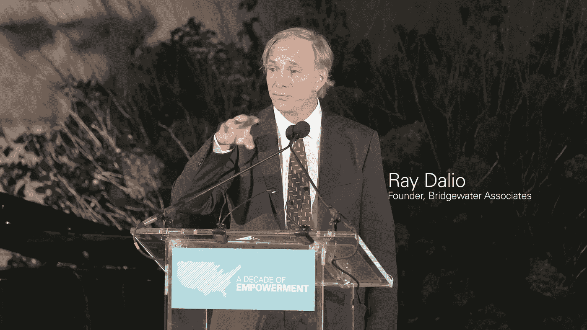

Ray Dalio while giving a speech at the 10th anniversary celebration of charity Grameen America. Metropolitan Museum of Art, September 23 2017\. Attribution: Grameen America [CC BY 3.0].

风险平价投资组合寻求在与每个资产类别或投资组合组成部分相关的风险之间实现均等的平衡。这样，低风险资产类别通常会比高风险资产类别拥有更高的名义配置。

> 风险对等大约是**平衡。**实现可靠平衡的最佳方式是基于对资产类别定价结构中固有的环境敏感性的基本理解来设计投资组合。这是全天候方法的基础。

风险平价策略在最近的历史(2010 年至 2017 年)中遭受了损失，因为牛市将股票推至创纪录高位，因此有利于股票集中的投资组合。然而，自 2018 年以来市场波动性的增加，地缘政治和贸易战风险的紧急情况，以及黄金等避险资产的增长，为加强多元化投资组合创造了条件。这在图 3.1 中得到证明，该图显示 S&P 风险平价策略在过去 12 个月(2018 年 8 月-2019 年 8 月)中的回报率接近 10%，是美国股票标准普尔 500 指数的两倍多。

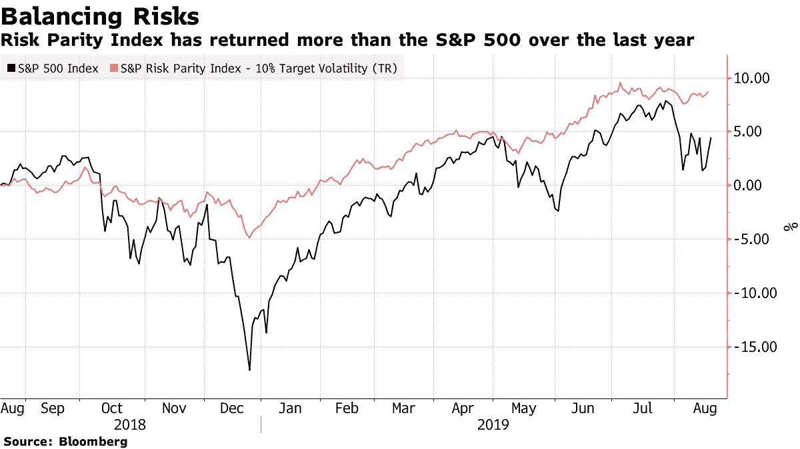

Fig. 3.1 S&P 500 index versus S&P Risk Parity Index. Source: Bloomberg.

但是我们如何建立风险平价投资组合呢？它与传统的均值-方差模型相比表现如何？

在这篇文章中，

1.  我们将展示如何建立自己的风险平价投资组合
2.  我们将创建并比较两个指数的性能:

*   风险均衡的 FAANG 公司的 FAANG 风险平价指数
*   FAANG 切线投资组合指数的 FAANG 公司的权重，使回报/风险比率是最佳的

到本文结束时，你将能够受雷伊·达里奥全天候方法的启发，创建自己的风险平价基金。作为我们[开源 Live Book 计划](http://www.openquants.com/book)的一部分，我们还提供了复制结果的代码。

[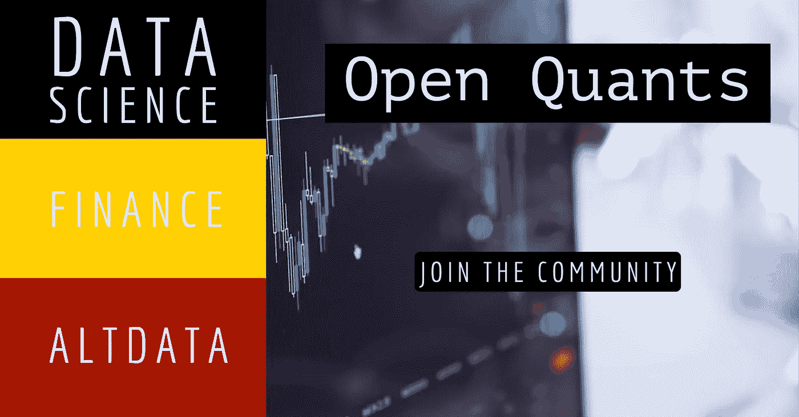](https://patreon.com/openquants)

# 风险平价投资组合——雷伊·达里奥方法

风险平价投资组合表示一类资产验证以下等式的投资组合(Vinicius 和 Palomar 2019 年):


其中 **f** 是衡量投资组合总风险的一次正齐次函数，而 **w** 是投资组合权重向量。换句话说，风险平价投资组合中每项资产的边际风险贡献是相等的。 **f** 的一个常见选择是投资组合的标准差，这是波动性的一个常见代表，即，

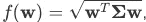

其中σ是资产的协方差矩阵。

在实践中，风险和投资组合经理在资产、国家、区域或行业层面都有他们遵循的风险指令或边际风险贡献界限。因此，风险平价组合的自然延伸是所谓的风险预算组合，其中边际风险贡献与预先分配的数量相匹配(Vinicius 和 Palomar 2019)。数学上，

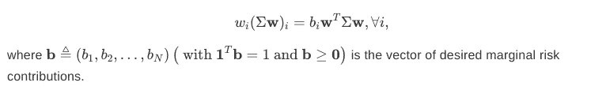

# 切线投资组合——马科维茨方法

均值方差优化是现代投资组合理论中常用的量化工具，允许投资者通过考虑风险和回报之间的权衡来进行分配。

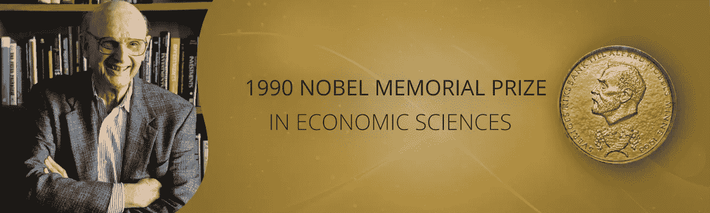

In 1990, Dr. Harry M. Markowitz shared The Nobel Prize in Economics for his work on portfolio theory.

在均值-方差框架中，目标是根据基线预期收益率μb 最小化投资组合风险σ，如下所示:


其中 *m* 是投资组合资产的预期收益向量。

我们将获得每个目标收益率μb 的最优(最小风险)投资组合，从而形成*有效边界*。图 3.4 中有效边界上的每一点都是在给定风险水平(标准差)的情况下，具有最小化风险的最优证券组合的投资组合。有效边界以下的点是表现较差的投资组合。它们要么提供相同的回报但风险更高，要么提供相同风险的更少回报。

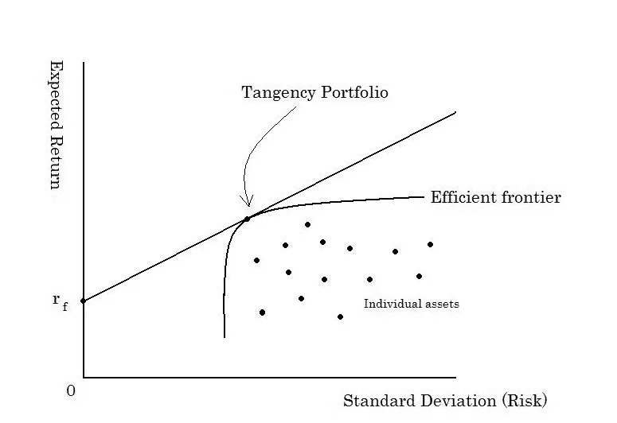

Figure 3.4: Efficienty Frontier. Attribution: ShuBraque (CC BY-SA 3.0)

但是我们如何从有效边界选择投资组合呢？一种方法是从风险/回报的角度选择最有效的投资组合，即具有最高夏普比率(超额回报和投资组合标准差之间的比率)的投资组合。这个投资组合被称为切线投资组合，它位于资本配置线和有效边界的切点。

我们将在下一节实现平价风险和切线投资组合。

# 优化 FAANG:雷伊·达里奥对马科维茨

## 单一投资组合

我们将考虑 FAANG 公司调整后价格的对数收益，即由以下代码标识的股票:FB、AMZN、AAPL、NFLX 和 GOOG。

我们可以使用**风险平价投资组合**和**投资组合**分别构建一个 FAANG 风险平价和切线投资组合。我们将首先考虑 2018 年的 FAANG 回报，以构建如下投资组合:

图 3.5 显示了平价和切线投资组合的投资组合权重。我们观察到切线投资组合集中了亚马逊和网飞的权重，两家公司的权重几乎相同，而脸书、苹果和谷歌被排除在投资组合之外。另一方面，平价投资组合在 FAANG 公司中呈现出均衡的权重分布，所有公司的权重都在 20%左右。苹果和谷歌的权重略高于 20%，而网飞是权重最低的公司(15%)。

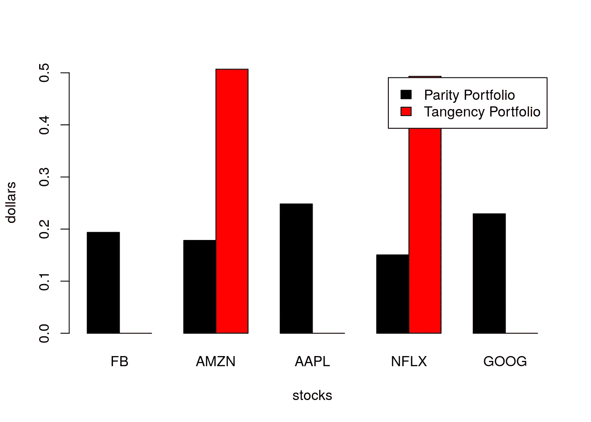

Figure 3.5: Portfolio weights for parity and tangency FAANG portfolios considering returns from 2018.

图 3.6 比较了获得的平价和切线投资组合的(协方差)风险预算。正如所料，我们观察到平价投资组合的风险预算在投资组合资产中平均分配。另一方面，切线投资组合集中了亚马逊和网飞之间的风险，后者对应于投资组合风险预算的 56%以上。

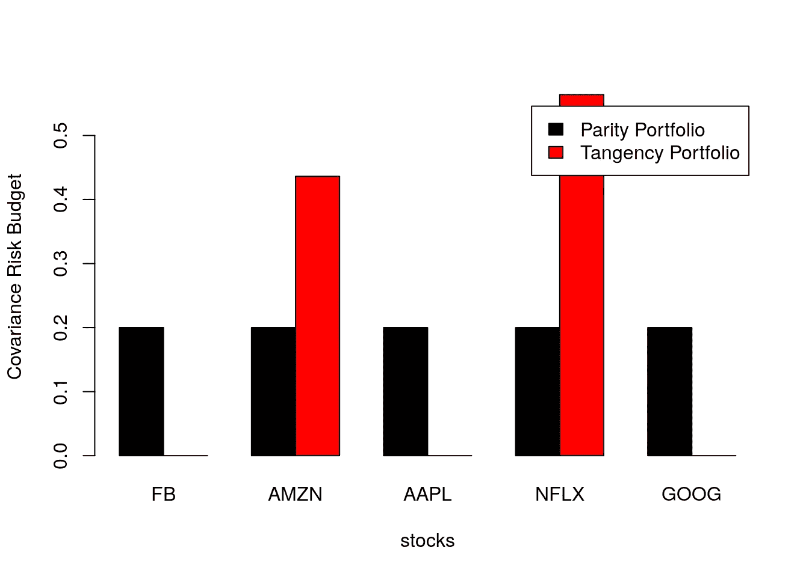

Figure 3.6: Portfolio covariance risk budget for parity and tangency FAANG portfolios considering returns from 2018.

# 雷伊·达里奥法昂指数

“雷伊·达里奥 FAANG 指数”，即由 FAANG 公司组成的投资组合，再平衡以匹配相应的风险平价投资组合，会有什么表现？它会击败相应的短期投资组合吗？

为了回答这些问题，我们将考虑 2014 年 1 月 1 日至 2019 年 9 月 1 日期间 FAANG 公司的投资组合，并构建两个指数:

1.  风险平价指数:每季度重新平衡投资组合权重，根据风险平价投资组合设定权重；
2.  切线投资组合指数:根据切线投资组合重新平衡投资组合权重。

我们首先通过构建一个宽度为 12 个月、步长为 3 个月的滚动窗口来定义重新平衡日期，如下所示:

```
**library**(fPortfolio)
faang.returns.xts<-faang.returns["2014-01-01/2019-09-01"]
rWindows<-**rollingWindows**(faang.returns.xts, period="12m",
                         by="3m")
```

我们的重新平衡日期如下:

```
**print**(rWindows$to) ## GMT
##  [1] [2014-12-31] [2015-03-31] [2015-06-30] [2015-09-30] [2015-12-31]
##  [6] [2016-03-31] [2016-06-30] [2016-09-30] [2016-12-31] [2017-03-31]
## [11] [2017-06-30] [2017-09-30] [2017-12-31] [2018-03-31] [2018-06-30]
## [16] [2018-09-30] [2018-12-31] [2019-03-31] [2019-06-30]
```

接下来，我们计算每个再平衡日期的风险平价投资组合权重，考虑 12 个月窗口内的回报，如下所示:

我们现在计算 FAANG 切线投资组合的季度权重。我们利用**f 组合**包来计算滚动切线组合，如下所示:

图 3.8 显示了平价风险和切线投资组合的投资组合权重。我们观察到，随着时间的推移，风险平价权重相当稳定，与其他投资组合成分相比，网飞的权重略有不足。另一方面，切线投资组合权重在考虑的时间段内变化很大，这可能会对其维护带来挑战，因为其周转率可能相当高。切线投资组合在许多重新平衡日期中增持苹果和亚马逊，在所有重新平衡日期中减持谷歌。

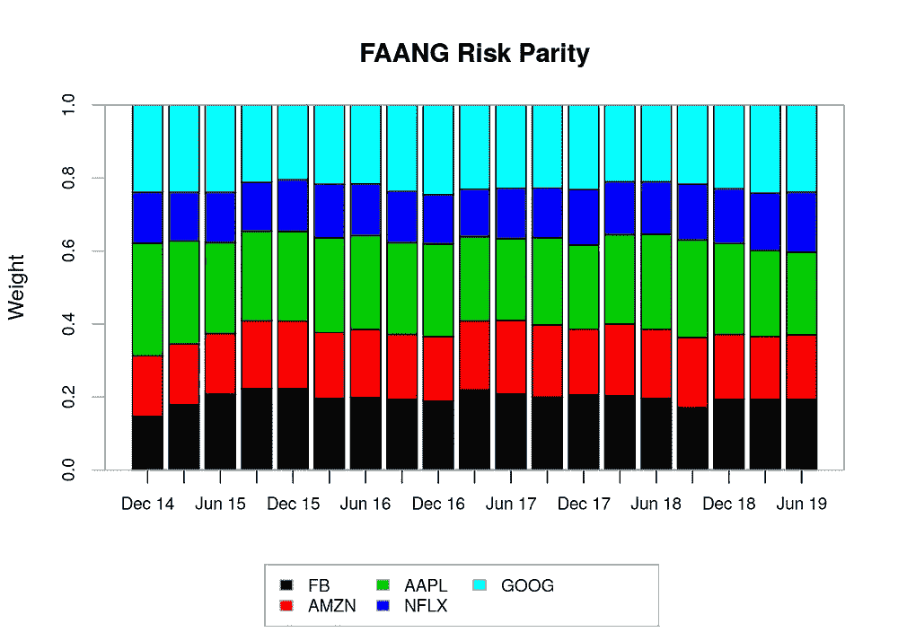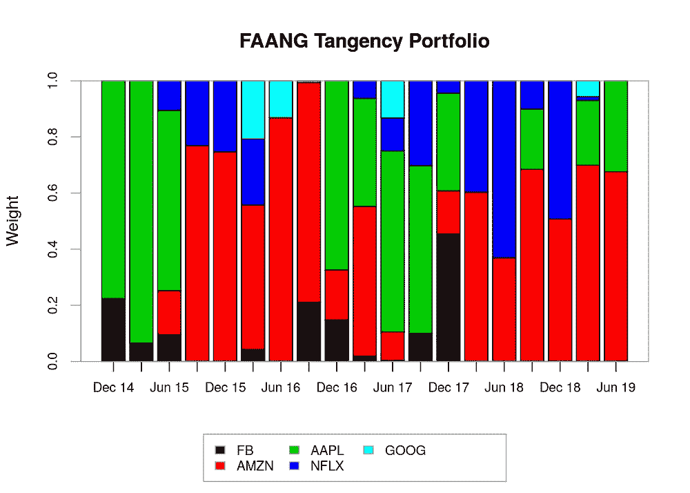

Figure 3.8: Portfolio weights for (A) FAANG risk parity portfolios and (B) FAANG tangency portfolios.

我们将使用 FAANG 公司的时间序列以及风险平价和切线投资组合权重的时间序列来计算风险平价和切线投资组合指数的回报，如下所示:

图 3.9 显示了风险平价指数与切线投资组合指数的绩效汇总。令人惊讶的是，FAANG 风险平价指数大大优于 FAANG 切线投资组合指数，累计回报率为 169.48%，而切线投资组合指数为 109.65%。FAANG 风险平价指数在分析的大部分时间内也有相对较低的下降。

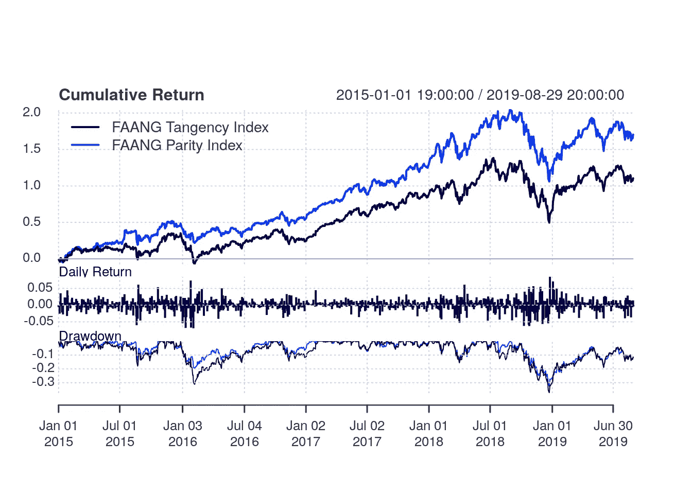

Figure 3.9: Performance summary for the risk parity index versus the tangency portfolio index

表 3.1 和 3.2 分别显示了风险平价和切线投资组合指数的日历回报。有趣的是，在切线投资组合指数累积回报为正的年份，风险平价指数的回报低于切线投资组合指数。相反，在切线投资组合指数累积回报为负的年份，风险平价指数的表现优于切线投资组合指数。这样，与切线投资组合相比，风险平价指数显示了“没那么好”但也“没那么差”的年回报率。

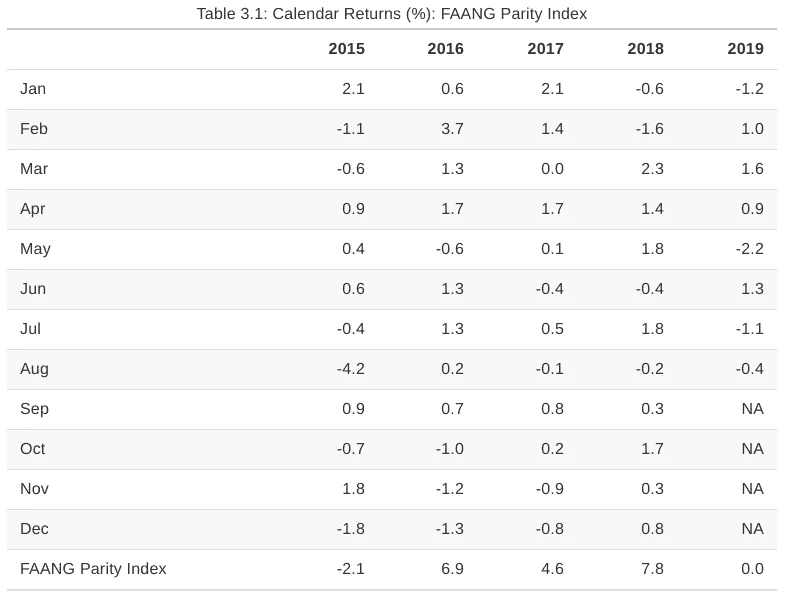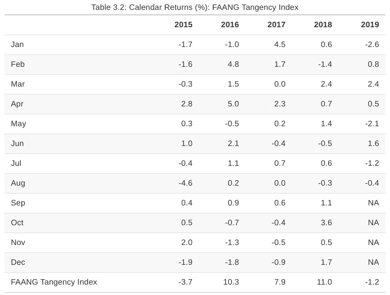

图 3.10 显示了滚动 252 天窗口中的性能摘要。同样，我们观察到风险平价指数比切线投资组合指数表现更好。与切线投资组合指数相比，风险平价指数在分析的大部分时间内具有更高的年化回报、更低的标准差和更高的夏普比率。如表 1 所示。3.3，风险平价指数的总年化回报率为 23.71%，标准差为 22.55%，夏普比率为 1.051，而切线投资组合指数的年化回报率为 17.22%，标准差为 26.42%，夏普比率为 0.652。

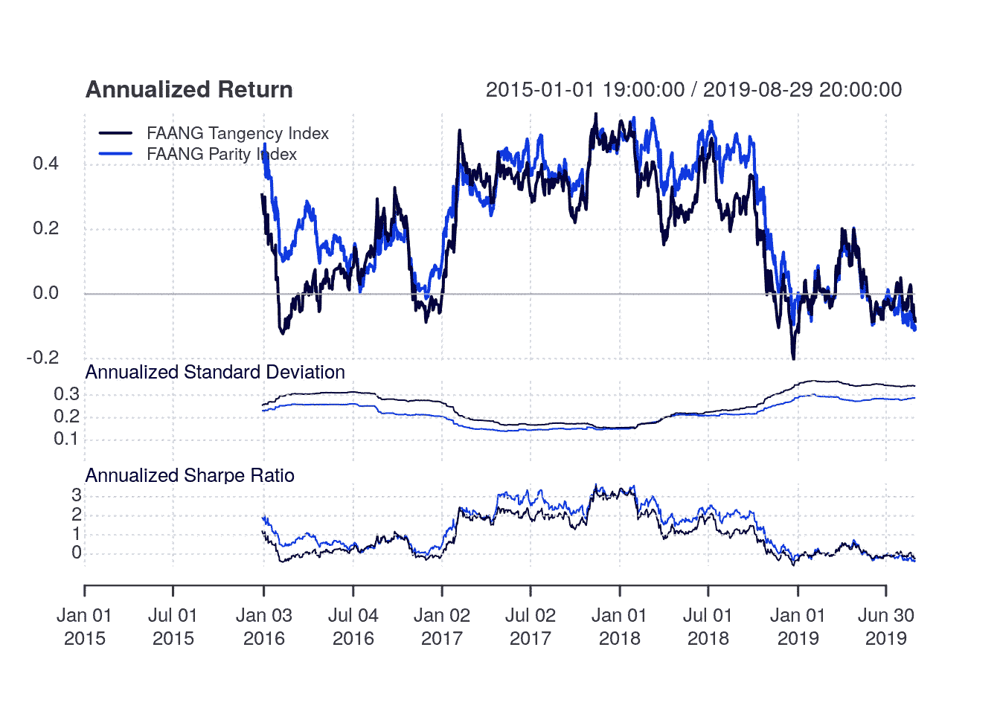

Figure 3.10: Performance summary in a rolling 252-day window for the risk parity index versus the tangency portfolio index

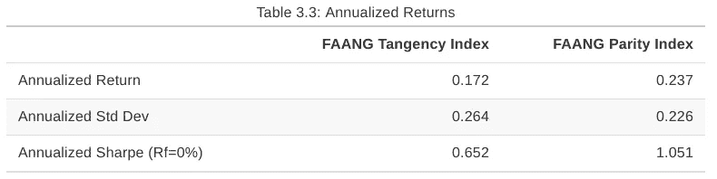

# 讨论和结论

在各种经济环境下，哪种资产组合最有可能带来长期的良好回报？

这是 Bridgewater Associates 在创建全天候基金之前提出的问题，其概念如今在所谓的风险平价策略中流行开来。

传统的资产配置方法往往容忍更高的风险集中度，目标是产生更高的长期回报。布里奇沃特认为这种方法有一个严重的缺陷:

> 如果短期风险的来源是高度集中于单一类型的资产，这种方法会带来长期回报不佳的重大风险，威胁到履行未来义务的能力。这是因为每种资产都容易受到持续十年或更长时间的不良表现的影响，这是由经济环境的持续变化引起的——T2 桥水。

在本文中，我们介绍了风险平价投资组合的概念，并将其与均值-方差模型进行了比较。我们通过构建 FAANG 风险平价指数并将其性能与 FAANG 切线指数进行比较，提供了一个简单的实际例子，FAANG 切线指数从均值-方差有效前沿中选择具有最优夏普比率的投资组合。

与切线投资组合指数相比，风险平价指数在分析的大部分时间里表现出更高的年化回报、更低的标准差和更高的夏普比率。当然，要谨慎对待结果。

在实践中，风险平价和均值-方差方法都被用于可能跨越多个资产类别的较大投资组合。当投资组合中存在不相关的资产时，这些方法会发挥作用，从而增加分散投资的潜力。此外，现代投资组合优化策略可能更加复杂，具有各种目标函数和约束。我们在这篇文章中的目标是给你一个良好的开端。请随意查看我们的 [github 项目](http://www.openquants.com/book)中的源代码，并实施您自己的策略！

[](https://patreon.com/openquants)

# 参考

Vinicius，Ze 和 Daniel P. Palomar。2019. *RiskParityPortfolio:风险平价组合的设计*。[https://CRAN.R-project.org/package=riskParityPortfolio](https://CRAN.R-project.org/package=riskParityPortfolio)。