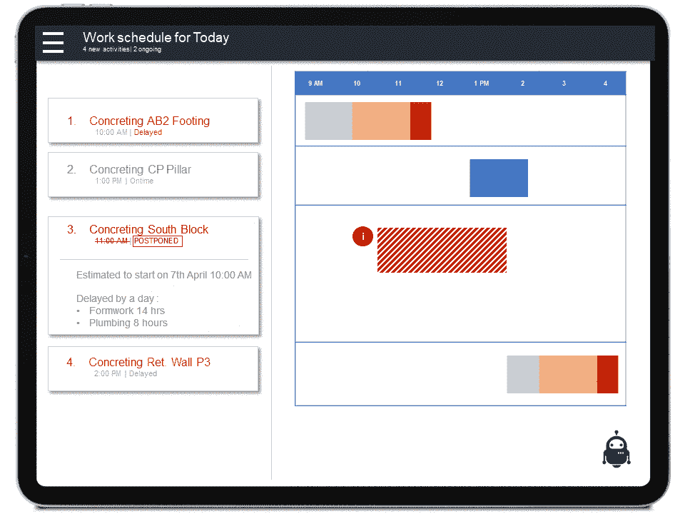
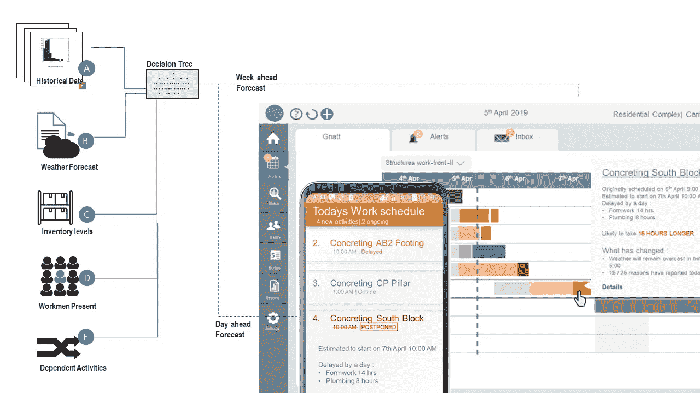
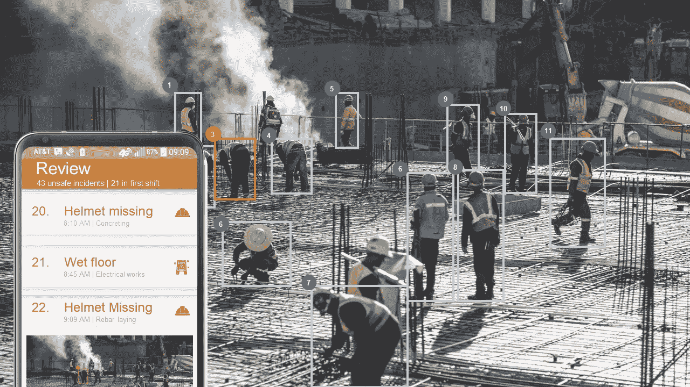
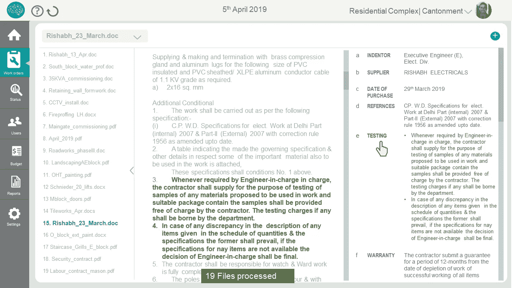
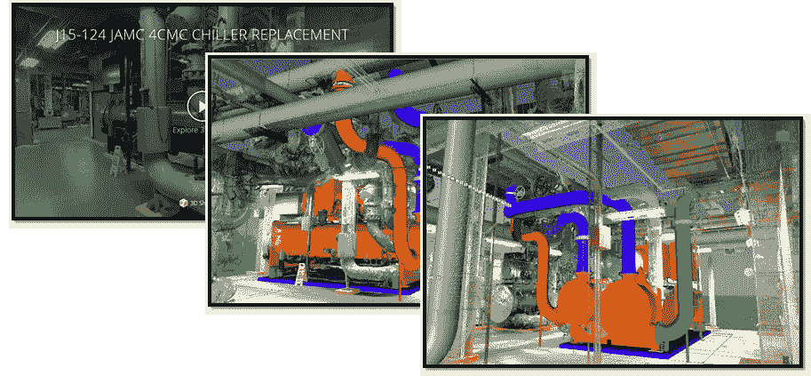
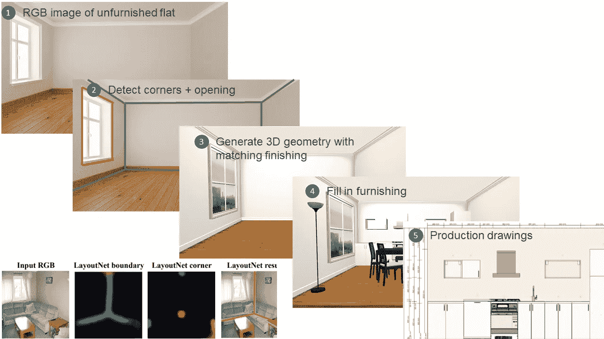

# AI 如何让建筑变得更好？

> 原文：<https://towardsdatascience.com/re-imagining-construction-with-ai-54d8c8077939?source=collection_archive---------19----------------------->

## 建筑业在创新和生产率方面落后于其他行业。这篇文章探讨了人工智能可以帮助弥合差距的应用。

Digital assistant in construction (Illustration by author)

到 2030 年，世界将需要在基础设施和住房上花费 57 万亿美元，为从农村到城市的移民腾出空间。基础设施和建筑行业雇佣了全球 7%的劳动适龄人口，将承担大部分责任。然而，建筑行业有一个棘手的生产率障碍。大型项目通常比计划多花 20%的时间来完成，并超出预算高达 80%。在过去二十年中，建筑行业的劳动生产率停滞在 1%。承包商的财务回报通常相对较低且不稳定。同样令人担忧的是工人死亡的比例(所有其他部门中最高的)。

传统上，建筑业一直在进行渐进式改进。*每个项目都是独一无二的*，正因为如此，不可能扩大新想法的规模。采用新技术是不切实际的。在本帖中，我们将看看人工智能可以帮助该行业实现跨越的一些应用。

## 建设项目管理的可预见性。

在工程采购和合同领域，有太多的变量会导致执行失控。劳动力短缺、恶劣天气、供应中断和监管许可是导致项目管理固有可变性的一些参数。每个项目都被认为是独特的。这种标准化的缺乏使得过程数字化变得缓慢。日常报告、图纸、合同继续严重依赖基于纸张的通信。一线承包商和项目规划者之间的信息流不稳定且速度缓慢。一线承包商的计划范围通常仅限于未来 7 天。大多数项目管理是被动的。中高级工作人员从事日常消防应急工作。

我们可以使用机器学习来实现一天和一周的预测。每个站点都会得到一个活动列表，这些活动预计在该日期开始。实时仪表板列出了成本和时间超支的高风险活动。施工中的运营数据来源有限。但是，大多数站点记录项目成本的库存水平。类似地，项目进度也通过计划工具进行监控。人工智能可以将这些数据流编织在一起，并将它们与天气和历史表现结合起来，以预测未来的结果。它将使承包商和现场管理人员能够采取现实的观点和优先干预。

Using machine learning to forecast delays, list out activities likely to overrun budget and schedule(Illustration by author)

## 一线蓝领工人的个性化培训

过去二十年来，建筑业劳动生产率增长停滞不前。如果不对人力资本进行投资，该部门就不可能加速发展。与其他行业相比，建筑业的农民工比例很高。许多建筑移民和劳动力市场严重依赖的非正式招聘渠道是公平和安全工作环境的障碍。新加入者在最初的五到七年里做学徒。在此期间，当机会出现时，他们会改变交易。学徒工在经济上很脆弱，并陷入移民债务。大多数学徒工只懂当地方言，这一障碍限制了他们提高自身技能、理解自己的基本权利，甚至寻求技能认证的能力。

Personalized training in native language for frontline workmen (Illustration by author)

对话式人工智能彻底改变了训练。个性化语言学习应用已经教会[超过 1 亿](https://play.google.com/store/apps/details?id=com.duolingo&hl=en_IN)人一门新语言。建筑部门。例如，个性化机器人可以教育工人操作混凝土振动器，从而获得[制造这种振动器](https://www.wackerneuson.com/en/in/products/concrete-technology/internal-vibrators/)的公司的认证。我们可以根据个人的学习进度和他的母语来定制课程。培训平台也可以取代目前使用的不透明的非正式渠道，成为寻找和招募人才的一种手段。它可以使招聘对工人和雇员都透明。

对于劳动力培训来说，合作是关键:政府、教育工作者、制造商和建筑公司。人工智能可以通过引入个性化、规模化和易于部署来扮演关键推动者的角色。

## 通过对象检测实现安全审计自动化

20%的工人死亡发生在建筑业。当你考虑到只有 7%的工人受雇于建筑行业时，这个统计数字就更加可怕了。自满的心态导致了受伤成为工作的一部分。安全部门经常人手不足:一个检查员管理着遍布工地的 500 名员工。

坠落、触电和倒塌占建筑行业所有工作场所事故的 60%。我们可以使用计算机视觉来检测导致此类事故的潜在条件。大多数项目都有监控摄像头来阻止盗窃。我们可以[处理](https://www.youtube.com/watch?time_continue=11&v=MPU2HistivI)这个 feed 来检测边界框内的单个工人。随后，我们可以根据安全帽和安全带的存在与否对边界框进行分类。我们可以每分钟重复自动化过程，并记录所有不安全事件。我们还可以训练图像分类模型来检测正在执行的活动的性质，例如。钢筋弯曲、混凝土浇筑等。我们可以调整一个[面罩-RCNN](https://github.com/matterport/Mask_RCNN) 来探测水溢出、障碍物和其他类似的不安全状况。所有此类事件和相关元数据在所有提要中聚合，相关人员会实时收到报告或警报，以便采取进一步的行动。

Aggregated unsafe incidents detected from surveillance footage. (Illustration by author)

存在局限性:错误检测、错误分类、视野中的障碍和弱光。目前，我们还不能完全自动化。但是，我们可以加强审计和合规性。我们可以将检查员的工作量减少 80%。这将使他有时间专注于训练和授权前线船员。

## 协作汇总合同，推动卓越发展

我们可以把建筑业大致分为两个部分。参与大型基础设施和住房项目的大型跨国公司，以及规模较小、分散的专业建筑商。分散单位的生产率通常是大单位的一半。较小公司执行的项目的财务回报和时间表仍不确定。

项目执行的一个重要组成部分是合同管理。我们应该根据标准对承包商进行评估，如过去的表现、财务状况、认证和 HSSE 合规性。较小的公司缺乏供应商网络，更不用说拥有管理复杂关系和合同的内部技能。低效的合同导致公司在一笔交易中损失价值的 5%到 40%之间。

零售电子商务同比增长 20%。到 2020 年，这一数字可能会超过 4.2 万亿美元。双边平台买方-卖方平台可以改变承包格局。美国[初创企业](https://udaan.com/)、[上市公司](https://www.justdial.com/)、[跨国巨头](https://www.amazon.in/b2b/info/amazon-business?layout=landing&ref_=b2bgoogle_BRac006dnak)正试图进入这一领域，以利用他们的物流、网络存在和对产品的深入了解。然而，此类平台缺少的关键方面是对签约中涉及的后端流程的支持。小型组织和部门需要工具来预算、预选、评估、管理投标、向卖方发出采购订单。一些较大的公司可能已有 ERP，需要集成到电子商务平台。现有的平台都没有提供这样的功能。

建筑公司将每个项目视为一项独特的努力。平台的力量来自于它组织和构造信息的能力。缺乏共享标准造成了额外的障碍。我们不能通过制定复杂的采购订单并要求人手不足的部门来填写来解决这个问题。

Using Entity Extraction on Contract Documents and preparing a relational database (Illustration by author)

今天，自然语言理解算法是几个应用程序的关键部分，从自动完成到处理保险索赔，再到垃圾邮件过滤器。除了财务数据之外，大多数建筑合同都是非结构化信息。如果我们需要组织这些信息，我们应该能够从非结构化的文本文档中提取信息。我们已经看到一些[应用](https://kirasystems.com/)增强了准法律团队对法律文件的尽职调查能力。通过提取命名实体和关系，类似的方法将帮助我们组织项目间混乱的构造合同。平台上无障碍透明的交易将提高效率，降低成本。该平台可以利用从数百万类似交易中获得的知识来帮助[编写合同规范](https://www.edmca.com/media/35207/masterformat-2016.pdf)，建立评估指南，匹配买家和卖家，并剔除不完整和模糊的订单。

B2B 电子商务规模巨大，大约是 B2C 的两倍。到 2020 年将达到 6 万亿美元。建筑合同在这一领域是一个未被充分利用的机会。

## 用摄影测量进行测量和检查

任何建设项目的首要活动之一就是土地测量。配备经纬仪的测量员将地形记录为网格点。在大型分散的基础设施项目中，这是一项在困难条件下的劳动和时间密集型活动。计算机视觉，即摄影测量已经彻底改变了这个领域。无人驾驶飞机携带的相机捕捉一系列图像，随后使用位置元数据对这些图像进行处理，以将其拼接成 3D 坐标阵列。在 8 小时的轮班中，一架无人机(带有额外的电池)可以覆盖勘测员在 2 个月内可以捕捉到的所有地形。在预设计阶段，时间是至关重要的，计算机视觉方法要快两个数量级，产生更高分辨率的 3D 网格，并且不会受到手动错误的影响。

Using 3D cameras to create an as-built point cloud |*source* [Matterport](https://matterport.com/)

摄影测量的应用不仅限于测量。安装在固定装置上的 3D 摄像机可以生成建筑物的内部视图。我们可以将测量的竣工尺寸与原始设计进行比较，并自动检测偏差。在改装结构中，我们可以直接从 3D 视图中读取尺寸。我们还使用摄影测量对风力发电场和桥梁等资产进行维护审计。我们可以比较不同时间的结构维度，并检测异常应变。

这个领域的一些令人兴奋的工作已经朝着从 RGB 全景图像生成布局的[方向发展](https://arxiv.org/pdf/1803.08999v1.pdf)。其他人使用立体和单目照片[来估计景深](https://arxiv.org/pdf/1811.06152v1.pdf)。在一些最先进的方法中，精度水平大约是每米 5-10 厘米。我们还不能使用这些维度检查。然而，我们可以构建应用程序来使用来自智能手机的全景图像，导出房间布局，使用布局来呈现[家具选项供房主](https://spacecraft.homelane.com/)选择。

From RGB image to 3D geometry to Furnishing and production drawings (Illustration by author)

建筑业颠覆的时机已经成熟。然而，存在着巨大的挑战。跨公司的数字化转型进展缓慢。除了试点规模的实施之外，创新的采用一直较为缓慢。数据透明度有限。在 b2c 领域，解决方案提供商必须介入并创建一个完整的垂直市场。

尽管如此，建筑行业提供了无与伦比的规模。如果我们耐心地微调用户体验，并达到产品与市场的契合，应用程序可以改变数百万人的生活。人工智能将在这些产品中发挥关键作用。

你经历过这篇文章中提到的建筑行业的一些挑战吗？我很想听听您对如何确定解决方案优先级的看法。你正在努力应对这些挑战吗？听听你的故事就好了。请在我的 [LinkedIn](http://bit.ly/copilot-linkedin) 上留言。