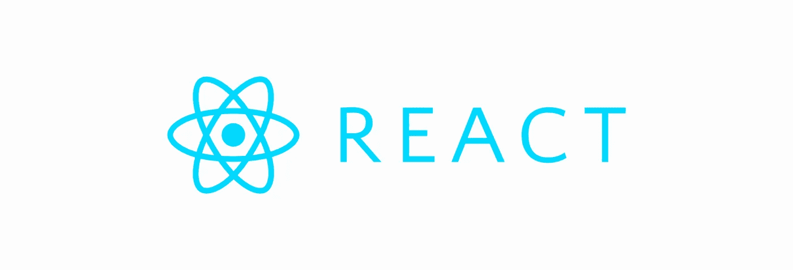
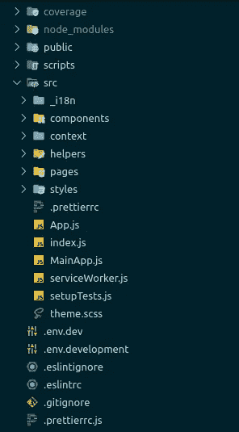
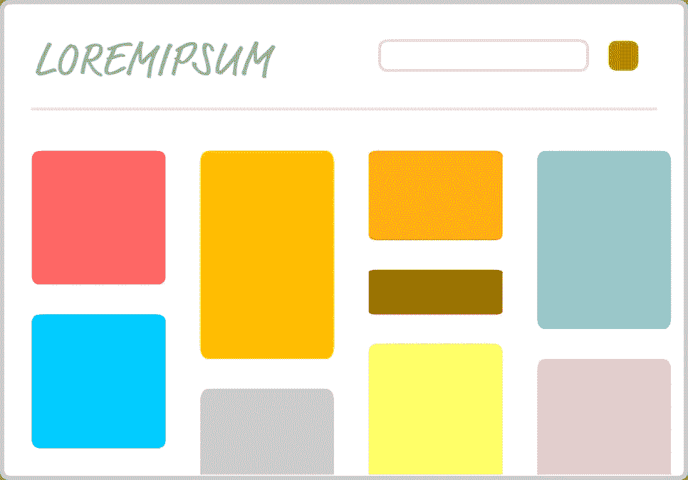
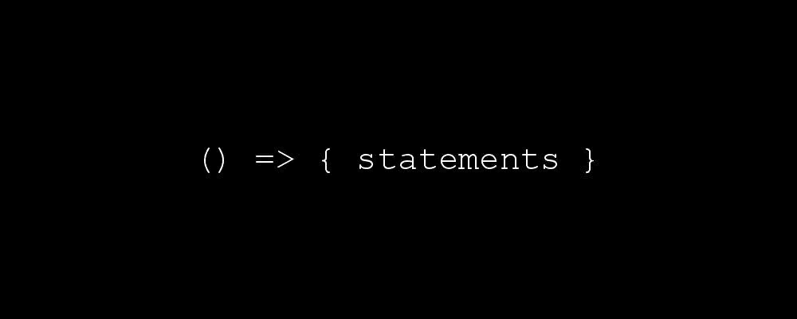
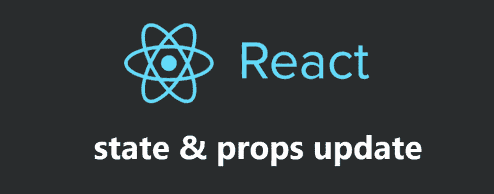
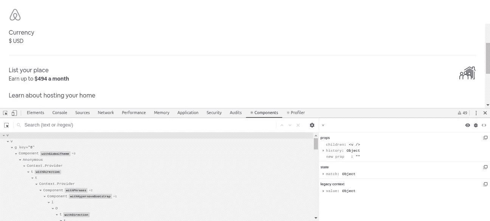

# 反应最佳实践⚛

> 原文：<https://towardsdatascience.com/react-best-practices-804def6d5215?source=collection_archive---------3----------------------->

## 前端

## 您应该在 React 项目中遵循的 React 最佳实践


Photo by [Mimi Thian](https://unsplash.com/@mimithian?utm_source=unsplash&utm_medium=referral&utm_content=creditCopyText) on [Unsplash](https://unsplash.com/s/photos/coding-practice?utm_source=unsplash&utm_medium=referral&utm_content=creditCopyText)

在 Sysco 实验室实习期间，我大量接触了 React Js。对于我们的项目，我们使用 React Js，并遵循 React 最佳实践。因此，我的团队领导和我的导师 [Nadun Indunil](https://medium.com/u/a66a40c6b858?source=post_page-----804def6d5215--------------------------------) 建议我写一写 React 最佳实践。这是我在 Medium 的第 25 篇文章。

# 反应⚛️

React 是一个用于开发用户界面的 JavaScript 库。 [React](https://github.com/facebook/react) 图书馆是脸书创建的。React 允许集成许多令人兴奋的[组件、库和框架](https://hackernoon.com/23-best-react-ui-component-libraries-and-frameworks-250a81b2ac42)。诚然，开发者可以自己制作组件。



在最佳实践之前，我建议在开发 react 应用程序时使用测试驱动开发。测试驱动开发意味着先写一个测试，然后根据测试开发你的代码。更容易识别缺陷。如果当你发现一个 bug 时，你遵循另一个软件开发过程，首先写一个测试。

# 最佳实践

## 目录

1.  [文件组织](#49ac)
2.  [微小功能部件](#bbb6)
3.  [复用组件](#2de0)
4.  [删除冗余代码](#3a85)
5.  [索引为键](#d96b)
6.  [不必要的<部门> s](#1912)
7.  [仅必要的注释](#d915)
8.  [理解为处理‘这个’](#249a)
9.  [道具—状态—构造器](#b021)
10.  [最终命名](#c966)
11.  [感知状态和渲染](#b850)
12.  [避免“设置状态”内的对象](#cb4d)
13.  [使用上部骆驼案例名称](#1211)
14.  [利用道具类型](#bc4d)
15.  [JavaScript 中的 CSS](#f00a)
16.  [测试](#08d7)
17.  [使用 ESLint、Prettier 和 snippet 库](#8cc9)
18.  [使用 React 开发者工具](#7745)

## 1.文件组织📂



文件组织不仅是 react 应用程序的最佳实践，也是其他应用程序的最佳实践。 [create-react-app](https://github.com/facebook/create-react-app) 的文件结构是组织 react 文件的一种可能方式。虽然不一定有一种文件结构比另一种更好，但保持文件有条理是很重要的。在 React 中，考虑到每个组件至少有一个与之相关联的文件，您的文件结构将快速增长。保存一个包含顶级 CSS、图像和字体文件的 ***资产*** 文件夹。维护一个 ***helpers*** 文件夹来存放其他文件的任何种类的文件功能。将与组件相关的所有文件保存在一个文件夹中。通常情况下， ***组件*** 文件夹包含不止一个组件文件，比如测试文件 CSS 和一个或多个组件文件。如果有某个特定组件只使用的小组件，最好将这些小组件保存在 ***组件*** 文件夹中。当您将大型组件放在它们自己的文件夹中，而将组件使用的小型组件放在子文件夹中时，就更容易理解文件的层次结构。开发人员主要将文件中的主要组件文件命名为 index.js。如果有几个文件都命名为 index.js，这可能会变得很麻烦。解决方法是在每个组件文件夹中添加一个 ***package.json*** 文件，并为相应的文件夹设置主入口点。例如，对于 button 组件，主要入口点是 Button.js。将 package.json 添加到每个文件夹并不是一个好的做法，但它有助于轻松处理您的文件。所以我们可以在按钮组件文件夹中添加下面的 package.json 文件。

当你在 React 项目中使用 Redux 时，你可以根据你的项目使用 ***Rails 风格*** 或 ***Domain 风格*** 或 ***【鸭子】*** 模式文件夹结构。在 ***Rails 风格的*** 模式中，单独的文件夹用于“动作”、“常量”、“缩减器”、“容器”和“组件”。在 ***域风格*** 模式中，每个特征或域使用单独的文件夹，每个文件类型可能有子文件夹。***【Ducks】***模式类似于领域风格，但是它明确地将动作和 reducers 联系在一起，通常是通过在同一个文件中定义它们。然而，文件夹结构可能是开发人员所希望的，但是应该有一种简单的方法来处理组件。React 说，它对你如何将文件放入文件夹没有意见。新队伍使用鸭式反应。当他们变得成熟时，他们开始使用 rails。Rails 具有易于理解项目的优势。

丹·阿布拉莫夫在推特上发布了一个解决方案👉

> 移动文件，直到感觉合适为止。

这正是你应该做的。你应该移动文件，直到他们觉得合适。

## 2.微小功能元件🤏

众所周知，React 可以处理大型组件。但是如果我们把它们分成小块，我们可以重复使用它们。小组件更容易阅读、测试、维护和重用。大多数 React 初学者创建类组件，即使他们没有使用组件状态或生命周期方法。功能组件对于简单组件来说效率更高。

上面的类组件可以编写如下。

使用功能组件的优势。

*   较少代码
*   更容易理解
*   无国籍的
*   更容易测试
*   没有`this`绑定。
*   更容易提取更小的成分。

当您使用功能组件时，您无法控制重新渲染过程。当某些东西改变甚至组件自身改变时，React 会重新渲染功能组件。在以前的 react 版本中有一个解决方案可以使用`React.PureComponent`。PureComponent 允许浅层 props 和状态比较。当组件的道具或内容或组件本身发生变化时，组件会重新呈现。否则，PureComponent 跳过重新渲染，而是重用最后一次渲染的结果。

React v16.6.0 之后 React 引入了一个新特性，那就是[备忘录](https://reactjs.org/docs/react-api.html#reactmemo)。Memo 浅比道具。当组件的道具或内容或组件本身发生变化时，组件会重新呈现。根据比较结果，react 将重用上次渲染的结果或重新渲染。Memo 允许你创建一个纯粹的功能组件。Memo 抹杀了有状态组件和`PureComponent`的使用。



Components, Picture credit: [https://www.kirupa.com/react/images/c_app_144.png](https://www.kirupa.com/react/images/c_app_144.png)

## 3.可重用组件♻️

每个功能组件应该有一个功能，这意味着一个功能组件等于一个功能。当你创建一个具有一个功能的功能组件时，你可以提高组件的可重用性。

## 4.删除冗余代码🗑️

不仅在 React 中，而且在所有应用程序开发中，通用规则是尽可能保持代码简洁。反应最佳实践指示保持无错代码和精确代码。不要重复你自己(DRY)是软件开发的一个原则，专注于最大限度地减少软件模式的重复，用抽象来代替它，或者使用数据规范化来避免冗余。在代码设计中，你可以使用你自己的风格指南，或者使用一个流行的成熟的风格指南( [Airbnb React/JSX 风格指南](https://github.com/airbnb/javascript/tree/master/react)、[脸书风格指南](https://reactjs.org/docs/getting-started.html)等等)。如果你开始追随任何一种风格的人，不要和其他人混淆。


Picture credit: [https://quotefancy.com/quote/46568/Lemony-Snicket-Don-t-repeat-yourself-It-s-not-only-repetitive-it-s-redundant-and-people](https://quotefancy.com/quote/46568/Lemony-Snicket-Don-t-repeat-yourself-It-s-not-only-repetitive-it-s-redundant-and-people)

## 5.作为关键字的索引🔑

当创建一个 JSX 元素的数组时，react 要求你给你的元素添加一个关键道具。这通常是通过使用映射函数来完成的，而映射函数又会导致人们使用索引来设置键属性。这太糟糕了！React 使用 key 属性来跟踪数组中的每个元素，并且由于数组的折叠性质。这很容易导致错误的信息出现在错误的地方。这在用状态循环遍历类组件时尤其明显。

## 6.不必要的🚫

当创建 React 组件时，记住您仍然在构建 HTML 文档是很重要的。人们倾向于在 React 中使用`divitis`,最终导致不正确的 HTML。

在上面的例子中，`div`是`ul`的直接子节点，这是不正确的 HTML，而在下面的例子中，`li`是`ul`的直接子节点，这是正确的 HTML。

我们可以使用另一种使用`<React.Fragment>`标签的方法。`<React.Fragment>`是在 React v16.2 中引入的，我们可以用它们来代替无关的`<div>`标签。

## 7.仅必要的注释📝

必要时在应用程序中添加注释。从应用程序中移除注释的能力意味着我必须编写有文化的代码，没有例外。它给出了混乱的自由代码段。一般来说，注释是糟糕设计的一个标志，尤其是冗长的注释，很明显开发者不知道他们在做什么，试图通过写注释来弥补。


Picture credit: [https://www.toptal.com/sql/guide-to-data-synchronization-in-microsoft-sql-server](https://www.toptal.com/sql/guide-to-data-synchronization-in-microsoft-sql-server)

## 8.理解处理“这个”👆

因为功能组件不需要`this`绑定，所以只要有可能，你就会想要使用它们。但是如果你使用的是 ES6 类，你需要手动绑定它，因为 React 不会自动绑定组件中的函数。这里有一些这样做的例子。

***例 1:绑定渲染***

将以下代码片段添加到名为 bind in render 的渲染中

```
onClick={this.logMessage.bind(this)}
```

这种方式清晰、简洁且可行，但可能会导致轻微的性能问题，因为每次组件重新渲染时都会调用新的函数，这可能会很频繁。

***例 2:渲染中的箭头功能。***

将以下代码片段添加到 render 中名为 arrow function 的渲染中。

```
onClick={() **=>** this.logMessage()}
```

这种方式清晰、简洁，就像示例 1 一样，但是像示例 1 一样，它也会在每次组件呈现时创建一个新函数。

***例 3:绑定构造函数***

将以下代码片段添加到名为 bind in constructor 的构造函数中。

```
this.logMessage = this.logMessage.bind(this);
```

这种方法将解决示例 1 和示例 2 的潜在性能问题。不要忘记在构造函数中调用 super。

***例 4:类属性*** 中的箭头函数

将以下代码片段添加到类属性中名为 arrow function 的类中。

```
logMessage = () **=>** {
**const** { message } = this.state;
console.log(message);
}
```

这种方式非常简洁、易读，它将避免例 1 和例 2 中的性能问题，并避免例 3 中的重复。但是要注意，这种方法依赖于实验特性，它不是 ECMA 脚本规范的正式部分。您可以通过安装和配置 babel 包来试验语言功能，create react 应用程序创建的应用程序启用了许多功能。



Picture credit: [https://codeburst.io/javascript-arrow-functions-for-beginners-926947fc0cdc](https://codeburst.io/javascript-arrow-functions-for-beginners-926947fc0cdc)

## 9.道具-状态-构造器🏁

我们可以把标题分成两个子标题，如。

*   初始状态的时候不要用道具。
*   不要在类构造函数内部初始化组件状态。

当你在初始状态使用 props 时，问题是当组件被创建时构造函数被调用。所以构造函数只被调用一次。如果您下次对 props 进行更改，组件状态将不会更新，它将保持与以前的值相同。您可以使用 react 生命周期方法`componentDidUpdate`来解决这个问题。当属性改变时,`componentDidUpdate`方法更新组件。`componentDidUpdate`在初始渲染时不会被调用。但是，在初始状态下使用道具并不是最好的做法。

将状态初始化为类字段是最佳实践。用构造函数初始化组件状态并没有那么糟糕，但是它增加了代码中的冗余，并产生了一些性能问题。当你初始化类构造函数内部的状态时，它会不必要地调用 super 并记住 props，这会造成性能问题。

另一个问题是，当你要在构造函数中初始化状态时，想想你需要多少行，你需要`constructor()`，`super()`？



Picture credit: [https://indepth.dev/in-depth-explanation-of-state-and-props-update-in-react/](https://indepth.dev/in-depth-explanation-of-state-and-props-update-in-react/)

## 10.最终命名🔚

键入脚本后命名一个函数或组件，因为它们应该易于识别。比如你因为组件代码，瞬间选择了`FacebookButton`这样的组件名称。但是将来你可能会用那个组件作为`TwitterButton`、`YoutubeButton`。因此，最佳实践是将该组件命名为`Button`。通常，当您完成函数时，您应该能够为组件和函数选择通用名称。最后命名增加了可重用性。

## 11.意识到状态和渲染🎭

在 React 中，我们可以根据状态对组件进行分类。有 ***有状态*** 和 ***无状态*** 。有状态组件存储组件的状态信息，并提供必要的上下文。反过来，无状态组件没有内存，也不能给用户界面部分提供上下文。无状态组件是可伸缩的、可重用的，就像纯 JavaScript 函数一样。将有状态提取逻辑与呈现无状态逻辑分开。一个更好的方法是使用有状态组件获取数据，使用另一个无状态组件显示获取的数据。

在 React v16.08 之后有一个新特性叫做“React Hooks”。React 钩子编写有状态的功能组件。React 钩子取消了类组件的使用。

如果数据没有在 render 方法中直接呈现，它就不应该处于组件状态。未直接呈现的数据可能会导致不必要的重新呈现。


Picture credit: [https://www.barrymichaeldoyle.com/sub-rendering/](https://www.barrymichaeldoyle.com/sub-rendering/)

## 12.避免“setstate”🛑内的对象

根据 [React 文档](https://reactjs.org/docs/react-component.html#setstate) React 不保证立即应用阶段更改。因此，在调用`setState`之后立即读取`this.state`是一个潜在的陷阱，因为`this.state`实际上可能不是你所想的那样。

```
**const** { ischecked } = this.state;
this.setState({ischecked: !ischecked});
```

我们可以使用下面的函数，而不是像上面的代码片段那样更新对象的状态。

```
this .setState((prevState, props) => {
return {ischecked: !prevState.ischecked}
})
```

上面的函数将接收先前的状态作为它的第一个参数，并将应用更新时的`props`作为它的第二个参数。状态更新是异步操作，所以要更新状态对象，我们需要使用带有`setState`的 updater 函数。

## 13.使用大写骆驼名称🐪

当你在 React 中工作时，记住你使用的是 JSX (JavaScript 扩展)而不是 HTML。你创建的组件应该用上驼格命名，又名 ***帕斯卡格*** 。大写骆驼字母表示单词书写时没有空格，每个单词的第一个字母大写。例如，如果有一个名为`selectbutton`的组件，那么你应该将其命名为`SelectButton`而不是`selectbutton`。使用大写骆驼有助于 JSX 区分默认的 JSX 元素标签和创建的元素。但是，您可以使用小写字母来命名组件，但这不是最佳做法。


Photo by [Artem Sapegin](https://unsplash.com/@sapegin?utm_source=unsplash&utm_medium=referral&utm_content=creditCopyText) on [Unsplash](https://unsplash.com/s/photos/reactjs?utm_source=unsplash&utm_medium=referral&utm_content=creditCopyText)

## 14.利用支柱型🧪

“prop-types”是一个用于类型检查道具的库，它可以通过确保你为你的道具使用正确的数据类型来帮助防止错误。`React.PropTypes`从 React v15.5 开始，已经转移到一个不同的包中。`React.PropTypes`包让我们能够对组件的属性进行类型检查，并赋予它默认值。因此，npm install 将使用一个外部库。

```
npm i prop-types
```

导入库，添加`PropTypes`到组件，相应地设置数据类型，如果需要道具，添加`isRequired`，如下所示。

可以使用`defaultProps`将默认值分配给属性。当一个组件没有收到它的道具时，它指的是已经赋值的`defaultProps` 。如果你已经按要求标记了你的道具，就不需要分配`defaultProps`。在下面的代码片段中，您可以看到所有已经分配给 *ModalButton* 的属性的默认值。对于这个例子，我使用了 *React Bootstrap* 框架。

> 始终为所有可选属性定义显式 defaultProps

需要注意的是，做类型检查时使用`PropsTypes` 后赋值`defaultProps` *。*因此，它也对分配给属性的默认值进行类型检查。

## 15.JavaScript 中的 CSS💅

在我的实习工作中，我们面临一个造型问题，尤其是主题。CSS 已在开发环境中加载，但没有在生产环境中加载。我的队友[哈里斯·桑卡帕](https://medium.com/u/87c8f67602eb?source=post_page-----804def6d5215--------------------------------)写了那个[问题](https://medium.com/@harith.sankalpa/how-to-load-css-or-sass-styles-into-single-spa-framework-using-style-loader-7d5937fc1c53)。但是现在我根据不同的应用找到了这么多最好的方法。

当你有一个大的 CSS (SCSS)文件时，你可以使用全局前缀，后跟块-元素-修饰符约定来避免名字冲突。当您的应用程序变得更大时，这种方法是不可伸缩的。所以你必须评估你的 CSS(SCSS)文件。还有另一种通过 webpack 的[迷你 CSS 提取文本插件](https://github.com/webpack-contrib/mini-css-extract-plugin)提取 CSS 的方法(它需要 webpack 4 才能工作)，但它对 webpack 产生了严重的依赖性。如果你使用这种方法，测试你的组件是困难的。最佳实践是拥有一个易于测试的应用程序，因此，遵循这种方法并不是最佳实践。

[EmotionJS](https://github.com/emotion-js/emotion) 、[laminate](https://glamorous.rocks/)和 [Styled Components](https://github.com/styled-components/styled-components) 是 JS 库中的一些新 CSS。您可以根据您的用例来使用它们。当你需要生成一个编译好的 CSS 时，你可以使用 EmotionJS 库。当你有一个复杂的主题问题时，你可以使用迷人的和风格化的组件库。


Picture credit: [https://wordpress.org/plugins/custom-css-js/](https://wordpress.org/plugins/custom-css-js/)

## 16.测试🚀

不仅在 React 中，在其他编程语言中也应该进行测试。测试是很重要的，因为它确保代码如预期的那样运行，并且可以简单快速地测试。在最佳实践中，在组件文件夹中创建一个`__Test__`文件夹。用组件名加上一个`.test.js`后缀来创建测试文件。您可以将 Jest 用作测试程序，将 Enzyme 用作 React 的测试工具。我的队友[卡温杜文迪卡](https://medium.com/u/9be478c2735f?source=post_page-----804def6d5215--------------------------------)写了关于[的笑话和酶测试](https://medium.com/@kavinduvsomadasa/unit-test-in-react-with-jest-enzyme-bde3840ade8)，如果你想你可以看看。

对组件进行崩溃测试是一种简单快速的方法，可以确保所有组件都正常工作而不会崩溃。组件崩溃测试很容易应用到你制作的每个组件中。

你应该做明显比碰撞测试更广泛的测试。如果你写更多的测试用例，它会给你的代码更多的测试覆盖率。但是，至少你应该做一些碰撞测试。在崩溃测试中，我们所做的是创建一个元素，然后它使用 ReactDom 并装载您导入到刚刚创建的 div 中的任何组件，然后它卸载 div。

> 一个真正的 react 开发人员会对整个 React 应用程序进行适当的测试。

## 17.使用 ESLint、Prettier 和 snippet 库📚

ESlint 用歪歪扭扭的字体对你大喊大叫，让你的代码保持整洁。您可以将它链接到您的 IDE。最佳实践是保留您自己的 ESLint [配置文件](https://eslint.org/docs/user-guide/configuring)。

> 一个好的开发人员会修复所有的 ESlint 错误和警告，而不是禁用那个错误。

[更漂亮](https://prettier.io/)是一个代码格式化工具。漂亮有一套代码格式和缩进的规则。您可以使用 [Sonarlint](https://www.sonarlint.org/) 来检查法术、功能长度和更好方法的建议。使用 [Husky](https://www.npmjs.com/package/husky) 不仅对 React 是一个好的实践，对 Git 也是一个好的实践。可以在 ***package.json*** 文件中定义哈士奇。Husky 防止您的应用程序出现错误提交和错误推送。

代码片段有助于您编写最佳代码和趋势语法。它们使你的代码相对没有错误。你可以使用很多代码片段库，比如 ES7 React，JavaScript (ES6)代码片段等。


Picture credit: [https://medium.com/dubizzletechblog/setting-up-prettier-and-eslint-for-js-and-react-apps-bbc779d29062](https://medium.com/dubizzletechblog/setting-up-prettier-and-eslint-for-js-and-react-apps-bbc779d29062)

## 18.使用 React 开发工具🛠️

React Developer Tools 是 Chrome 和 Firefox 的扩展。如果您使用 Safari 或其他独立 shell，请使用以下命令来安装它。

```
npm install -g react-devtools@^4
```



如果您正在寻找 React 中内置的 web 应用程序，您可以在 Components 选项卡中看到组件层次结构。如果您点击一个组件，您可以查看该组件的属性和状态。如你所见，React Developer Tools extension 是一款非常有价值的工具，可用于测试和调试，并真正了解该应用程序发生了什么。

# 结论✌️

本文描述了 React 中的最佳实践。这些实践提高了您的应用程序性能、应用程序代码和编码技能。作为我的第 25 篇文章，我想动态更新这篇文章。这意味着我会用新的趋势来更新这篇文章。如果我更新这篇文章，我会通过[推特](https://twitter.com/TheSabesan)通知。保持联系。呜哇！！！🙌

快乐编码😎

***关注我的***[***Twitter***](https://twitter.com/TheSabesan)***和 Medium 如果你将来对这些更深入、更翔实的文章感兴趣的话！***