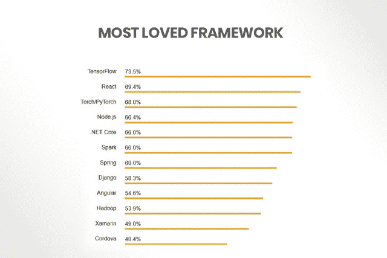
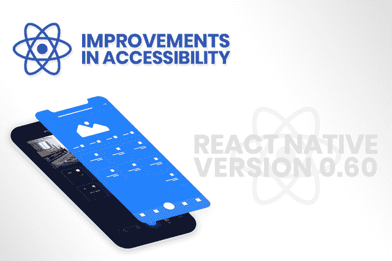
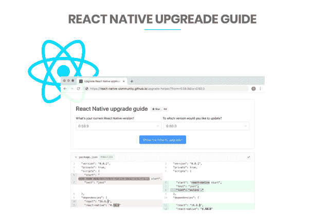

# React Native 推出其最新版本 0.60

> 原文：<https://towardsdatascience.com/react-native-introduces-its-latest-version-0-60-a855b08fd383?source=collection_archive---------21----------------------->

React Native 是最受欢迎的移动应用程序开发框架之一，它的高级特性和创建功能丰富的跨平台移动应用程序的能力一直吸引着开发者和企业。

凭借其显著的特性，这种混合应用程序开发框架比其他框架节省了创建应用程序的时间。它有助于减少大约 40%到 50%的移动应用程序开发费用。

经过几个月的努力和奉献，近日，React Native 宣布推出最新版本 0.60。如今，用户很高兴看到 React Native 新版本的每个功能。根据 Stack Overflow [调查](https://insights.stackoverflow.com/survey/2018/)，React native 是目前第二受欢迎的框架:

[Source](https://insights.stackoverflow.com/survey/2018/)

# ***下面我们来了解一下 React 原生 0.60 的各种新特性:***

React Native 的最新版本可以处理 Android 和 iOS 平台的各种重要迁移，旧版本 0.59 中的其他小问题也通过最新更新得到了解决，以提供更好的用户界面和体验。

> 以下是最新的 React 原生 0.60 中的一些其他变化:

## **可访问性的改进**

最新的 0.60 版本发布了针对 Android 和 iOS 的可访问性 API 前端的多项改进。所有的改进虽然范围很广，但都包含了一些元素，例如宣布可访问性，以及角色、动作支持、标志等方面的改进。react native 的开发团队希望，随着这些进步，成为 A11Y(可访问性的数字符号)会更容易。Reach Native 0.60 在可访问性方面有更多改进，包括:

> 为各种元素包含过多的缺失角色，以便根据需求有效地使用它。
> 
> 包括点击回叫和一个可点击的道具，有助于使用键盘导航来请求操作。
> 
> 通过最新的可访问性状态 API，保证在未来的运行中增强 web 协助。
> 
> 启用最大的可访问性操作，以便添加回调来处理用户特定的功能可访问性。
> 
> 最新的 0.60 版本引入了大量的改进，同时引入了一些元素，如宣布可访问性、动作支持改进、标志和角色等等。

## **所有新屏幕**

React 的最新版本带有新的应用程序屏幕，据称更加用户友好。它显示了有用的说明，例如文档链接，编辑 App.js，如何启动调试菜单，以及最后如何与即将到来的网站设计和重新设计保持一致。新的用户界面“Hello world”将以更好的方式向手机用户介绍生态系统。

## **支持 AndroidX**

随着 React Native 与 Android 扩展库(AndroidX)的迁移，原生代码和依赖项也应该迁移。由于这种转变，所有的 React 原生应用将不得不自己使用 AndroidX。虽然，React Native 的开发团队已经针对这个问题开发了一个名为“Jetifier”的临时解决方案。它是一个 AndroidX 过渡工具，风格与 React Native 兼容。

## **操作系统自动链接**

React Native 的库通常由本机代码和特定于平台的代码组成。这种新机制还允许您的项目发现并再次使用该代码。React Native 的 CLI 团队在自动链接中引入了类似这样的重大改进。

## **CocoaPods 作为 iOS 的一部分**

CocoaPods 是一个应用级依赖管理器，是为 Objective-C Cocoa 项目和 Swift 设计的。现在，React Native 在 iOS 中默认自带 CocoaPods。现在要求手机 app 开发者使用“xcworkspace”文件打开 [**iOS 开发平台**](https://www.xicom.biz/offerings/iphone-development/) 代码。

## **精益旧件移除**

React Native 的新变化包括将 NetInfo 和 Webview 放在单独的存储库中。它们已从 React Native 的存储库中成功删除。此外，基于社区反馈，地理定位已被移除。

## **升级助手**

React native 的开发人员构建了一个名为“升级助手”的伟大工具，以使升级过程变得非常简单。它还可以帮助用户对棕色地带应用程序或复杂的自定义应用程序进行本地反应，以了解它们的版本之间发生了哪些变化。快速浏览最新的[升级文档](https://facebook.github.io/react-native/docs/upgrading)。

## **给库维护者的一个快速提示**

AndroidX 的所有改动几乎都需要更新库，所以请务必尽快加入支持。如果您还不能升级您的版本，您可以考虑根据 Jetifier 检查库，以便确认用户可以在构建时修补您的库。

您还可以查看自动链接文档，以更新您的自述文件和配置。根据之前库的集成方式，您可能需要进行一些额外的更改。为此，您可以从 CLI 查看依赖关系指南，了解定义依赖关系接口的不同方法的信息。

# **让我们总结一下:**

脸书创始人马克·扎克伯格在 2012 年评论说，“作为一家公司，我们犯的最大错误之一是在 HTML 而不是原生语言上下了太多赌注”。基于以上陈述，我们可以得出结论，React 原生框架比其他选择更好。你不必相信我们的话，因为你可以通过事实自己看出来。随着 react native 的最新更新，我们可以看到对该平台的需求不断增长，其用户群可能会随着时间的推移而增强。

*除此之外，为 Android 和 iOS 构建的移动应用在这两个平台上将保持相似。对于未来，预测这种混合型* [***手机 app 开发平台***](https://www.xicom.biz/offerings/mobile-app-development/) *点播会更高。此外，随着时间的推移，其用户基础可能会有所改善。*

react native 的最新进步引发了在印度雇佣最佳移动应用程序开发公司的需求，因为大多数 [**软件开发公司**](https://www.xicom.biz/) 将 react native 作为其跨平台应用程序开发的首选。如果你也在寻找 react 本地开发解决方案，你可以联系这些公司，你会得到你所需要的最好的服务。