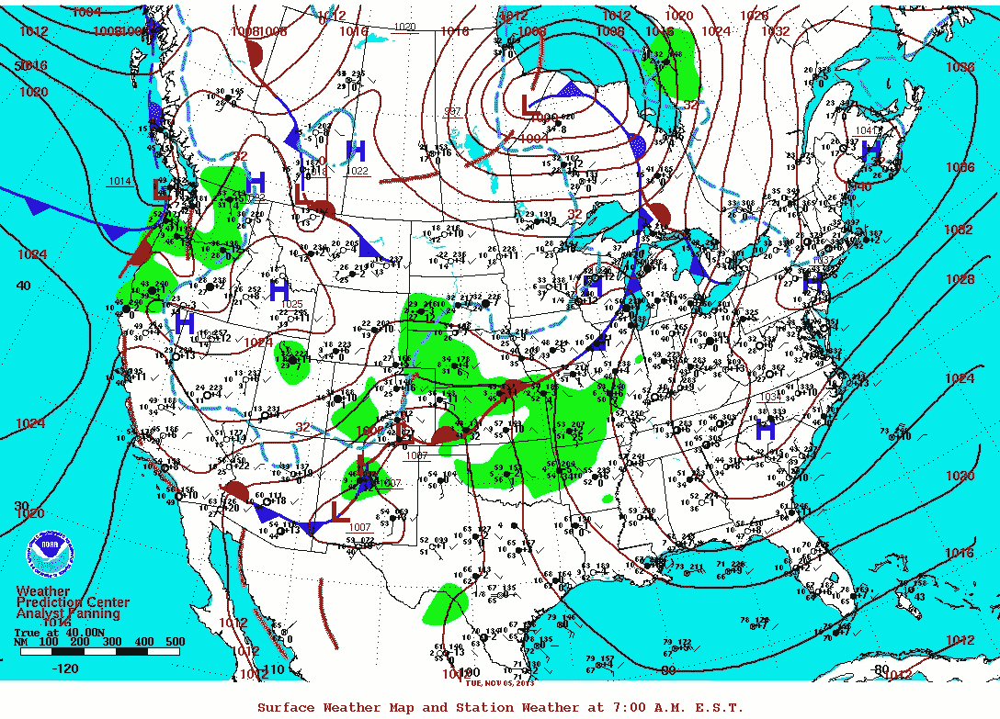
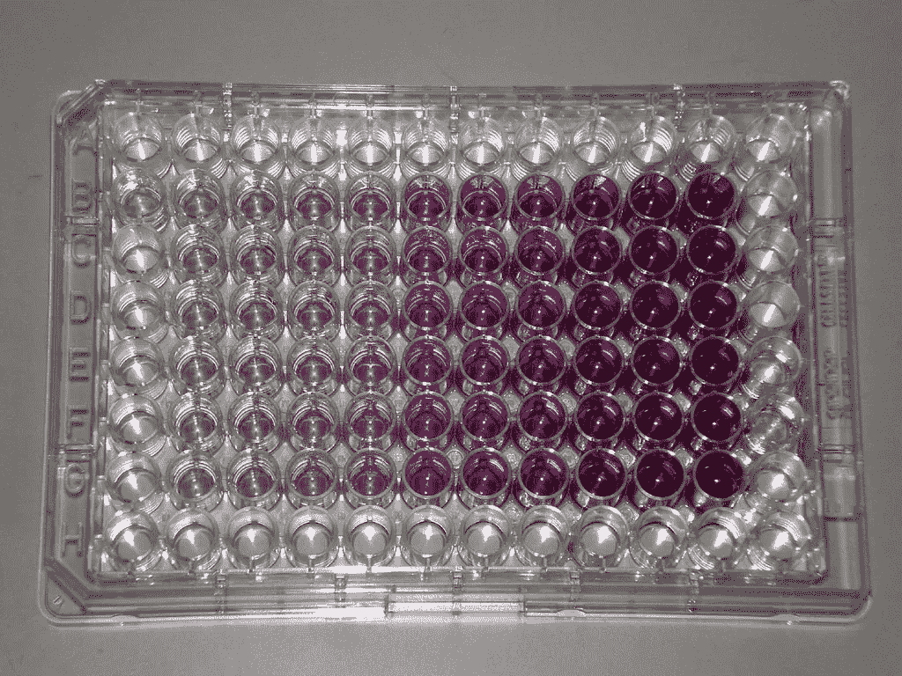
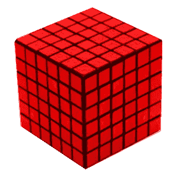
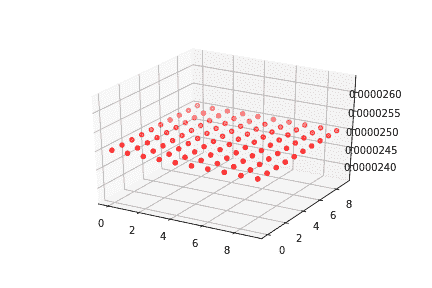
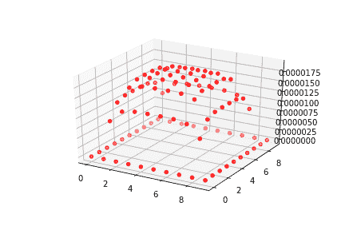

# 反应扩散模型与数据可视化

> 原文：<https://towardsdatascience.com/reaction-diffusion-model-and-data-visualization-f66fd6116bf?source=collection_archive---------21----------------------->

在科学界，模型是一个概念的表示，可以用来模拟和帮助描述一个想法。如果模型足够接近真实世界，它也可以用来预测在一系列条件下会发生什么。常见的一种模型表示是天气图，如下所示。



National Centers for Environmental Prediction [Public domain], via Wikimedia Commons

天气图是天气模型的可视化表示。天气模型接收许多位置的输入，如温度、压力、风速和其他参数，在处理这些信息后，它可用于描述和预测天气。模型要考虑的另一个方面是它们可能是错误的。任何根据天气预报出门时不打伞的人都知道这一点。因此，记住模型通常是真实世界的不完美再现是很重要的。然而，这并不意味着它们没有用处。

例如，当一个物理系统被很好地理解时，可以开发一个模型来允许系统内的实验在虚拟环境中运行。这使得科学家能够探索系统参数的变化，这可能允许他们发现给定目标的最佳条件集。人们可能选择创建模型而不是在系统上进行物理实验的原因是，在探索最佳系统条件的任务中，收集一系列参数的足够数据常常是昂贵且耗时的。一个这样的系统是反应扩散模型。

涉及反应和扩散的化学系统具有许多变量，并且当涉及的组件是昂贵的时，在整个参数域上运行试验是不可行的。这种类型的系统的一个模型将在这篇文章中介绍。具体来说，本文中的模型将代表发生在立方体化学阱中的反应和扩散，其中活性位点吸附在阱的壁和底部。这些井与下图中的井相似，但几何形状将是立方体而不是圆柱形。井的表面充满了反应位点，井溶液中的化学物质与这些位点相互作用。



Obtained from Wikimedia Commons



Obtained from [https://www.hitbullseye.com](https://www.hitbullseye.com/Reasoning/Painted-Cube-Problem-Formula.php)

反应空间是一个立方体，它将被分成更小的立方体，就像左边的立方体一样。大立方体的尺寸将是 10×10×10 的小立方体，以下称为单元。该模型将通过开发一个具有四个维度的数组来工作:x、y、z 和 t。这四个维度分别代表 x、y 和 z 空间维度以及时间维度。每个数组索引的值将代表该空间和时间的浓度。

毫不奇怪，反应扩散模型中的两个重要因素是反应和扩散。反应只发生在井壁，但扩散发生在整个系统。反应后，化学物质被认为是从系统中清除。扩散后，化学品从一个井移动到另一个井，但不会从系统中移除。

首先，必须用初始条件来定义系统。这些包括扩散常数、每个单元边的长度、模拟时间的长度、时间步长的长度、单元的初始浓度、初始井表面位置浓度、吸附和解吸的速率常数以及吸附的化学物质的初始浓度。

在时间 0，所有细胞都等于初始浓度。下一个时间步骤的细胞浓度是通过从每个细胞中去除由于反应而损失的化学物质，并基于感兴趣的细胞和所有相邻细胞之间的浓度差计算来自扩散的细胞浓度变化来计算的。完成此任务的 python 代码如下所示。

```
"""
D = Diffusivity constant in m^2/s
r = length of each dimension of cubic well in meters
n = number of partitions in each dimension of cubic well
tf = length of time of simulation
dt = numerical integration time step
initial_conc = initial concentraion of well solution
dx = r/n
nt = tf/dt
xrn is in moles per time
Aconc and Sconc are in moles per m^2
k_des is in per time
k_ad is in per M per t
dx is in m
rxnDMtot is total change in cube molarity due to reaction"""
stracker = 0
D = 1 * 10 ** -5
r = 0.0048
tf = 0.1
dt = 0.000001
n = 10
nt = int(tf / dt)
dx = r/n
initial_conc = 2.5 * 10 ** -5
import numpy as np
conc = np.zeros([n,n,n,nt+5])
for i in range(0, n):
    for j in range(0, n):
        for k in range(0, n):
            conc[i, j, k, 0] += initial_conc
#print(conc)
Sconc = 1 * 10 ** -8 #surface site concentration
Aconc = np.zeros([nt+6]) #adsorbed concentration
Dfactor = D *dt/(dx ** 2)
k_ad = 1 * 10 ** 7
k_des = 1 * 10 ** -6
Sconc = 1
Aconc[0] = 0
time_list = []
Aconc_list = []
SminusA_conc_list = []
for t in range(0, nt + 6):
    for i in range(0, n):
        for j in range(0,n):
            for k in range(0,n):

                #start of neighbor unit diffusion calculations

                if i == n - 1:
                    xposdiff = 0
                else:
                    xposdiff = Dfactor * (conc[i + 1, j, k, t] - conc[i, j, k, t])if i == 0:
                    xnegdiff = 0
                else:
                    xnegdiff = Dfactor * (conc[i - 1, j, k, t] - conc[i, j, k, t])

                if j == n - 1:
                    yposdiff = 0
                else:
                    yposdiff = Dfactor * (conc[i, j + 1, k, t] - conc[i, k, k, t])

                if j == 0:
                    ynegdiff = 0
                else:
                    ynegdiff = Dfactor * (conc[i, j - 1, k, t] - conc[i, j, k, t])

                if k == n - 1:
                    zposdiff = 0
                else:
                    zposdiff = Dfactor * (conc[i, j, k + 1, t] - conc[i, j, k, t])

                if k == 0:
                    znegdiff = 0
                else:
                    znegdiff = Dfactor * (conc[i, j, k - 1, t] - conc[i, j, k, t])

                #end of neighbor unit diffusion calculations

                #start of neighbor unit reaction calculations

                if i == 0 or i == n - 1:
                    xrxn = dx ** 2 * (k_ad * conc[i, j, k, t] * (Sconc - Aconc[t]) - k_des * Aconc[t])              #xrn is in moles per time, Aconc and Sconc are in moles per m^2, k_des is in per time, k_ad is in per M per t, dx is in m
                else:
                    xrxn = 0

                if j == 0 or j == n - 1:
                    yrxn = dx ** 2 * (k_ad * conc[i, j, k, t] * (Sconc - Aconc[t]) - k_des * Aconc[t])
                else:
                    yrxn = 0if k == 0:
                    zrxn = dx ** 2 * (k_ad * conc[i, j, k, t] * (Sconc - Aconc[t]) - k_des * Aconc[t])
                else:
                    zrxn = 0

                #end of neighbor unit reaction calculations#calculates total molarity change due to reactions
                rxnDMtot = -(xrxn + yrxn + zrxn) * dt / (dx * 10) ** 3           #total change in cube molarity due to reaction#limits change in concentration due to reaction because time step minimization is limited by processing power
                if rxnDMtot < -1 * conc[i, j, k, t]:
                    rxnDMtot = -1 * conc[i, j, k, t]

                #keeps track of the surface site concentration
                stracker = stracker - rxnDMtot * (dx * 10) ** 3#uses the current unit concentration and the reaction and diffusion changes to calculate the unit concentration at the next time step
                conc[i, j, k, t + 1] = conc[i, j, k, t] + xposdiff + xnegdiff + yposdiff + ynegdiff + zposdiff + znegdiff + rxnDMtot

    Aconc[t + 1] = Aconc[t] + stracker / (5 * r ** 2)
    stracker = 0
    time_list.append(t * dt)
    Aconc_list.append(Aconc[t])
    SminusA_conc_list.append(Sconc - Aconc[t])for i in range(0, n):
    for j in range(0,n):
        for k in range(0,n):

            totalconc = totalconc + conc[i, j, k, nt] * (dx * 10) ** 3totalconc = totalconc / ((r * 10) ** 3)
totalconc = totalconc + Aconc[nt] * 5 * r ** 2 / (r * 10) ** 3
```

我承担这个项目的主要原因之一是因为我想发展我使用 python 呈现信息的技能。显示包含细胞浓度的四维数组将需要五维来显示三个空间维度、浓度和时间。这可以通过三维动画热图来实现。我可能会回到这个项目来完成显示所有的信息在稍后的时间。目前，我已经开发了 gif，使用了 z 维度固定的细胞浓度的等间隔时间快照。这意味着 x 和 y 轴将代表细胞在 x 和 y 方向上的位置，垂直轴将代表每个细胞的浓度，时间维度将由动画表示。显示的 z 坐标显示在每个 gif 下面。



The second from the bottom layer (z = 1)



The fourth from the base (z = 3)

你可以看到反应空间两侧细胞中的浓度立即下降到零。我们将这些细胞称为壁细胞，因为它们与反应空间的壁接触。壁细胞中的浓度比内部细胞下降更快的原因是因为壁细胞是唯一由于反应而损失浓度的细胞。扩散导致溶质从高浓度流向低浓度。由于浓度高于壁细胞，扩散导致内部细胞的浓度在反应开始后开始下降，因为溶质向壁净转移。

不幸的是，这不是一个完美的模型，因为有更复杂的方法来更准确地描述这个系统，而且时间步长不够小，不能准确地反映现实。

# 承认

约翰·罗勃兹，因为他开发了最初的 VBA 模型。

卢克·博尔斯对他在图形开发方面的协助表示感谢。

芳芳，凯文和卡罗琳的指导。

# 图形和 Gif 生成 Python 代码

```
import matplotlib
!pip install imageio
import mpl_toolkits
from mpl_toolkits.mplot3d import axes3d
import matplotlib.pyplot as plt
!pip install --upgrade matplotlibdef plot_looper(snapshot_number, z_level):
    #this will only work correctly with n = 10
    t = 0
    file_title = 'z'
    while t < tf / dt:
        fig = plt.figure()
        ax = fig.add_subplot(111, projection = '3d')
        X = [[0,1,2,3,4,5,6,7,8,9],[9,0,1,2,3,4,5,6,7,8],[8,9,0,1,2,3,4,5,6,7],[7,8,9,0,1,2,3,4,5,6],[6,7,8,9,0,1,2,3,4,5],[5,6,7,8,9,0,1,2,3,4],[4,5,6,7,8,9,0,1,2,3],[3,4,5,6,7,8,9,0,1,2],[2,3,4,5,6,7,8,9,0,1],[1,2,3,4,5,6,7,8,9,0]]
        Y = [[0,1,2,3,4,5,6,7,8,9],[0,1,2,3,4,5,6,7,8,9],[0,1,2,3,4,5,6,7,8,9],[0,1,2,3,4,5,6,7,8,9],[0,1,2,3,4,5,6,7,8,9],[0,1,2,3,4,5,6,7,8,9],[0,1,2,3,4,5,6,7,8,9],[0,1,2,3,4,5,6,7,8,9],[0,1,2,3,4,5,6,7,8,9],[0,1,2,3,4,5,6,7,8,9]]
        Z = conc[X,Y,z_level, t]

        file_title += 'z'
        ax.scatter(X, Y, Z, c = 'r', marker = 'o')
        fig.savefig(f'model_image{file_title}'.format('PATH/x'))
        print(t)
        t += 1000

import os
import imageio
png_dir = 'PATH/Model_Images'
images = []
for file_name in os.listdir(png_dir):
    if file_name.endswith('.png'):
        file_path = os.path.join(png_dir, file_name)
        images.append(imageio.imread(file_path))
imageio.mimsave('PATH/model.gif', images)
```