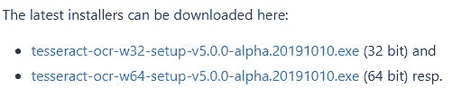
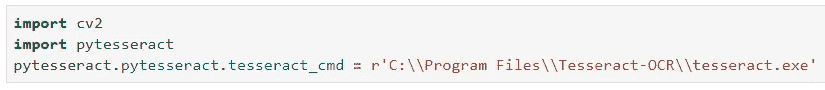
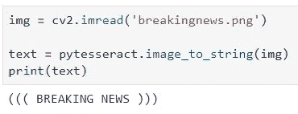
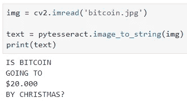

# 用一行 Python 代码从图像中读取文本

> 原文：<https://towardsdatascience.com/read-text-from-image-with-one-line-of-python-code-c22ede074cac?source=collection_archive---------0----------------------->

处理图像不是一件小事。对你来说，作为一个人，很容易看到某样东西，并立即知道你在看什么。但是电脑不是这样工作的。


Photo by [Lenin Estrada](https://unsplash.com/@lenin33?utm_source=medium&utm_medium=referral) on [Unsplash](https://unsplash.com?utm_source=medium&utm_medium=referral)

对你来说太难的任务，像复杂的算术和一般的数学，是计算机不费吹灰之力就能完成的。但是在这里**正好相反适用于**——对你来说微不足道的任务，比如识别图像中是猫还是狗，对计算机来说真的很难。在某种程度上，我们是天造地设的一对。至少现在是这样。

虽然图像分类和涉及某种程度的计算机视觉的任务可能需要一些代码和扎实的理解，但从某种程度上格式良好的图像中读取文本却是 Python 中的一行程序——可以应用于许多现实生活中的问题。

在今天的帖子中，我想证明这一点。虽然还有一些安装工作要做，但应该不会花太多时间。这些是您需要的库:

*   OpenCV
*   宇宙魔方

我不想再长篇大论这个介绍部分了，所以我们现在为什么不进入正题呢？

# OpenCV

现在，这个库将只用于加载图像，你实际上不需要事先对它有一个坚实的理解(虽然它可能是有帮助的，你会看到为什么)。

根据官方文件:

> OpenCV(开源计算机视觉库)是一个开源的计算机视觉和机器学习软件库。OpenCV 旨在为计算机视觉应用提供一个公共基础设施，并加速机器感知在商业产品中的应用。作为一个 BSD 许可的产品，OpenCV 使得企业利用和修改代码变得很容易。[1]

简而言之，你可以使用 OpenCV 做任何种类的**图像转换**，这是一个相当简单的库。

如果您还没有安装它，它将只是终端中的一行:

```
pip install opencv-python
```

差不多就是这样。到目前为止，这很容易，但这种情况即将改变。

# 宇宙魔方

***这到底是什么库？*** 嗯，根据维基百科:

> Tesseract 是用于各种操作系统的光学字符识别引擎。它是自由软件，在 Apache 许可下发布，版本 2.0，自 2006 年以来一直由 Google 赞助开发。[2]

我确信现在有更复杂的库可用，但是我发现这个运行得很好。根据我自己的经验，这个库应该能够读取任何图像中的文本，前提是字体不是一些连你都无法读取的粗体字。

如果它不能读取你的图像，花更多的时间玩 OpenCV，应用各种过滤器使文本突出。

现在安装有点底层的痛苦。如果你使用的是 Linux，这可以归结为几个 ***sudo-apt get*** 命令:

```
sudo apt-get update
sudo apt-get install tesseract-ocr
sudo apt-get install libtesseract-dev
```

我用的是 Windows，所以这个过程有点繁琐。

首先，打开[这个 URL](https://github.com/UB-Mannheim/tesseract/wiki) ，下载 32 位或 64 位安装程序:



安装本身很简单，归结起来就是点击几次 ***下一个*** 。是的，你还需要做一个 **pip 安装**:

```
pip install pytesseract
```

***就这些吗？*** 嗯，不是，你还是要告诉 Python 宇宙魔方安装在哪里。在 Linux 机器上，我不需要这样做，但是在 Windows 上是必须的。默认安装在 ***程序文件*** 中。

如果您做的一切都是正确的，那么执行这个单元格应该不会产生任何错误:



**一切都好吗？你可以继续了。**

# 阅读课文

先说一个简单的。我发现了几个包含某种文字的免版税图片，第一个是这样的:


[https://upload.wikimedia.org/wikipedia/commons/thumb/b/bc/Wikinews_Breaking_News.png/800px-Wikinews_Breaking_News.png](https://upload.wikimedia.org/wikipedia/commons/thumb/b/bc/Wikinews_Breaking_News.png/800px-Wikinews_Breaking_News.png)

这应该是最简单的，并且有可能宇宙魔方会把那些蓝色的“物体”读成括号。让我们看看会发生什么:



我的主张是真实的。不过这不是问题，你可以用 Python 的魔法轻松解决这些问题。

下一个可能更棘手:


[https://live.staticflickr.com/7892/46879778504_3b11c328b0_b.jpg](https://live.staticflickr.com/7892/46879778504_3b11c328b0_b.jpg)

我希望它不会发现硬币上“B ”:



看起来效果很好。

现在就看你把这个应用到你自己的问题上了。如果文本与背景融为一体，OpenCV 技巧在这里可能至关重要。

# 在你离开之前

对于计算机来说，从图像中读取文本是一项非常困难的任务。想想看，计算机不知道什么是字母，它只对数字起作用。在引擎盖后面发生的事情起初可能看起来像一个黑箱，但是如果这是你感兴趣的领域，我鼓励你进一步调查。

我不是说 PyTesseract 每次都能完美地工作，但是我发现它甚至在一些复杂的图像上也足够好了。但不是直接从盒子里拿出来的。需要一些图像处理来突出文本。

我知道这是个复杂的话题。过一天算一天。总有一天它会成为你的第二天性。

喜欢这篇文章吗？成为 [*中等会员*](https://medium.com/@radecicdario/membership) *继续无限制学习。如果你使用下面的链接，我会收到你的一部分会员费，不需要你额外付费。*

[](https://medium.com/@radecicdario/membership) [## 通过我的推荐链接加入 Medium-Dario rade ci

### 作为一个媒体会员，你的会员费的一部分会给你阅读的作家，你可以完全接触到每一个故事…

medium.com](https://medium.com/@radecicdario/membership) 

# 参考

[1][https://opencv.org/about/](https://opencv.org/about/)

[2][https://en . Wikipedia . org/wiki/tessera CT _(软件)](https://en.wikipedia.org/wiki/Tesseract_(software))