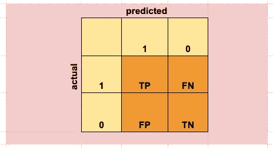
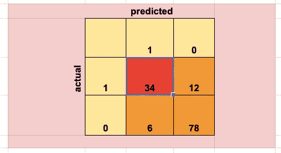
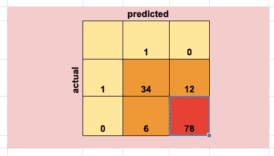
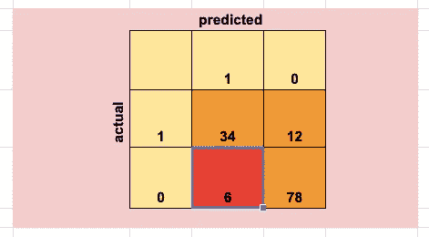
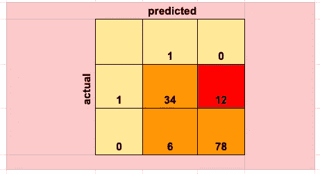
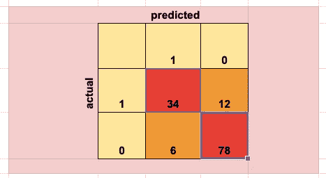
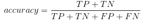
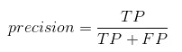
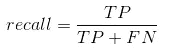
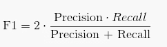

# 阅读混淆矩阵

> 原文：<https://towardsdatascience.com/reading-a-confusion-matrix-60c4dd232dd4?source=collection_archive---------8----------------------->

## 精确度，召回，f 分数，真阳性，假阴性，真阴性，假阳性…你困惑了吗？

Image from [https://pixabay.com](https://pixabay.com/images/search/)

本文将尝试解释上述术语，并演示如何阅读混淆矩阵，以便从中获取最多信息。

**什么是混淆矩阵？**

混淆矩阵是一种可视化分类结果的方法。您已经建立了一个分类模型，该模型预测了测试集上的一些值，并且您还有一些目标变量的实际值要与之进行比较。困惑矩阵将向你展示你的预测是否与现实相符，以及它们是如何更详细地计算的。

下面的混淆矩阵显示了预测值与实际值的对比，并给出了分类对的名称:真阳性、真阴性、假阴性和假阳性。我们将讨论每一个预测患者高血压的特殊例子的意义。

**真阳性**

我们现在将考虑 130 名患者的数据集，其中基于一些特征集，我们试图预测患者是否患有高血压。在数据集中，有 46 名患者有高血压，其余 84 名没有。我们已经运行了我们的分类算法，并绘制了我们的模型相对于实际值的预测值。混淆矩阵如下所示。我们可以看到我们得到了 34 个真阳性。这对应于患有高血压的患者，并且我们的模型正确地识别了他们。

**真底片**

我们可以看到，我们也得到了 78 个真负对。这意味着我们的算法已经正确地发现了 78 名没有高血压的患者(他们没有高血压，并且模型也预测他们没有)。真正的否定和真正的肯定是我们的模型做对的部分。我们希望找到能最大化这两者的模型。

**误报**

现在，我们开始关注我们的模型表现不佳的部分。假阳性代表我们的模型归类为有高血压的患者的数量，但实际上，他们没有。对病人来说可能不是一个严重的错误，但是对治疗病人没有的疾病的医院机构来说可能是昂贵的。假阳性也称为 1 型错误。

**假阴性**

假阴性代表患者有高血压，但我们的模型预测他们没有。它也称为第二类错误，这种错误的含义可能不同于第一类错误。在我们的情况下，后果甚至可能是严重的，因为那些患有高血压的患者将被诊断为健康的，而没有得到治疗。

**精度**

累积正确预测并将该数字放入所有实例的对比中的度量是**准确性**。它将真阳性和真阴性相加，然后除以所有实例的数量。

准确度的实际公式如下:

如你所见，我们将所有真值(真正值和真负值)相加，然后除以所有示例。在我们的例子中，这是(34+78)/130。我们得到的精度比 0.86 稍高一点。

重要的是要注意，有一些例子，准确性本身可能会产生误导。因此，在我们的例子中，有 84 名患者没有高血压，因此，一个只预测所有患者没有高血压的模型将获得 64%的准确性(84/130=0.64)。因此，我们希望使用其他指标来帮助模型评估。

**精度**

这是一个非常重要的概念。这是模型正确识别的高血压患者数(真阳性)除以模型预测的所有高血压患者数(真阳性和假阳性)。换句话说，它衡量的是在我们模型的正面预测中，正确识别的实例所占的比例。

**回忆**

召回代表正确识别的高血压患者(真阳性)除以患病患者总数(真阳性和假阴性)。换句话说，它衡量的是我们的模型能够正确识别的疾病患者的比例。

如果你仍然感到困惑，你可以把召回率理解为被模型正确分类的所有相关结果的百分比，把精确度理解为相关结果的百分比。

**F 分数**

精确度和召回率可以结合成一个单一的指标，称为 f-score。如果你对回忆和精确给予同等的重视，你可以用它来优化你的模型。如果你不强调回忆和精确更重要的话，这可能是一个很好的折中方案。公式如下所示，它结合了我们讨论过的两个指标。

**结论**

在这篇文章中，我介绍了一个混淆矩阵，并给出了可以从它导出的度量标准。在评估分类问题时，查看上面提到的所有指标是很重要的。然而，当试图优化或选择最佳模型时，增加一个指标可能会导致另一个指标下降。根据模型应用选择折衷方案并理解这些决策的含义是很重要的。

*原载于 aboutdatablog.com:* [阅读一个困惑矩阵](https://www.aboutdatablog.com/post/reading-a-confusion-matrix)，*2019 年 12 月 11 日。*

*PS:我正在 Medium 和***上撰写深入浅出地解释基本数据科学概念的文章。你可以订阅我的* [***邮件列表***](https://medium.com/subscribe/@konkiewicz.m) *每次我写新文章都会收到通知。如果你还不是中等会员，你可以在这里加入**[***。***](https://medium.com/@konkiewicz.m/membership)**

**下面是一些你可能会喜欢的帖子**

** [## python 中的 lambda 函数是什么，为什么你现在就应该开始使用它们

### 初学者在 python 和 pandas 中开始使用 lambda 函数的快速指南。

towardsdatascience.com](/what-are-lambda-functions-in-python-and-why-you-should-start-using-them-right-now-75ab85655dc6)  [## Jupyter 笔记本自动完成

### 数据科学家的最佳生产力工具，如果您还没有使用它，您应该使用它…

towardsdatascience.com](/jupyter-notebook-autocompletion-f291008c66c)  [## 当你开始与图书馆合作时，7 个实用的熊猫提示

### 解释一些乍一看不那么明显的东西…

towardsdatascience.com](/7-practical-pandas-tips-when-you-start-working-with-the-library-e4a9205eb443)**