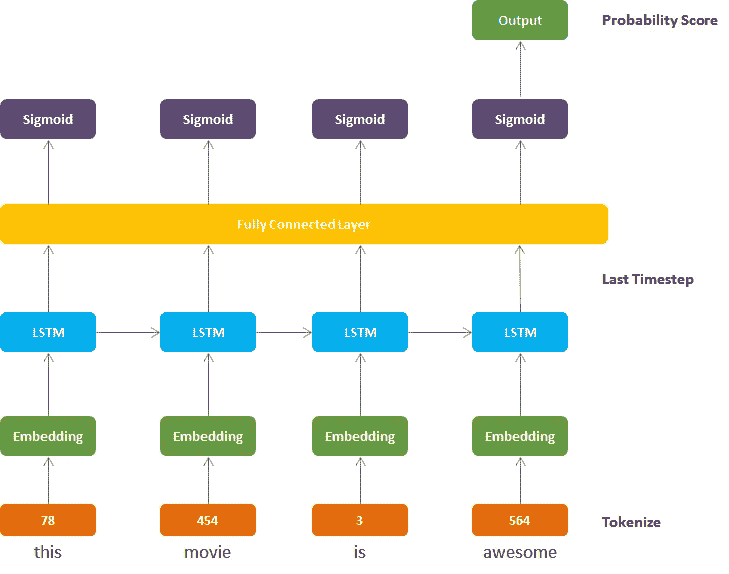
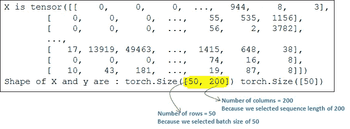
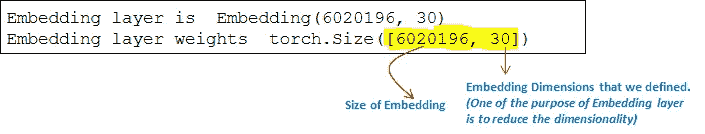
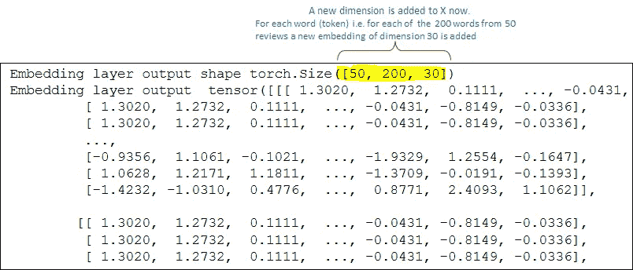
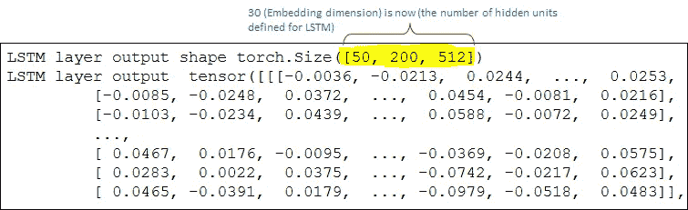
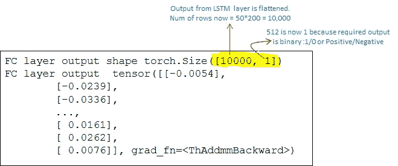
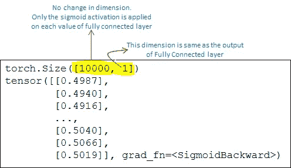
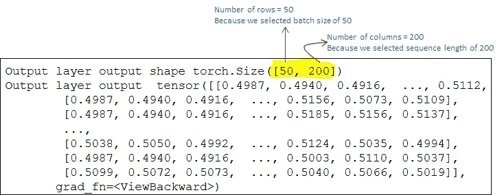
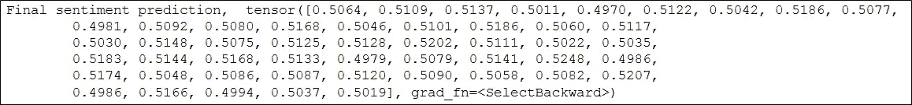

# 层间阅读(LSTM 网络)

> 原文：<https://towardsdatascience.com/reading-between-the-layers-lstm-network-7956ad192e58?source=collection_archive---------8----------------------->

## 使用 PyTorch 框架进行深度学习


Photo by [Paul Skorupskas](https://unsplash.com/@pawelskor?utm_source=medium&utm_medium=referral) on [Unsplash](https://unsplash.com?utm_source=medium&utm_medium=referral)

> 构建深度神经网络的最关键部分之一是——当数据流经经历维度变化、形状改变、展平然后重新成形的层时，要有一个清晰的视图…

我们将参考之前在情感分析教程中看到的 LSTM 架构。链接到这篇文章。

[](/sentiment-analysis-using-lstm-step-by-step-50d074f09948) [## 使用 LSTM 逐步进行情感分析

### 使用 PyTorch 框架进行深度学习

towardsdatascience.com](/sentiment-analysis-using-lstm-step-by-step-50d074f09948) 

LSTM Network Architecture for Sentiment Analysis

这些层如下所示:

0.令牌化:这不是 LSTM 网络的一个层，而是将我们的单词转换成令牌(整数)的一个强制步骤

1.  嵌入层:将单词标记(整数)转换成特定大小的嵌入
2.  LSTM 层:由隐藏状态变暗和层数定义
3.  全连接图层:将 LSTM 图层的输出映射到所需的输出大小
4.  Sigmoid 激活层:将所有输出值转换为 0 到 1 之间的值
5.  输出:最后一个时间步的 Sigmoid 输出被认为是该网络的最终输出

**在定义模型类之前，仔细观察每一层会有很好的洞察力。**这将有助于您更清楚地了解如何为模型架构的嵌入、LSTM 和线性层准备输入

## 背景:

我们正在使用 [IMDB 电影回顾数据集](http://ai.stanford.edu/~amaas/data/sentiment/)，数据处理和准备步骤已经完成。如果您需要重新查看这些步骤，请点击此处的[按钮](/sentiment-analysis-using-lstm-step-by-step-50d074f09948)。我们从数据加载器开始(我们已经定义了`batch_size=50`和`sequence length=200`)。根据我关于使用 LSTM 构建[情感分析模型的文章，我们正在用显微镜观察第 14 步——](/sentiment-analysis-using-lstm-step-by-step-50d074f09948)

*   **我们先来看看来自**的 `**inupts**` **和** `**targets**`

```
dataiter = iter(train_loader)
x, y = dataiter.next()
x = x.type(torch.LongTensor)
print ('X is', x)print ('Shape of X and y are :', x.shape, y.shape)
```

****

**Reviews converted into tokens (integers)**

**从`X`的形状我们可以看出`X`是一个 50 行(=批量)& 200 列(=序列长度)的张量。这确保了我们的令牌化过程运行良好。这个`X`将作为嵌入层的输入**

*   ****嵌入层:****

**允许你使用嵌入的模块是`torch.nn.Embedding`。它需要两个参数:词汇量和嵌入的维数**

```
from torch import nnvocab_size = len(words)
embedding_dim = 30
embeds = nn.Embedding(vocab_size, embedding_dim)
print ('Embedding layer is ', embeds)
print ('Embedding layer weights ', embeds.weight.shape)
```

****

**Embedding Layer ‘Weight Matrix’ or ‘Look-up Table’**

```
embeds_out = embeds(x)
print ('Embedding layer output shape', embeds_out.shape)
print ('Embedding layer output ', embeds_out)
```

****

**Input tokens converted into embedding vectors**

**从嵌入层的输出我们可以看到，由于嵌入了权重，它创建了一个三维张量。现在它有 50 行，200 列和 30 个嵌入维度，也就是说，在我们的评论中，对于每个标记化的单词，我们都添加了嵌入维度。这些数据现在将被传送到 LSTM 图层**

*   ****LSTM 层:****

**在定义 LSTM 层时，我们保持 Batch First = True，隐藏单元数= 512。**

```
# initializing the hidden state to 0
hidden=None
lstm = nn.LSTM(input_size=embedding_dim, hidden_size=512, num_layers=1, batch_first=True)
lstm_out, h = lstm(embeds_out, hidden)
print ('LSTM layer output shape', lstm_out.shape)
print ('LSTM layer output ', lstm_out)
```

****

**Output of LSTM layer**

**通过观察 LSTM 层的输出，我们看到我们的张量现在有 50 行，200 列和 512 个 LSTM 节点。接下来，该数据被提取到完全连接的层中**

*   ****全连通层:****

**对于完全连接的图层，输入要素的数量= LSTM 中隐藏单元的数量。输出大小= 1，因为我们只二进制输出(1/0；正/负)**

**请注意，在将 lstm 输出放入 fc 层之前，必须将其展平。**

```
fc = nn.Linear(in_features=512, out_features=1)
fc_out = fc(lstm_out.contiguous().view(-1, 512))
print ('FC layer output shape', fc_out.shape)
print ('FC layer output ', fc_out)
```

****

**Output from Fully Connected Layer**

*   ****乙状结肠激活层:****

**只需要将全连接层的所有输出值转换为 0 和 1 之间的值**

```
sigm = nn.Sigmoid()
sigm_out = sigm(fc_out)
print ('Sigmoid layer output shape', sigm_out.shape)
print ('Sigmoid layer output ', sigm_out)
```

****

**Output from Sigmoid Activation Layer**

*   ****最终输出:****

**这包括两个步骤:首先，重新调整输出，使行数=批量大小**

```
batch_size = x.shape[0]
out = sigm_out.view(batch_size, -1)
print ('Output layer output shape', out.shape)
print ('Output layer output ', out)
```

****

**Sigmoid Activation Layer output reshaped**

**第二，正如我们在网络架构中看到的，我们只想要最后一个序列之后的输出(最后一个时间步长之后)**

```
print ('Final sentiment prediction, ', out[:,-1])
```

****

**Final output from the model**

**这些输出来自未经训练的网络，因此这些值可能还不能说明任何问题。这只是为了举例说明，我们将使用这些知识来正确定义模型。**

## **结束语:**

*   **我希望你读它的时候和我写这篇文章的时候一样开心**
*   **试着为你正在尝试实现的任何其他深度学习模型复制这个过程**
*   **请随意写下您的想法/建议/反馈**