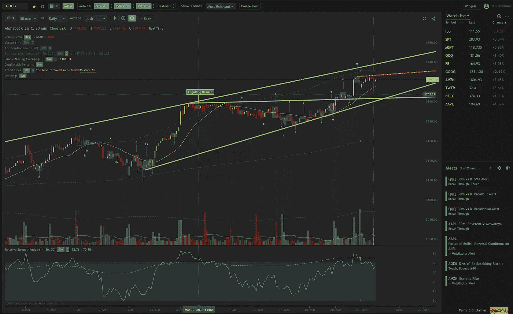
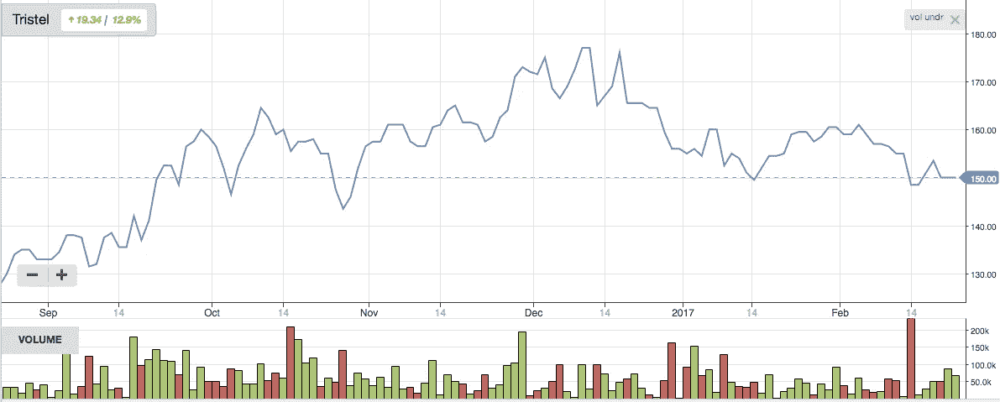

# 用卷积神经网络读取股票图表

> 原文：<https://towardsdatascience.com/reading-charts-with-convolutional-neural-networks-cbaabdd5f478?source=collection_archive---------8----------------------->

Source: trendspider.com

# 介绍

> "历史不会重演，但它经常会重复。"马克·吐温

在了解了卷积神经网络(CNN)在图像识别方面的强大功能后，我想知道算法是否能比人类图表分析师更好地阅读股票市场图表，人类图表分析师的工作是发现图表模式并从中获利。我们知道[CNN 比人类更擅长](https://www.eetimes.com/document.asp?doc_id=1325712#)对 ImageNet 图片进行分类，但是他们能比其他市场参与者更好地阅读和发现模式吗？

以下是我为适应 CNN 的股票价格预测所做的细微差别和调整。你可以在这里找到我凌乱的 jupyter/colab 笔记本。

# 1.选择正确的市场/数据集

我认为合乎逻辑的是，技术分析[在量化基金交易的市场中不会起作用](https://mathinvestor.org/2017/09/charts-and-technical-analysis-do-they-work/)——任何从有趣的图表模式或【插入复杂的声音术语】中可能获得的收益都已经被任何体面的量化者榨干了，但我很想知道，在量化者由于能力有限而不去的地方，是否仍然存在简单的低效率。因此，我寻找全球顶级交易所之外但仍可进入的市场——华沙证券交易所就是这样一个例子。

# 2.时间序列的训练-测试分裂的危险

使用[标准 ML 包](https://scikit-learn.org/stable/modules/generated/sklearn.model_selection.train_test_split.html)分割数据集很容易，但必须小心处理时间序列，否则会发生数据泄漏，并产生乐观的样本内结果，而非样本外结果。如果你的随机训练测试分割让你的模型学会如何填补下面的空白，你实际上是在用未来预测过去！

Source: [fast.ai](https://www.fast.ai/2017/11/13/validation-sets/)

我遵循了 Rachel Thomas 的[建议](https://www.fast.ai/2017/11/13/validation-sets/)，以一种不会让模型预测过去的方式分割数据——关于选择验证集时的其他细微差别，请阅读她的[帖子](https://www.fast.ai/2017/11/13/validation-sets/)。

# **3。使用循环图成像时间序列**

向 CNN 提供信息的最直接方式是使用标准的价格/交易量图表，如下所示:

然而，由于 CNN 从数据中处理和学习洞察力的方式可能与人类不同，因此以不同的形式表示时间序列可能是有用的。此外，由于图像有 3 个通道，所以可以用不同的度量来包装每个通道，以便为我们的算法提供更多信息。这个有用的[库](https://pyts.readthedocs.io/en/latest/auto_examples/index.html#imaging-time-series)有几个函数实现了时间序列的 SOTA 图像表示。

一种这样的转换是 Gramian Angular Fields (GAFs)，它将时间序列转换到一个“*极坐标系统，而不是典型的笛卡尔坐标。*【0】。另一种这样的表现是循环图，这种图*“显示了重要的和容易解释的关于时间尺度的信息，否则是很难得到的”。*【1】*下面是一些变换后的图表，看起来蛮不一样的吧？你可以在这一页的末尾看到我实验的最终结果。*

**

*Recurrence Plot transformations*

# *4.分数微分——平衡内存和稳定性*

> *平稳性是 ML 算法的高性能的必要的非充分条件。问题是，在平稳性和记忆性之间有一个权衡。我们总是可以通过微分使一个序列更加平稳，但这将以擦除一些记忆为代价，这将挫败 ML 算法的预测目的。”**马科斯·洛佩斯·德·普拉多【2】***

**

*Figure 1: Memory vs Time [2]*

*使用价格系列时的一个标准工程特征是退货系列。Lopez[2]写道，return 系列的问题是丧失记忆。图 1 本质上显示了相对于时间保存的内存。对于返回序列，即“整数 1”微分，在第一个周期后，序列的记忆会失去对过去值的记忆。但是我们可以看到，对于分数微分值，历史值的记忆仍然存在，这有助于预测。*

*然后，诀窍是找到一个分数，其中微分小于 1，但仍达到平稳性——一个 [ADF 测试](https://www.statsmodels.org/dev/generated/statsmodels.tsa.stattools.adfuller.html)可以检查给定分数是否达到平稳性。*

# *5.平移不变性的可选性*

*CNN 如此擅长对图像进行分类的一个关键原因是[平移不变性](https://stats.stackexchange.com/questions/208936/what-is-translation-invariance-in-computer-vision-and-convolutional-neural-netwo)，即输出对输入的微小变化不变。如果你试图对一只不总是在同一个地方的猫进行分类，它仍然可以识别这只猫。*

**

*Source: What is wrong with Convolutional neural networks*

*但是对于时间序列，时间上较早的尖峰与预测时间之前的尖峰具有不同的含义，因此如果平移不变性有用的话，我们可能希望抛弃它——使用 [Coordconv](https://eng.uber.com/coordconv/) [3]可以实现这种可选性。一个 Coordconv 层包括 2 层 I 和 j 坐标，让 CNN 知道每个像素的位置。如果算法决定坐标是有用的，权重将反映这一点，因此使用 Coordconv 只有好处！作者发现，将 Coordconv 添加到各种 CNN 任务中几乎总能提高性能。*

**

*Source: An intriguing failing of convolutional neural networks and the CoordConv solution [3]*

# *结果和进一步的工作*

*我使用 CNN 通过将时间序列数据表示为图像来预测时间序列。CNN 有一个相对简单的二元分类任务——决定第二天的收盘价是否为正。*

*我关注的是精确度，因为我们赌假阳性会赔钱。使用 GAF 成像的分数微分序列(d=0.3)，最好的评分是 **64** %。我跑得最好的笔记本是这里的。*

**

*接下来，我将着眼于改进 CNN 架构，以更好地捕捉时间关系，即波网！兴奋地去理解和测试它。*

# *特别提及:fast.ai*

*我从我的人工智能硕士那里学到了很多东西，但我也学到了同样多的东西，如果不是从 [fast.ai](https://www.fast.ai/) 那里学到更多关于*实用*深度/机器学习的话。 [fast.ai 库](https://docs.fast.ai/)挤满了最先进的深度学习技术，这些技术可以加快训练速度，它们的默认设置会产生惊人的结果，从而使用户可以专注于实验的其他部分。论坛也非常活跃，上面的大多数想法都来自[这个帖子](https://forums.fast.ai/t/time-series-sequential-data-study-group/29686)中的人。*

# *参考*

*[0] Z. Wang 和 T. Oates，“使用平铺卷积神经网络将时间序列编码为用于视觉检查和分类的图像。”AAAI 研讨会(2015 年)。*

*[1] J.-P Eckmann 和 S. Oliffson Kamphorst 和 D Ruelle，“动力系统的递归图”。欧洲物理学通讯(1987 年)。*

*[2]马科斯·洛佩兹·德·普拉多，“金融机器学习的[进展](https://www.amazon.com/Advances-Financial-Machine-Learning-Marcos/dp/1119482089)”。2018*

*[3] [罗莎妮·刘](https://eng.uber.com/author/rosanne-liu/)、[乔尔·雷曼](https://eng.uber.com/author/joel-lehman/)、[皮耶罗·莫里诺](https://eng.uber.com/author/piero-molino/)、[费利佩·彼得罗夫斯基这样的](https://eng.uber.com/author/felipe-petroski-such/)、[埃里克·弗兰克](https://eng.uber.com/author/eric-frank/)、[亚历克斯·谢尔盖耶夫](https://eng.uber.com/author/alex-sergeev/)、[杰森·约辛斯基](https://eng.uber.com/author/jason-yosinski/)、【卷积神经网络和 CoordConv 解决方案的一个耐人寻味的失败】。2018.*