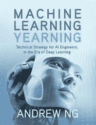
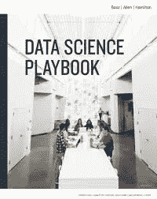
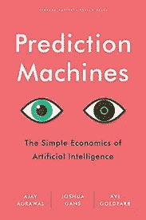
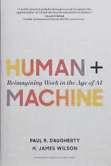
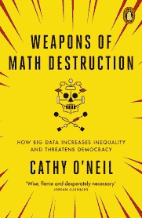

# 应用人工智能阅读书目

> 原文：<https://towardsdatascience.com/reading-list-for-applied-ai-5f4b84c75c1f?source=collection_archive---------10----------------------->

Photo by [Nong Vang](https://unsplash.com/@californong?utm_source=unsplash&utm_medium=referral&utm_content=creditCopyText) on [Unsplash](https://unsplash.com/s/photos/reading?utm_source=unsplash&utm_medium=referral&utm_content=creditCopyText)

## 如果你在 2020 年将人工智能应用到你的业务中，六本书值得一读

据行业领袖称，2020 年将是人工智能(AI)“现实检验”的一年。在未来一年，许多企业将寻求从人工智能和机器学习试点计划转向为将人工智能完全嵌入企业奠定基础。IDC [预测](https://www.forbes.com/sites/gilpress/2019/11/22/top-artificial-intelligence-ai-predictions-for-2020-from-idc-and-forrester/#2f63f8d6315a)到 2022 年，75%的企业将在运营中嵌入智能自动化。

如果你是一名商业领袖或数据专业人士，正在考虑如何在你的组织中使用人工智能，以及部署这一新兴技术的最佳方式，这里有一份书单，可以添加到你的新年阅读清单中。这些书涵盖了在商业中应用人工智能的战略和实践层面。他们会让你明白；

*   人工智能在不久的将来对商业意味着什么。
*   如何为应用人工智能建立合适的团队？
*   部署机器学习的最佳实践。
*   如何制定坚实的战略，将人工智能和机器学习嵌入到组织中。
*   实施人工智能的伦理和道德考虑。

## [机器学习向往](https://d2wvfoqc9gyqzf.cloudfront.net/content/uploads/2018/09/Ng-MLY01-13.pdf)

*吴恩达*

被称为谷歌大脑背后的人的吴恩达在 2018 年发布了这本完全免费的书。根据他领导谷歌大脑团队的经验，他介绍了一个将机器学习嵌入组织的框架。

这本书涵盖了如何制定机器学习策略，测试机器学习模型的正确方法以及如何建立一个“超级英雄”团队。对于希望开始在企业中使用或扩展机器学习的数据科学家和企业领导者来说，这是一本必读的书。即使你已经在部署机器学习，这本书也将提供如何改进现有流程的技巧。

## [机器学习的规则](http://martin.zinkevich.org/rules_of_ml/rules_of_ml.pdf)

马丁·津克维奇

另一本免费下载的书，作者是谷歌的一位研究科学家，这本书涵盖了机器学习工程的最佳实践。这是一本非常实用的书，既适合商业领袖，也适合数据科学家。它涵盖了实现机器学习的最佳实践，从最基本的原则开始，比如只在有意义的地方使用机器学习。

这本书分为四个部分，包括:如何了解在实施机器学习(ML)之前需要准备什么，如何部署端到端的 ML 管道，如何启动模型和迭代以获得性能改善，以及当性能增益达到平台期时该做什么。

## [数据科学行动手册](https://www.boozallen.com/s/insight/publication/data-science-playbook.html)

*柯克·博恩和埃兹梅拉达·哈利勒·萨格尔*

这是一份来自数据科学咨询公司 Booz Allen Hamilton group 的出版物。这本书概述了成功的数据科学的“六个关键要素”，这些要素是他们通过与众多公共和私营部门企业合作而确定的。

这六个要素包括:

*   识别分析机会。
*   如何更好地管理和治理数据。
*   从这些数据中产生有用见解时需要考虑的分析技术。
*   如何建立和发展数据科学团队？
*   如何最好地将新技术和现有技术用于数据科学项目。
*   为数据科学的成功开发一种企业文化，他们称之为“Adapt-C”。

这本书主要针对商业和数据科学领导者，并就如何制定公司范围的数据科学战略给出了非常实用的建议。

## [预测机器](https://www.predictionmachines.ai/)

阿贾伊·阿格拉瓦尔、阿维·戈德法布和约书亚·甘斯

这本书是从市场营销、经济和管理专家的角度写的。它旨在回答“人工智能对我的业务意味着什么？”。他们相信将人工智能重新定义为“廉价预测”而不是“魔法”，并提出人工智能将为能够成功利用这项技术的企业提供经济优势。

这本书为商业领袖和战略家提供了一个关于人工智能的现实视角，并介绍了一个实用的框架来理解你需要了解的关于这项技术的知识以及它将如何影响你的业务。

## [人+机器:重新想象人工智能时代的工作](https://www.amazon.co.uk/Human-Machine-Reimagining-Work-Age/dp/1633693864)

*保罗·r·多尔蒂和 h·詹姆士·威尔森*

这本书聚焦于人工智能的不远的将来，以及这将如何用这种技术导致所有业务流程的转变。作者讨论了他们如何看到公司部署人工智能解决方案来增强创新和盈利能力。这本书还提供了一个“领导者指南”，它给出了成为人工智能驱动的企业并实现公司业绩改善的五个关键原则。

这本书是商业领袖对人工智能的实用介绍，并解释了它在不久的将来对企业和“人类”意味着什么。

## [破坏数学的武器](https://www.amazon.co.uk/Weapons-Math-Destruction-Increases-Inequality/dp/0553418815)

*凯茜·奥尼尔*

人工智能目前的局限性之一是，尽管机器能够通过复杂的计算学习数据中存在的模式，但它们还无法对它们做出的预测做出任何道德判断。当企业开始将这项技术应用到他们的流程中时，考虑自动做出的决策的道德含义是很重要的。因此，我觉得在人工智能的推荐书目中至少包括一本关于伦理的书是至关重要的。

这本书强调了在将人工智能集成到企业中时一些最重要的伦理和道德考虑。作为业务领导者或数据从业者，这将为您正在部署的模型的潜在含义提供许多思考的素材。

感谢阅读！