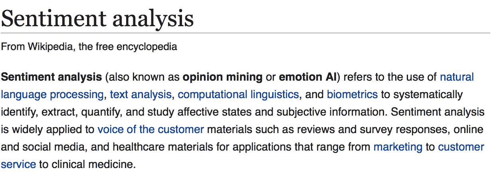
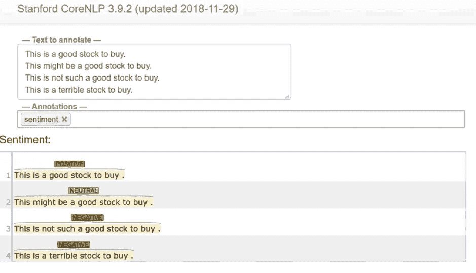
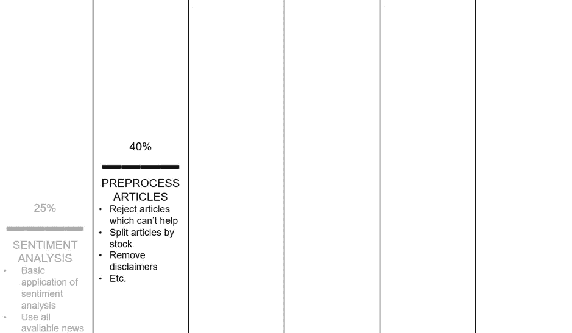
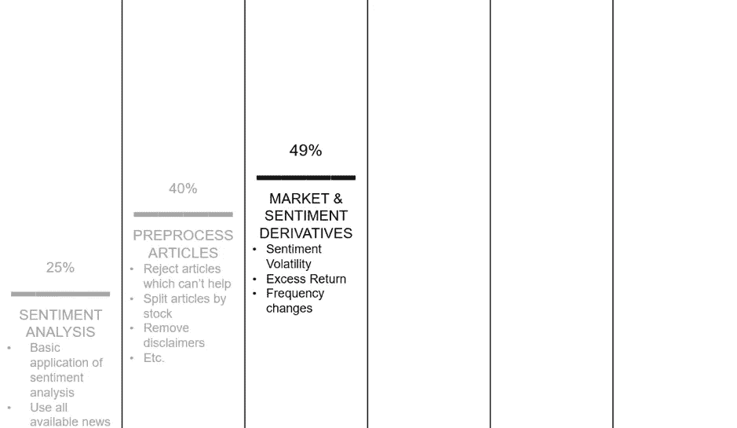
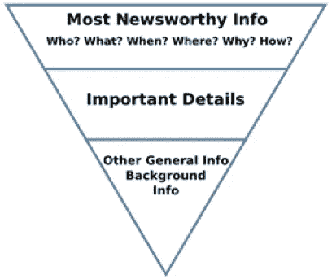
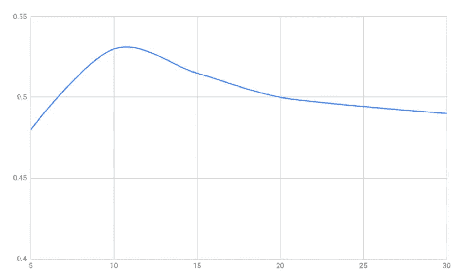
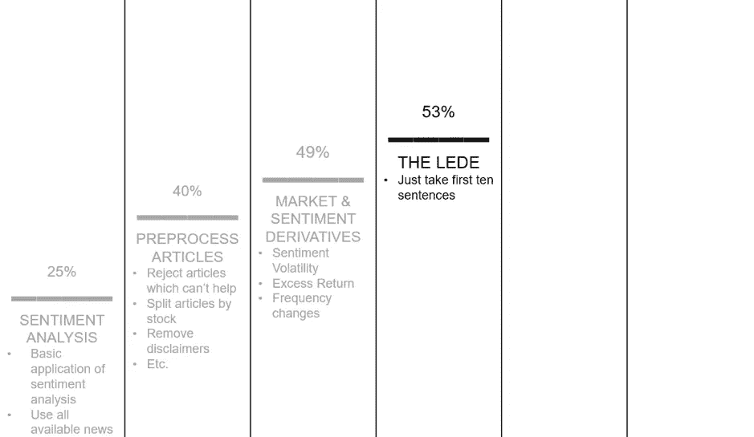
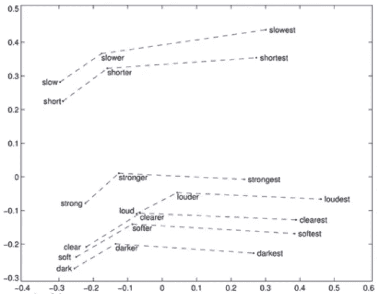
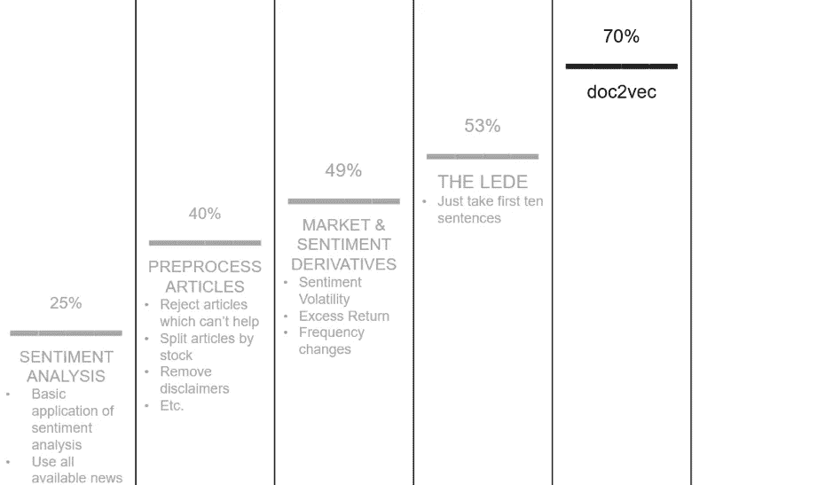

# 解读市场——机器学习与金融新闻

> 原文：<https://towardsdatascience.com/reading-the-markets-machine-learning-versus-the-financial-news-bcd3704f37b8?source=collection_archive---------11----------------------->

大量的金融新闻文章出版了。但只有一小部分能真正推动市场。知道哪些可能会有帮助。机器学习能指明方向吗？

【本文涵盖今年 5 月在维也纳举行的 QuantMinds 国际会议上介绍的工作，以及 12 月在纽约举行的量化金融中的机器学习和人工智能会议上的更新。它基于我们在《走向数据科学:[机器学习与新闻](/machine-learning-versus-the-news-3b5b479d8e6a)中发表的测量新闻情绪的工作。]

想象一下，你想要战胜股票市场。你是个勤奋的投资者。每天早上开市前，你会阅读前一天收盘后发布的所有新闻。在以某种方式预测了这些文章中的哪一篇会推动市场后，你运用你巨大的直觉和洞察力来下注。然后你去海滩。

> 这种梦境的问题在于数据量巨大，而且数据和结果之间的关系从未被可靠地公式化。但是，这当然是我们喜欢应用机器学习的那类问题的本质[【1】](#_ftn1)。

道琼斯通讯社是主要的实时财经新闻提供商之一，每年传送几百万篇文章。这些包括从主要报纸的文章到新闻发布和经纪人的评论。即使我们把自己对世界的看法限制在与标准普尔 500 指数成份股公司明确相关的文章上，我们每天仍会看到成千上万篇文章。如果我们在开市前一个小时到达工作地点，我们几乎没有两秒钟的时间来阅读和评估每篇文章。我们也许能够以这样的速度浏览一些文章，并发现一些有趣的文章，但我们的分析不太可能非常深入，而且几乎可以肯定的是，我们无法保持这样的速度一个小时。人们也早已清楚，即使有足够的时间，投资者也不太擅长预测市场。

我想到的一个大问题是:

> 有没有可能建立一个算法，可以成功地找到将推动市场的文章？

继续读下去，你会发现答案最终是肯定的。但实现这一目标的能力取决于投入大量精力，培养对现有新闻文章本质的理解，以及对相关工具和算法的直觉。

# 理解新闻

对于这个项目，我们使用自然语言处理，特别是情感分析。参考维基百科的定义:

Wikipedia’s definition of Sentiment Analysis

在我们的语境中，这意味着分析一篇新闻文章的文本，并决定它“听起来”是积极的还是消极的。有几种常用的库可供使用:

●斯坦福 CoreNLP

● NLTK

●谷歌云平台

这些库的运行方式各不相同，但总的想法是，它会消耗一些文本并返回一个分数，其中如果一篇文章特别乐观，它可能被评为+1，如果它特别消极，它可能被评为-1，或者其他适当的介于两者之间的值。本文给出的结果是使用 NLTK VADER 获得的。这种选择主要是出于计算的原因，因为它比其他选择要快得多。

为了举例说明，让我们看几个已经传递给斯坦福的情感分析器的句子(可以在这里运行)。

Sentiment computed for a variety of sentences by Stanford’s CoreNLP

我们看到一些无关紧要的句子被评价为或多或少积极的，与我们可能希望期待的一致。当处理新数据或新库时，为了确定您可能遇到的弱点，运行这样的小测试是非常有用的。所有库的结果都很差——为了避免显得卑鄙，这里不分享这样的例子。

# 如何预测未来

一旦我们知道了一篇新闻文章的观点，我们希望能够预测它的发表是否会引起市场的重大变化[【2】](#_ftn2)。

用机器学习的行话来说，这是一个有监督的学习问题。我们有包含特征(文章的属性)的历史新闻文章数据，并添加了一些标签(基本上是 0 或 1 ),指定文章实际上是否跟随了文章中提到的公司的股票价格的显著移动。

我们将这些数据传递给一个分类器——某种算法，在我们的例子中，该算法试图推断某一特定商品是否可能会发生重大价格变化。在实践中，我们希望能够确定我们是否从可用的历史数据中学到了任何有用的东西。为此，我们将历史数据分为训练集和测试集。在“学习”阶段，我们向算法展示来自训练数据的特征和标签。然后，在测试阶段，我们向经过训练的算法提供以前未见过的特征，指示它预测最可能的标签，然后将该预测与实际对应的标签进行比较。

鉴于这一总体框架，我们的工作必须朝着两个方向前进:

●确定可用新闻文章的最佳功能集。

●确定将最成功地学习我们的特征和标签之间的关系的分类器(及其参数化)。

# 机密情报

我们将很快讨论我们脑海中的特征类型，但是首先对分类器进行一些评论。对于监督学习问题，存在多种分类器。最基本的是逻辑回归。然后是决策树、随机森林等算法。在数学上复杂的一端，我们发现了神经网络。对于这个项目，我们使用神经网络找到了我们的最佳结果，所以我们在这里展示的结果是通过这种方式获得的。

我们不会尝试在这里介绍神经网络。只要说它们是一种非线性回归工具就够了，其基础设计是从人脑基本结构的简化中找到灵感的。

在过去的几年里，我们在机器学习方面经历的许多重大进步都利用了神经网络。这种基本算法已经存在了几十年，但随着处理能力和数据可用性的稳步增长，它开始发挥作用。

对于这个项目，我们用 Python 实现了我们的神经网络，使用了 Google 流行的 TensorFlow 库。我们的神经网络的特征，特别是它的复杂性，被选择来平衡精度和泛化能力。这相当于:

●准确预测样本内训练数据的标签

●准确预测样本外测试数据的标签

这并不像听起来那么容易。很明显，如果一个模型非常简单，即使在训练过程中“看到”的数据上也不太可能表现良好。随着模型变得越来越复杂，它开始在训练数据上表现得更好。如果它运行良好，它将越来越多地在以前看不到的测试数据上表现良好——即，它将学会概括。但是从某种复杂程度上来说，它将继续在训练数据上表现得更好，而在测试数据上表现得越来越差。因此，选择架构的目标是在最佳点着陆，在这个点上，模型在*测试* *数据*上的准确性最高。

对这种现象的一种思考方式是，没有一种关系可以从数据中完美地学习到。这很大程度上是因为数据本身并不是我们试图了解的关系的完美例子——总有噪音。随着模型变得更加复杂，它获得了从训练数据中学习噪声的数值自由度。但是从这个角度来看，既然噪音基本上是随机的(因此是不可预测的)，那么这些知识只能分散对未知数据的有用学习。

因此，诀窍在于找到一个足够复杂的网络，以学习数据中非线性关系的本质，但又不足够丰富，以至于能够有效地记住所呈现的数据(每个观察结果都包含特定的噪声，这些噪声不会在未来的数据中再现)。

> 这是很重要的，因为记忆数据证明是一个非常差的保证，知识可以推广到以前看不到的情况。从某种意义上说，对记忆的约束是洞察力的起源。但只是在一定程度上——给定一个足够有限的模型，我们既不会记住任何东西，也不会学到任何有用的东西。

最适合我们的网络架构如下:

●四个隐藏层—64、128、128 和 64 个节点

●层完全连接并使用 Relu 激活

●输出层包含具有 sigmoid 激活的单个节点

# 特征工程

特征工程是确定可用数据的特定属性集的工艺，这将最好地促进我们寻求推断的关系的学习。我们可以想象一些物品属性的效用:

●文章的正文

●刊登文章的出版物的名称

●文章发表的时间

●出版商的文章 ID 代码

我们可能随后会发现在我们的特性中包含文章 ID 是没有帮助的。包括它甚至可能使结果恶化。在直觉层面上，我们可以认为这个特性只是带来了额外的噪声，妨碍了算法搜索洞察力。在这种情况下，从特性中删除文章 ID 实际上消除了干扰，使学习更容易。

相反，文章的文本本身可能很难让我们的算法从中学习任何东西。因此，特征工程工艺的另一个方面是计算出可以从数据中导出哪些进一步的属性，以帮助突出关键关系，并使算法的工作更容易。(如前所述，我们将使用情感等衍生特征)

# 该过程

为了获得这里给出的结果，我们遵循一个相当典型的机器学习过程。实际上，我们将把数据随机分成训练集和测试集。所呈现的结果是从将已训练的模型应用到测试测试中获得的结果(即，未被用作训练模型的一部分的数据集)。

首先，一篇新闻文章只有一个特征——文章的情感。我们将把它与 0(意味着股票的绝对超额收益小于 1%)或 1(意味着绝对超额收益大于 1%)联系起来。

接下来，我们在随机选择的训练子集上训练我们的分类器，然后通过从测试数据集生成预测并将它们与股票价格的实际记录历史移动进行比较来测试训练的网络。

为了使这种比较对一组数据有用，我们需要一个度量标准。评估分类问题解决方案成功与否的一个常用指标是 F1 分数。这在我们这样的情况下特别有用，在我们的数据集中有大量的“真正的负面消息”，这意味着大多数文章之后没有重大的股价波动。

请记住，如果我们的模型预计一篇新闻文章之后会有市场变动，则预测值为 1，否则预测值为 0，F1 得分计算为以下各项的调和平均值:

●从我们的模型中得出的 1 个预测实际上为 1 的比例(所谓的精确度)，以及

●我们的模型正确预测为 1 的所有实际 1 的比例(召回)。

如果我们的结果是完美的，这个值将是 100%,如果它们完全没有用，这个值将是 0%,更有可能在两者之间。

为了说明这类项目的发展，我们将以渐进的方式呈现结果——查看我们在实验不同功能集时发现的 F1 分数。要记住一个重要的事实:

> 虽然添加功能的过程是由我们的直觉和智慧驱动的，但现实往往不会被我们最伟大的洞察力所打动，有时甚至会成为苛刻的批评家。

无论如何，我们希望通过明智地添加功能，我们将提高我们的模型的预测能力！

# 第一步:那些艰难的早期结果

看到第一个结果往往是你无畏的机器学习工程师或数据科学家陷入绝望的时刻——所以我们必须做好准备，对我们最终的结局保持一定程度的乐观。

虽然我们还没有天真到想象用一个数字来表示一篇文章——它的情感——会让我们的分类器有更多的希望来推断这篇文章是否会推动市场，但从这里开始仍然是有用的。

这有几个原因。首先，它是一种检查我们的整个管道是否正常工作的方法——我们可以收集数据，构建功能，分离测试数据，训练模型，根据测试数据评估模型，等等。第二，它有助于建立一个基准水平的准确性，我们可以根据它来决定增加其他数据特征或改变我们的分类器结构的效用。

尽管如此，人们希望我们在这个阶段取得的结果会比随机的好——因为那至少会令人感到鼓舞。从本能上来说，由于我们是在预测这篇文章是否会推动市场，所以感觉是二元的。因此，人们可能会认为 50%是随机猜测的结果。因此，我们希望在测试数据上获得介于 50%和 100%之间的 F1 分数。

因此，当第一次运行完成时，F1 分数出现在屏幕上，其值为 25%，很难不感到有点沮丧。稍微思考一下，我们就可以从以下事实中得到安慰:我们的文章中，只有少于一半的文章出现了大幅的市场波动，因此，选择频率相同的 0 和 1 会导致较低的结果，所以我们的结果确实比随机结果要好。

## 进度检查:第一步

# 第二步:物品预处理

数据科学家最重要的活动之一是理解数据。有时这可能是微不足道的。但是，如果一项工作足够复杂，需要一名数据科学家，那么数据集可能会很大，而且是非结构化的。这种分析可能是一种令人沮丧且耗时的活动，但也是必不可少的。

我们找到的第一篇文章显然是我们希望从中学习到一些东西的:

> 贝尔沃租赁有限公司(BLV。LN)周三表示，该公司超过了 2017 年投资组合收购的目标。这家英国房产租赁公司表示，2017 年期间，特许经营商完成了 23 笔交易，增加了超过 330 万英镑的网络收入，超过了其目标。

这篇文章有几个优点:

●它明显与特定公司相关

●它拥有可以相对容易地推断出情感的语言

●它不包含大量中性或分散注意力的文本

我们开始注意到的许多其他文章就不一样了。有些形式经常重复出现，其中包括:

●经纪人的价格更新

●带有免责声明的新闻稿

● S&P 评级评论

●与多家公司相关的文章

第一种方法对我们的目的没有多大用处，因为它们只是简单地引用了特定证券的出售价格。它们本质上几乎完全是数字——尽管这并不排除它们的用处，但我们的 NLP 情感算法并不适合解释它们。此类物品最好能被检测出来，并从我们的流程中排除。

新闻稿和 S&P 评级评论可能非常有用。但是他们经常以免责声明的形式包含大段的法律术语。情感是作为文档句子的平均值来计算的。由于法律术语往往是中性的，在分析文章时包括这些标准文本的大段文字将会大大削弱文章报道的情感。因此，在评估这些标准文本之前，我们将把它们从我们的文章中去掉。这是一项繁琐的工作，但是可以通过一系列正则表达式有效地实现。

一些新闻文章总结了与不同公司相关的多条新闻。由于这些文章遵循特定的格式(取决于出版商等)，通常可以自动将它们分成一系列迷你文章，每篇文章只报道一条新闻。

一旦我们建立并实现了一套预处理数据的规则，我们就可以重新运行我们的分析，看看我们得到了什么样的测试结果。

## 进度检查:第二步

事实上，通过对文章进行预处理，我们看到 F1 分数提高了 15%。这是第一次表明，了解您的问题领域和技术领域是有实际价值的。在这种情况下，这意味着理解:

●在浩如烟海的文章中究竟能找到什么样的文章，以及

●算法将如何在各种类型的文章上执行

# 第三步:添加更多功能

为了提高我们的神经网络学习某些东西的机会，我们现在将向它扔更多的数据——具体来说，我们将为每篇新闻文章提供额外的功能。

在我们这样做之前，有必要思考这样一个事实，即一篇新闻文章只有在改变我们对某件事的看法时才会对我们“有用”。在我们对世界的简化观点中，我们从新闻报道对股票的情绪中推导出对股票的情绪。因此，如果一篇新闻文章偏离了我们之前对该股的看法，它可能会被认为是有趣的。请注意，一篇文章不一定要与我们当前的观点相矛盾，它可能只是让我们对我们当前的观点更加自信。考虑到这些目标，我们为每篇文章引入了以下功能:

●近期新闻文章对该股的平均情绪

●本文观点与该股近期历史均值之间的偏差

●近期文章对该股情绪的波动

我们还可以想象，股票对新闻报道的反应可能取决于股票最近的交易情况，因此我们纳入了捕捉以下信息的指标:

●该股的交易量表现如何？

●该股相对于整体指数的表现如何？

●该股近期超额收益的波动性如何？

最后，一些公司在正常时期很少被报道，而在重大事件发生时会被更频繁地报道。因此，我们纳入了一个衡量标准，衡量股票的报告频率相对于其长期平均水平的近期表现。

将所有这些特性放在一起，重新运行我们的测试，我们看到我们的 F1 分数从 40%增加到 49%。

## 进度检查:第三步

# 第四步:一点新闻洞察力

这类工作最重要的一个方面是发展对领域的理解。许多新闻都是按照所谓的倒金字塔模型构建的。借用维基百科，我们可以将一篇典型新闻文章的结构形象化如下:

)

Inverted Pyramid Model of Journalism courtesy of Wikipedia

这是写文章的一个相当标准的方法。这个想法是在文章的开头传达谁，什么，等等，然后在接下来的段落中提供更多的辅助细节。开头的几个句子被称为文章的导语。

我们可能会假设，Lede 中传达的情感更多地与公司相关新闻的最重要部分相关，并且我们越深入文章，我们就越会偏离它(通过关注不太重要的细节的情感)。如果我们被这个假设所吸引，那么我们应该考虑运行网格搜索来识别文章中要处理的最佳部分。

我们通过使用 NLTK 工具包将文章文本转换成句子来做到这一点。接下来，我们从文章中选择第一个 *n* 句子(每篇文章都有相同的 *n* )，然后我们用这部分文本继续完成剩下的过程，并计算 F1 总分。此外，我们迭代不同的 *n* 值，直到我们找到最好的 F1 分数。我们发现的结果如下:

F1-score computed using a series of Lede lengths (in number-of-sentences)

这显示了大约十个句子的最佳情感信息内容，因此在完成步骤四时，我们将处理限制在十个句子的文章。

## 进度检查:第四步

# 停下来想一想——我们被困住了吗？

通过几次迭代，我们已经推进到这样一个点，即我们的结果有一些统计意义，但没有足够的意义来保证写一篇关于它的文章。我们已经花了很多时间来加深对新闻文章的理解，所以现在我们必须努力加深对我们正在使用的人工智能工具的理解。

尤其值得思考的是，情感分析是否很好地适应了我们试图解决的问题。要做到这一点，我们必须更深入地了解我们可用的特定情感分析工具。这是有见地的考虑语料库的性质，每一个是建立在。一般来说，流行的情感分析师没有接受过金融新闻报道方面的培训。更常见的是，它们是通过以下方式构建的:

●来自亚马逊或 IMDB 的评论

●推特

每种类型的文本都有自己的特点。推文肯定是用与完整长度新闻完全不同的语言写的，所以为推文精心校准的工具不太可能理解更正式写作的情感范围。

值得注意的是，从我们对股票的看法来看，“结果略有改善”这样的句子是积极的。然而斯坦福的 CoreNLP 把这句话归类为否定。同样，所有的库都有自己的特点和不一致性，所以这并不是对 CoreNLP 的批评。

所有这些都让人怀疑，最好的前进方式是不是建立我们自己专有的情绪分析器。如果我们环顾一下可用的工具，很容易被 Doc2vec 的流行和据称的功能所诱惑。所以我们来看看有没有帮助。

# 与 Doc2vec 一起前进

Doc2vec 是流行的 Word2vec 的扩展，有效地在文档级别而不是单个单词级别应用该技术。Word2vec 最初来自谷歌进行的研究。Word2vec 的想法是学习一个将单词映射到一个 *n* 维向量的函数。该算法通过查看一些语料库中的单词序列来做到这一点。在机械上，一个简单的神经网络用于学习预测哪个单词最有可能跟随任何给定的单词。第一个惊喜在下一步。扔掉神经网络的输出层，转而看看倒数第二层的 *n* 节点的激活。然后，这些激活的值可以被认为对应于输入单词的矢量表示。

这有什么用呢？对于这是如何发生的还有一点不确定性，但是如果我们绘制一系列单词的向量值，我们会开始注意到一些非常有趣的模式。从谷歌深度思维研究科学家的一篇[文章中截取这张图片:](https://ruder.io/secret-word2vec/)

[Word embeddings for related words under Word2vec](https://ruder.io/secret-word2vec/)

这里我们看到的是一些常见单词对应的向量值的曲线图。(实际的向量是高维的，但是它们在这里通过称为降维的数学过程被简化，以便它们可以在某种意义上近似为我们可以绘制的二维图形)

要注意的是，虽然像“慢”、“短”、“强”、“暗”这样的词都出现在图表上相当不同的位置(沿着左手边)，但更慢和最慢(到慢)的相对位移，基本上与我们看到的短/更短/最短、强/更强/最强等完全相同。

这几乎表明，该算法已经推断出某种语言语义的算法。事实上，我们可以制作图表，展示语言的许多其他属性的类似有趣的结果。

我们不会在这里详述细节，只是说 Doc2vec 将该方法扩展到了文档级别——并且已经发表了几篇在情感分析中使用 Doc2vec 文档矢量化的论文。

这特别有趣，因为在任意文档语料库上训练 Doc2vec 很容易。因此，我们建立了新闻文章的向量化，然后，当沿着这个新方向前进的兴奋达到顶点时，我们看一下这个过程的下一步:训练我们的情感分析器。我们意识到了问题。

已发表的使用 Doc2vec 进行情感分析的工作主要是通过评论数据完成的，特别是来自亚马逊客户或 IMDB 电影评论者的评论数据。这些案例有标签，而我们没有，也就是说，对于每个评论，都有文本和用户指定的星级。这两者的结合大大简化了从文本中学习情感。

然而…在我们这里，我们只有文章，没有星级。因为我们知道我们的目标是拥有一个情感分析器，它是根据出现在财经新闻而不是电影评论中的语言类型来训练的，所以我们陷入了困境。

# 所以我们碰壁了

在努力寻找解决我们问题的方法后，一个真正的障碍出现了。就像马拉松运动员必须在最后一次努力中找到出路一样，我们也必须如此。

想想我们在努力做什么。实际上有两个步骤:

1.  文本-> Doc2vec ->情绪，然后
2.  情绪->市场结果预测

我们的问题是缺乏可用的情感价值。但是注意到情绪既是一个步骤的输出，又是下一个步骤的输入，我们就不能简化一下吗？

为什么不用市场结果来代表情绪呢？这将给我们留下一个步骤:

1.  TEXT -> doc2vec ->市场结果预测

# 第五步:集成 Doc2vec

事实证明，以这种方式可以发现显著的改进。实现相对简单，尽管我们使用 gensim，而不是 Google 的实现。结果如下所示。

## 进度检查:第五步

# 第六步:拿着香槟

在我们忽略的各种细节中，有一些在使用 Doc2vec 时出现的基本实际限制。主要的问题是，我们需要一套完整的文章来建立模型——不可能动态地添加新文章，然后对这些文章进行预测。这意味着，对于出现的每一篇新文章，我们都可能需要重新训练我们的文档矢量器。

问题实际上比那更糟糕。Doc2vec 中的特定向量不是算法的本质——重点是不同文章的相对嵌入。重建模型时，这些不同向量之间的形状可能会保持不变，但绝对值可能会改变。由于我们用作分类器的神经网络与实际值有关，因此也有必要对其进行重新训练。

这是很大的计算负担，并且在每天有数千篇新文章的实时环境中一点也不方便。

我们可以认为，基本约束源于 Doc2vec 需要一个完整的词汇表来构建其矢量化模型。给定一个足够大的特定领域训练数据集，在以前看不到的文章中很少会遇到新词。但在实际操作层面，总会有一个新人的名字、地名、公司名称等。这表明我们可以尝试构建没有专有名称的向量。事实上，有一些 NLP 工具可以让我们获取文本并标记每个单词的词性。然后我们可以过滤出与专有名词相对应的单词。

这在直觉上很有吸引力，因为它应该使归纳更容易(所以我们对一只股票的了解肯定适用于另一只股票，因为股票的名称被排除在外)。我们肯定会找到更好的结果…所以让我们看看。

## 进度检查:第六步

不幸的是，这并没有改善我们的结果——无论这个想法多么吸引人。

更仔细的观察表明，基本的词类过滤并不是特别有效——它删除了一些不是真正专有名词的单词。并且为了推断情感，需要那些被移除的单词中的一些。

然而:

> 由此得出的关键点是，通过采取这一步骤，我们解决了困难的实时问题，而不会显著影响结果的质量。

# 结论

在本文中，我们展示了处理新闻文章并确定哪些文章可能影响股票价格是可能的。这并不是说我们的模型在 70%的时间里正确地预测了市场。如果是这样，我们就不会写这篇文章了。我们的测试范围要窄得多——请记住，我们关注的是预测一篇新闻文章之后，股价的变动是否会超过指数变动的 1%。我们也在看昨晚收盘和今天开盘之间的变化。所以并不是所有变化都可以直接归因于这篇文章。我们不应该混淆相关性和因果性。

当然，一个人理解得越多，能够取得的结果就越好。这意味着有必要密切关注所有方面:

●了解数据

●了解新闻业

●理解算法

与许多机器学习应用一样，处理新闻和市场几乎是一门手艺，就像它是一门硬科学或工程学科一样。在某种程度上，处于科学、工程和工艺之间的这一位置使它成为一门迷人和令人愉快的学科。

在这个领域还有很多工作要做——未来几年还会有很多研究要做。考虑到金融市场的风险，最好的作品不太可能被出版。

***注来自《走向数据科学》的编辑:*** *虽然我们允许独立作者根据我们的* [*规则和指导方针*](/questions-96667b06af5) *发表文章，但我们不认可每个作者的贡献。你不应该在没有寻求专业建议的情况下依赖一个作者的作品。详见我们的* [*读者术语*](/readers-terms-b5d780a700a4) *。*

[【1】](#_ftnref1)为了清楚起见，这里要注意这是一种简化。今天早上不可能以昨晚的收盘价交易。我们可以在新闻文章发表时对其进行评估，但这将需要比我们现有的这个项目更多的当天价格数据。此外，值得注意的是，这里的重点是确定哪些消息将推动市场，而不是确定该移动将是哪个方向。(也就是说，给定一个，确定另一个可能相对简单——但鉴于我们历来对波动性的关注，这就是我们的兴趣所在)

[【2】](#_ftnref2)注意，我们不是在推断因果关系。在任何时刻，都有多种因素驱动着任何一只股票价格的变动。此外，我们关注的是超过同期标准普尔& P500 指数变动的股票价格变化，也就是说，我们关注的是超额回报，通常称为 Alpha。