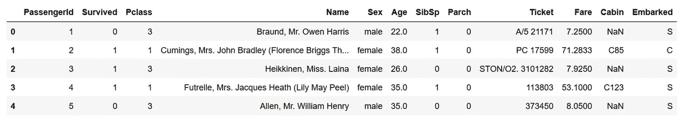

# 扩展 Pandas API 的简单方法

> 原文：<https://towardsdatascience.com/ready-the-easy-way-to-extend-pandas-api-dcf4f6612615?source=collection_archive---------22----------------------->

# 写出你自己的熊猫味道


Photo by [Zach Rowlandson](https://unsplash.com/@zachr1992?utm_source=unsplash&utm_medium=referral&utm_content=creditCopyText) on [Unsplash](https://unsplash.com/s/photos/pandas-food?utm_source=unsplash&utm_medium=referral&utm_content=creditCopyText)

在本文中，您将通过使用[pandas _ flavor](https://github.com/Zsailer/pandas_flavor)，学习如何根据您的业务、研究或个人工作流程定制 pandas API。

[Pandas-flavor](https://github.com/Zsailer/pandas_flavor) 是一个引入 API 来扩展 Pandas 的库。这个 API 处理将定制的**访问器/方法**注册到 Pandas 对象上的样板代码。

但是在本文中，我将展示如何使用它来扩展功能。为简单起见，我将使用泰坦尼克号数据集:

```
**import pandas**df = pd.read_csv("titanic.csv")
```



# 注册方法

[Pandas-flavor](https://github.com/Zsailer/pandas_flavor) 将以下自定义方法*直接*添加到 Pandas 的 DataFrame/Series 上:

*   允许将方法附加到数据帧。
*   `register_series_accessor()`允许将方法附加到序列。

这两个装饰器允许你我们可以调整上面的例子，将“`is_old_lady`”方法直接附加到 DataFrame 上。

```
**from** **pandas_flavor** **import** register_dataframe_method**@register_dataframe_method**
**def** is_old_lady(df):
   is_lady = df["Sex"] == "female"
   is_old = df["Age"] > 70
   **return** df[is_old & is_lady]df.is_old_lady()
```

但这可能会导致一些问题，例如，如果许多包开始用自定义方法对数据帧进行猴子式修补，可能会出现重复和混乱。

通过使用隔离(名称空间),注册一个包含自定义方法的访问器，可以很容易地解决这个问题。

# 注册访问者

熊猫数据框架/系列的访问者注册也是如此:

*   `register_dataframe_accessor()`允许将访问器附加到数据帧。
*   `register_series_accessor()`允许将访问器附加到序列。

作为一个例子，这里有一个简单的“titanic”访问器，它有一个“`is_old_lad`”方法:

```
**from** **pandas_flavor** **import** register_dataframe_accessor**@register_dataframe_accessor**("titanic")
**class** **TitanicAccessor**:
    **def** __init__(self, df):
        self._df = df

    **def** is_old_lady(self):
        df = self._df
        is_lady = df["Sex"] == "female"
        is_old = df["Age"] > 70
        **return** df[is_old & is_lady]df.titanic.is_old_lady()
```

# 但是熊猫有自己的 API

在本文中，我选择展示 pandas-flavor，尽管 pandas 有自己的 API[来扩展 DataFrame/Series 功能，您可能应该在注册访问器时使用这些功能。](https://pandas.pydata.org/pandas-docs/stable/reference/api/pandas.api.extensions.register_dataframe_accessor.html ?)

但是有一些限制:

*   您使用较旧的 pandas 版本，因为它只在 0.24.x 中引入
*   您希望注册方法而不是访问器，一个用例可以是覆盖 pandas 自己的方法，如 [pandas-log](https://github.com/eyaltrabelsi/pandas-log) 。
*   您希望将访问器/方法注册到其他包，如 xarray。

出于简洁的原因，我选择为所有用例展示熊猫风味。

# 遗言

当您想要扩展 Pandas 的功能并使您的代码更好时，Pandas flavor 非常有用。这篇文章的灵感来自 Zach Sailer 的[博客](https://zsailer.github.io/software/pandas-flavor/)(熊猫风味作者)。

我希望你觉得有趣和有用。我乐于接受任何建设性的反馈。