# 德克萨斯州的房地产投资

> 原文：<https://towardsdatascience.com/real-estate-investing-in-texas-bbe794df1613?source=collection_archive---------30----------------------->

## 你能用时间序列分析预测德克萨斯州的房价吗？


Photo by [M. B. M.](https://unsplash.com/@m_b_m?utm_source=medium&utm_medium=referral) on [Unsplash](https://unsplash.com?utm_source=medium&utm_medium=referral)

**简介**

对于这个项目，我使用 Zillow 的美国历史房价中值进行了时间序列分析。其目的是为投资者提供最好的邮政编码，以便在德克萨斯州购买和开发房屋。

我们开始吧！

**数据**

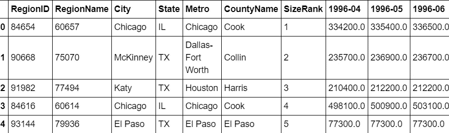

Figure 1: Zillow Median Housing Prices

数据集包含描述性变量，如州、城市、地区 ID 和县。它还包含一个名为 SizeRank 的变量，在数据探索后，该变量根据城市化程度对邮政编码进行排名。城市化程度越高的地区，规模排名越高。该数据还包括 1996 年 4 月至 2018 年 4 月的房价中位数。这些是我用来进行时间序列分析的值。在深入分析之前，需要满足一些先决条件才能考虑投资。

**邮编选择**

投资者有几种投资偏好:

*   州:投资者希望专门投资于德克萨斯州，因为该州的人口在过去五年中增长了 10 %，居住在该州的人口的中值年龄为 33.9 岁，而美国的中值年龄为 37.4 岁。
*   城市化:根据 SizeRank 变量，邮政编码应该在前 20 %
*   房价中值:邮政编码区的平均房价应该在邮政编码区 1 年房价中值上下 1.5 个十分位数之间。选择一年期参数是因为这是房地产投资者即将面临的最现实的价格。
*   风险:因为投资者采取规避风险的策略，所以根据低于 60%的变异系数来选择邮政编码。
*   回报:一旦根据投资者的偏好过滤了所有的邮政编码，我就选择投资回报率最高的邮政编码。

当所有的邮政编码被过滤和排序后，我得到了以下五个邮政编码:

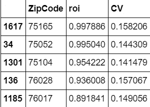

Figure 2: Final zip codes

邮政编码属于德克萨斯州的以下城市:

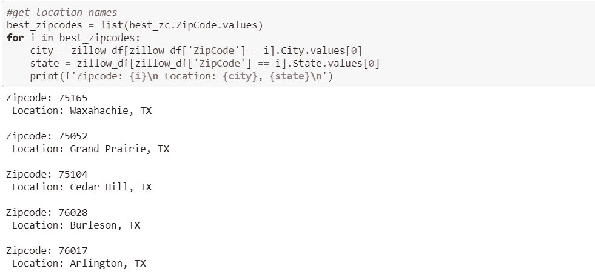

Figure 3: Locations that suited the investor’s needs

现在已经获得了 5 个邮政编码，我继续执行时间序列分析，根据预测的 10 年回报对这些邮政编码进行排序。

**时间序列分析**

现在可以绘制时间序列，我们可以直观地检查数据。

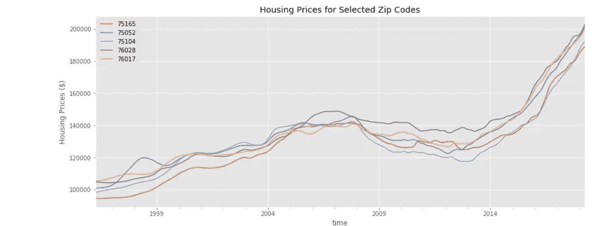

Figure 4: Exploring price change over time

住房价格中位数有一个积极的趋势，价格可能不是稳定的，因为下一个时期的价格取决于前一个时期的价格。因此，我计算了月度回报，对每个邮政编码进行了模型拟合，并使用月度回报计算了预测。回报更有可能是稳定的，并且具有恒定的零均值。接下来，我开始计算并绘制这五个邮政编码的月回报率。

```
*# new column for monthly returns* **for** zc **in** range(len(dfs_ts)): dfs_ts[zc][‘ret’] = np.nan *len(dfs_ts) **for** i **in** range(len(dfs_ts[zc])-1): dfs_ts[zc][‘ret’][i+1] = (dfs_ts[zc].value.iloc[i+1]/dfs_ts[zc].value.iloc[i]) — 1
  *
#plot the monthly returns for each zipcode* **for** i **in** range(len(dfs_ts)):     dfs_ts[i].ret.plot(figsize=(11, 5), color = 'b')     plt.title(f'Zipcode: **{dfs_ts[i].ZipCode[0]}**')     plt.xlabel('Date')     plt.ylabel('Returns %')     plt.legend(loc='best')     plt.show()
```

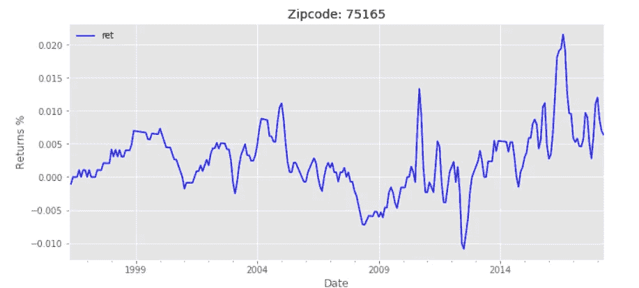

Figure 5: Waxachie’s Monthly Returns

从上面的图中，我注意到数据中没有明确的趋势，数据似乎是稳定的，这是构建模型的一个假设。检查平稳性的一个有用的可视化方法是滚动平均值和标准偏差，它们不应该显示数据平稳的趋势。

```
**for** i **in** range(len(dfs_ts)):
    rolmean= dfs_ts[i].ret.rolling(window=12, center=**False**).mean()
    rolstd = dfs_ts[i].ret.rolling(window=12, center=**False**).std()
    fig = plt.figure(figsize=(11, 5))
    orig = plt.plot(dfs_ts[i].ret,color='blue',label='Orginal')
    mean = plt.plot(rolmean, color='red', label='Rolling Mean')
    std  = plt.plot(rolstd, color='black', label='Rolling Std')
    plt.legend(loc='best')
    plt.title(f'Rolling Mean & Standard Deviation for Zipcode: **{dfs_ts[i].ZipCode[0]}**')
    plt.show()
```

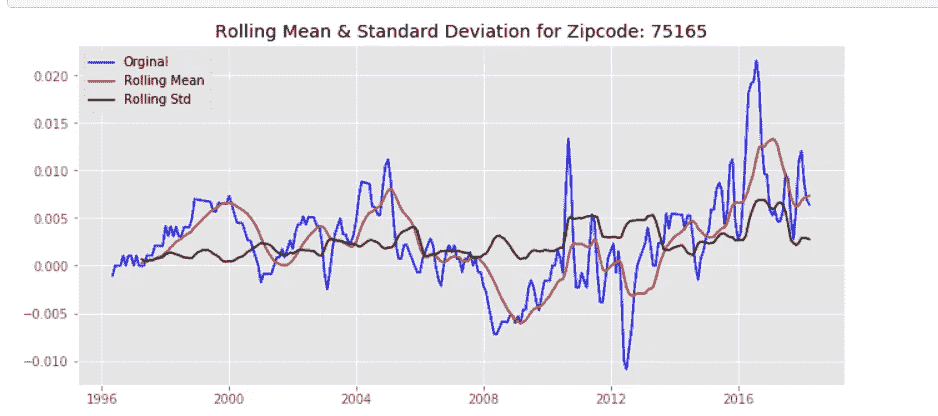

Figure 6: Rolling Mean

虽然数据看起来不是静态的，但仅仅依靠可视化并着手拟合时间序列模型是不够的。因此，有必要对平稳性进行扩展的 Dickey-Fuller 检验。

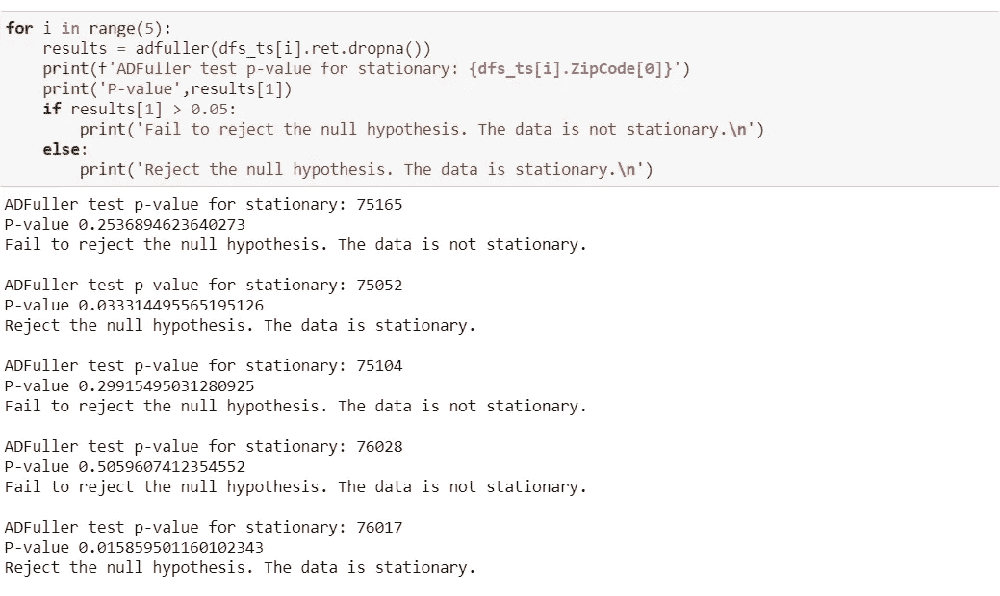

Figure 7: Dickey-Fuller Results

从上面的结果来看，五个邮政编码中的两个导致了 95 %置信水平下的非平稳。因此，这四个邮政编码需要将 ARIMA 模型中的“I”参数设置为 1。

**ARIMA 模式**

ARIMA 代表自回归综合移动平均线。到目前为止，只有“I”参数的值是已知的。现在是时候搜索 AR (p)和 MA (q)参数来最适合每个邮政编码了。

使用平稳时间序列的自相关函数(ACF)和偏自相关函数(PACF)图来估计 AR 和 MA 参数。

```
**def** acf_pacf(df, alags=48, plags=48):
    *'''Creates the ACF and PACF plots to* 
 *observe possible parameters for ARIMA model'''*
    *#Create figure*
    fig,(ax1, ax2) = plt.subplots(2,1, figsize=(13,8))
    *#Create ACF plot*
    plot_acf(df, lags=alags, zero=**False**, ax=ax1)
    *#PACF plot*
    plot_pacf(df, lags=plags, ax=ax2)
    plt.show()
**def** seasonal_plot(df, N=13, lags=[12,24,36,48,60,72]):
    *#differencing the rolling mean to find seasonality in acf plot*
    fig,(ax1, ax2) = plt.subplots(2,1,figsize=(13,8))
    rolling = df - df.rolling(N).mean()
    plot_acf(rolling.dropna(), lags=lags, ax=ax1)
    plot_pacf(rolling.dropna(), lags=lags, ax=ax2)
    plt.show();
```

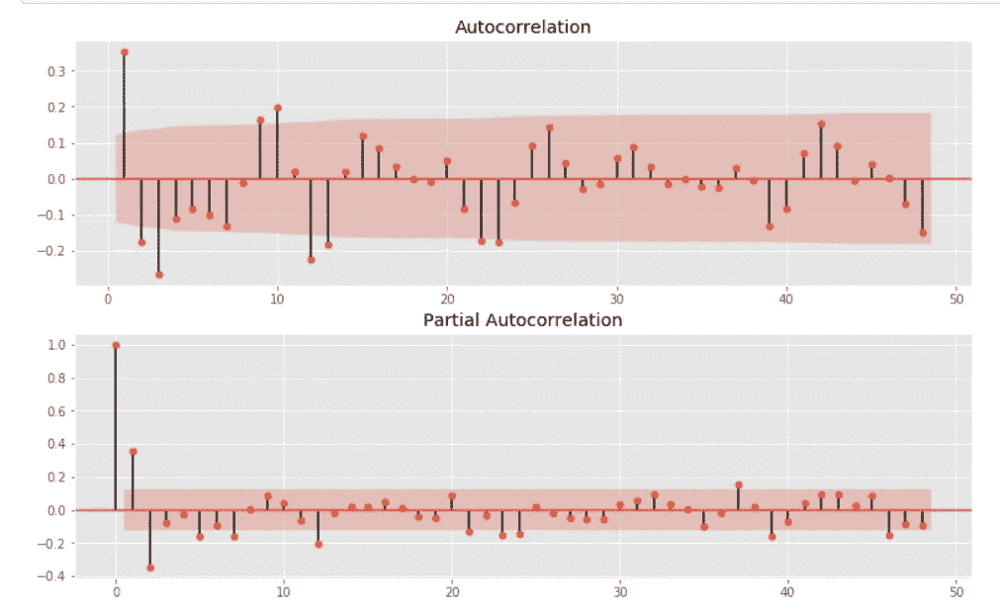

Figure 8: ACF & PACF plots

为每个邮政编码创建了曲线图，以找到 AR 和 MA 参数的最佳估计值。对于大多数邮编来说，这些图遵循一种衰减模式。因此，模型将可能包括这两个参数。

为了进一步帮助寻找参数，使用 Akaike 信息标准或 AIC 执行嵌套 for 循环。AIC 是由 statsmodels 提供的一个值，用于估计统计模型的相对质量，并提供模型选择的方法。与具有较少要素的模型相比，具有较多要素且能很好地拟合数据的模型将被赋予较大的 AIC 值，以实现相同的拟合优度。因此，我们感兴趣的是尽可能低的 AIC 值。

```
*# Define the p, d and q parameters to take any value between 0 and 3*
p = d = q = range(0,2)*# Generate all different combinations of p, d and q triplets*
pdq = list(itertools.product(p, d, q))
pdqs = [(x[0], x[1], x[2], 12) **for** x **in** list(itertools.product(p, d, q))]
ns = []
**for** comb **in** pdq:    
    **for** combs **in** pdqs:
        **try**:
            mod = sm.tsa.statespace.SARIMAX(TS_75165,
                                                order=comb,
                                                seasonal_order=combs,
                                                enforce_stationarity=**False**,
                                                enforce_invertibility=**False**)
            output = mod.fit()
            ans.append([comb, combs, output.aic])
            *#print('ARIMA {} x {}12 : AIC Calculated ={}'.format(comb, combs, output.aic))*
        **except**:
            **continue** ans_df = pd.DataFrame(ans, columns=['pdq','pdqs', 'aic'])
ans_df.loc[ans_df['aic'].idxmin()]
```

根据这一估计，获得的 ARIMA 参数(P，I，Q)为(1，1，1)，季节分量(P，D，Q，S)为(0，0，0，12)。这告诉我们，数据有 12 个周期的季节性。其他邮政编码也是如此。参数被传递到一个模型上，摘要如下:

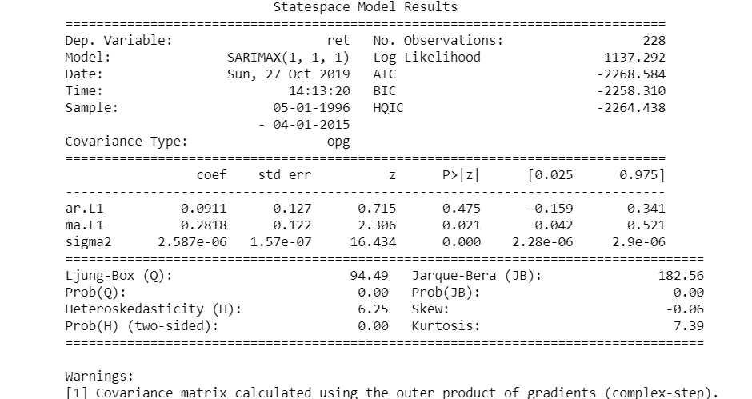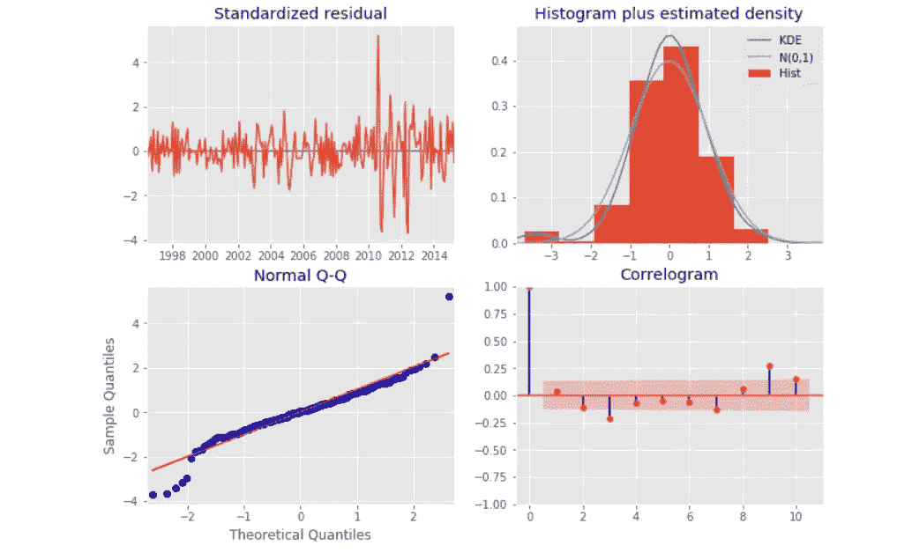

Figure 9: Summary of Athe RIMA model

从上面的图中，我们可以看到 KDE 曲线相对接近 N(0，1)曲线，这表明残差是正态分布的。Q-Q 图还向我们展示了残差是正态分布的，因为蓝点(残差)沿着红线(正态分布)。左上角的图表没有显示任何明显的季节性，似乎是白噪声。右下角的图表证实了这一点，因为时间序列残差与其滞后版本的相关性较低。

拟合模型后的下一步是通过将预测值与真实值进行比较来验证模型的准确性。

```
**def** forecast(df, pred_date, start_date):
    *#make these global so they can be accessed later*
    **global** pred
    **global** pred_conf

    *#get predictions from specific date and calculate confidence intervals*
    pred = output.get_prediction(start=pd.to_datetime(pred_date), dynamic=**False**)
    pred_ci = pred.conf_int()

    *#plot real vs predicted values*
    rcParams['figure.figsize'] = 15,6

    *#plot observed values*
    ax = df[start_date:].plot(label='Observed')

    *#plot predicted values*
    pred.predicted_mean.plot(ax=ax, label='One-Step Forecast', alpha=.9)

    *#plot range of confidence intervals*
    ax.fill_between(pred_ci.index,
                   pred_ci.iloc[:,0],
                   pred_ci.iloc[:, 1], color = 'g', alpha=.5)
    *#axes labels*
    ax.set_xlabel('Date')
    ax.set_ylabel('Monthly Returns')
    plt.legend()
    plt.show() 

    values_forecasted = pred.predicted_mean
    values_truth = df

    rmse = np.sqrt(mean_squared_error(values_truth[pred_date:], values_forecasted))
    print('RMSE: '+str(rmse))
    print('mean: '+str(df[pred_date:].mean()))
```

我决定将过去的三年作为测试集，并在此之前对模型进行所有方面的训练。创建模型后，我计算了训练数据集的 RMSE，然后对测试集执行了一步预测，以计算模型的拟合优度。


Figure 10: One-step Forecast

从上图中我们可以看到，单步预测似乎与真实值非常吻合。量化我们预测的准确性也是有用的。我们将使用 MSE 或均方差，它概括了我们预测的平均误差。

对于动态预测，我们仅使用截至某个时间点的时间序列信息，之后，使用之前预测时间点的值生成预测。

**预测**

一旦模型被训练好，我就用这个模型来计算未来 10 年的月回报率。有了这些信息，我计算了 1 年、3 年、5 年和 10 年的总回报。

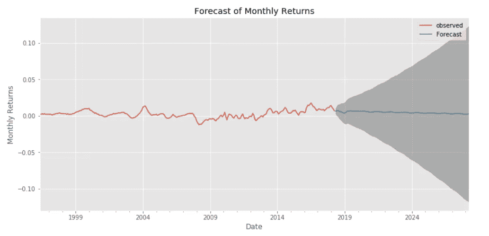

Figure 11: 10-year forecast for Waxahachie

**调查结果**

在对五个邮政编码进行时间序列分析并预测了十年的总回报后，我向投资者推荐了以下邮政编码:

1.  76028:德克萨斯州伯利森(10 年回报率为 448 %)
2.  75104:德克萨斯州雪松山(10 年回报率为 187 %)
3.  75165:德克萨斯州沃克西哈奇(10 年回报率为 127 %)

拥有更多房地产投资领域的知识将提高分析能力。这些模型可以通过考虑其他外部变量来改进。这些其他变量可能包括税率、犯罪率、学区评级和利率。将时间序列分析中的房价和月回报率进行比较可能会很有趣。两者的结果将改善决策过程。

请注意，这个项目只是时间序列建模的一个练习，不应该作为实际的房地产投资。