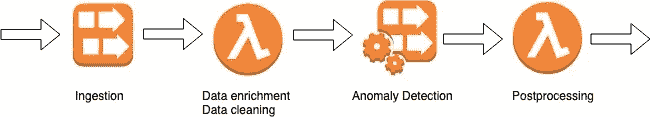

# 自动气象站的实时异常检测

> 原文：<https://towardsdatascience.com/real-time-anomaly-detection-with-aws-c237db9eaa3f?source=collection_archive---------8----------------------->

> 数据越新，就越具有可操作性和价值。这是实时数据分析的基本逻辑。

可能会有一些用户进行可疑的活动，或滥用您的折扣。另一方面，你也可以只是观察客户的行为并采取行动。为了实现这个目标，我将介绍如何使用 AWS 工具创建一个实时数据分析应用程序。


Picture taken from [AWS Docs](https://docs.aws.amazon.com/kinesisanalytics/latest/sqlref/sqlrf-random-cut-forest.html)

想象一下，你想要实时观察的最后一千个数据点就画在上面这样的 2D 图上。我们的应用程序将能够捕捉那些暗示异常值的红色点。最重要的是，我们还建立了一个警报系统，只要出现一个*红色*点就会触发。

# 管道

## 投入


我们的应用程序的输入实际上*可以是任何流数据。*然而，我们需要它成为可操作的数据，以便我们的异常检测应用程序有意义。后端的方法日志、来自移动应用程序的点击/触摸事件或数据库更改事件将会很好，因为它们的性质赋予了我们观察客户端动作的能力。

## 溪流


我们如何将现有数据接收并传输到我们的应用程序中？AWS Kinesis 是一个非常方便的工具，易于使用，易于配置和自我管理。坦率地说，Kinesis 由 3 个不同的服务组成；对于流媒体，我们将使用 [Kinesis 数据流](https://aws.amazon.com/kinesis/data-streams/)。

为了创建一个 Kinesis 数据流，你需要给它一个名字，并为它选择碎片计数。碎片是 Kinesis 流的处理单位，在我写这篇文章的时候，一个碎片可以每秒接收 1MB 和 1000 条记录，每秒发出 2MB。对于大多数基本应用程序，1 个 shard 足以处理您的输入数据。

## 摄取

现在我们已经创建了流，我们可以接收实时数据了。有官方库可以使用 AWS 工具，例如:

*   **boto**for*Python 2*
*   **boto3** 为 *Python 3*
*   **AWS-SDK**for*node . js*

我们只需要我们想要放置记录的流的名称，以及写入该流的权限。

## 数据分析应用

为了处理数据并从我们的实时数据中捕捉异常，我们将使用 Kinesis 的另一项名为 [Kinesis 数据分析](https://aws.amazon.com/kinesis/data-analytics/)的服务。这是一个非常灵活的工具，它使我们能够在应用程序处理数据之前对数据进行预处理，然后使用丰富的 SQL 引擎处理数据，并对应用程序捕获的数据进行后处理。



*   预处理器是一个由 Kinesis 数据流触发的 AWS Lambda 函数，它可能会丰富数据或清理数据。如果我们想在应用程序中使用一些其他数据，我们可以用这些数据丰富我们的输入。此外，我们可能希望通过类型转换来清理输入，或者移除未使用的字段。
*   异常检测是我们的 Kinesis 数据分析应用程序的名称。它是用 SQL 编写的，并增加了特殊的分析功能。我将在下一部分对此进行更深入的探讨。
*   后处理器是一个 AWS Lambda 函数，由 Kinesis 数据分析为其每个结果触发。你可以对结果做任何你想做的事。您可以将它附加到一个警报系统，或者您可以调用一个端点，或者您可能希望用该数据训练一个模型。灵活性是存在的。

## 警报


AWS 提供了一个名为[简单通知服务](https://aws.amazon.com/sns/)的工具，您可以用它来创建警报系统。在我们的例子中，我们将异常检测应用程序的结果发送到一个 SNS *主题*。然后，订阅该主题的每个用户都会收到一个通知，比如说，一封电子邮件。

因此，我们的管道如下图所示。你可以断开 Lambda functions，或者 SNS，用你想要的另一个服务来代替。这种方法提供了灵活性，同时借助 AWS 工具保持了自我管理和持久性。


# 数据分析应用

在 Kinesis 中创建数据分析应用相当简单:

*   我们选择应用引擎，SQL 或 Apache Flink。我们将在我们的案例中使用 SQL。
*   我们选择一个数据源，Kinesis 流或 Kinesis 消防水带交付流。在我们的例子中，我们将使用 Kinesis 流。
*   可以创建一个 lambda 函数来预先预处理数据。
*   由于我们是用 SQL 构建我们的应用程序，我们的数据需要严格类型化，这意味着需要一个模式。Kinesis 数据分析具有自动推断模式的功能，然后您可以根据需要编辑模式。


An example schema enforced data analytics app input format

*   我们可以连接另一个称为参考数据的数据源，以便在应用程序中使用。我们将暂时忽略它。
*   我们可以在 Kinesis 流、Kinesis 消防水管输送流或 Lambda 函数中选择结果的目的地。在我们的例子中，选择了一个后处理器 Lambda 函数来将数据发送到 SNS 以创建警报。
*   至于应用程序的代码，人们需要阅读 [AWS Kinesis 数据分析 SQL 参考文档](https://docs.aws.amazon.com/kinesisanalytics/latest/sqlref/analytics-sql-reference.html)。SQL for data analytics 应用程序增加了分析功能和技术，如流、泵和窗口。我将在接下来的章节中略微谈到它们。

## 整体逻辑

*   有*流*像带有 TTL(生存时间)数据的表。

```
CREATE OR REPLACE STREAM "DESTINATION_SQL_STREAM" 
(
"field1" DOUBLE, 
"field2" INTEGER, 
"ANOMALY_SCORE" DOUBLE
);
```

*   还有将实时数据输入数据流的*泵*。
*   您可以用名称`SOURCE_SQL_STREAM_001`访问您的输入流。
*   代码的输出应该是一个流。你需要把结果注入到这条流中。

```
CREATE OR REPLACE PUMP "STREAM_PUMP" 
AS INSERT INTO "DESTINATION_SQL_STREAM"SELECT "field1", "field2", ANOMALY_SCORE
FROM TABLE (RANDOM_CUT_FOREST(CURSOR(SELECT STREAM "field1", "field2" 
FROM "SOURCE_SQL_STREAM_001"
WHERE "field1" > 0 AND "field2" > 0
ORDER BY STEP("TEMP_STREAM".ROWTIME BY INTERVAL '10' SECOND);)));
```

> 上面的代码片段实际上构建了一个完整的实时数据分析应用程序代码。我们确实从 windows 中的流中读取了 *field1* 和 *field2* ，我将在这之后谈到，并将它们应用到后台使用机器学习的[*RANDOM _ CUT _ FOREST*](https://docs.aws.amazon.com/kinesisanalytics/latest/sqlref/sqlrf-random-cut-forest.html)内置 SQL 函数中。该模型被增量地训练，并且在为具有足够数据来训练的模型输入一些数据点之后，可以说出一个数据点是否是异常。随机切割森林函数的结果被泵入目标流。

## Windows 操作系统

窗口让我们能够对数据执行聚合功能。例如，要对实时数据进行计数，我们需要为数据设定边界。

窗口有不同的技术，但我将只通过最常用的窗口:翻滚和滑动。


*   滚动窗口分批分离数据。这些批次的界限通常以时间为基础选择，很少以数据计数为基础。我们想要使用滚动窗口的根本原因是我们不会两次使用相同的数据点。

```
GROUP BY field1,
STEP("SOURCE_SQL_STREAM_001".ROWTIME BY INTERVAL '60' SECOND);
```

*   进行时基聚合时，滑动窗口更有用。有一个固定大小的窗口，它逐渐向右移动。你可能想用它来观察一个峰值点。

```
WINDOW W1 AS (    
PARTITION BY field1     
RANGE INTERVAL '1' MINUTE PRECEDING);
```

您还可以构建自定义窗口或使用交错窗口，每当新数据点到达时都会创建一个窗口。

## 高级用法

Kinesis 数据分析 SQL 引擎让您可以灵活地创建更复杂的逻辑来处理更困难的情况。

*   如果我们只想发送异常值大于特定值的记录，该怎么办？或者，如果该分数需要与一些其他参考数据聚合在一起呢？为了解决这些问题，可以在应用程序中定义第二个流。异常检测算法的结果应该被泵送到这个新的临时流中，而不是我们的目的流中。然后，我们有另一个窗口来对我们的结果数据进行新的聚合。这种新聚合的结果现在可以被注入到我们的目标流中。

从上面的例子可以看出，可以有多个不同窗口类型的流。

# 结论

我已经经历了灵活的结构，强大的 SQL 引擎与实现流技术，自我管理服务的 AWS。我们已经创建了一个示例实时数据分析应用程序，用于检测数据中的异常。我们利用 AWS Lambda 在手动数据分析应用之前和之后对数据进行预处理和后处理。我们使用 AWS SNS 创建了一个警报系统，一旦出现异常情况，该系统就会实时通知我们。

## 感兴趣的

Zynga 技术团队展示了他们对 Kinesis 数据分析的使用，以及他们如何使用它来解决复杂的情况。