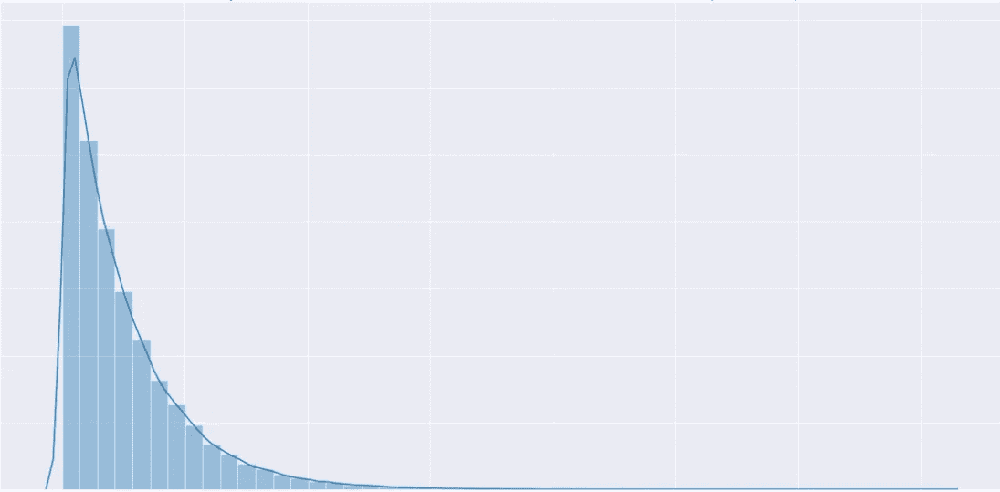
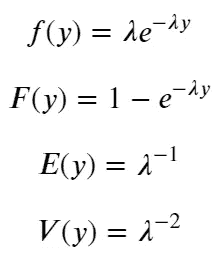
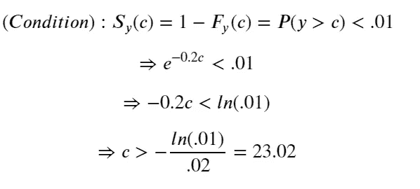
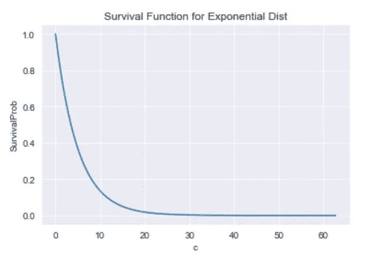

# 基于指数分布数据的实时异常检测

> 原文：<https://towardsdatascience.com/real-time-anomaly-detection-with-exponentially-distrubted-data-205e0df32096?source=collection_archive---------24----------------------->

## 一个简单的算法可以提示你异常活动

# 动机

考虑以下情况:您运营一个网站，允许人们预约他们的医生。在过去的一个月中，您观察到有人每 5 分钟预约一次，但略有不同。然而，在某一天监控预约量时，您发现 10 分钟内没有任何预约。然后 15 分钟。然后 20 分钟。在什么情况下你应该关注并跟进，以确保不存在可能阻止人们预约的问题？

# 衍生物

这是一个常见的统计问题，它来源于对“到达间隔时间”或事件之间的时间的考虑。如果所讨论的事件是相互独立的，并且它们发生的速率在一段时间内是稳定的，那么到达间隔时间是指数分布的。形式上，我们有以下内容:

Exponential PDF, CDF and first two moments

其中 f(y)是 y 的密度函数，y 是到达间隔时间的随机变量。累积分布函数 F(y)表示观察到小于 y 的值的概率。

这是一个非常好的、简单的分布，它将允许我们实时地对观察到的数据做出一些快速的推断。再次考虑上面的例子。我们声明预约之间的平均间隔时间是 5 分钟。所以平均每分钟，我们观察到 0.2 个约会——这是到达率，或者上面指定的模型中的λ。

我们的目标是提出一个阈值，以便在没有预约的情况下经过足够长的时间后，我们将认为不活动是异常的。这个阈值有点武断——就像统计推断中的大多数显著性阈值一样。但是让我们想出一个阈值(c ),使得通过该阈值的概率小于 1%。数学上，这看起来像

这告诉我们，观察到超过 23.02 分钟的到达间隔时间的概率小于 1%。如果我们只考虑这一个事件，我们会认为观察到这个到达间隔时间是罕见的，我们会将其归类为异常值并进行随访。当我们将我们的容忍水平(也称为“生存概率”)从 1%更改为其他值时，我们可以看到阈值是如何变化的:

直觉上，观察到较高到达间隔时间的概率降低。如果我们将容忍度设置为 0.1%，那么我们将有一个 34 分钟的阈值。这个“生存函数”在保险等其他领域有很多应用(想想人寿保险和死亡率)。我们可以看到，从大约 20 分钟开始，概率变得非常小，并且渐近接近于零。这个尾部的值应该让我们停下来研究一下。

现在让我们停下来，思考一下这个结果给了我们什么。这个推导所代表的是观察到单一随机事件的概率。有了足够的数据或事件，这些离群事件就会发生*最终*。这就是指数分布的本质——所有正值都有可能出现。在现实世界中，由于自然限制，这可能不是真的，但它是近似的。这个阈值的推导并没有给我们一个完美识别异常的幻数。这意在引起一些人的注意，并刺激对什么是*可能*异常的调查。或者换句话说，它意味着标记那些不太可能是纯粹随机的结果的事件。

此外，验证之前做出的关于事件独立性和到达率稳定性的假设非常重要。如果其中任何一个不成立，模型就会崩溃。

# 从数学到应用科学

从数学练习到应用的、生产就绪的算法需要几个额外的步骤。整个过程中更重要的部分不是统计数据，而是与生产环境的集成。我不打算深入设置生产管道的血淋淋的细节——无论如何，这些细节中的许多都是特定于上下文的(Azure vs AWS vs Google Cloud 都是不同的)。然而，我提供了一些我发现对这种练习特别重要的细节。

在处理真实数据时，会出现一些实际障碍。如上所述，即使您确信数据是独立的，到达率也很容易随时间而变化。在预约的情况下，潜在的患者行为可以改变，或者新的提供者可以添加到您的网络中，然后更多的患者可以访问在线调度(可能会增加到达率)。此外，到达率可能因一天中的时间甚至一周中的日期而异。在这种情况下，考虑基于这些类型的变量来调节平均值是有意义的。代价是样本量的减少，这也阻止了对平均值的精确估计。

接下来，根据数据的提取方式，真正的实时检测可能是不可能的。如果数据是直接从一些实时流媒体服务中提取的，那么就有可能获得更实时的感觉。然而，如果在您的算法和初始数据源之间有一个 ETL 管道，可能会有很大的延迟。

如果有延误，也不一定是世界末日。视上下文而定，可能根本不重要。例如，如果 ETL 管道每 5 分钟运行一次，并且捕获的数据的平均到达时间为 2 分钟，则以 1%计算的异常将出现在 9:12 分钟标记附近，这意味着算法将在 10 分钟标记处拾取它，增加了 48 秒的检测过程。几乎在任何情况下，这都不应该成为交易的破坏者。你只需要决定什么最适合你的环境。

最后，如果 ETL 备份或失败，一旦 ETL 再次开始运行，这可能会触发算法将事件分类为异常值。显然，这些不是真正的离群值。

如果这些障碍可以避免(或充分处理)，那么算法是简单明了的。核心代码可以用几行代码来概括。只进行一次比较，即(I)自上次事件以来经过的当前时间和(ii)上面推导出的阈值。如果经过的时间大于阈值，则标记该事件；如果不是，那么什么也不做。简单！

# 结论

我们已经走过了一个方法，推导出一个简单的指数分布数据异常检测技术。通过一些基本的假设，一个好的模型和公式可以应用于到达间隔时间，以标记那些预先定义的“太长”的时间。这种方法不是识别实际异常的简单方法，而是识别不太可能偶然发生的事件的方法。

虽然这个讨论的核心是一个数学练习，但实现和相关的障碍是更重要和更实质性的组成部分。这些障碍包括(1)选择包含在模型中的一致准确的到达率，(2) ETL 管道引入实时数据访问的延迟，以及(3) ETL 失败可能在结果中引入假阳性。一旦这些问题得到充分解决，实际的算法就是一个简单的过程。

考虑 1000 个事件的集合。每个都有 1%的概率被归类为异常值。**而非**在整个集合中看到异常值的概率是 0.99⁰⁰⁰= 0.004%，这非常小。换句话说，虽然对于任何给定的事件，可能不太可能观察到异常值，但很可能在足够大的样本中至少会出现一个异常值。