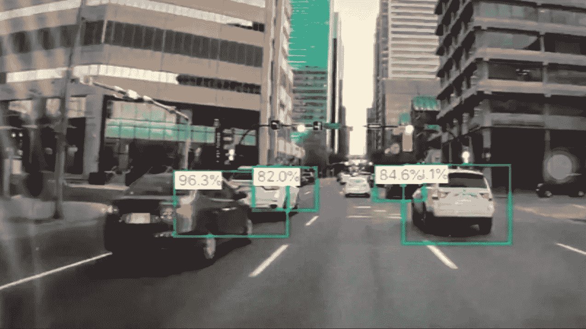
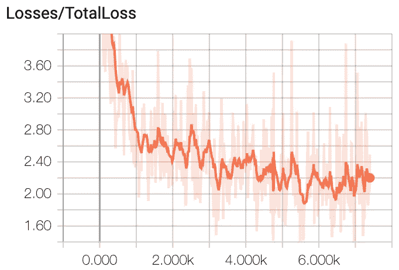
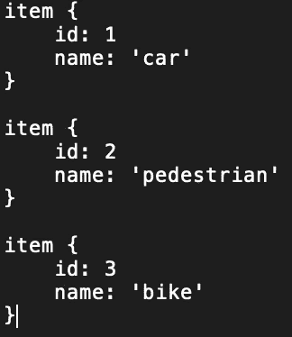
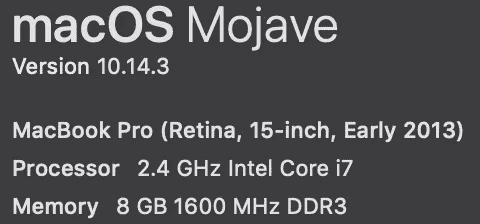

# 使用 Tensorflow 对象检测 API 和 iOS 集成示例进行实时汽车/行人/车道检测

> 原文：<https://towardsdatascience.com/real-time-car-pedestrian-lane-detection-using-tensorflow-object-detection-api-and-an-ios-fbb1b7cbb157?source=collection_archive---------5----------------------->

Prediction with mPA > 80% using ssd_mobilenet_v1_pets.config with pretrained ssd_mobilenet_v1_coco_2018_01_28 nets

Total Loss decrease with respect of optimization steps. 100 training photos and 20 testing photos. Better results can be achieved with more data.

受到其他人在异议检测项目上的工作的启发，例如

1.  [如何使用 TensorFlow 的对象检测器 API](/how-to-train-your-own-object-detector-with-tensorflows-object-detector-api-bec72ecfe1d9) 训练您自己的对象检测器，它演示了如何使用 Tensorflow 的 API 来构建和训练用于对象检测的定制 DL 网络。
2.  [如何构建实时物体识别 iOS app](https://medium.com/@junjiwatanabe/how-to-build-real-time-object-recognition-ios-app-ca85c193865a) ，演示了如何将一个经过训练的 DL net 集成到 iOS app 中。

然后，我真的很想尝试如何使用类似的程序来建立自己的网络，在 iOS 的实时摄像头中检测汽车/行人/自行车(+车道)。结合我之前关于[自适应巡航控制](https://medium.com/@wtlove876/adaptive-cruise-control-with-sensor-fusion-within-matlab-simulink-294aeb24e6e0)的帖子，集成的功能应该真的很有意思。

在我进一步谈论技术细节之前，为了节省你的时间，使用的软件版本必须放在最前面。我在使用 Xcode 7.3 版本的 macOS EI Capitan 时遇到了一些问题，所以在我的尝试中，我不得不将我的系统更新到 Xcode 10.2 版本的 Moyawe。主要问题是我尝试[例 2](http://How to build real-time object recognition iOS app, which demonstrates how integrate a trained DL net into iOS) 的例子时，我 iphone 8 上安装的 app 一直碾压。

Tensorflow 是使用 pip 虚拟环境 1.9.0 版安装的。在我使用 1.8 之前，问题是当我试图冻结用于 iOS 检测 app 的训练图时，它总是失败，并出现错误“non_max_suppression()”。

根据这篇[帖子](https://github.com/csharpseattle/tensorflowiOS)，tensor flow for iOS 版本为 v1.11。我也安装了最新版本，但是[例 2](http://How to build real-time object recognition iOS app, which demonstrates how integrate a trained DL net into iOS) 中的代码无法成功编译。因为我想将周围的框添加到检测到的项目中，所以我必须回到 1.11 版。

如果你想知道更多的细节，请在下面评论，我会试着分享更多我的经验。

# 图片报和培训网

1.  正在准备输入 TFRecord 文件

首先，我从[这里](http://cbcl.mit.edu/software-datasets/streetscenes/)得到合适的数据集。只使用了 120 张图片，100 张用于训练，20 张用于测试。记录的街道快照用于训练。然后我用 labelImg 来标记物体。我的标注地图包含三个项目，如下所示

My model contains three items: car, pedestrian and bike

手动给物品贴标签既无聊又对眼睛有害。所以我建议你使用一些聪明的方法来这样做，比如使用一些[自动注释工具](https://github.com/opencv/cvat)。实际上，这种注释过程也与使用机器学习(ML)技术的对象检测/分割/分类的主题相关。如果我有时间，我会写另一个关于它的故事。

在对来自 100 张训练图片和 20 张测试图片的对象进行人工标记之后，对象在 2D 图片中的位置被保存为 xml 格式。然后，我使用以下两个步骤来获得 TFRecord 格式，它将被直接提供给 TF 训练过程。使用的代码可以从我的 github 下载。有些文件是来自 [Dat Tran](https://towardsdatascience.com/@datitran) 的 github 库的令牌。

*转换图片+xml = > TFRecord 文件*

*   为每个数据集将单独的`*.xml`文件转换为统一的`*.csv`文件。
*   将每个数据集的`*.csv`文件转换为`*.record`文件(TFRecord 格式)。

2.设置培训配置

我目前的目的不是从头构建一个新的网络，而是演示获得定制工作网络的过程。然后我用 TF 发布的 github 的预建配置[SSD _ mobilenet _ v1 _ pets . config](https://github.com/tensorflow/models/tree/master/research/object_detection/samples/configs)。不是从一个完全随机的初始化模型开始，而是采用了一个预先训练好的模型，[SSD _ mobilenet _ v1 _ coco _ 2018 _ 01 _ 28](https://github.com/tensorflow/models/blob/master/research/object_detection/g3doc/detection_model_zoo.md)，以加快训练过程，就像 TF 官网上建议的那样。然后，一些相应的参数设置如下

*   num_classes: 3 *#设置不同标签类别的数量*
*   键入:' ssd_mobilenet_v1' *#设置为您选择的预训练模型的名称*
*   fine _ tune _ check point:" pre-trained-model/model . ckpt "*#预训练模型提取文件路径*
*   TF _ record _ input _ reader {
    input _ Path:" annotations/train . record "*#第一步训练 TFRecord 文件的路径*
    }
    label _ map _ Path:" annotations/label _ map . Pb txt "*#标注地图文件的路径如前*所示
*   TF _ record _ input _ reader {
    input _ Path:" annotations/test . record "*#测试 TFRecord 的路径*
    }
    label _ map _ Path:" annotations/label _ map . Pb txt "*#标签映射文件的路径*

3.TF 培训流程

使用以下命令进行训练过程(注意:—必须用两个减号(-)替换)

> python train . py-logtostderr-train _ dir =。/training/—pipeline _ config _ path =。/training/SSD _ mobilenet _ v1 _ pets . config

Configuration of my laptop

如果遇到一些错误，首先检查输入数据路径和 tensorflow 的版本。训练过程应该持续很长时间。我的训练是在我自己的笔记本电脑上进行的，花了大约 20 个小时/8k 步。通过调查损失，我终止了它，形成了一个用于 iOS 集成的次优模型。对于更精确的模型，必须使用更多的输入图片。训练过程也可以像 [Dat Tran](https://towardsdatascience.com/@datitran) 所做的那样从云中运行。

4.训练数据观察和可视化

Tensorboard 用于即时可视化培训，使用

> *tensor board—logdir[你的日志目录] — host=127.0.0.1*

如果你遇到关于 LC_ALL 的问题，使用下面的命令并重新运行 tensorboard

> export LC_ALL="en_US。UTF-8”
> 
> 导出 LC_CTYPE="en_US。UTF-8”

根据来自终端的弹出信息执行以下操作。因为我对损失很满意，所以我终止了训练并提取了图形。

5.提取/冻结图表

> 输入类型=图像张量
> 
> 管道配置路径=。/training/SSD _ mobilenet _ v1 _ pets . config
> 
> 特训 _ CKPT _ 前缀=。/training/model.ckpt-7265
> 
> EXPORT_DIR=。/frozen_inference_graph
> 
> python ~/tensor flow/models/research/object _ detection/EXPORT _ inference _ graph . py-INPUT _ TYPE = $ { INPUT _ TYPE }-PIPELINE _ CONFIG _ PATH = $ { PIPELINE _ CONFIG _ PATH }-TRAINED _ check point _ PREFIX = $ { TRAINED _ CKPT _ PREFIX }-output _ directory = $ { EXPORT _ DIR }

如果你遇到***【non _ max _ suppression()】***的问题，尝试使用 TF v1.9.0

# 构建 iOS 应用程序

直到现在我有了自己定制的训练图，然后我按照[这篇文章](https://medium.com/@junjiwatanabe/how-to-build-real-time-object-recognition-ios-app-ca85c193865a)的步骤开发一个测试 iOS 应用。没有什么特别的事情发生，但是错误信息可能会再次出现。也看看这个 [github 帖子](https://github.com/csharpseattle/tensorflowiOS)，可能会有帮助。由于代码使用了 iphone 的后置摄像头，所以它不能正确地简单运行 Xcode 内的模拟器。应该特别注意一些设置，尤其是头文件和库的搜索和链接路径。其他技术细节可以从 ios 的 [tensorflow 官方网站上查看。](https://github.com/tensorflow/tensorflow/tree/master/tensorflow/examples/ios)

我的 iOS 应用程序的最终实现示例，不完美，但足够好，可以更进一步。

# 未完待续…

1.  车道检测
2.  网速快一点的，试试 yolo net，不然对一个高速条件没用。
3.  距离计算