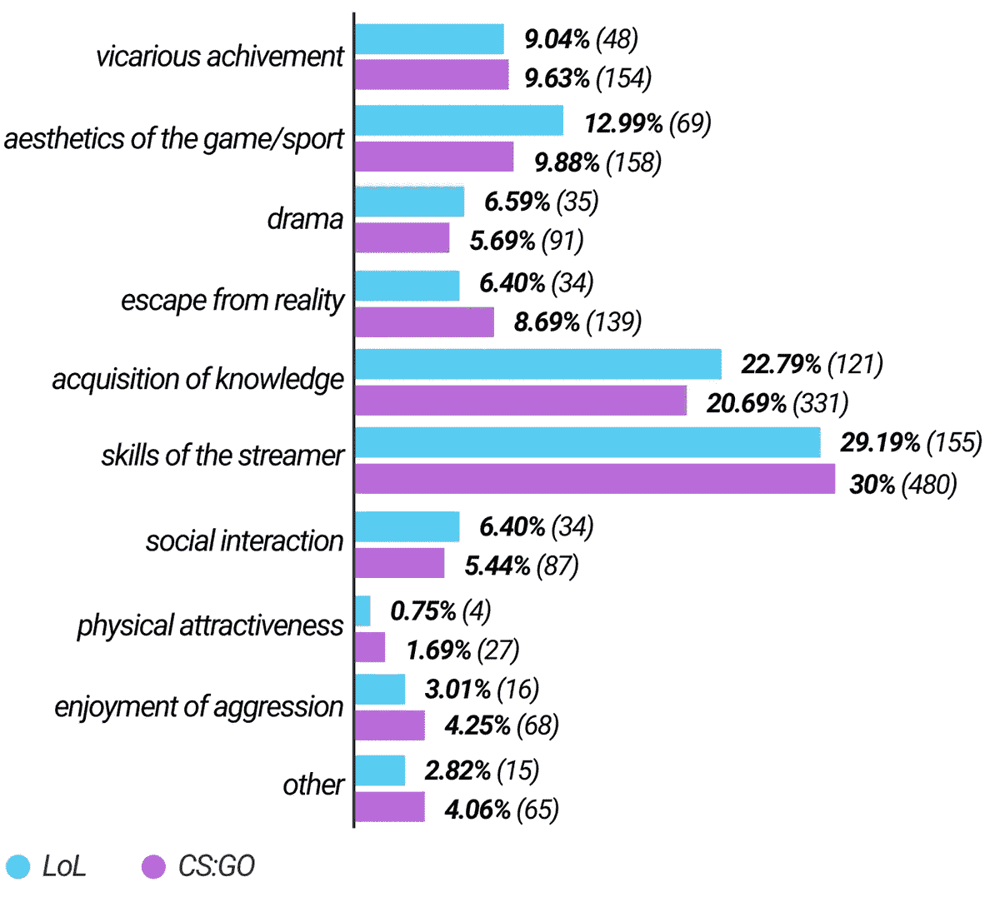
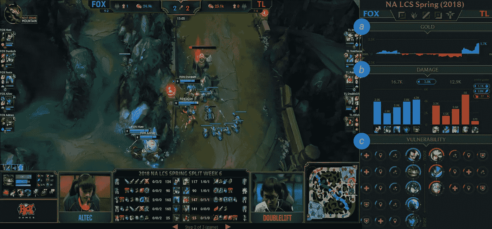
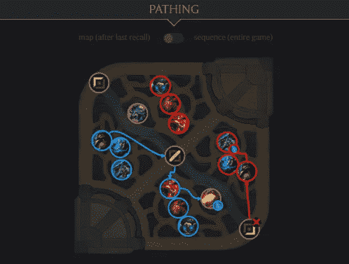
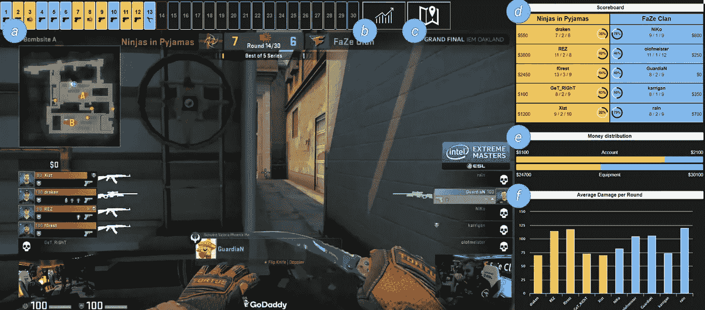
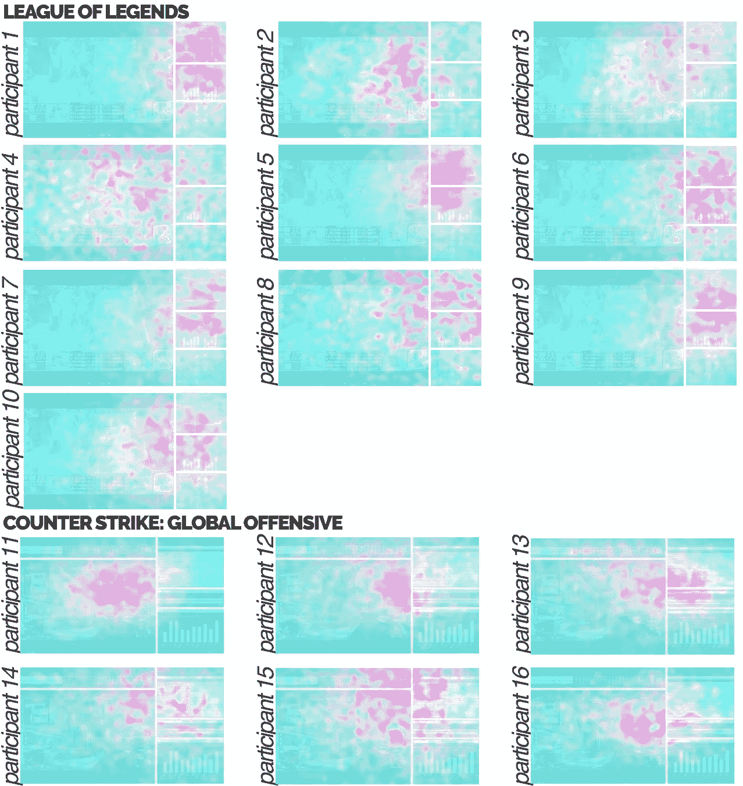

# 支持电子竞技观看的实时仪表盘

> 原文：<https://towardsdatascience.com/real-time-dashboards-to-support-esports-spectating-48cfa1e43274?source=collection_archive---------16----------------------->

## 这一定是我在学术界期间最喜欢的项目。

The League of Legends and Counter-strike: Global Offensive dashboards in action! Read on to learn more.

我的博士学位是通过多个(欧洲和更小的)项目资助的，主题包括学习分析、数字人文和失业。它们很有趣:我设计了桌面、桌面和移动设备上的数据可视化，我研究了用户的感知和体验……所有的乐趣和游戏。

但是不，不是游戏。

我一直对游戏情有独钟。我搬到国外住了两年(并让我的妻子放弃了一份很好的工作),这样我就可以实现梦想，成为一名游戏开发人员(以后再说吧)。将我的研究与游戏相结合是我长久以来的梦想。

唉，没有资金支持这项研究。但是生活总会有办法的，对吧？；)

# 学生来救援

同学们！当然啦！每年我们都有新的工程硕士学生从事有趣(有时很无聊)的硕士论文课题。所以我引入了一个新的:支持观众的电子竞技仪表板。不同玩家在大型战场上的高节奏行动不容易跟上。那么，我们如何帮助观众在职业玩家玩的这些狂热游戏中，更好地实时了解正在发生的事情。

在学生中取得了巨大的成功，但遗憾的是名额有限，两名学生“中了彩票”(我们对此事没有发言权。挺随机的):Hans Cauwenbergh 和 Bram Luycx。

我们很幸运。这被证明是有史以来与学生最好的合作之一。

# 仪表板

汉斯跳上了《英雄联盟》，而布拉姆则接下了《反恐精英:全球攻势》。我们在 Reddit 上设计并设置了几项调查，以深入了解观众的动机和对各场比赛提供的不同统计数据的感知有用性，从而为仪表板的设计提供信息。然后，他们就出发了！

Viewer preferences (167 responses for League of Legends, 596 for Counter-strike: Global Offensive)

## 英雄联盟

a) Gold distribution, b) Damage dealt, c) Vulnerability.

仪表板是五次迭代的结果:两个数字非交互设计，两个交互原型，以及用 React.js 和 D3.js 开发的最终全功能原型。第一次到第四次迭代是使用界面设计工具 Figma 开发的。22 名参与者参与了原型迭代的评估。

主视图分为三个模块:黄金，伤害和脆弱性。所有模块*持续*实时更新。金和伤害相当明显。我来解释一下**漏洞**。

**漏洞**提供了每个玩家有多脆弱的指示。一个简单的线性方程结合了玩家相对于团队其他成员和/或敌人的位置劣势，当前的生命和法力点，防御统计和召唤师法术可用性。这些值被组合并可视化在播放器图标周围，作为一个摘要指示器。这个视图让观众预测游戏的状态。

汉斯还添加了一个有趣的荣格勒可视化:

## 反恐精英:全球攻势

a) Round progression, b) Economy button, c) Map button, d) Scoreboard, e) Money Distribution, f) Average Damage per Round

该仪表板是三次迭代的结果:一个纸质原型，一个使用 Figma 设计的非交互式数字原型，以及一个使用 React.js 和 D3.js 开发的全功能原型。14 名参与者参与了迭代的评估。仪表板由回合进程、经济、地图、记分牌、金钱分配和每回合平均伤害组成。

# 结果

通过半结构化采访和眼球追踪，我们设法进一步了解参与者在使用我们的仪表盘观看这些电子竞技游戏时的感知和体验。它产生了一个有趣的观众仪表盘设计目标列表，我们在澳大利亚墨尔本举行的 2018CHI PLAY 上发布并展示了该列表。

LoL and CS:GO eye tracking results from each participant after the evaluation. The attention heatmap indicates the areas of interest where participants focused more during the whole match.

我不会把这篇容易理解的博客文章变成一篇冗长的科学文章。但是如果你对指南感兴趣，你可以在这里找到[的文章](https://dl.acm.org/citation.cfm?id=3242680)(或者[在我的网站上给我发消息](http://svencharleer.com))。或者浏览下面的幻灯片！

如果有足够的兴趣，我将在 Medium 上发布指南的摘要；)就在评论里告诉我吧！

*汉斯(全职)和我(兼职自由职业者)并没有止步于此，而是在为*[*GRID eSports Gmbh*](https://www.grid.gg/)*工作，在那里，大量的电子竞技数据奇迹正在发生！*

*接下来，我是一名* ***自由职业数据可视化体验设计师/顾问*** *。我是被雇佣的，所以如果你有任何 dataviz 需求，来 svencharleer.com***打个招呼吧！**