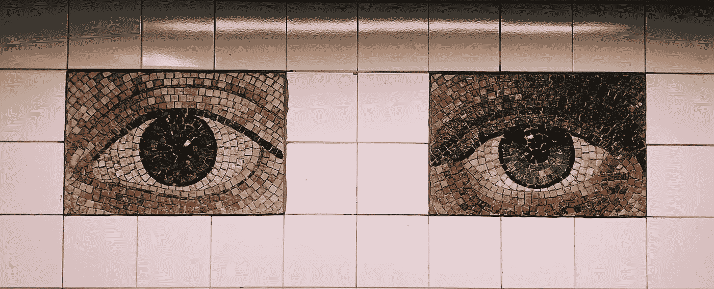
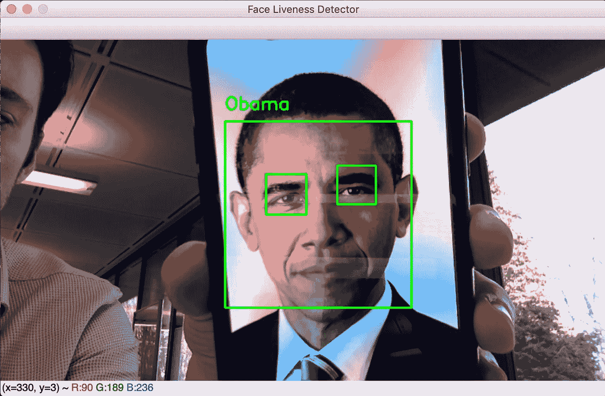

# 基于 Python、Keras 和 OpenCV 的实时人脸活性检测

> 原文：<https://towardsdatascience.com/real-time-face-liveness-detection-with-python-keras-and-opencv-c35dc70dafd3?source=collection_archive---------5----------------------->

Image by [Jon Tyson](https://unsplash.com/@jontyson) from [Unsplash](https://unsplash.com/photos/LCZcQk-47HI).

你在互联网和研究论文上找到的大多数面部识别算法都遭受了照片攻击。这些方法在检测和识别来自网络摄像头的图像、视频和视频流中的人脸方面非常有效。然而，他们不能区分现实生活中的脸和照片上的脸。这种无法识别人脸的现象是由于这些算法是在 2D 框架下工作的。

现在让我们想象我们想要实现一个面部识别开门器。该系统将很好地区分已知和未知的面孔，以便只有授权的人才能访问。尽管如此，不怀好意的人很容易通过仅展示授权人的照片来进入。这就是 3D 探测器，类似于苹果的 FaceID，进入游戏的地方。但是如果我们没有 3D 探测器呢？

Example of photo attack with Obama face ❌ *(Image by author)*

本文的目的是实现一个基于眨眼检测的人脸活性检测算法来抵御照片攻击。该算法通过网络摄像头实时工作，只有当人们眨眼时才会显示他们的名字。通俗地说，程序运行如下:

1.  检测网络摄像头生成的每一帧中的人脸。
2.  对于每个检测到的面部，检测眼睛。
3.  对于每个检测到的眼睛，检测眼睛是睁开还是闭上。
4.  如果在某个时间点检测到眼睛是睁开的，然后闭上，再睁开，我们推断这个人已经眨眼，程序显示它的名字(在面部识别开门器的情况下，我们将授权这个人进入)。

对于人脸的检测和识别，你需要安装 [*face_recognition*](https://github.com/ageitgey/face_recognition) 库，它提供了非常有用的深度学习方法来查找和识别图像中的人脸。特别是， *face_locations、face_encodings* 和 *compare_faces* 函数是 3 个最有用的*。**face _ locations*方法可以使用两种方法*检测人脸:梯度方向的历史程序(HoG)* 和 C *选择性神经网络(CNN)。*由于时间限制选择了 *HoG* 方法。 *face_encodings* 函数是一个预训练的卷积神经网络，能够将图像编码成 128 个特征的向量。这个嵌入向量应该代表足够的信息来区分两个不同的人。最后， *compare_faces* 计算两个嵌入向量*之间的距离。它将允许算法识别从网络摄像头帧中提取的人脸，并将其嵌入向量与我们数据集中所有编码的人脸进行比较。最近的向量应该对应于同一个人。*

## 1.已知人脸数据集编码

在我的例子中，算法能够识别我和巴拉克·奥巴马。我选择了大约 10 张图片。下面是处理和编码已知人脸数据库的代码。

既然我们知道了我们想要识别的每个人的编码，我们可以尝试通过网络摄像头来识别和辨认人脸。但是，在移动到这一部分之前，我们需要区分人脸照片和活人的脸。

## 2.人脸活性检测

提醒一下，我们的目标是在某个时刻检测一个睁开-闭上-睁开的眼睛模式。我训练了一个卷积神经网络来分类一只眼睛是闭着的还是睁开的。所选择的模型是 LeNet-5，该模型已经在[*【CEW】*](http://parnec.nuaa.edu.cn/_upload/tpl/02/db/731/template731/pages/xtan/ClosedEyeDatabases.html)数据集上被训练。它由大约 4800 个大小为 24x24 的眼睛图像组成。

在评估模型时，我达到了 **94%** 的准确率。

每当我们检测到一只眼睛时，我们使用我们的模型预测它的状态，并且我们跟踪每个人的眼睛状态。因此，由于下面的函数，检测眨眼变得非常容易，该函数试图在眼睛状态历史中找到闭-开-闭模式。

## 3.活人的人脸识别

我们几乎拥有了设置我们的“真实”——人脸识别算法的所有元素。我们只需要一种实时检测人脸和眼睛的方法。我使用 openCV 预训练的 Haar-cascade 分类器来执行这些任务。关于 Haar-cascade 人脸和眼睛检测的更多信息，我强烈推荐你阅读 openCV 的这篇伟大的文章[。](https://docs.opencv.org/3.4.3/d7/d8b/tutorial_py_face_detection.html)

上面的函数是用于检测和识别真实人脸的代码。它接受论点:

*   模型:我们的睁眼/闭眼分类器
*   视频捕获:一个流视频
*   人脸检测器:一个哈尔级联人脸分类器。我用了*Haar cascade _ frontal face _ alt . XML*
*   睁眼探测器:一个哈尔级联睁眼分类器。我用了*Haar scade _ eye _ tree _ glasses . XML*
*   左眼检测器:一个哈尔级联左眼分类器。我用的是*Haar cascode _ lefteye _ 2 splits . XML*可以检测眼睛睁开还是闭上。
*   右眼检测器:一个哈尔级联右眼分类器。我用了*Haar scade _ righteye _ 2 splits . XML*可以检测眼睛睁开还是闭上。
*   数据:已知编码和已知名称的字典
*   eyes_detected:包含每个名字的眼睛状态历史的字典。

在**第 2–4 行**,我们从网络摄像头流中抓取一帧，并调整其大小以加快计算速度。在**第 10 行**，我们从帧中检测人脸，然后在**第 21 行**，我们将它们编码成一个 128 维向量。在**第 23–38 行**中，我们将这个向量与已知的人脸编码进行比较，通过计算匹配的数量来确定这个人的名字。具有最大匹配数量的一个被选择。从第 45 行**开始，我们试着从面部框中检测眼睛。首先，我们尝试用*睁眼 _ 眼睛 _ 检测器*检测睁开的眼睛。如果检测器成功，则在**第 54 行**，**，**‘1’被添加到眼睛状态历史中，这意味着眼睛是睁开的，因为 *open_eye_detector* 不能检测到闭着的眼睛。否则，如果第一分类器已经失败，(可能因为眼睛是闭着的或者仅仅因为它没有识别出眼睛)，那么使用*左眼*和*右眼*检测器。面部被分成左侧和右侧，以供相应的检测器进行分类。从**行 92 开始，**提取眼睛部分，并且训练的模型预测眼睛是否闭合。如果检测到一只眼睛闭上，则预测两只眼睛都闭上，并且将“0”添加到眼睛状态历史中。否则就断定是睁眼了。最后，在**行 110** 处，使用 *isBlinking()* 函数检测眨眼，如果此人眨眼，则显示其姓名。**

*注:完整代码可以在*[*my github*](https://github.com/Guarouba/face_rec)*上找到。:)*

Photo attack thwarted using eye-blink detection ✔️ *(Image by author)*

## 参考

*   [https://docs . opencv . org/3 . 4 . 3/D7/d8b/tutorial _ py _ face _ detection . html](https://docs.opencv.org/3.4.3/d7/d8b/tutorial_py_face_detection.html)
*   [https://www . pyimagesearch . com/2018/06/18/face-recognition-with-opencv-python-and-deep-learning/](https://www.pyimagesearch.com/2018/06/18/face-recognition-with-opencv-python-and-deep-learning/)