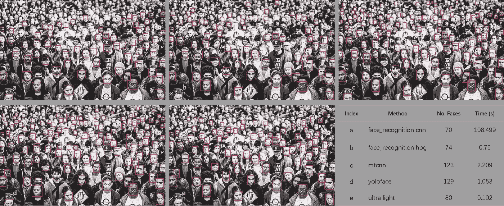

# CPU 实时人脸识别

> 原文：<https://towardsdatascience.com/real-time-face-recognition-with-cpu-983d35cc3ec5?source=collection_archive---------1----------------------->

## **看完这篇文章，你就会明白如何利用预先训练好的模型，用 CPU** 构建实时人脸识别系统。


Static face recognition with system described in this post

学术和工业领域都投入了巨大的努力来开发既快速又准确的人脸识别算法和模型。由于这些努力，现在可以用 CPU 完成多张人脸的准确、实时的人脸识别。

在这篇文章中，我们将使用林扎尔[和 MobileFaceNet 的超轻型人脸检测器构建一个实时人脸识别系统。](https://github.com/Linzaer/Ultra-Light-Fast-Generic-Face-Detector-1MB/blob/master/README_EN.md)

# 人脸检测

为了识别人脸，我们首先需要从图像中检测人脸。有许多方法可以做到这一点。

我已经探索了多种面部检测器。其中包括[人脸识别](https://github.com/ageitgey/face_recognition)包(包含方向梯度直方图(HOG)和卷积神经网络(CNN)检测器) [MTCNN](https://pypi.org/project/mtcnn/) 、 [Yoloface](https://github.com/sthanhng/yoloface) 、 [Faced](/faced-cpu-real-time-face-detection-using-deep-learning-1488681c1602) ，以及最近发布的超轻人脸检测器。

我发现，虽然 Yoloface 具有最高的准确性和最一致的执行时间，但超轻人脸检测器在速度方面是无与伦比的，并产生了相对较好的准确性。



在这篇文章中，我们将使用超轻型探测器。但是如果你有兴趣应用提到的任何其他检测方法，你可以在这里参考我的 Github 库[。](https://github.com/fyr91/face_detection/tree/master)

要使用超轻模型，需要以下 python(python 3.6 版)包:

`onnx==1.6.0``onnx-tf==1.3.0``onnxruntime==0.5.0``opencv-python==4.1.1.26`

使用`pip install`安装所有的依赖项。

准备好环境后，我们可以通过以下代码使用 OpenCV 库从我们的网络摄像头获取帧馈送:

对于我们获取的每个帧，我们需要在模型训练阶段遵循精确的预处理流水线，以实现预期的性能。

由于我们将使用预训练的`[ultra_light_640.onnx](https://drive.google.com/open?id=1EDOJtWE_rnotlHZBRoYvPotRHr9PghxY)`模型，我们必须将输入图像的大小调整为 640x480。如果您使用的是 320 型号，请相应地重新设置。

代码如下所示:

在预处理图像之后，我们将必须准备 ONNX 模型并创建一个 ONNX 推理会话。想了解更多关于模型推断的内容，可以查看这里的[链接](https://blogs.nvidia.com/blog/2016/08/22/difference-deep-learning-training-inference-ai/)。

准备模型和创建推理会话的代码如下所示:

现在是时候用下面的代码检测一些人脸了:

变量`confidences`包含了`boxes`变量中每个框的置信水平列表。一个置信度对的第一和第二值分别指示包含背景和人脸的概率。

由于`boxes`值包含了所有生成的盒子，我们将不得不根据相应的 Jaccard 索引(也称为 Union 上的交集)来识别具有包含面部的高概率的盒子并移除重复的盒子。

获得正确框的代码如下所示:

`predict`函数将接受一个盒子数组，以及每个标签对应的置信度。然后，将执行置信度过滤，以保留所有包含人脸的概率较高的框。

之后，计算每个剩余盒子的交集(IOU)值。最后，使用具有硬 IOU 阈值的非最大抑制来过滤方框，以移除相似的方框。

一旦我们有了过滤框，我们就可以在视频流中绘制和显示:

英特尔酷睿 i7–8550 u CPU @ 1.80 GHz 笔记本电脑网络摄像头的结果:


检测部分的完整代码可以在[这里](https://gist.github.com/fyr91/79aaf4b6d679814406ee4028bd03b7aa)找到。

# 人脸识别

检测到人脸后，下一步是识别它们。面部识别的技术有很多，包括 [OpenFace](https://github.com/cmusatyalab/openface) 、 [FaceNet](https://github.com/davidsandberg/facenet) 、 [VGGFace2](https://github.com/ox-vgg/vgg_face2) 、 [MobileNetV2](https://github.com/xiaochus/MobileNetV2) 等。本文中我们将使用的模型是 MobileFaceNet，它的灵感来自于 MobileNetV2。这个网络架构的细节以及如何训练可以在[这里](https://arxiv.org/abs/1804.07573)找到。

一般来说，识别一张人脸需要三个步骤:(1)数据预处理，(2)人脸特征提取，以及(3)比较目标人脸和数据库中人脸的特征。

## 预处理

我们将使用的数据是吉米·基梅尔采访詹妮弗·安妮斯顿的视频剪辑。我们将拍摄视频片段并提取詹妮弗·安妮斯顿的面部。您可以在相应的文件夹中添加自己的培训数据。

文件结构如下所示:

```
train.py
faces
  --training
    --rachel
      --rachel.mp4
    --...
  --temp
  --embeddings
```

一旦训练数据就绪，我们就可以使用下面的代码对视频剪辑执行人脸提取:

在`boxes`里面抓拍人脸。现在，我们可以从人脸预处理开始。

我们将确定五个面部标志，通过适当的变换对齐面部，并将它们的大小调整为 112x112。

我们将使用`dlib`和`imutils`来完成这些子任务。如果您还没有安装这两个软件包，请使用`pip install`进行安装。

满足要求后，我们需要用下面的代码启动`shape_predictor`(用于面部标志预测)和`FaceAligner`:

`shape_predictor_5_landmarks.dat`用过的可以在这里下载[。`desiredLeftEye`指定你想要提取的人脸的大小。通常该值的范围是从 0.2 到 0.4。值越小，脸就越大。](https://drive.google.com/open?id=1lAFZBh93lbzXEuDWgg6HPv2X0U61e6P9)

下面的代码说明了如何在提取的所有面上应用面对齐并写入文件:

结果:


Eyes are aligned and faces are of similar sizes.

为了使用 MobileFaceNet 模型，需要进一步的预处理。我们必须用 127.5 减去对齐的面，然后用 128 除结果，如论文中所述。

用于如上所述的更多预处理的代码:

## 计算面部嵌入

是时候从预处理过的人脸中获取面部特征了。我们将从加载张量流[模型](https://drive.google.com/drive/folders/1J5NFwdeiamiPofeJsCpcmm46rgdrs5NW?usp=sharing)开始:

接下来，我们将定义网络输入，获取嵌入并保存到 pickle 文件:

## 认出一张脸

要识别人脸，只需加载带有相应标签的嵌入数据集。然后使用欧几里德距离和阈值来确定每个检测到的人脸属于谁。

代码如下所示:

## 最后

让我们看看我们的结果:


Embeddings acquired for six main characters from Friends series

同样，你可以在这里找到完整的代码。

# 摘要

据此，我们创建了一个可以用 CPU 进行实时人脸识别的系统。虽然它的运行速度只有大约 13 FPS，但它比使用复杂的 CNN 要快得多。

然而，我们仍然可以做很多事情来提高这个系统的性能(精度和速度)。潜在地，我们可以应用知识提取来压缩当前模型，并使用低位量化来进一步减小模型大小。此外，我们可以使用其他机器学习分类方法来提高嵌入的准确率。

感谢您的阅读！希望这对您有所帮助。

敬请期待，再见~


## 参考

*[1]:陈，盛，等，“移动人脸识别网:在移动设备上实现准确实时人脸识别的高效细胞神经网络”中国生物识别会议。施普林格，查姆，2018。*

*【2】:桑德勒、马克等《Mobilenetv2:反向残差与线性瓶颈》。IEEE 计算机视觉和模式识别会议录。2018 年*