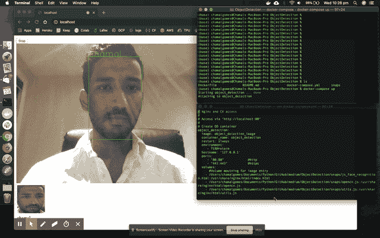
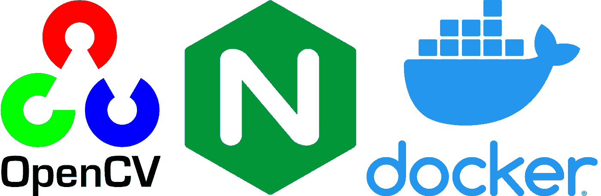

# docker+OpenCV:1 分钟实时面部识别

> 原文：<https://towardsdatascience.com/real-time-facial-recognition-in-1-minute-docker-opencv-e89f281c8f01?source=collection_archive---------11----------------------->

集成 Docker、OpenCV.js 和 Nginx，快速部署实时面部识别机器学习模型。对于 Mac Docker 社区来说，这是一个方便的解决方案，他们正在努力获得网络摄像头的访问，因为 Docker hyper kit 支持的缺点在 Nginx 的帮助下。该解决方案可以很容易地扩展到包括 OpenCV、Keras、Tensorflow 等任何现成的机器学习模型..



**动机:**

1.  虽然推荐从源代码构建 OpenCV.js，但是需要 LLVM-to-JavaScript 编译器和 CMAKE，这相当复杂。
2.  由于 Docker 超级工具包支持的缺点，从 Docker 容器访问 Mac 网络摄像头是不可能的。因此，在 Mac 上部署实时面部识别模型是不可能的。

因此，我决定让任何人在 Docker 的帮助下在几秒钟内部署 OpenCV 模型变得尽可能容易。我通过使用夜间构建克服了**点 1** ，通过使用 Nginx 克服了**点 2** 。这完全是为了让读者熟悉 Docker 的机器学习的**部署**方面，而不是为了建立面部识别的机器学习模型。



**项目结构:**从 **Github repo** 这里[克隆项目](https://github.com/gomesc166/MediumRepo)。

```
. 
├── Version1            
│ ├── Dockerfile                    #Building the image 
│ ├── docker-compose.yml            #Defining the files for mounting    
│ ├── CV                            #OpenCV.js soure code
|    ├──js_face_recognition.html
|    ├──opencv.js
|    ├──utils.js
```

1.  **Dockerfile**

**2。docker-compose.yml**

请更新此文件中项目文件夹的路径。注意 Nginx 服务器被设置为在端口 80 上运行。

docker-compose.yml

**CV 文件夹**驻留了该项目的源代码，包括 OpenCV.js 的夜间构建。我使用了 OpenCV.js [官方网站](https://docs.opencv.org/3.4/d9/df8/tutorial_root.html)的教程中的面部识别代码，也可以从 OpenCV 的官方 GitHub repo 中获得。他们提供的教程真的很有帮助，也是我学习大多数 OpenCV.js 应用程序的地方。

## **第一步:**

```
#Clone the repo 
git clone [git@github.com](mailto:git@github.com):gomesc166/MediumRepo.git#Go to ObjectDetection directory 
cd Version1
```

## **第二步:**

```
#Build the image
docker build -t object-detection-image .
```

## **第三步:**

```
#Start the Container
docker-compose up
```

**注意:**编辑主机上项目的路径。

## **第四步:**

在浏览器上访问 **localhost:80**

单击下载模型按钮。模型下载完成后，您可以添加任意多的人进行识别。如果您想要添加自定义的 Keras/Tensorflow 模型，您必须调整 JS 脚本。

如果您对代码有任何疑问，请留下您的回复，我会尽快回复您。我使用了官方 OpenCV.js 教程中的 JS 脚本。请记住，这篇文章的主要目的是让用户了解如何使用 Docker 轻松部署现成的模型，并克服在 Mac 上使用 Docker hyper kit 的限制。干杯..