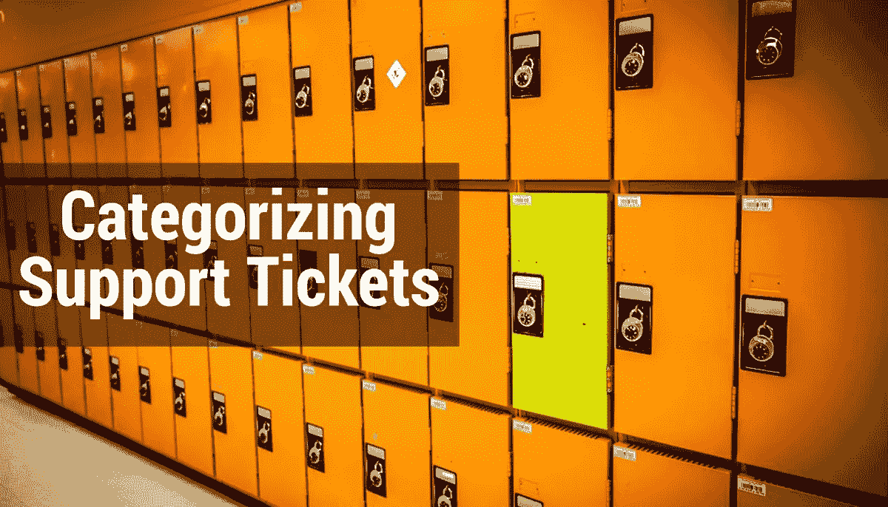
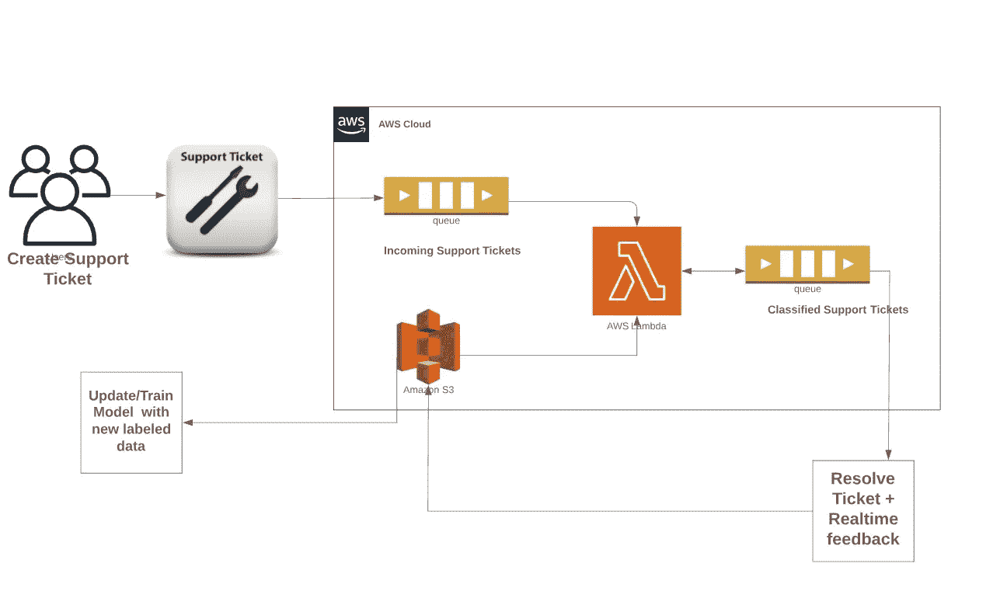
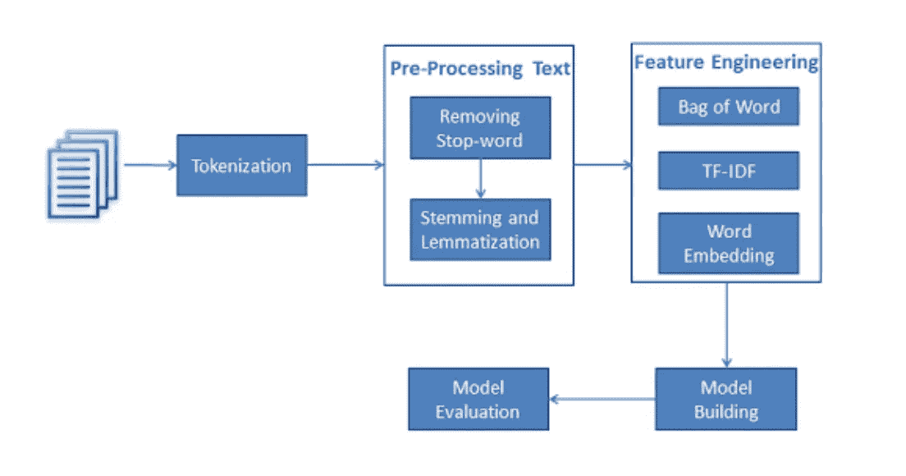
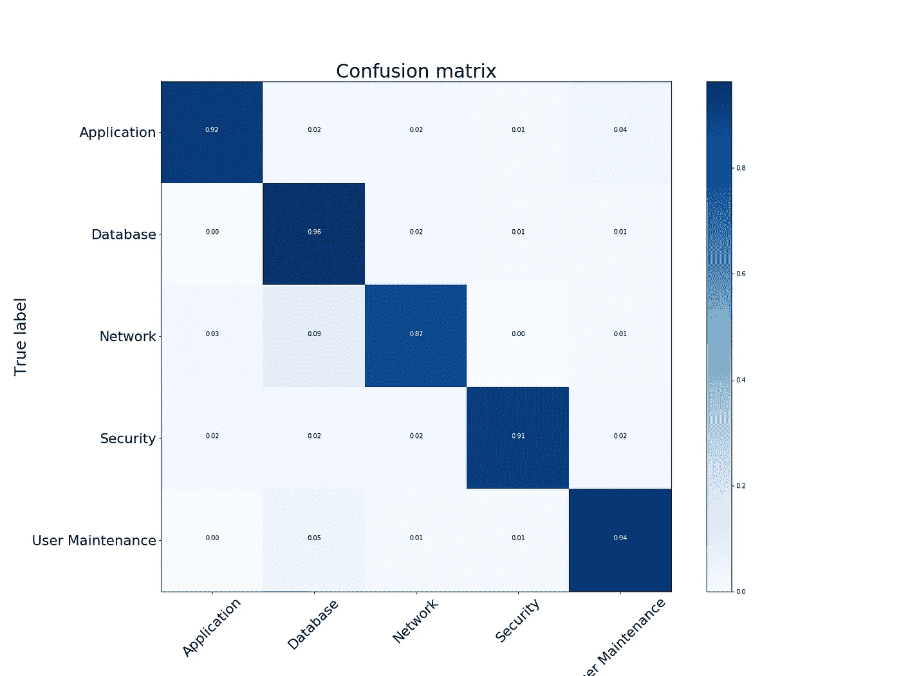
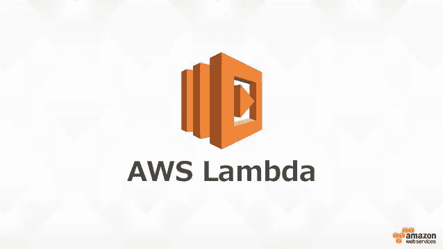
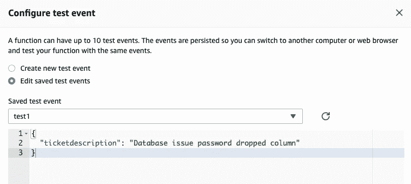
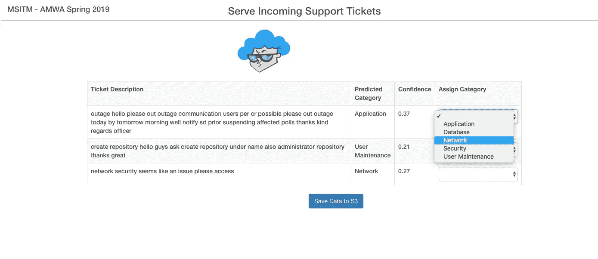

# 通过 AWS 上的用户反馈支持票证分类的端到端数据管道

> 原文：<https://towardsdatascience.com/real-time-it-support-ticket-classification-with-aws-lambda-and-model-retraining-e4cb53814e9?source=collection_archive---------7----------------------->

在 AWS 上建模和部署票据分类器

*团队——Abhilasha kanit kar、Jitender Phogat、Pankaj Kishore*

在本文中，我们将尝试解决一个真实的业务问题。在 IT 界，大多数生产问题都是以 IT 支持票的形式处理的。我们将首先介绍我们用于解决问题的数据集以及我们使用的模型，然后介绍我们如何在 AWS 上部署模型并能够进行实时预测。让我们开始吧。

# 一.动机

有几个平台用于处理支持票并跟踪它们，如 BMC Remedy、ServiceNow 等。每当提出一个问题，就会有人把票分配给他所知道的最相关的团队。

大多数时间票证没有直接分配给负责解决该问题的正确团队，而是在团队之间不断滚动，在到达相关团队之前，其 SLA 就过期了。有时，问题很严重，需要立即补救，这时候就会影响工作效率。

因此，我们想到使用机器学习来解决这个问题，并建立一个平台，该平台将自动为团队分配门票，并具有随着时间的推移进行学习和改进的能力。

这是整个工作流程的样子。

# 二。数据

我们使用了微软的支持票数据集，你可以在这里找到。为了简单和计算限制，我们使用这个[数据集](https://privdatastorage.blob.core.windows.net/github/support-tickets-classification/datasets/all_tickets.csv)的一个子集。想法是有一个完整的框架/工作流程准备就绪，然后我们可以增加系统的复杂性。

# 三。模型

该项目的下一步是建立一个分类器模型，可以将不同的票证分类。我们之前使用 RNN 和 LSTM 做了这个分类，但这次我们选择保持模型简单，因为我们也想将它与 AWS 集成。这是大多数公司遵循的最佳实践，也是从简单模型开始的良好实践。

我们选择多项式朴素贝叶斯模型进行分类。朴素贝叶斯是一组基于应用贝叶斯定理的算法，假设每个特征相互独立，以预测给定样本的类别。它们是概率分类器，因此将使用贝叶斯定理计算每个类别的概率，并且具有最高概率的类别将被输出。

**但是，为什么朴素贝叶斯分类器呢？**

我们在处理 NLP 问题时确实有其他的替代方案，比如支持向量机(SVM)和神经网络。然而，朴素贝叶斯分类器的简单设计使得它们对此类分类器非常有吸引力。此外，在自然语言处理的许多应用中，它们被证明是快速、可靠和准确的。

# 四。数据预处理

对于文本分类，如果你自己通过抓取来收集数据，那么你可能会有一个杂乱的数据集，在应用任何模型之前，你必须付出很多努力来清理它并使它保持良好的形式。在我们的例子中，数据集并没有那么乱，所以我们不需要在这方面投入太多精力。因此，我们执行了以下非常常见但至关重要数据预处理步骤-

1.  **小写并删除停用词** —将整个输入描述转换为小写并删除停用词，因为它们不会给分类添加任何内容
2.  **词汇归类** —这将相同词汇的不同变化组合在一起，如 organize、organizing、organizing 等。
3.  **n-grams —** 使用 n-grams，我们可以计算单词的序列，而不是计算单个单词

为了执行分类，我们必须使用单词包技术以向量的形式表示输入描述。有两种方法可以做到这一点。

1.  计算每个单词在文档中出现的次数
2.  计算每个单词在文档中所有单词中出现的频率

**矢量化(计数矢量化器)**

它对词的频率起作用，即计数记号的出现并建立一个文档记号的稀疏矩阵

**TF-IDF 变压器**

TF-IDF 代表术语频率和逆文档频率。TF-IDF 权重是一种统计度量，用于评估一个单词对集合或语料库中的文档有多重要。重要性与单词在文档中出现的次数成比例增加，但是被单词在语料库中的频率抵消。

词频是一个词在特定文档中的出现频率。

逆文档频率为我们提供了一个术语稀有程度的度量。术语越稀有，IDF 分数越高。

# 动词 （verb 的缩写）模型拟合

现在我们已经准备好了数据，并将多项式朴素贝叶斯拟合到数据中来训练模型。我们创建了一个包含所有预处理步骤的 sklearn 管道，因为我们希望以向量的形式表示新的传入票证描述，这是在模型经过训练后获得的，而不是基于新的描述创建新的票证描述。

> 来自 sklearn.pipeline 导入管道
> 
> text_clf = Pipeline([('vect '，CountVectorizer(ngram_range=(1，2)，stop _ words = stop words . words(' English '))，(' tfidf '，TfidfTransformer())，(' clf '，MultinomialNB())，])

[https://github . com/jitender 18/IT _ Support _ Ticket _ Classification _ with _ AWS _ Integration](https://github.com/jitender18/IT_Support_Ticket_Classification_with_AWS_Integration)

创建模型后，我们在测试数据集上测试了模型性能，我们获得了相当好的 92.167%的准确率。然后，我们将模型导出到 pickle 文件中。

# 不及物动词与 AWS 集成

现在是项目最重要的部分，在 AWS 上部署模型并配置 AWS Lambda 函数进行实时预测。这是我们花了很多时间的地方。

**首先，什么是 AWS Lambda，我们为什么要使用它？**

AWS Lambda 是亚马逊提供的无服务器计算平台。它让我们可以运行代码，而不必担心服务器和资源的供应和管理。当你想运行 lambda 函数时，你必须定义事件触发器，只需上传你的代码，Lambda 就会处理好运行和缩放你的代码所需的一切。lambda 的一个优势是，你只需为代码的计算时间付费，也就是说，只有在代码运行时，你才需要付费，而在代码不运行时，你不需要支付任何费用。

让我们开始这个过程。

**设置一个新的 EC2 实例**

首先设置一个新的 EC2 实例，在这里你将安装所有你的代码(模型)在 Lambda 上运行时将会用到的库。设置新 EC2 实例的原因是，您将从头开始配置 python 环境并安装所有需要的库。

一旦你完成，你将压缩整个 python 环境以及你将在 Lambda 上运行的代码，并将其下载到你的本地机器，然后我们将把它上传到亚马逊 S3 桶。Lambda 函数将使用这个 zip 文件来执行。

每当发生调用 Lambda 函数的事件时，它将使用您指定的 zip 文件来执行。比方说，在事件上，我指定我将运行已经在 zip 文件中的 sample.py，然后 Lambda 函数将在该 zip 文件中寻找它需要的一切(python 环境和运行代码所需的库),如果缺少什么，那么代码的执行将会失败。

[https://github . com/abhilasha 23/awsdata piline/blob/master/forlambdamlmodel . py](https://github.com/abhilasha23/AWSDataPipeline/blob/master/ForLambdaMLModel.py)

**创建一个 Lambda 函数**

一旦你准备好了 S3 水桶的压缩文件。然后你可以创建一个新的 Lambda 函数。

点击创建函数并提供一个有意义的名称，在运行时选择 Python 3.6，并可以选择最适合您需求的权限。

转到你的 lambda 函数，在函数代码部分，你必须上传一个 zip 文件，或者你可以指定在 S3 桶上存储的 zip 地址，如截图所示。

仅供参考—在屏幕截图中，函数是代码文件名(Function.py ),处理程序是将运行的文件中定义的方法名。

Specify the path of S3 link for the zip file

**测试你的代码**

您可以测试您的代码是否正确运行。单击右上角的测试选项卡，并配置一个测试事件。你可以传递你的代码需要的输入，然后你可以看到你的代码是否正在运行。

如屏幕截图所示，我们传递描述并运行代码。如果您使用我们的代码来尝试，那么您必须取消注释第 29 行，它将读取测试描述，并注释第 30 行，它从 AWS 队列读取输入，我现在将对此进行解释。

**AWS SQS(简单队列服务)**

通过从设计器选择框中选择 SQS 来创建 SQS 服务。这很简单。在这个 SQS 中，我们配置了两个队列。一个是将输入传递给 lambda 函数，我们在这个队列上有一个事件触发器，这意味着每当这个队列中有新消息时，它就会触发 Lambda 运行。

第二个是输出队列，它将显示输入消息的预测值。

Input and output queue

选择输入队列，并从队列操作中选择“发送消息”。单击提交按钮后，将触发 Lambda 函数，您的代码将运行并进行预测，然后将其写入输出队列。

正如您在屏幕截图中看到的，输出队列中可用的消息是 7，输入是 0，这意味着输入队列中没有新消息，您的 lambda 函数没有运行您的代码。

# 七。重新训练模型的用户反馈

我们创建了一个简单的 angular JS UI 来获取用户反馈。用户反馈的想法是，无论分类票正确与否，都要得到用户的认可。如果分类票是错误的类别，那么用户可以选择从下拉列表中选择正确的类别，并点击保存，这将把文件保存到 S3 桶。我们将使用这个文件定期重新训练我们的模型。

为此，我们设置了另一个 Lambda 函数，您可以根据需要安排它每天或每周运行。它将使用模型 pickle 文件来读取模型，重新训练模型并修改 pickle 文件。

# **结论**

AWS Lambda 是可伸缩模型的一个非常好的选择，因为您不必担心服务器的供应和管理。它很容易部署模型，并根据您的需求自动扩展所需的资源，您只需在代码运行时付费，因此非常划算。

## GitHub 链接:

[https://github . com/jitender 18/IT _ Support _ Ticket _ Classification _ with _ AWS _ Integration](https://github.com/jitender18/IT_Support_Ticket_Classification_with_AWS_Integration)