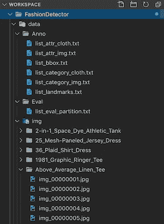

# 基于张量流的实时移动视频对象检测

> 原文：<https://towardsdatascience.com/real-time-mobile-video-object-detection-using-tensorflow-a75fa0c5859d?source=collection_archive---------6----------------------->

## 全栈数据科学

## 向您的下一个移动应用程序添加对象检测的分步指南


Photo by GeoHey

随着人们对自动驾驶汽车、人脸识别、智能交通系统等计算机视觉用例的兴趣日益增加。人们正在寻求建立定制的机器学习模型来检测和识别特定的对象。

然而，从零开始构建定制模型需要大量的专业知识、时间和计算资源——从数据标注到模型服务。为了减少障碍，谷歌发布了开源工具，如[tensor flow Object Detection API](https://github.com/tensorflow/models/tree/master/research/object_detection)和 [Tensorflow Hub](https://www.tensorflow.org/hub) ，使人们能够利用那些已经广泛使用的预训练模型，如更快的 R-CNN、R-FCN 和 SSD，使用迁移学习快速构建定制模型。

本文将展示我们如何使用 TensorFlow 的对象检测 API 来训练实时视频对象检测器，并通过以下步骤将其快速嵌入到我们自己的移动应用程序中:

1.  设置开发环境
2.  准备图像和元数据
3.  模型配置和培训
4.  将定型模型转换为 TensorFlow Lite
5.  在移动应用程序中测试模型

# 设置环境

本文中的所有代码都基于 macOS & Linux 系统。对于 Windows 用户，你可以在 [docker](https://hub.docker.com/r/tensorflow/tensorflow/) 容器中工作:

或者安装 [Windows 子系统用于 Linux](https://docs.microsoft.com/en-us/windows/wsl/install-win10) (由于主机硬件隔离，这个不支持 TensorFlow GPU)。

对于 VS 代码用户来说，remote [WSL](https://code.visualstudio.com/docs/remote/wsl) 和 [Containers](https://marketplace.visualstudio.com/items?itemName=ms-vscode-remote.remote-containers) 的扩展也给出了更好的开发体验，应该完全兼容本文中的脚本。

## 设置项目目录

为了便于阅读，我们将在主项目目录中创建三个子文件夹:


**数据—** 存储模型数据的文件夹(如*。记录，*。csv 等。)

**模型—** 存储所有预训练模型及其配置文件的文件夹。

**tf-models —** 一个文件夹，其中包含来自 Tensorflow 的克隆模型代码，我们将在建模中使用这些代码。

使用下面的脚本复制上面的项目文件夹结构。

## 安装 Tensorflow 对象检测 API 和依赖项

一旦我们有了项目设置，Tensorflow 对象检测 API 现在应该位于`rf-models/research/object_detection`中，代码库目前由社区维护，稍后我们将从那里调用模块进行模型训练。

> (可选)对于 Tensorflow 对象检测 API 代码基础之上的任何进一步工作，请查看`model_main.py`和`model_lib.py`作为起点。

现在我们需要安装其余的依赖项。要安装所需的 python 库:

安装 [COCO API](https://github.com/cocodataset/cocoapi)

> 注意:如果您在编译 COCO API 时遇到问题，请确保在编译之前已经安装了 Cython 和 Numpy。

安装 [Protobufs](https://github.com/protocolbuffers/protobuf) — Tensorflow 对象检测 API 使用 Protobufs 来配置模型和训练参数。

**向 PYTHONPATH 添加 Tensorflow 库**

在本地运行时，`rf-models/research/`和`rf-models/research/slim`目录需要追加到 PYTHONPATH 中，以便将来自 TensorFlow 对象检测 API 的 python 模块添加到搜索路径中，它们将在稍后阶段从模型脚本中被调用。

> 注意:上述脚本需要在每个新的终端环境中运行。或者，您可以添加您的~/。以绝对路径作为永久解决方案的 bashrc 文件。

## 测试安装

要测试一切是否按预期运行:

您应该会看到如下测试输出:


# 准备图像和元数据

## 下载图像数据

我们使用的图像数据来自香港中文大学多媒体实验室创建的 DeepFashion 数据库。这是一个大规模的服装数据库，拥有超过 800，000 张不同的时尚图片，从造型优美的商店图片到无拘无束的消费者照片。

数据库中的所有图像都被标注了丰富的信息，包括 50 个不同的类别，1000 个描述性属性，边界框和服装标志。

特别地，我们使用“类别和属性预测基准”类别作为时尚对象检测任务的训练数据。


Photo by DeepFashion

在这里下载数据( [Google Drive](https://drive.google.com/drive/folders/0B7EVK8r0v71pWGplNFhjc01NbzQ) )并将它们解压到我们项目目录下的`data`文件夹中。完成后将有三个子文件夹:



**彦俊** —标注包括包围盒标签、时尚地标标签、服装类别标签、服装属性标签。

**Eval**—分别用于训练、验证和测试集的图像名称。

**img**—289222 张多样的服装图片。(为了加快开发速度，我们在本文中使用低分辨率图像)

## 我们先来看看数据

我从数据集中随机挑选了一些图像，并用它们的边框打印出来。


> 注意:由于 DeepFashion 数据库已经提供了边界框标签，我们不需要标记数据，而如果你想为其他图像创建自己的标签，或者改进当前的标签(正如我们在上面的图像中看到的，一些边界框的质量并不完美。 [**LabelImg**](https://github.com/tzutalin/labelImg) 将是那些工作的工具之一。

我们还将使用图像元数据的聚合视图为训练集和测试集创建汇总表。汇总表将在稍后阶段用于为模型训练生成建模数据。


summary table — training set

可视化上述图像并生成汇总表的 python 脚本可以在这里找到 [Jupyter 笔记本](https://github.com/ivanliu1989/Real-time-Mobile-Video-Object-Detection/blob/master/generate_summary_table.ipynb)。因此，我们现在在`data`文件夹中有了汇总表(`train_labels.csv` & `test_labels.csv`)。

> 注意:为了简化工作，您将在笔记本中看到我们只选择了前 6 个常用类别。

## 生成 TF 记录

为了高效地读取数据，TensorFlow 使用 TFRecord 格式，这是一种存储二进制记录序列的简单格式。它对数据进行序列化，使它们能够被线性读取，如果数据是通过网络传输的，这一点尤其正确。

为了将图像数据转换为 TFRecord 格式，我们将使用以下 python 模板，并将我们创建的汇总表作为参考:

> 注意:通过为新标签更新 class_text_to_int()，我们可以为其他数据集使用相同的模板。

一旦执行完成，你会在`data`文件夹下看到两个新文件，分别命名为`test.record`和`train.record`。

## 生成标签地图

我们现在需要创建一个标签映射，即将每个使用的标签映射到一个整数值。训练和推理过程都将使用标签映射。

上面的脚本给了我们一个名为`label_map.pbtxt`的新文件。如果我们想引入额外的新标签，我们需要相应地更新它。

现在，我们已经在`data`文件夹中准备好了所有需要的文件。

# 模型配置和培训

## 下载预先训练的模型

正如我们在开始时提到的，我们将使用预训练模型，而不是从头开始设计模型，[检测模型动物园](https://github.com/tensorflow/models/blob/master/research/object_detection/g3doc/detection_model_zoo.md)收集广泛使用的预训练模型的列表。

例如，我们将使用 SSD mobilenet 量化模型，该模型针对移动设备性能进行了优化，降低了模型推理的复杂性(同时牺牲了一些模型性能)。

模型文件将保存在如下的`models`文件夹下。


我们需要了解的一些文件是:

*   **model.ckpt** —您的模型(预训练模型/部分训练模型)的检查点，带有用于进一步训练的估计器。
*   **pipeline.config** —模型、训练数据、评估数据等的配置。

## 更新模型管道配置

`pipeline.config`中有五个主要部分*。**模型*部分定义了网络的预设计架构。 *train_config* 部分定义模型训练参数，为我们提供调整参数的灵活性，如批量大小、学习速率、学习步骤等。

```
model {
(... Add model config here...)
}

train_config : {
(... Add train_config here...)
}

train_input_reader: {
(... Add train_input configuration here...)
}

eval_config: {
}

eval_input_reader: {
(... Add eval_input configuration here...)
}
```

对于我们的试验，我们将模型配置和超参数保留为默认值，仅更新以下配置:

*   数量类 : 6
*   **微调检查点**:检查点文件的路径`model.ckpt`
*   **label_map_path** :上面创建的`label_map.pbtxt`的路径
*   **tf_record_input_reader** :上面创建的`train.record`和`test.record`的路径

## 模特培训

接下来，为了初始化训练，我们现在可以直接使用来自 TensorFlow 对象检测 API 的建模脚本:

训练开始后，我们应该会在下面的控制台中看到训练进度日志。


此外，我们还可以使用 tensorboard 根据可视化的性能指标和验证集对训练步骤的预测来持续监控进度。


> 注 1:如果在训练过程中出现内存不足错误，请尝试减少`*pipeline.config*`文件中训练步骤的批量。
> 
> 注 2:我们可以随时停止训练，稍后通过更新`*pipeline.config*`中的`*fine_tune_checkpoint*`从任何检查点继续。作为一个例子，你可以在这里找到我部分训练的模型检查点[。](https://github.com/ivanliu1989/Real-time-Mobile-Video-Object-Detection/tree/master/models/ssd_mobilenet_v2_quantized_300x300_coco_2019_01_03)

# 转换为 TensorFlow Lite

一旦我们有了一个经过训练/部分训练的模型，要为移动设备部署该模型，我们需要首先使用 [TensorFlow Lite](https://www.tensorflow.org/mobile/tflite/) 将该模型转换为一个针对移动和嵌入式设备优化的轻量级版本。它支持设备上的机器学习推理，具有低延迟和更小的二进制大小。它使用像量化核这样的技术来实现更小更快的(定点数学)模型。

> 目前仅支持 SSD 型号。目前不支持 faster_rcnn 这样的模型。

## 安装 Bazel 并生成冻结图

我们需要首先安装 Bazel 构建工具(对于不同的操作系统，请参考[安装指南](https://docs.bazel.build/versions/master/install.html))。

Bazel 安装完成后，我们将选择最新的检查点，以获得 TensorFlow 冻结图，该图具有兼容的操作，可以与 TensorFlow Lite 一起使用。要获得冻结图，我们可以直接从`tf-models/research`使用模板脚本`export_tflite_ssd_graph.py`。

> 注意:这是为了简单起见，我们应该总是检查模型评估来决定最佳的检查点/步骤。

这将给我们指定输出目录(`/tmp/tflite`)中的两个文件(`tflite_graph.pb` & `tflite_graph.pbtxt`)。


之后，我们将使用 TensorFlow Lite 优化转换器[到](https://github.com/tensorflow/tensorflow/tree/master/tensorflow/lite/toco)从 TensorFlow 冻结图源文件(`tflite_graph.pb`)中获取优化的模型。我们将通过运行下面来自`tensorflow`目录的脚本，为更好的移动性能生成一个量化模型。

如果脚本运行成功，您现在应该会在`/tmp/tflite`目录下看到一个新文件— `detect.tflite`。该文件包含图表和所有模型参数，可通过 Andriod & iOS 设备上的 TensorFlow Lite 解释器运行。

# 在移动设备上运行 TensorFlow Lite 模型

现在，我们剩下的最后一步是将我们的模型嵌入到我们的移动应用程序中，这应该很简单，因为 TensorFlow 已经提供了示例应用程序，使人们更容易测试模型。

要下载示例应用程序代码并以 ios 为例:

> 注意:构建 iOS 应用程序超出了本文的范围，本质上，上面的脚本是安装 Podfile 中列出的 iOS 应用程序的所有依赖项。一旦脚本完成，就会在`ios`目录下创建一个`*.xcworkspace`文件。

实际模型文件保存在`ios/ObjectDetection/Model`下，其中包含模型文件(`detect.tflite`)和一个标签映射文件。我们需要从我们的模型中覆盖模型文件和标签映射。

接下来，要构建应用程序:

1.  在 Xcode 中打开`ObjectDetection.xcworkspace`。
2.  首次编译应用程序时，请更新捆绑包标识符，并在“常规->签名”中选择您的开发团队。
3.  将您的移动设备连接到笔记本电脑
4.  在 Xcode 中构建并运行应用程序。


一旦项目建立，应用程序现在应该在您的移动设备上运行，并测试我们的模型执行得有多好！


# 下一步是什么

到目前为止，我们已经完成了使用实时视频对象检测的自定义模型创建 iOS 应用程序的过程，这也是一个很好的起点，可以通过利用一些现有的预训练模型来快速原型化这些想法。

可以通过以下方式进一步实施应用程序:

*   手动标记原始图像数据以获得训练集的更好质量(例如，标记如下 **)**


*   模型选择和超参数调整以获得更好的模型性能。
*   将应用容器化，并利用云服务(例如 TPU)进一步扩展建模。

[**GitHub**](https://github.com/ivanliu1989/Real-time-Mobile-Video-Object-Detection) 资源库为教程。

# 参考

[](https://www.tensorflow.org/lite/examples) [## TensorFlow Lite 示例| TensorFlow

### 面向移动和嵌入式设备的 TensorFlow Lite

www.tensorflow.org](https://www.tensorflow.org/lite/examples) [](https://tensorflow-object-detection-api-tutorial.readthedocs.io/en/latest/training.html#training-the-model) [## 培训自定义对象检测器- TensorFlow 对象检测 API 教程文档

### 所以，到目前为止你应该已经做了以下事情:现在我们已经做了以上所有的事情，我们可以开始做一些酷…

tensor flow-object-detection-API-tutorial . readthedocs . io](https://tensorflow-object-detection-api-tutorial.readthedocs.io/en/latest/training.html#training-the-model)