# 使用深度学习的人脸属性检测

> 原文：<https://towardsdatascience.com/real-time-multi-facial-attribute-detection-using-transfer-learning-and-haar-cascades-with-fastai-47ff59e36df0?source=collection_archive---------11----------------------->

## 一个快速的 4 部分演练，通过使用深度学习进行实时多面部属性检测(ResNet50 与 FastAI & Pytorch)，使用 Haar 级联进行面部检测和定位(OpenCV)。

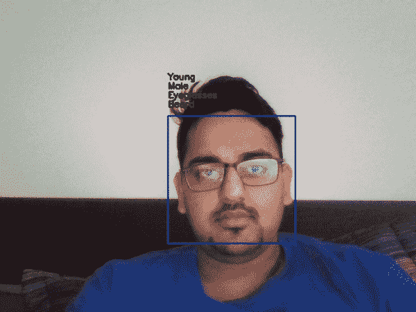

The final output of the multi facial attribute detection project.

在这篇文章中，我们试图达到上述结果。这篇文章用一个端到端的过程来指导我如何构建它。复制项目的全部代码都在我的 [GitHub 库](https://github.com/aayushmnit/Deep_learning_explorations/tree/master/7_Facial_attributes_fastai_opencv)中。

# 第 1 部分—数据采集和理解

对于任何深度学习模型来说，要给出合理的准确率，我们都需要依赖大量的标注数据。我发现大多数关于面部特征检测的报告都只集中在多类分类上，如情感检测、微笑检测等。我在寻找一个带有多个标签的面部图像数据集，这样我就可以实现一个[谷歌视觉 API](https://cloud.google.com/vision/) 实现的东西，如下所示—

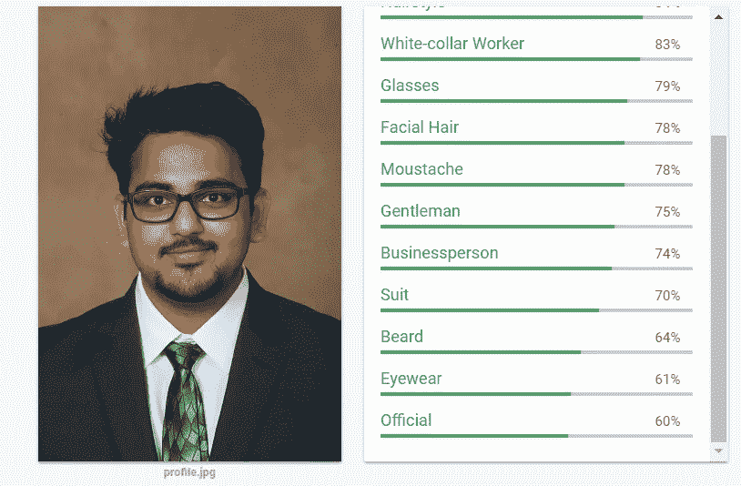

Example of a facial detection output from Google vision API

为此，我在 [Kaggle 数据集网站](https://www.kaggle.com/datasets)上找到了一个名为[CelebA 属性(CelebA)数据集](https://www.kaggle.com/jessicali9530/celeba-dataset)的数据集，其中包含-

*   202，599 个各种名人的面部图像
*   10，177 个独特的身份，但没有给出名人的名字
*   每个图像 40 个二元属性注释
*   5 个地标位置

对于处理计算机视觉中的各种令人兴奋的问题来说，这是一个相当不错的数据集，因为我只对面部图像和这些图像的 40 个二进制属性注释感兴趣。这里列出了 40 个二元属性(是/否)——5 点钟形阴影、拱形眉毛、迷人、眼袋、秃头、刘海、大嘴唇、大鼻子、黑发、金发、模糊、棕色头发、浓密的眉毛、胖乎乎的、双下巴、眼镜、山羊胡、灰色头发、浓妆、高颧骨、男性、嘴巴微张、小胡子、窄眼睛、无胡须、椭圆形脸、苍白的皮肤、尖鼻子、后移的发际线这里有一个例子-


Example from CelbeA dataset

上面的图片标注了这些特征——拱形眉毛，迷人，大嘴唇，浓妆，窄眼睛，没有胡子，尖鼻子，涂着口红，年轻。因为雄旗是假的，我们可以说标签是雌的。

# 第 2 部分—数据预处理

数据预处理的全部代码都在[这个笔记本](https://github.com/aayushmnit/Deep_learning_explorations/blob/master/7_Facial_attributes_fastai_opencv/Data_prepration.ipynb)里。

**2.1)在图像上-**

当我为 CelebA 数据集进行数据处理时，我的主要想法是考虑如何使用建立在真实视频/网络摄像头流/图像上的模型。CelebA 数据紧密地裁剪在脸部周围，但是在视频/网络摄像头/图像中，脸部可以在任何地方，并且必须首先被检测到。有许多预先构建的工具可以在图像中定位人脸，例如[人脸识别](https://github.com/ageitgey/face_recognition)，它使用深度学习网络来检测人脸。我想保持这一步简单，所以我使用了[哈尔级联](https://docs.opencv.org/3.3.0/d7/d8b/tutorial_py_face_detection.html)，这是一种传统的计算机视觉方法来检测物体。Haar cascade 返回检测到人脸的图像上的边界框坐标，下面是使用 Haar cascade 的输出示例

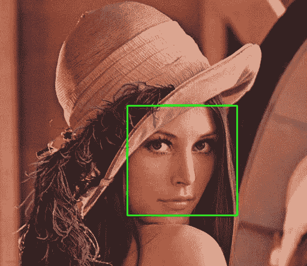

An example of Haar Cascade output.

要了解更多关于哈尔瀑布的信息，请参考[这篇博客](/face-detection-for-beginners-e58e8f21aad9)。 [OpenCV](https://docs.opencv.org/3.3.0/index.html) 中有[预置的 haar 级联](https://github.com/opencv/opencv/tree/master/data/haarcascades)滤镜。我用其中一个进行正面人脸检测。因此，一旦决定了人脸检测的方法，下一步就是在 CelebA 数据集上应用相同的方法来检测人脸，并只裁剪图像的面部区域(增加一些边距)，这一步将有助于确保

*   我们使用 Haar 级联来移除正面人脸未被检测到的任何人脸，例如人侧脸的情况
*   这将确保我们的训练图像符合模型的实际使用

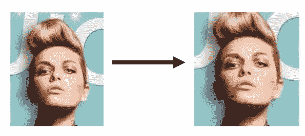

Example of Haar cascade processing on CelebA dataset

请注意，在上面的例子中，在哈尔级联裁剪后，左边的图片被转换为右边的图片(看起来更放大了)。我们还从 202，599 张图像过滤到 175，640 张图像，因为过滤后的图像不包含正面人脸。过滤后的图像示例如下-

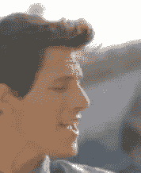

Example of a filtered image.

**2.2)在标签文件上-**

除了对图像进行预处理，我们还需要创建我们的标签文件，供 FastAI 数据集加载器使用。

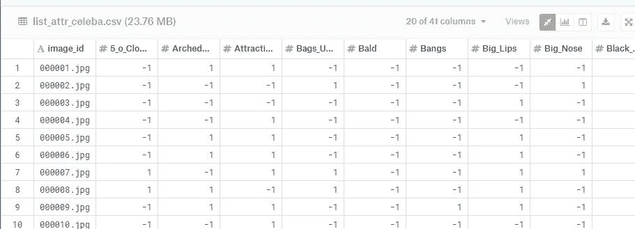

Original label file

在原始标签文件中，多属性标签每 40 个属性包含 1 /-1 个值，其中 1 表示该特征是否存在，而-1 表示该特征不存在。我只是写了一个简单的函数来转换这个文件，这样我们只有一个标签列，用空格分隔标签(如下图)

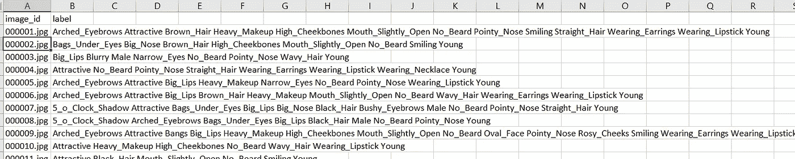

Modified Label file

# 第 3 部分—模型培训

一旦我们预处理了我们的数据，下一步是建立一个模型，它可以检测给定面部图像的 40+个属性。为此，我们将使用由 [Pytorch 1.0](https://pytorch.org/) 编写的 [FastAI](https://docs.fast.ai/) v1 库。模特训练笔记本可以在我的 [Github 这里](https://github.com/aayushmnit/Deep_learning_explorations/blob/master/7_Facial_attributes_fastai_opencv/MultiClass%20classification%20on%20CelebA%20dataset%20using%20FastAI.ipynb)找到。我根据对图像编号的建议划分，从 1–182637(用于训练)到 182638(用于验证)对训练和验证集中的数据进行了划分。在 FastAI 库中用几行代码训练世界级的模型是不可思议的容易，所以让我们来看看代码-

**锅炉钢板库导入命令—**

```
**import** **pandas** **as** **pd**
**import** **numpy** **as** **np**
**from** **fastai.vision** **import** *
**import** **matplotlib.pyplot** **as** **plt**
```

**数据集加载**

```
path = Path('../data/celeba/faces/')
*## Function to filter validation samples*
**def** validation_func(x):
    **return** 'validation' **in** xtfms = get_transforms(do_flip=**False**, flip_vert=**False**, max_rotate=30, max_lighting=0.3)src = (ImageItemList.from_csv(path, csv_name='labels.csv')
       .split_by_valid_func(validation_func)
       .label_from_df(cols='tags',label_delim=' '))data = (src.transform(tfms, size=128)
       .databunch(bs=256).normalize(imagenet_stats))
```

*第 1 行* —定义数据集文件夹的路径。

*第 2–4 行* —定义我们将如何找到训练和验证图像。

*第 6–7 行* —定义我们想要对数据进行的变换，例如将图像随机旋转最大 30 度，以及最大 0.3 的光照调整。

*第 8 行* —将图像定义为标签 CSV 中的项目列表

*第 9 行* —使用第 2–4 行的验证函数拆分训练和验证中的数据

*第 10 行* —帮助我们从 labels.csv 的 tags 列获取标签，并帮助我们定义它是一个多标签列，其中用空格分隔标签。

*第 12 行* —传递第 6–7 行的转换函数，将图像大小调整为 3*128*128

*第 13 行* —定义 256 张图像的批量大小，并使用 ImageNet 平均值对数据进行标准化

请注意，我们使用较小的图像大小进行模型的初始训练，稍后我们将图像大小增加到 3*256*256。这个技巧通过允许更大的批量帮助我们更快地训练我们的模型，并且更快地试验什么模型配置有效。

**模型定义—**

在本次建模练习中，我们将使用预先训练好的 ResNet 50 模型进行迁移学习。

```
arch = models.resnet50
acc_02 = partial(accuracy_thresh, thresh=0.2)
acc_03 = partial(accuracy_thresh, thresh=0.3)
acc_04 = partial(accuracy_thresh, thresh=0.4)
acc_05 = partial(accuracy_thresh, thresh=0.5)
f_score = partial(fbeta, thresh=0.2)
learn = create_cnn(data, arch, metrics=[acc_02, acc_03, acc_04, acc_05, f_score])
```

*Line1* —下载预训练的 Resnet 50 模型

*第 2–6 行* —在 FastAI 中，我们可以跟踪尽可能多的验证数据的准确性度量；这些指标仅用于监控，不用于训练模型。我们使用部分函数来定义不同阈值的准确性，并跟踪阈值为 0.2 时的 F 值

*第 7 行* —通过使用 ResNet 50 模型的预训练卷积部分并在顶部添加两个新的全连接层，帮助创建 CNN 架构。

FastAI 的好处是，它通过为特定的兴趣练习找到理想的学习速度，节省了大量的训练时间。

```
learn.lr_find()
learn.recorder.plot()
```

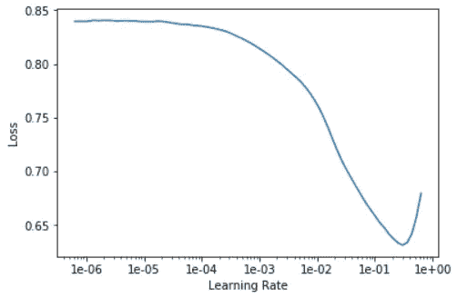

Learning rate finder from FastAI

*第 1 行——通过在数据样本上尝试多个学习率来找到理想的学习率*

*第 2 行—* 让我们画出不同学习速率下的损失。

我们需要在上面的函数中选择一个斜率最大的学习率。在这种情况下，它是 1e-2。

```
lr = 1e-2
learn.fit_one_cycle(4, slice(lr))
```

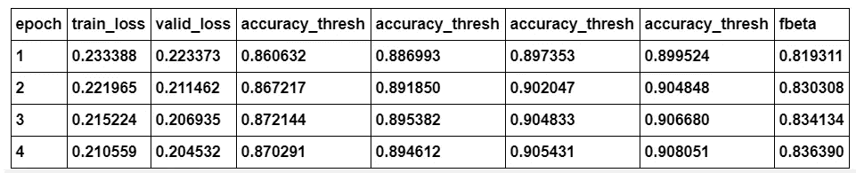

Training snapshot

现在我们已经训练了最后一个全连接层。让我们解冻所有的层，并训练完整的模型。我们将使用学习率查找器再次确定理想的学习率。

```
learn.unfreeze()
learn.lr_find()
learn.recorder.plot()
```

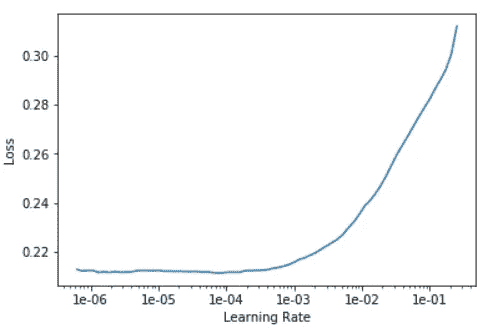

Snapshot of learning rate finder in FastAI

*线 1* —解冻所有层

*第 2–3 行* —帮助我们找到理想的学习速度。

现在，我们将对模型中的每一层使用不同的学习速率，方法是当我们回到各层时，按指数规律衰减学习速率。

```
learn.fit_one_cycle(5, slice(1e-5, lr/5))
learn.save('ff_stage-2-rn50')
```

*第 1 行* —以可变学习率使用一个周期学习

*第 2 行* —用指定的名称保存我们的模型。

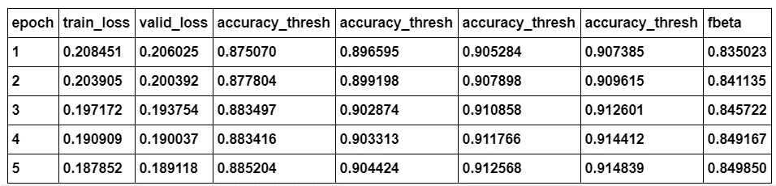

Training snapshot

现在，我们可以将输入图像大小增加到 3*256*256，并在上面训练的模型上使用迁移学习来适应新的输入图像大小。

```
data = (src.transform(tfms, size=256)
       .databunch(bs=64).normalize(imagenet_stats))acc_05 = partial(accuracy_thresh, thresh=0.5)
f_score = partial(fbeta, thresh=0.5)
learn = create_cnn(data, models.resnet50, pretrained=**False**,metrics=[acc_05, f_score])learn.load("ff_stage-2-rn50")
```

*第 1–2 行* —创建一个新的数据加载器，将图像大小调整为 3*256*256，并将批量大小减少到 64。

*第 4–6 行* —定义我们需要跟踪的指标，并创建一个与之前模型相似的 ResNet 50 模型。

*第 8 行* —将权重从我们之前训练的模型加载到新创建的模型中。

现在，我们可以按照上面提到的类似步骤对模型进行更多的训练。培训笔记本还提供了可视化中间层激活的代码，以帮助理解图像的哪一部分驱动模型的最终结果。

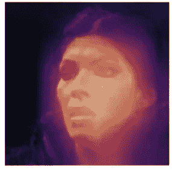

Models Intermediate Activation layers heatmap over the actual image.

正如我们可以从上面的图像中看到的，该模型在图像中人脸所在的位置最活跃，这正是我们想要的，因为它是一个面部特征检测模型。

# 第 4 部分—组合一切

现在我们已经训练好了我们的模型，让我们写一个可以进行面部属性检测的脚本，最后一部分是把它们放在一起。这部分的代码在我的 [Github 这里](https://github.com/aayushmnit/Deep_learning_explorations/blob/master/7_Facial_attributes_fastai_opencv/detect_features.py)。

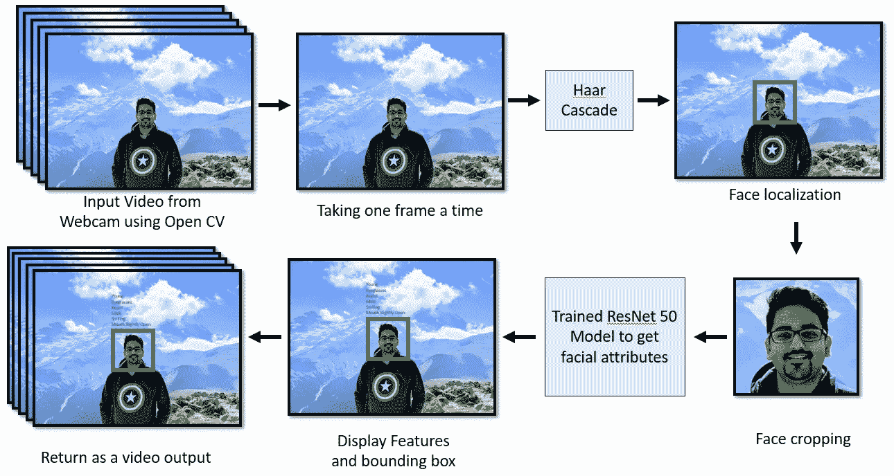

Detection script process flow

该脚本执行以下任务-

1.  使用 OpenCV 访问网络摄像头拍摄输入视频并转换成一系列图像帧。
2.  对于每一帧，我们从 OpenCV 运行 Haar 级联模型来定位面部并将其从帧中裁剪出来。
3.  将这些裁剪出来的检测到的人脸帧传递到我们训练过的模型中，以找到相关的面部特征
4.  运行脚本时，显示边界框以及在帧上检测到的所有特征
5.  可选地保存视频流

# 结论

在上面的博客中，我们看到了如何通过将从传统机器视觉到深度学习的各种技术结合在一起，来完成端到端的面部属性检测问题。

我希望你喜欢阅读，并随时使用我在 [Github](https://github.com/aayushmnit/Deep_learning_explorations/tree/master/7_Facial_attributes_fastai_opencv) 上的代码来为你的目的进行试验。此外，如果对代码或博客有任何反馈，请随时联系 aayushmnit@gmail.com 的 [LinkedIn](https://www.linkedin.com/in/aayushmnit/) 或给我发电子邮件。您也可以在 Medium 和 Github 上关注我，了解我将来可能会写的博客文章和探索项目代码。