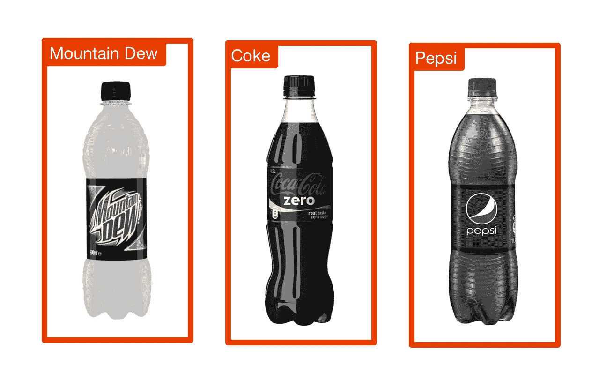
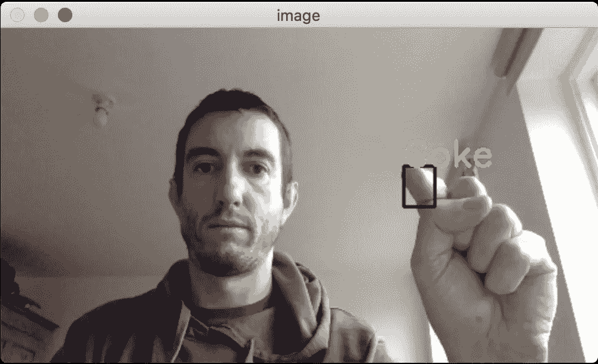

# 无需机器学习的实时目标检测

> 原文：<https://towardsdatascience.com/real-time-object-detection-without-machine-learning-5139b399ee7d?source=collection_archive---------7----------------------->



## 深度学习与启发式

今年早些时候，IBM 的软件开发人员 Nick Bourdakos 发布了一系列视频，演示在网络浏览器中进行实时物体检测。他早期的一个视频迅速走红，在 LinkedIn 上获得了超过 16000 个赞和 900 多条评论。以下是原帖:

[](https://www.linkedin.com/posts/nicholasbourdakos_machinelearning-javascript-activity-6496499508409561088-1M00) [## LinkedIn 上的 Nicholas Bourdakos:“在您的浏览器中实时可定制的对象检测…

### 2019 年 1 月 30 日:尼古拉斯·布尔达科斯在 LinkedIn 上发帖

www.linkedin.com](https://www.linkedin.com/posts/nicholasbourdakos_machinelearning-javascript-activity-6496499508409561088-1M00) 

视频显示，三个瓶子(可口可乐、百事可乐和激浪)被举到摄像机前，计算机实时识别。当检测到每个瓶子时，会给它一个文本标签，并在其周围绘制一个边界框。如果举起一个以上的瓶子，系统将正确标记不同的瓶子。

Nick 的系统现在已经进化成了 [IBM cloud annotations](https://cloud.annotations.ai) ，但是上面的演示使用了 TensorFlow.js 以及 COCO-SSD 深度学习模型。SSD，或单次多盒探测器，是一种广泛使用的技术，用于检测一帧中的多个子图像，详细描述[这里](/understanding-ssd-multibox-real-time-object-detection-in-deep-learning-495ef744fab)。这是深度学习擅长的任务，这些技术现在非常普遍，你可能在口袋里有一个深度学习网络，为照片或社交网络应用程序运行手机的对象检测。

## “没有机器学习”的挑战

受到尼克帖子的启发，我决定挑战自己，探索是否可以在不使用机器学习的情况下*取得类似的结果。我突然想到，最初演示中使用的瓶子可以根据它们的颜色或其他特征以及一些简单的匹配规则来检测。这被称为解决问题的[启发式](https://en.wikipedia.org/wiki/Heuristic)方法。*

这样做的潜在优势包括:

*   易于开发和概念化
*   降低 CPU 和内存使用
*   更少的依赖性

在 CPU 和内存方面，在我的 i5 MacBook Pro 上，IBM Cloud Annotations 演示使用了超过 100%的 CPU 和超过 1.5 GB 的 RAM。它还依赖于一个网络浏览器和一些严重的依赖，包括 Tensorflow，React.js，node.js 和 COCO-SSD 本身。

我自己定的规则是:

1.  可口可乐、百事可乐和激浪瓶必须贴上正确的标签
2.  当瓶子移动时，应该在每个瓶子周围画一个矩形
3.  最小代码
4.  没有机器学习技术！

最初的演示声称只使用了 10 行代码，然而包括样板文件，当前的演示是 107 行 JavaScript。我认为低于 100 行是这个任务的一个很好的目标。

## 方法和解决方案

首先，我决定将我的项目建立在 OpenCV 的基础上，因为我以前在工作项目中使用过它，它有相对简单的设置，并且是专门为计算机视觉设计的*。OpenCV 是用 C++写的，有 Python 和 [JavaScript](https://docs.opencv.org/3.4/d5/d10/tutorial_js_root.html) 的绑定。为了方便起见，我决定使用 Python 版本。*

*我开始只是认出一个可乐瓶子。为此，一个简单的解决方案是分析视频帧中的颜色，并在发现[可乐红](https://usbrandcolors.com/coca-cola-colors/)的地方贴上标签。这里的一个问题是，根据照明条件和相机颜色精度，瓶子标签不太可能准确地为*RGB 244 0 0。**

*为了解决这个问题，我们可以使用一个 [HSV](https://en.wikipedia.org/wiki/HSL_and_HSV) 颜色表示以及 [cv::inRange](https://docs.opencv.org/trunk/d2/de8/group__core__array.html#ga48af0ab51e36436c5d04340e036ce981) 来查找图像中给定*范围内的颜色。*想想“红色的深浅”。这给了我们一个图像遮罩，所有红色区域为白色，其他区域为黑色。然后，我们可以使用 [cv::findContours](https://docs.opencv.org/3.4/d3/dc0/group__imgproc__shape.html#ga17ed9f5d79ae97bd4c7cf18403e1689a) 来提供一个定义框架内每个“红色区域”的点列表。基本代码如下所示:*

```
*mask = cv2.inRange(hsv, colour.lower, colour.upper)
conts, heirarchy = cv2.findContours(mask.copy(), cv2.RETR_EXTERNAL, cv2.CHAIN_APPROX_NONE)
biggest = sorted(conts, key=cv2.contourArea, reverse=True)[0]*
```

*第三行代码对检测到的“红色”轮廓进行排序，并返回最大的轮廓。搞定了。…对吗？不幸的是没有。像这样，程序经常在图像中找到可乐，即使图像中没有可乐。*

**

*Coke false positive*

*为了解决这个问题，我们需要一个额外的启发。我发现简单地排除任何小于 50×50 的轮廓就足够了。*

```
*if w < 50 or h < 50:
    continue*
```

*最后，为了让我们的检测系统工作良好，我们需要排除在其他颜色“内部”的颜色。例如，百事可乐和激浪标签*都含有*红色，除非我们排除它，否则它会被检测为可口可乐。因此，我们为可乐添加了一个特殊的试探法，如果它在另一个瓶子的垂直边界内，则忽略检测。*

```
*if name == "Coke":
    if any([contains_vertical(rects[n], rect) for n in rects]):
        continue*
```

## *示范*

*综上所述，这是最终系统的工作演示。*

*在我的 i5 MacBook Pro 上，它在 45%左右的 CPU 和略高于 50MB 的 RAM 下运行顺畅。完整的源代码有 85 行，可以在这里[找到。](https://github.com/jamiebullock/heuristic-bottle-detection)*

## *限制*

*这种基于颜色的方法的一个限制是，它不在瓶子周围放置边界框，而只在着色区域放置。我们可以定义额外的规则来考虑检测区域上方或下方的颜色，或者尝试猜测边界框应该在哪里，但是代码会很快变得复杂。*

*另一个限制是，虽然我们的系统可以同时识别可乐和百事可乐瓶，但它不能检测两个可乐瓶。我们可以添加进一步的启发式方法来处理这个问题，但是如果需要添加这么多的复杂性，我会质疑启发式方法是否是正确的选择。*

## *深度学习 vs 启发式*

*我已经展示了为高度受限的任务构建一个与基于深度学习的系统精度相当的启发式检测器是很简单的。此外，启发式对象检测器在概念上更简单，具有更少的依赖性，占用更少的 CPU，并且使用更少数量级的存储器。*

*然而，启发式方法不像使用深度学习那样健壮或准确。深度学习系统可以很容易地识别同一物体在不同比例和旋转下的多个实例，这取决于它的训练方式。它还可以做一些事情，比如即使关键特征缺失也能识别部分物体。*

## *结论*

*对我来说，这不是深度学习的明显胜利，我认为启发式方法仍然有一席之地。可以对检测条件(一致的背景和/或比例、受约束的对象类型、诸如颜色的区别特征)做出的假设越多，试探法就越有吸引力。作为一名开发人员，如果时间和资源紧张，并且输入约束明确，我会考虑基于启发式的解决方案。如果我想要增加健壮性和灵活性，我会选择机器学习。这两种方法肯定都有它们的位置，问题是要为工作选择正确的工具。*