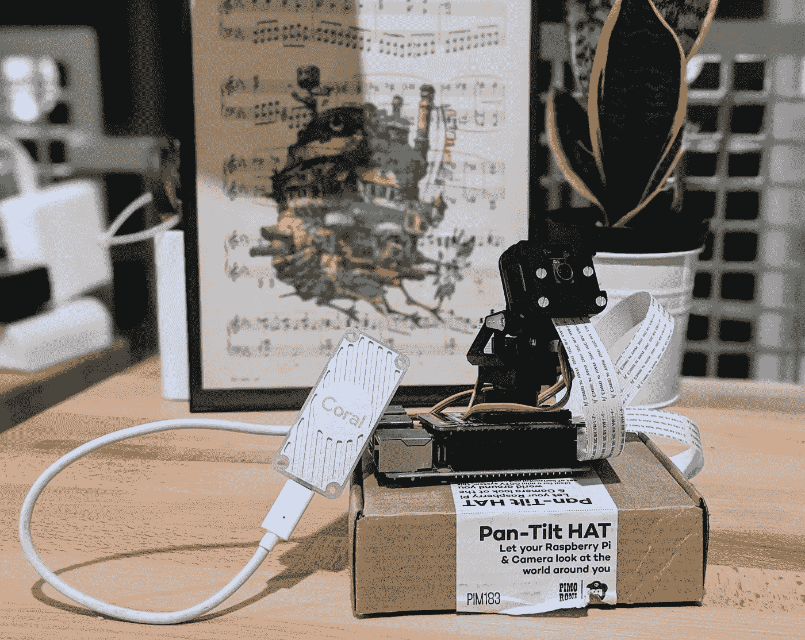
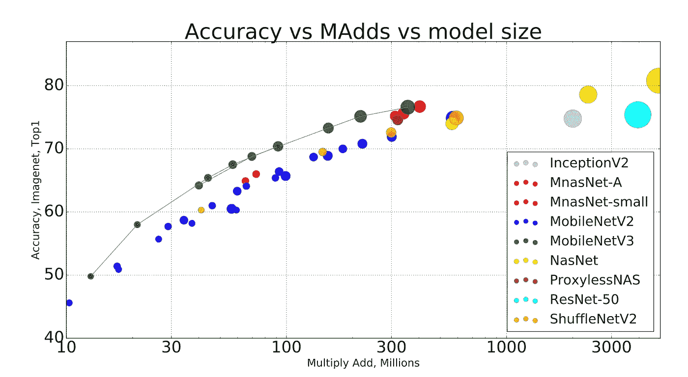
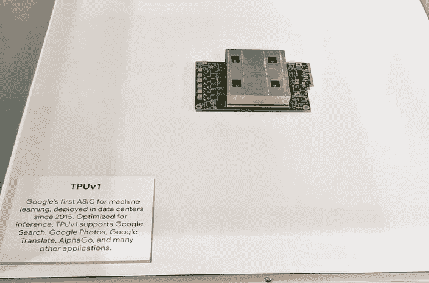
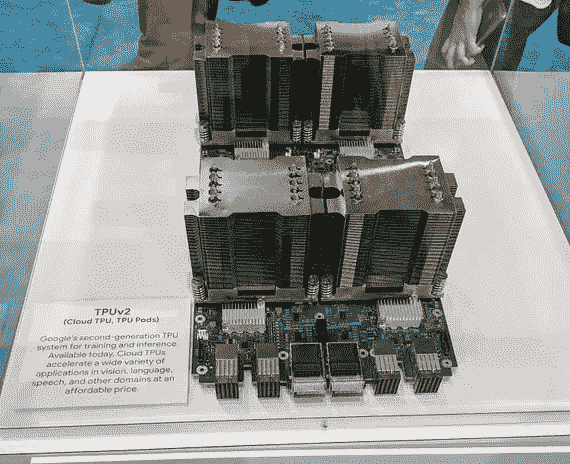
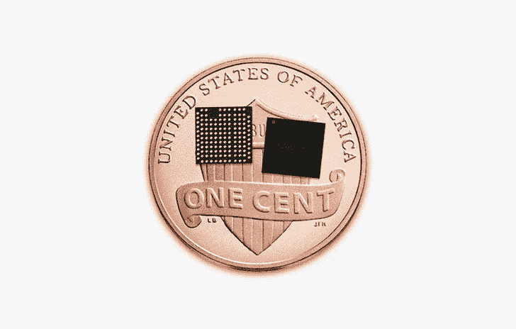
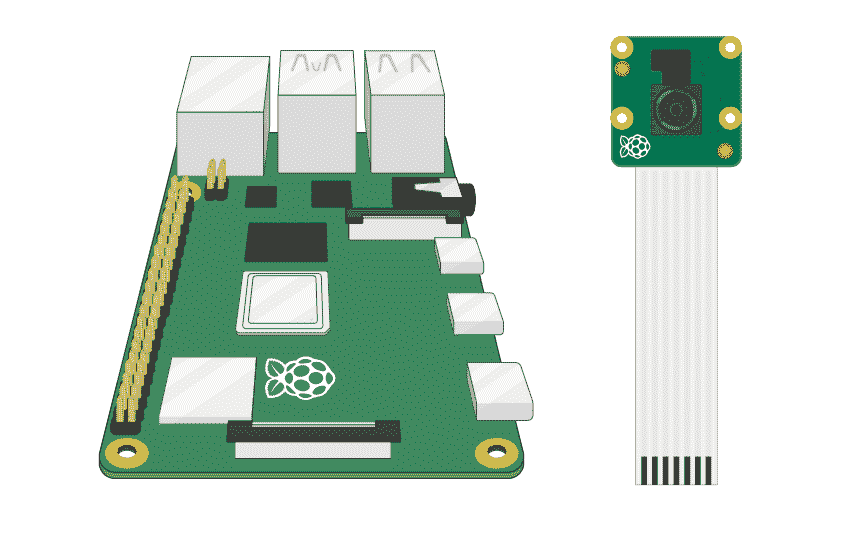
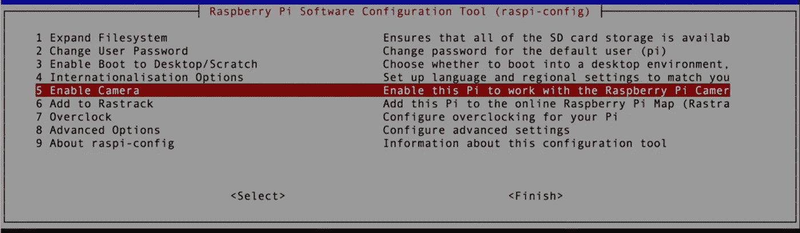
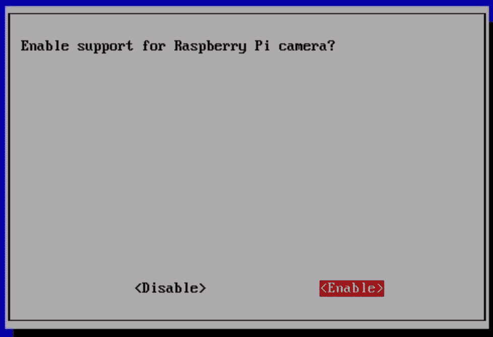
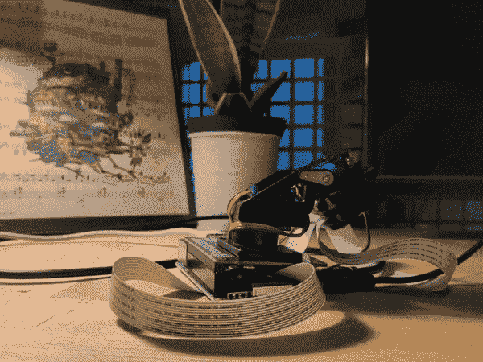
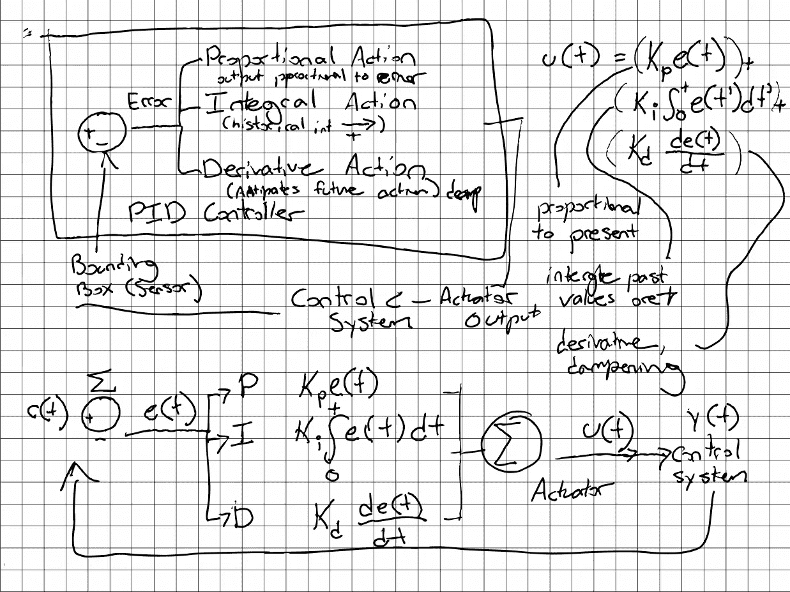

# 使用 TensorFlow、Raspberry Pi 和 Pan-Tilt HAT 进行实时对象跟踪

> 原文：<https://towardsdatascience.com/real-time-object-tracking-with-tensorflow-raspberry-pi-and-pan-tilt-hat-2aeaef47e134?source=collection_archive---------1----------------------->



Pictured: Raspberry Pi 4GB, Pi Camera v2.1, Pimoroni Pan-Tilt HAT, Coral Edge TPU USB Accelerator

## 便携式计算机视觉和运动跟踪的预算。

# 第 1 部分—简介👋

你是刚入门机器/深度学习，TensorFlow，还是 Raspberry Pi？太好了，这篇博文是给你的！我创建了[**rpi-deep-pantilt**](https://github.com/leigh-johnson/rpi-deep-pantilt)**作为野外物体检测的交互演示。🦁**

****更新—** 新增人脸检测和跟踪！**

**我将向您展示如何复制下面的视频，它描绘了一个摄像机平移和倾斜来跟踪我在房间中的移动。**

**我将介绍以下内容:**

1.  **建筑材料和硬件组装说明。**
2.  **将 **TensorFlow Lite** 对象检测模型 **(MobileNetV3-SSD)** 部署到 **Raspberry Pi。****
3.  **使用**比例-积分-微分控制器(PID)控制器向平移/倾斜伺服电机发送跟踪指令。****
4.  **使用 **Coral 的 USB Edge TPU 加速器**和 **Edge TPU 编译器**加速任何 **TensorFlow Lite** 模型的推理。**

# **术语和参考📚**

**[**树莓派**](https://www.raspberrypi.org/)——一款受教育者、硬件爱好者和机器人爱好者欢迎的小型平价电脑。🤖**

**[**Raspbian**](https://www.raspberrypi.org/downloads/raspbian/)**——**树莓派基金会的官方操作系统为 Pi。Raspbian 源自 Debian Linux。**

**[**TensorFlow**](https://www.tensorflow.org/) —用于[数据流](https://en.wikipedia.org/wiki/Dataflow_programming)编程的开源框架，用于机器学习和深度神经学习。**

**[**tensor flow Lite**](https://www.tensorflow.org/lite)—一个在移动和嵌入式设备上部署 **TensorFlow** 模型的开源框架。**

**[**卷积神经网络**](/portable-computer-vision-tensorflow-2-0-on-a-raspberry-pi-part-1-of-2-84e318798ce9#e8cc)**——一种非常适合图像分类和对象检测任务的神经网络架构类型。****

****[**【SSD】**](/review-ssd-single-shot-detector-object-detection-851a94607d11)—一种**卷积神经网络** (CNN)架构，专门用于实时物体检测、分类、包围盒定位。****

****[**MobileNetV3**](https://ai.googleblog.com/2018/04/mobilenetv2-next-generation-of-on.html)**—**一款最先进的计算机视觉模型，针对普通手机处理器的性能进行了优化。****

****[**MobileNet v3-SSD**](https://github.com/tensorflow/models/tree/master/research/object_detection#nov-13th-2019)—基于 **MobileNet** 架构的**单次探测器**。本教程将使用通过 [TensorFlow 的对象检测模型 zoo 提供的 **MobileNetV3-SSD** 模型。](https://github.com/tensorflow/models/blob/master/research/object_detection/g3doc/detection_model_zoo.md)****

********

****Comparison of computer vision neural networks. Image Credit and Paper: [Searching for MobileNetV3](https://arxiv.org/abs/1905.02244)****

****[**边缘 TPU**](https://cloud.google.com/edge-tpu/) —张量处理单元(TPU)是一个集成电路，用于加速 **TensorFlow 执行的计算。****边缘 TPU** 是为“在边缘”的移动和嵌入式设备开发的，占地面积小****

************************

****Cloud TPUv1, TPUv2 (left, middle) at Google Cloud Next ’18\. Cloud TPUs accelerate TensorFlow model training and inference. Edge TPUs on a United States penny (right). Edge TPUs accelerate inferences in mobile devices. Image credit: [Google](https://cloud.google.com/edge-tpu/))****

# ****第 2 部分—🛠构建列表****

## ******基本******

*   ****[树莓 Pi 4(推荐 4GB)](https://www.raspberrypi.org/products/raspberry-pi-4-model-b/)****
*   ****[树莓派相机 V2](https://www.raspberrypi.org/products/camera-module-v2/)****
*   ****[皮莫尔尼云台套装](https://shop.pimoroni.com/products/pan-tilt-hat?variant=22408353287)****
*   ****Micro SD 卡 16+ GB****
*   ****微型 HDMI 电缆****

## ******可选******

*   ****[12 英寸 CSI/DSI 色带，用于 Raspberry Pi 摄像机](https://www.adafruit.com/product/1648)。
    Pi 摄像机的标准电缆对于云台帽子的全范围运动来说太短。****
*   ****[RGB NeoPixel Stick](https://www.adafruit.com/product/1426)
    这个组件为你的项目增加了一致的光源。****
*   ****[珊瑚缘 TPU USB 加速器](https://coral.withgoogle.com/products/accelerator)
    在树莓派上加速推断(预测)速度。你不需要这个来重现演示。****

> ****👋**找一个动片少的项目** s？****
> 
> ****查看[便携式计算机视觉:树莓 Pi 上的 tensor flow 2.0](/portable-computer-vision-tensorflow-2-0-on-a-raspberry-pi-part-1-of-2-84e318798ce9)以创建手持图像分类器。✨****

# ****第 3 部分— Raspberry Pi 设置****

****有两种方法可以将 **Raspbian** 安装到您的 Micro SD 卡上:****

1.  ****[NOOBS](https://www.raspberrypi.org/documentation/installation/noobs.md) (新的开箱即用软件)是一个 GUI 操作系统安装管理器。如果这是你的第一个 Raspberry Pi 项目，我建议从这里开始。****
2.  ****[将 Raspbian 图像写入 SD 卡](https://www.raspberrypi.org/documentation/installation/installing-images/README.md)。****

****本教程及配套软件使用[**R**](https://www.raspberrypi.org/documentation/installation/)**aspbian(Buster)**编写。如果您使用的是不同版本的 Raspbian 或另一个平台，您可能会经历一些痛苦。****

******在进行**之前，您需要:****

*   ****将您的 Pi 连接到互联网( [doc](https://projects.raspberrypi.org/en/projects/raspberry-pi-using/4)****
*   ****SSH 到您的树莓 Pi ( [doc](https://www.raspberrypi.org/documentation/remote-access/ssh/) )****

# ****第 4 部分—软件安装****

1.  ****安装系统依赖项****

```
**$ sudo apt-get update && sudo apt-get install -y python3-dev libjpeg-dev libatlas-base-dev raspi-gpio libhdf5-dev python3-smbus**
```

****2.创建新的项目目录****

```
**$ mkdir rpi-deep-pantilt && cd rpi-deep-pantilt**
```

****3.创建新的虚拟环境****

```
**$ python3 -m venv .venv**
```

****4.激活虚拟环境****

```
**$ source .venv/bin/activate && python3 -m pip install --upgrade pip**
```

****5.从社区构建的轮子安装 TensorFlow 2.0。****

```
**$ pip install [https://github.com/bitsy-ai/tensorflow-arm-bin/releases/download/v2.4.0/tensorflow-2.4.0-cp37-none-linux_armv7l.whl](https://github.com/bitsy-ai/tensorflow-arm-bin/releases/download/v2.4.0/tensorflow-2.4.0-cp37-none-linux_armv7l.whl)**
```

****6.安装**rpi-deep-pantilt**Python 包****

```
**$ python3 -m pip install rpi-deep-pantilt**
```

# ****第 5 部分—云台帽硬件组件****

****如果您购买了预组装的**云台套件，您可以跳到下一部分。******

****否则，在继续之前，遵循[装配云台](https://learn.pimoroni.com/tutorial/sandyj/assembling-pan-tilt-hat)中的步骤。****

# ****第 6 部分—连接 Pi 摄像机****

1.  ****关掉树莓派****
2.  ****找到 USB 模块和 HDMI 模块之间的摄像头模块。****
3.  ****向上(轻轻地)拉，打开黑色塑料夹****
4.  ****插入摄像头模块带状电缆(金属连接器**朝向远离 Raspberry Pi 4 上以太网/ USB 端口的**)****
5.  ****锁定黑色塑料夹****

********

****Image Credit: [Getting Started with the Pi Camera](https://projects.raspberrypi.org/en/projects/getting-started-with-picamera)****

# ****第 7 部分—启用 Pi 摄像机****

1.  ****打开树莓派****
2.  ****运行`sudo raspi-config`并从 Raspberry Pi 软件配置工具的主菜单中选择`Interfacing Options`。按回车键。****

********

****3.选择`Enable Camera`菜单选项并按下回车键。****

********

****4.在下一个菜单中，使用右箭头键高亮显示`ENABLE`并按 ENTER 键。****

********

# ****第 8 部分—测试云台****

****接下来，测试 Pan-Tilt HAT 模块的安装和设置。****

1.  ****嘘到你的树莓皮****
2.  ****激活你的虚拟环境:`source .venv/bin/activate`****
3.  ****运行以下命令:`rpi-deep-pantilt test pantilt`****
4.  ****用 Ctrl+C 退出测试****

****如果你安装了正确的帽子，你应该看到两个伺服移动在一个平稳的正弦运动，而测试正在运行。****

********

# ****第 9 部分—测试 Pi 摄像机****

****接下来，通过启动摄像机的预览覆盖来验证 Pi 摄像机是否安装正确。叠加将在 Pi 的主显示器(HDMI)上呈现。****

1.  ****将您的 Raspberry Pi 插入 HDMI 屏幕****
2.  ****嘘到你的树莓皮****
3.  ****激活你的虚拟环境:`$ source .venv/bin/activate`****
4.  ****运行以下命令:`$ rpi-deep-pantilt test camera`****
5.  ****用 Ctrl+C 退出测试****

****如果您正确安装了 Pi 摄像机，您应该会看到摄像机中的素材渲染到您的 HDMI 或复合显示器上。****

# ****第 10 部分—测试对象检测****

****接下来，验证您可以在您的 Raspberry Pi 上运行对象检测模型( **MobileNetV3-SSD** )。****

1.  ****嘘到你的树莓皮****
2.  ****激活你的虚拟环境:`$ source .venv/bin/activate`****
3.  ****运行以下命令:****

```
**$ rpi-deep-pantilt detect**
```

****您的 Raspberry Pi 应该检测对象，尝试对对象进行分类，并在其周围绘制一个边界框。****

```
**$ rpi-deep-pantilt face-detect**
```

## ******注意:**使用默认的 **MobileNetV3-SSD 模型，只能检测和跟踪以下对象。******

```
**$ rpi-deep-pantilt list-labels
[‘person’, ‘bicycle’, ‘car’, ‘motorcycle’, ‘airplane’, ‘bus’, ‘train’, ‘truck’, ‘boat’, ‘traffic light’, ‘fire hydrant’, ‘stop sign’, ‘parking meter’, ‘bench’, ‘bird’, ‘cat’, ‘dog’, ‘horse’, ‘sheep’, ‘cow’, ‘elephant’, ‘bear’, ‘zebra’, ‘giraffe’, ‘backpack’, ‘umbrella’, ‘handbag’, ‘tie’, ‘suitcase’, ‘frisbee’, ‘skis’, ‘snowboard’, ‘sports ball’, ‘kite’, ‘baseball bat’, ‘baseball glove’, ‘skateboard’, ‘surfboard’, ‘tennis racket’, ‘bottle’, ‘wine glass’, ‘cup’, ‘fork’, ‘knife’, ‘spoon’, ‘bowl’, ‘banana’, ‘apple’, ‘sandwich’, ‘orange’, ‘broccoli’, ‘carrot’, ‘hot dog’, ‘pizza’, ‘donut’, ‘cake’, ‘chair’, ‘couch’, ‘potted plant’, ‘bed’, ‘dining table’, ‘toilet’, ‘tv’, ‘laptop’, ‘mouse’, ‘remote’, ‘keyboard’, ‘cell phone’, ‘microwave’, ‘oven’, ‘toaster’, ‘sink’, ‘refrigerator’, ‘book’, ‘clock’, ‘vase’, ‘scissors’, ‘teddy bear’, ‘hair drier’, ‘toothbrush’]**
```

# ****第 11 部分—以约 8 FPS 的速度跟踪物体****

****这是我们期待已久的时刻！采用以下步骤，使用云台以大约 8 帧/秒的速度跟踪物体。****

1.  ****嘘到你的树莓皮****
2.  ****激活你的虚拟环境:`$source .venv/bin/activate`****
3.  ****运行以下命令:`$ rpi-deep-pantilt track`****

****默认情况下，这将跟踪标签为`person`的对象。您可以使用`--label`参数跟踪不同类型的物体。****

****例如，要跟踪一只香蕉，您需要运行:****

****`$ rpi-deep-pantilt track --label=banana`****

****在一台 **Raspberry Pi 4 (4 GB)** 上，我对我的模型进行了大约每秒 8 帧的基准测试。****

```
**INFO:root:FPS: 8.100870481091935
INFO:root:FPS: 8.130448201926173
INFO:root:FPS: 7.6518234817241355
INFO:root:FPS: 7.657477766009717
INFO:root:FPS: 7.861758172395542
INFO:root:FPS: 7.8549541944597
INFO:root:FPS: 7.907857699044301**
```

# ****第 12 部分—使用边缘 TPU 实时跟踪物体****

****我们可以用 [Coral 的 USB 加速器来加速**模型推理速度**。](https://coral.ai/products/accelerator/)USB 加速器包含一个 Edge TPU，它是一个专用于 TensorFlow Lite 操作的 [ASIC](https://en.wikipedia.org/wiki/Application-specific_integrated_circuit) 芯片。欲了解更多信息，请查看[开始使用 USB 加速器。](https://coral.ai/docs/accelerator/get-started/)****

1.  ****嘘到你的树莓皮****
2.  ****安装边缘 TPU 运行时****

```
**$ echo "deb https://packages.cloud.google.com/apt coral-edgetpu-stable main" | sudo tee /etc/apt/sources.list.d/coral-edgetpu.list

$ curl https://packages.cloud.google.com/apt/doc/apt-key.gpg | sudo apt-key add -

$ sudo apt-get update && sudo apt-get install libedgetpu1-std**
```

****3.插入 Edge TPU(最好是一个 **USB 3.0 端口**)。如果您的 Edge TPU 已经插入，**移除并重新插入**，以便 udev 设备管理器可以检测到它。****

****4.使用`--edge-tpu`选项尝试**检测命令**。你应该能够实时检测物体！🎉****

```
**$ rpi-deep-pantilt detect --edge-tpu --loglevel=INFO**
```

******注意:** `**loglevel=INFO**` 将向您显示检测对象和将边界框渲染到 Raspberry Pi 相机覆盖图的 FPS。****

****您应该看到大约 24 FPS，这是帧从 Pi 相机采样到帧缓冲区的速率。****

```
**INFO:root:FPS: 24.716493958392558
INFO:root:FPS: 24.836166606505206
INFO:root:FPS: 23.031063233367547
INFO:root:FPS: 25.467177106703623
INFO:root:FPS: 27.480438524486594
INFO:root:FPS: 25.41399952505432**
```

****5.使用`--edge-tpu`选项尝试跟踪命令。****

```
**$ rpi-deep-pantilt track --edge-tpu**
```

# ****第 13 部分—检测和跟踪人脸(v1.1.x 中的新功能)****

****我在`rpi-deep-pantilt`的 **v1.1.x** 版本中添加了一个**全新的**人脸检测模型🎉****

****该模型来源于 TensorFlow 的[研究模型 zoo](https://github.com/tensorflow/models) 中的**faces SD _ mobilenet _ v2 _ quantified _ 320 _ open _ image _ v4**。****

****新命令是`rpi-deep-pantilt face-detect`(检测所有人脸)和`rpi-deep-pantilt face-track`(戴着潘迪特帽子追踪人脸)。这两个命令都支持`--edge-tpu`选项，如果使用 Edge TPU USB 加速器，这将加速推理。****

```
**rpi-deep-pantilt face-detect --help
Usage: cli.py face-detect [OPTIONS]

Options:
  --loglevel TEXT  Run object detection without pan-tilt controls. Pass
                   --loglevel=DEBUG to inspect FPS.
  --edge-tpu       Accelerate inferences using Coral USB Edge TPU
  --help           Show this message and exit.**
```

```
**rpi-deep-pantilt face-track --help
Usage: cli.py face-track [OPTIONS]

Options:
  --loglevel TEXT  Run object detection without pan-tilt controls. Pass
                   --loglevel=DEBUG to inspect FPS.
  --edge-tpu       Accelerate inferences using Coral USB Edge TPU
  --help           Show this message and exit.**
```

# ****包扎🌻****

****恭喜你！你现在自豪地拥有了一个 DIY 对象跟踪系统，该系统使用**单次检测器**(一种**卷积神经网络**)来分类和定位对象。****

## ****PID 控制器****

****平移/倾斜跟踪系统使用 [**比例-积分-微分控制器(PID)控制器**](https://en.wikipedia.org/wiki/PID_controller) 来平滑地跟踪边界框的质心。****

********

****PID Controller Architecture, Leigh Johnson 2019****

## ****张量流模型动物园****

****本教程中的模型来源于 [**TensorFlow 检测模型 Zoo**](https://github.com/tensorflow/models/blob/master/research/object_detection/g3doc/detection_model_zoo.md) **中的[**SSD _ mobilenet _ v3 _ small _ coco**](http://download.tensorflow.org/models/object_detection/ssd_mobilenet_v3_small_coco_2019_08_14.tar.gz)和**SSD _ mobilenet _ edge TPU _ coco****。🦁🦄🐼********

****我的模型可以通过 [Github 发布说明](https://github.com/leigh-johnson/rpi-deep-pantilt/releases/tag/v1.0.1)@[Leigh-Johnson/rpi-deep-pantilt](https://github.com/leigh-johnson/rpi-deep-pantilt)下载。****

****我添加了自定义的**TF lite _ Detection _ PostProcess**操作，它在模型输出上实现了**非最大抑制(NMS)** 的变体。**非最大抑制**是使用 [**集合操作**过滤许多包围盒提议的技术。](https://www.probabilitycourse.com/chapter1/1_2_2_set_operations.php)****

********

****Image Credit: [Non-maximum Suppression (NMS)](/non-maximum-suppression-nms-93ce178e177c)****

# ****感谢您的阅读！****

****寻找更多针对 Raspberry Pi 和其他小型设备的机器学习实践示例？[报名我的简讯](https://www.bitsy.ai/)！****

****我发布了真实世界的 ML 应用程序的例子(带有完整的源代码)和漂亮的小技巧，如[自动消除边框注释的痛苦](https://www.bitsy.ai/automate-bounding-box-annotation-with-tensorflow-and-automl/)。****

# ****特别感谢和致谢🤗****

****撰稿人:熊云阳、、苏约格·古普塔、、加布里埃尔·本德、谭明星、伯金·阿金、、郭乐。****

******MobileNetV3 SSDLite** 供稿人:、、Vivek Rathod、Jonathan Huang。****

****特别感谢 **Adrian Rosebrock** 用树莓 Pi 和 OpenCV**编写了 [**云台人脸跟踪，这是整个项目的灵感来源！**](https://www.pyimagesearch.com/2019/04/01/pan-tilt-face-tracking-with-a-raspberry-pi-and-opencv/)******

****特别感谢 **Jason Zaman** 审阅本文和提前发布候选人。💪****