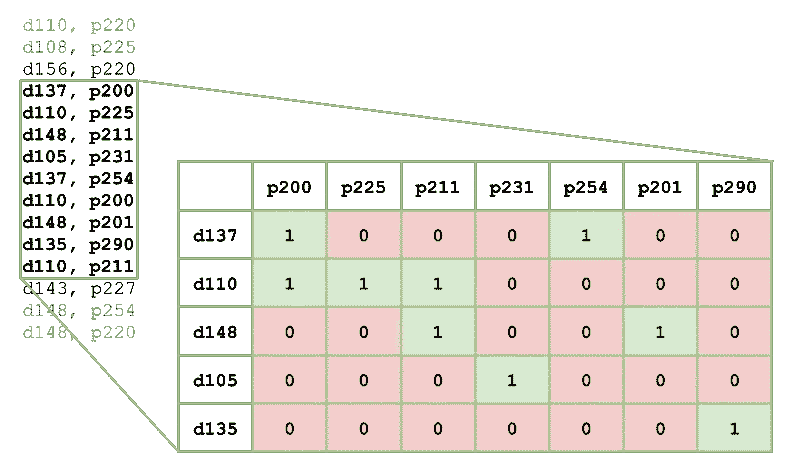
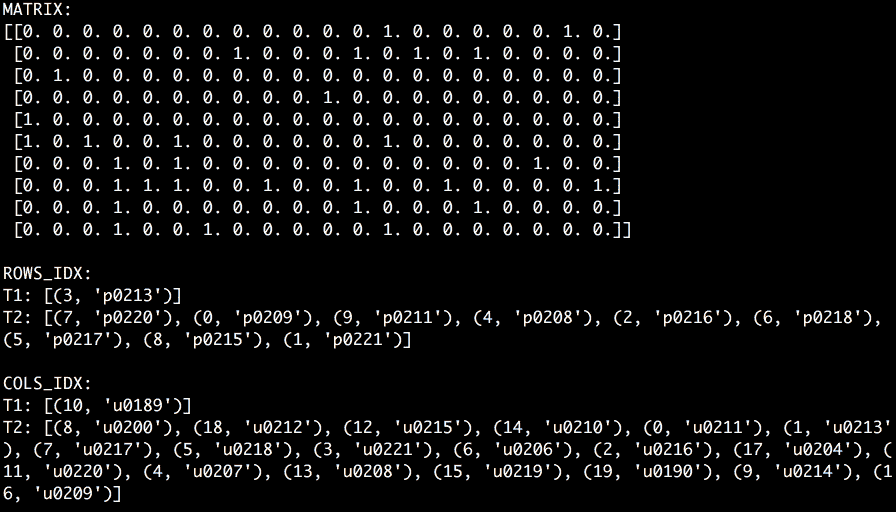

# 实时推荐系统:滚动特征矩阵

> 原文：<https://towardsdatascience.com/real-time-recommendation-system-rolling-feature-matrix-f5ca701439df?source=collection_archive---------6----------------------->

## 在许多应用中，速度比质量更有价值。当一篇文章发表后，推荐系统没有时间提出完全相关的建议。流量高峰出现在最初几分钟。这里有一个如何应对这种情况的想法。

如今，很难找到一个新闻网站不会试图通过一些推荐系统来吸引你的注意力。

如果你碰巧在互联网上的任何地方阅读了一篇文章，那么“下一篇”、“最多人阅读”、“趋势”或类似的东西将不可避免地在下面遇到你。有时我们仍然会看到《编辑文摘》——不管上下文如何，推荐的文章都不会改变。更先进的将使用标签，基于内容或另一种手工制作的相似性。但是当一个人读到今天的火灾事故时，并不一定意味着“火灾”或“事故”是他或她的兴趣所在。比如说 11.3%可能是真的，但今天的其他新闻可能比一个月前的另一场火灾事故更有趣，比如说概率为 24.6%，其余的可能兴趣是过去三天的信息背景形成的思想和感觉的复杂组合。

当然，人们可以以某种方式理解和衡量所有可能因素的影响，并为排名函数列出非常精确的系数，但明天世界将会不同。一项实证研究表明，任何形式的协同过滤在推荐方面都更有效。也就是说，我们永远不应该试图把集体意识解释成人类可读的表达。现代推荐系统应该寻找的不是关键词和日期，而是行为模式。被证明有效的简单方法是依靠文章的[余弦相似度](https://en.wikipedia.org/wiki/Cosine_similarity)。

为了使用余弦相似度，你必须将文章表示为访问向量。为简单起见，当第 n 个读者访问了给定的文章时，假设第 n 个系数为 1，否则为 0。在浏览多篇文章时，您可以将这些向量堆叠成一个矩阵，其中每行代表一篇文章，每列代表一个读者。如果你在一个网站的访问日志中选择一个窗口，你可以用如下方式表示它。

d — document, p — person (which are more general terms for an article and a reader)

现在，要知道每对文章之间的余弦相似性，可以使用以下方法。

得到的对称矩阵具有 M 乘 M 的形状，其中 M 是项目的数量。每个系数表示第 I 篇和第 j 篇文章之间的相似性度量。不用说，当 i = j 时，系数是 1，因为这是一篇文章与其自身的相似性。

上面的例子是一种批处理。也就是说，当您加载一段适当的原始输入数据、进行计算并存储结果时，可以在以后请求推荐时检索它们。这种方法在推荐系统中广泛使用，因为它使您能够使用更复杂的数据表示和更精确的算法。它在新出版物频率较低、生命周期较长的应用程序中工作得非常好，比如在线商店或娱乐平台。但是对于一个新闻网站来说，间歇性的运行就成了一个大问题。

想象一下，一个病毒式的出版物在几分钟内被成千上万的人访问。如果这种波动恰好出现在每 10 分钟运行一次批处理的推荐系统的工作周期之间，该怎么办呢？为了充分利用高峰期的出席人数，你必须向那些人推荐一些东西，以便让他们留下来。当您试图在计算能力有限的情况下增加批处理的频率时，您可能需要减少批处理的大小，这反过来会降低结果的质量，并且仍然不能完全消除间歇性的负面影响。那么，如何让一个新闻网站的推荐系统持续工作呢？

关键思想是始终将文档/人员矩阵保存在内存中，当它到来时用数据填充它，并按需执行计算。同时，我们仍然希望能够控制矩阵的大小。因此，在任何给定时刻，矩阵必须只包含最重要的数据。就好像每次发送建议请求时都会加载批处理一样。我们想到的是利用一些缓存替换策略。

假设我们有一个由 *document_id，person_id* 对组成的输入流。当下一对到达时，我们将它的 *document_id* 放入缓存 1，将 *person_id* 放入缓存 2。当命中发生时，我们根据策略调整相应的缓存，并在矩阵中分配相应的系数。对于未命中的情况，我们替换高速缓存中最不重要的(例如，最近最不重要的)记录，并用除了该对的交集之外的全零来重新初始化矩阵中的相应行或列。胜过千言万语的 GIF 如下图。

在这个例子中，我使用了[自适应替换缓存](https://en.wikipedia.org/wiki/Adaptive_replacement_cache)算法。该算法通过从驱逐历史中学习来考虑被缓存的元素的频率和新近度。最频繁元素与最近元素的比值是自适应的，是算法的核心知识。它有助于只将最重要的元素保留在内存中，也就是说，这些元素在不久的将来可能会再次被访问。我所使用的实现的关键特性是为缓存中的每条记录分配一个惟一的 ID，取值范围为 0 到 N - 1，其中 N 是缓存中记录的最大数量。这些 id 没有告诉我们任何关于记录顺序的信息，只是保证在缓存实例中是唯一的。因此，id 可以用作矩阵中行和列的索引。当一条记录被收回时，ID 被重用，我们知道哪一行或哪一列需要重新初始化。现在我们有了一个“滚动特征矩阵”。这意味着它包含准备用于实时计算推荐的输入数据的滑动批次。当然，这种方法可能有更多的应用。我只是用一个推荐系统给你一个思路。

## 实现的细微差别

使用 [lil_matrix](https://docs.scipy.org/doc/scipy/reference/generated/scipy.sparse.lil_matrix.html) 加快计算速度，同时保持变异(稀疏度变化)的效率，在对某个文档执行推荐计算之前删除不需要的列。也就是说，切掉对应行有零的所有列。

如果您有一个 2k 乘 2k 的矩阵，其中大约有 10k 个非零值(这在许多情况下是足够的数据量)，上述代码在任何现代 CPU 上的单个线程中每秒运行数百次，这使得这种方法适合于实时应用程序。

为了证明我的观点，我实现了 [Recom.live](https://github.com/grinya007/recomlive) ，这个推荐系统利用了“滚动特征矩阵”。这是一个生产就绪的实时推荐系统。您可以在 docker 容器中安装并运行它。请查看包含 Dockerfile 文件和说明的库。简而言之，安装非常简单:

这将启动一个 UDP 服务器(默认端口是 5005)。您可以开始将 *document_id，person_id* 对注入其中，并通过提供相同的上下文(这对 *document_id，person_id* )从其中检索推荐。API 非常简单，尽管为了让它更简单，我用 python 写了一个小小的[客户端库](https://github.com/grinya007/recomlive-client)。

在该负载下，Recom.live 在英特尔酷睿 i5 CPU 上运行时，每秒钟可处理 700 个记录/推荐请求。使用默认的矩阵形状(2000 X 2000)时，Recom.live 服务器会消耗大约 100 Mb 的 RAM。Docker 镜像是从 debian:stretch-slim 构建的，需要大约 350 Mb 的磁盘空间。总而言之，它绝对不会让您的服务器停机。

所以，欢迎每个人使用，留下反馈，为 Recom.live 的发展做出贡献。祝你有一个美好的一天/周末/生活，永远不要犹豫去联系！