# 自然语言处理的基础和使用开源工具的实时情感分析

> 原文：<https://towardsdatascience.com/real-time-sentiment-analysis-on-social-media-with-open-source-tools-f864ca239afe?source=collection_archive---------1----------------------->

Trinity College, Dublin | source: [link](https://www.boredpanda.com/trinity-college-long-room-library-dublin/?utm_source=google&utm_medium=organic&utm_campaign=organic)

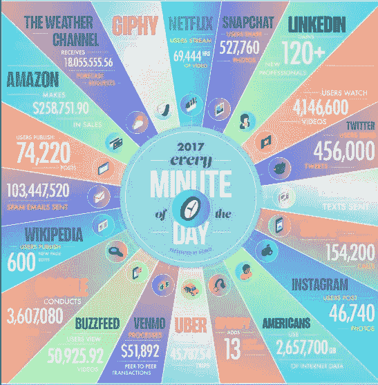

Image credit: [Domo](https://www.domo.com/blog/data-never-sleeps-5/)

Instagram 上每天有 5 亿条推文，每月有 8 亿活跃用户，其中 90%的人不到 35 岁。用户每天在 Reddit 上发表 280 万条评论，68%的 T2 人使用脸书。每时每刻都有数量惊人的数据生成，从这些杂乱的数据中获取相关的见解变得极其困难。有没有一种方法可以让你实时掌握这一点？如果您阅读了本文的其余部分，我将向您展示一种方法:)我还在我的[社交收听网站](http://social.ozgurgenc.dev)上部署了一个简单的真实例子，供您试用…

# 什么是 NLP，为什么它很重要？

[**自然语言处理** (NLP) 是计算机科学、人工智能、语言学交叉的领域](https://en.wikipedia.org/wiki/Natural_language_processing)。目标是让计算机处理或“理解”自然语言，以执行各种类似人类的任务，如语言翻译或回答问题。

随着语音接口和聊天机器人的兴起，自然语言处理是第四次工业革命的最重要技术之一，并成为人工智能的一个热门领域。从 NLP 领域衍生出来的有用的应用程序正在快速增长。它们从简单到复杂。以下是其中的一些:

*   搜索、拼写检查、关键字搜索、查找同义词、复杂问题回答
*   [从网站提取信息](https://heartbeat.fritz.ai/extractive-text-summarization-using-neural-networks-5845804c7701)，例如:产品、价格、日期、地点、人物或姓名
*   机器翻译(即谷歌翻译)、语音识别、个人助理*(想想亚马逊 Alexa、苹果 Siri、脸书 M、谷歌助理或微软 Cortana)*
*   用于客户支持、控制设备、订购商品的聊天机器人/对话代理
*   匹配网络广告， [**情感分析**](https://heartbeat.fritz.ai/training-a-sentiment-analysis-core-ml-model-28823b21322c) 用于营销或金融/贸易
*   识别财务风险或欺诈

# NLP 是如何表示单词/句子的？

NLP 背后的天才是一个叫做 [**字嵌入**](https://en.wikipedia.org/wiki/Word_embedding) **的概念。**单词嵌入是将*单词表示为向量*，通过利用大量文本来学习。每个单词被映射到一个向量，向量值以类似于人工神经网络的方式被学习。

每个单词都由一个实值向量来表示，这个向量通常有几十或几百维。这里的 ***单词向量是一行实数值*** ，其中每个数字是单词含义的维度*和 ***，其中语义相似的单词具有相似的向量*** *。*即*女王*和*公主*会不会是**更近的媒介物。***

***如果我们在一个假设的单词向量中用一些虚构的维度来标记 4 个单词(国王、王后、女人、公主)，它可能看起来有点像下面这样:***

***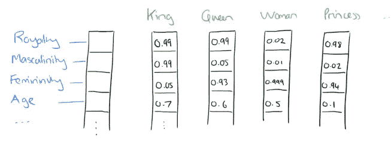***

***Source: [the morning paper](https://blog.acolyer.org/2016/04/21/the-amazing-power-of-word-vectors/)***

***单词向量中的数字表示*单词在各个维度上的分布权重。单词的* ***语义*** *都嵌入在这些* ***维度*** *的向量中。另一个跨越 4 个维度的简化示例如下:****

**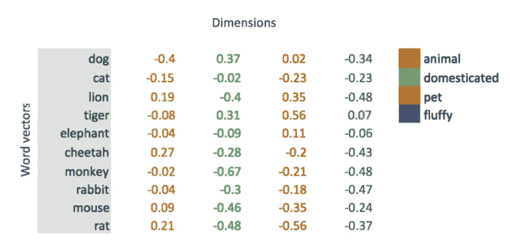**

**Source: [medium](https://medium.com/@jayeshbahire/introduction-to-word-vectors-ea1d4e4b84bf) / [Jayesh Bapu Ahire](https://medium.com/@jayeshbahire)**

> **这些假设的向量值代表了一个词的抽象“意义”。将单词表示为向量的美妙之处在于，它们有助于数学运算符，因此我们可以对它们进行编码！然后它们可以被用作人工神经网络的输入！**

**我们可以通过将学习到的向量投影到简化的二维空间来可视化它们，如下所示，很明显，向量捕获了关于单词及其相互关系的有用语义信息。**

**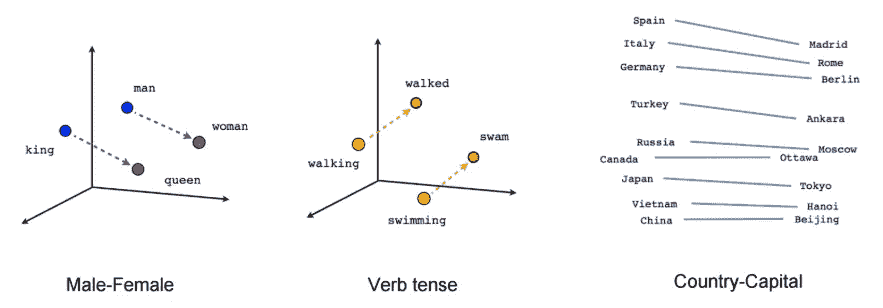**

**Source: [Google TensorFlow blog](https://www.tensorflow.org/tutorials/representation/word2vec)**

**这些是*d* 分布向量，基于出现在**相似语境**中的单词具有**相似含义**的假设。比如下图中，所有的*大型猫科动物*(即*猎豹*、*美洲豹*、*黑豹*、*老虎*和*豹子*)在向量空间中确实很接近。**

**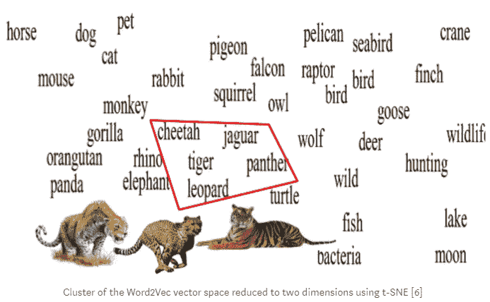**

**Source: [medium](https://medium.com/@josecamachocollados/on-the-contribution-of-neural-networks-and-word-embeddings-in-natural-language-processing-c8bb1b85c61c) / [Jose Camacho Collados](https://medium.com/@josecamachocollados)**

**单词嵌入算法从大型文本语料库[中获取输入，并产生这些](https://en.wikipedia.org/wiki/Text_corpus)[向量空间](https://en.wikipedia.org/wiki/Vector_space)，通常具有数百个[维度](https://en.wikipedia.org/wiki/Dimensions)。在大语料库(文本主体)上训练神经语言模型**，并且网络的输出用于将每个唯一的单词分配给相应的向量。最流行的[单词嵌入](/3-silver-bullets-of-word-embedding-in-nlp-10fa8f50cc5a)算法有谷歌的 [*Word2Vec*](https://code.google.com/archive/p/word2vec/) ，斯坦福的 [*GloVe*](https://nlp.stanford.edu/projects/glove/) 或者脸书的 [*FastText*](https://fasttext.cc/) 。****

> **单词嵌入代表了无监督学习最成功的人工智能应用之一。**

# **潜在的缺点**

**也有缺点，比如不能区分一个词的不同意思。例如，单词“ *bat* ”至少有两个不同的意思:一个会飞的动物，和一件运动器材。另一个挑战是文本可能同时包含多种情感。例如([源](https://medium.com/analytics-vidhya/simplifying-social-media-sentiment-analysis-using-vader-in-python-f9e6ec6fc52f))**

**“这部电影背后的意图很棒，但它本可以做得更好”。**

**上面这句话由**正反两个极性**组成。那么，我们如何断定该评论是正面的还是负面的呢？**

**好消息是，人工智能(AI)现在可以(几乎)实时地对复杂的人类语言及其细微差别进行足够好的理解。感谢 ***预训练*** 和深度学习驱动的算法，我们开始将 NLP 案例视为我们日常生活的一部分。**

# **NLP 上最新最受欢迎的新闻**

**预先训练的 NLP 模型可以像人类一样行动，并且可以使用合理的计算资源更快地部署。比赛开始了！**

**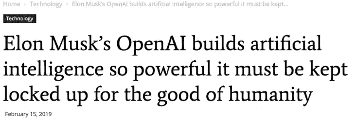**

**source: [the Verge](https://www.theverge.com/2019/2/21/18234500/ai-ethics-debate-researchers-harmful-programs-openai)**

**NLP 上最近的一条热门新闻是关于 OpenAI 发布了一个新的 GPT-2 语言模型的争议，但是他们拒绝开源完整的模型，因为它有潜在的黑暗用途。它通过 800 万个网页进行训练，GPT-2 可以*生成*长段类似人类的连贯文本，并有可能创建假新闻或欺骗在线身份。基本上是发现[太危险不敢张扬](https://www.wired.com/story/ai-text-generator-too-dangerous-to-make-public/)。这只是开始。我们将会看到更多关于自然语言领域不受监管的人工智能方法的危险的讨论。**

****

**source: [Vice — Chris Kindred](https://motherboard.vice.com/en_us/article/xwk9zd/how-facebook-content-moderation-works)**

**最近还有消息称[谷歌已经开源了其自然语言处理(NLP)预训练模型](https://venturebeat.com/2018/11/02/google-open-sources-bert-a-state-of-the-art-training-technique-for-natural-language-processing/)，名为[来自变形金刚的双向编码器表示(BERT)](https://ai.googleblog.com/2018/11/open-sourcing-bert-state-of-art-pre.html) 。然后[百度(*有点像“中国的谷歌”*)公布了自己预先训练好的 NLP 模型，名为“ERNIE”](https://venturebeat.com/2019/03/20/baidu-open-sources-nlp-model-it-claims-achieves-state-of-the-art-results-in-chinese-language-tasks/)。**

**最后，包括脸书或谷歌拼图 T21 在内的大型科技公司和出版商正试图找到消除互联网上大量辱骂和骚扰的方法。尽管在人工智能和 NLP 赶上来之前，仍然需要数千名人类主持人来避免丑闻。敬请关注 NLP 的更多进展&新闻！**

# **社交媒体情感分析**

****

**[source](https://unamo.com/blog/social/sentiment-analysis-social-media-monitoring)**

**一个人能读多少书或者能跟多少人走才能找到问题的关键？也许你正在看超级碗，好奇休息时间其他人对最新广告的看法。也许你想发现潜在的社交媒体危机，联系不满意的客户，或者帮助开展营销/政治活动。也许你想避免(网上)危机或确定最有影响力的人…**

**[情感分析](https://en.wikipedia.org/wiki/Sentiment_analysis)(也称为**意见挖掘**或**情感 AI** )是 [NLP](https://en.wikipedia.org/wiki/Natural_language_processing) 的一个子领域，它试图在博客、评论、社交媒体、论坛、新闻等给定文本中识别和提取意见。使用 NLP 和开源工具，情感分析可以帮助将所有这些指数级增长的*非结构化文本*加工成*结构化数据*。例如，Twitter 是一个情感宝库，用户可以对世界上的每个话题发表自己的反应和意见。**

**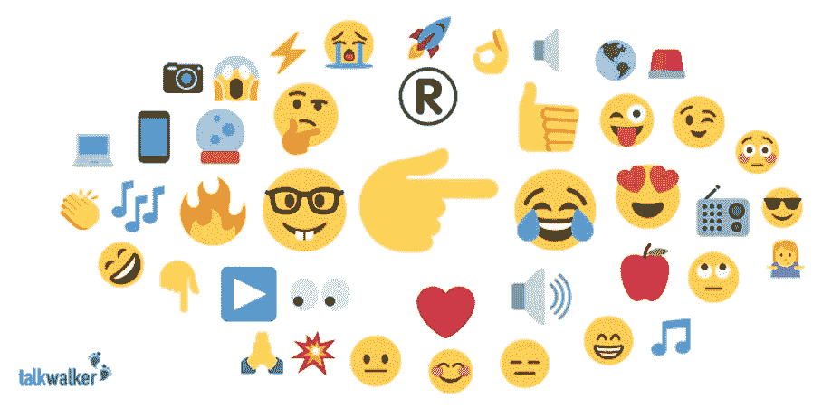**

**Source: [talkwalker](https://www.talkwalker.com/blog/emoji-analysis-crack-consumer-code)**

**好消息是，在人工智能驱动的新世界中，在几秒钟内分析这些文本片段是可能的，而且每天都在变得更好。实际上，有很多现成的类似商业工具可用，尽管你可以自己创建一个自己的应用程序，只是为了好玩！**

**在数据挖掘中，流式推文是一项有趣的练习。爱好者通常使用一个名为 [*tweepy*](http://www.tweepy.org/) 的强大 Python 库来实时访问(公共)推文。简单的想法是，我们首先(1)在线生成 [Twitter API 凭证，然后(2)使用 *tweepy* 和我们的凭证，根据我们的过滤器设置来传输推文。然后，我们可以(3)将这些流推文保存在数据库中，以便我们可以执行自己的搜索查询、NLP 操作和在线分析。大概就是这样！](http://dev.twitter.com)**

# **什么是 VADER？**

**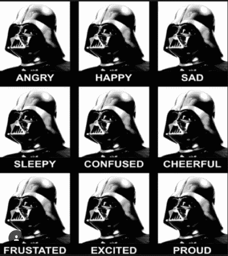**

**[source](http://t-redactyl.io/blog/2017/04/using-vader-to-handle-sentiment-analysis-with-social-media-text.html)**

**好消息是，你不需要成为深度学习或 NLP 专家就可以开始为你的想法编码。其中一个现成的预训练算法叫做[VADER](https://github.com/cjhutto/vaderSentiment)*(****V****alence****A****ware****D****ictionary 和 s****E****ntiment****R***它的算法针对 Twitter、在线新闻、电影/产品评论等社交媒体中表达的观点进行了优化。VADER 可以给我们一个积极和消极的分数，可以在-1 到 1 的范围内标准化。VADER 能够包含来自表情符号(例如，:-)、与情绪相关的首字母缩写词(例如 LoL)和俚语(例如 meh)的情绪，而算法通常会在这些地方挣扎。因此，维德是一个可怕的工具，新鲜的在线文本。**

**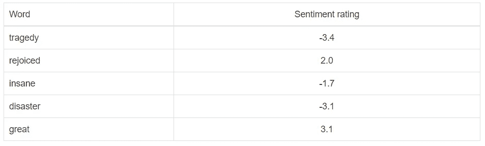**

**Source: [Medium — David Oti](https://medium.com/datadriveninvestor/sentiment-analysis-with-a-social-media-text-in-php-a8f3d5f71c42)**

**虽然 VADER 在社交媒体类型的文本上有优势，但它也不需要任何训练数据，因为它是基于化合价的、人类策划的标准情感词典。对我来说同样重要的是，它的速度足够快，可以在线使用实时流数据。VADER 的开发者使用了[亚马逊的机械土耳其人](https://www.mturk.com/)来获得他们的大部分评分，该模型在一篇名为“ [VADER:一个基于规则的社交媒体文本情感分析的简约模型”的学术论文中有完整描述。](https://www.google.com.au/url?sa=t&rct=j&q=&esrc=s&source=web&cd=1&ved=0ahUKEwigy573kZrKAhUCG6YKHYd5CvoQFggcMAA&url=http%3A%2F%2Fcomp.social.gatech.edu%2Fpapers%2Ficwsm14.vader.hutto.pdf&usg=AFQjCNH4e8g6eNiCCrqB4sEIwYY5gxTbKQ&sig2=d2NXgpP-H-_OeoNdUfnUHQ)”。**

**输入的句子首先通过一个叫做“**”的过程被拆分成几个单词。然后，通过在情感词典内进行比较，查看每个单词句子的情感值会容易得多。实际上，这里没有进行机器学习，但是这个库解析每个标记化的单词，与它的词典进行比较，并返回极性得分。这将显示推文的总体情绪得分。VADER 也有一个[开源 python 库](https://github.com/cjhutto/vaderSentiment)，可以使用常规的 pip 安装来安装。它不需要任何训练数据，并且可以足够快地处理几乎实时的流数据，因此对于我的[手来说，它是一个简单的选择。](https://social.ozgurgenc.dev/)****

# ****基础数据清理****

****任何 NLP 代码都需要做一些实时清理，以删除停用词和标点符号，降低大写字母，并根据感兴趣的语言过滤推文。Twitter API (tweepy)有一个自动检测常用语言的功能，我只过滤了英语。还有一些其他流行的 NLP 技术可以进一步应用，包括*(将单词转换为词典形式)或 [*词干*](https://en.wikipedia.org/wiki/Stemming) (将单词简化为其词根形式)，以进一步改善结果。*****

****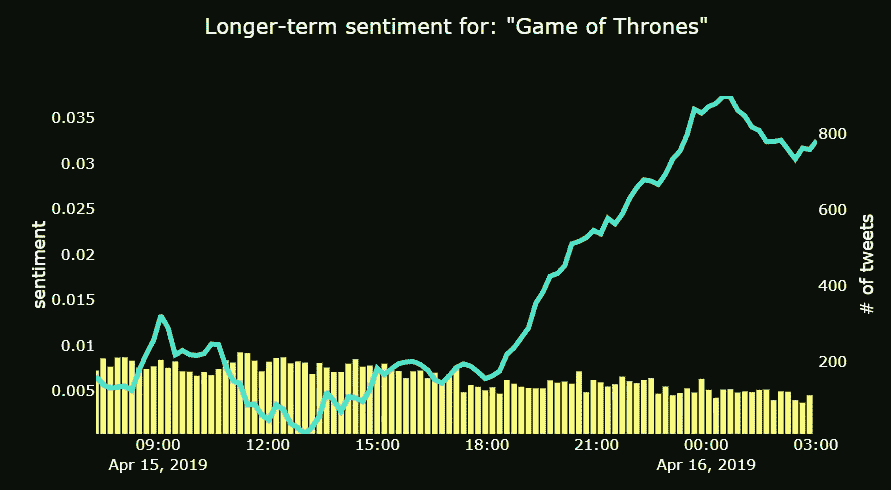****

****Source: [hands on example](https://social.ozgurgenc.dev/) — Vader sentiment for the “Game of Thrones”****

# ****使用实时 Twitter 数据的 MVP 实践示例:****

****最后，我在我的演示网站[上部署了一个示例模型来展示预训练的 NLP 模型的威力，该模型只使用实时 twitter 数据和英语推文。这个最小可行的产品是只用开源工具完成的。灵感和原代码来自于 python 编程中的](https://social.ozgurgenc.dev/)[sendex](https://www.youtube.com/user/sentdex/featured)这个[环节](https://github.com/Sentdex/socialsentiment)。我添加了一些额外的功能，比如类似谷歌的搜索体验，美国各州情感地图，以捕捉带有用户位置元数据的推文，搜索词汇的词云，以及避免崩溃的错误处理。我发现 Twitter 用户不太维护他们的“位置”,因此美国地图包含的 tweets 更少。您可以从我的 [GitHub 库](https://github.com/Sailor74/social_sentiment)下载修改后的代码，并按照这些[指令](https://www.youtube.com/watch?v=rDodciQhfS8&list=PLQVvvaa0QuDfsGImWNt1eUEveHOepkjqt&index=13&t=263s)在云上部署。代码是混乱的，因为我在有限的时间内编辑它，并开放任何帮助，使它看起来更好。****

********

****A wordcloud at my [blog](https://social.ozgurgenc.dev/) for “cobra kai”****

# ****依赖性:开源技术和云****

****工作的重要部分是安装所有这些组件并协同工作，清理数据并集成开源分析库，而 Vader 模型本身只有几行基本代码。****

****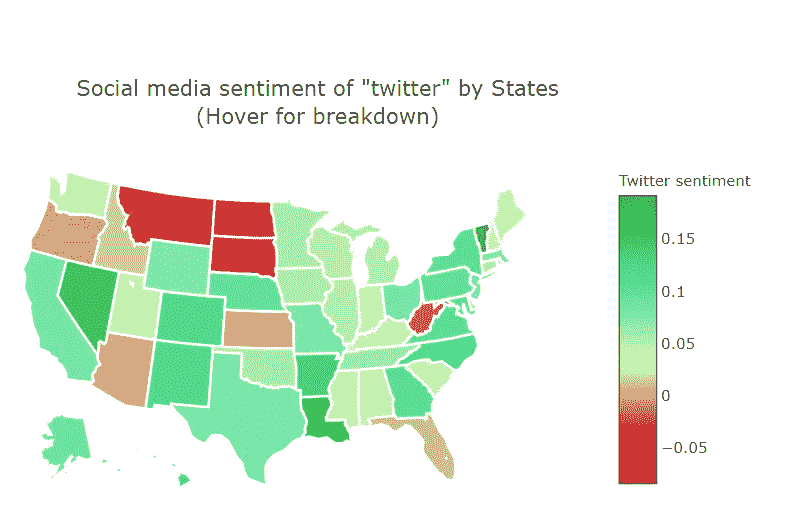****

****Example: location based sentiments for the tweets including the word “twitter” at a random time in mid-April****

******开源技术:**我把 Python 3.7 和各种开源库一起用。主要的有(1) [Tweepy](http://www.tweepy.org/) : Twitter API 库，以 JSON 格式传输公共推文(2) [SQlite3](https://www.sqlite.org/index.html) :广泛使用的轻量级关系数据库(3) [Panda](https://pandas.pydata.org/) :非常适合读取和操作数字表和 Twitter 时间序列(4) [NLTK](https://www.nltk.org/) :自然语言工具包(5) wordcloud:显而易见哈！(6) [Flask](http://flask.pocoo.org/) :用于 web 部署的微 web 框架。爱死了！(7) [Dash](https://plot.ly/products/dash/) :使您能够使用纯 python 构建令人惊叹的仪表盘(8) [Plotly](https://plot.ly/python/) :流行的 Python 图形库，用于交互式和在线绘制折线图、散点图、面积图、条形图……首先，您需要注册 Twitter API，安装依赖项，编写代码，并将其部署到您的笔记本电脑或云上。****

******云部署**:我使用 [**数字海洋**](https://m.do.co/c/7dbc2646f244) *(声明:这是一个推荐链接)*作为我的虚拟专用服务器(VPS)提供商。我使用了一个低层次的节俭服务器，因此我的演示的速度/性能不是超级快，但它的工作和 SSL 相对安全。最初我部署了 AWS Beantalks，但我不得不转向，因为可用的 Amazon Linux 发行版与我希望与我的代码集成的最新 SQlite3 数据库版本不兼容。实际上，当您处理开源工具时，这些都是典型的挑战，需要数据科学家以极大的耐心保持灵活性。有趣的是，在这种情况下，数字海洋给了我更多的控制权，而且很容易设置。另一个不错的选择是 Heroku。如果你使用 AWS，我建议使用 mySQL、MongoDB 等数据库服务(相对于 SQLite3)。如果有问题，请告诉我。****

# ****结论****

****维德模型表明，它并不完美，但安静的象征。尽管更先进、更精确的 ML 算法正在向我们走来，但任何算法都会有一些假阴性或假阳性。****

********

****[Source](http://www.knightriderarchives.com/knight_rider/season_three/knight_in_disgrace/): Michael could override KITT’s AI when needed :)****

****这些预先训练的自然语言处理能力可以很容易地重新应用于电子邮件、脸书、推特、Instagram、YouTube、Reddit、IMDB、电子零售商评论、新闻博客和公共网络。这些见解可以通过位置、人口统计、受欢迎程度、影响来分析…测量网络脉搏或生成类似人类的内容从未如此简单！可怕的是，这些很容易被社交媒体机器人或其他人用于计算宣传…小心！****

****人工智能/机器学习实现了民主化，并使您能够实时获得针对您所在领域的关键见解。尽管如果你不打算根据洞察力采取行动，跟踪本身可能不值得。****

****未来的幸存者将需要转变他们的流程和资源，以适应这个数据和算法丰富的新时代。****

****2019 年快乐学习！还有…****

> ****不要忘记活在当下！****

********

****John Blanding/The Boston Globe via Getty Image****

******资源**:****

****Source: [Sentiment analysis video](https://www.youtube.com/watch?v=rDodciQhfS8&list=PLQVvvaa0QuDfsGImWNt1eUEveHOepkjqt&index=13&t=263s)****

**** [## 使用 Python 中的 VADER 简化情感分析(在社交媒体文本上)

### 一个易于使用的 Python 库，专为社交媒体文本的情感分析而构建。

medium.com](https://medium.com/analytics-vidhya/simplifying-social-media-sentiment-analysis-using-vader-in-python-f9e6ec6fc52f)  [## 改变你未来沟通方式的 7 种 NLP 技术(上)

### 什么是 NLP？

heartbeat.fritz.ai](https://heartbeat.fritz.ai/the-7-nlp-techniques-that-will-change-how-you-communicate-in-the-future-part-i-f0114b2f0497)  [## 深度学习 NLP 的十大趋势

### 2018 年是基于深度学习的自然语言处理(NLP)研究繁忙的一年。在此之前最高…

blog.floydhub.com](https://blog.floydhub.com/ten-trends-in-deep-learning-nlp/)  [## 单词向量简介

### 词向量

medium.com](https://medium.com/@jayeshbahire/introduction-to-word-vectors-ea1d4e4b84bf)  [## 使用 Python 中的 VADER 简化情感分析(在社交媒体文本上)

### 一个易于使用的 Python 库，专为社交媒体文本的情感分析而构建。

medium.com](https://medium.com/analytics-vidhya/simplifying-social-media-sentiment-analysis-using-vader-in-python-f9e6ec6fc52f)  [## VADER 情绪分析解释-数据与媒体相遇

### VADER(情感推理的效价感知词典)是一个用于文本情感分析的模型

datameetsmedia.com](http://datameetsmedia.com/vader-sentiment-analysis-explained/)****