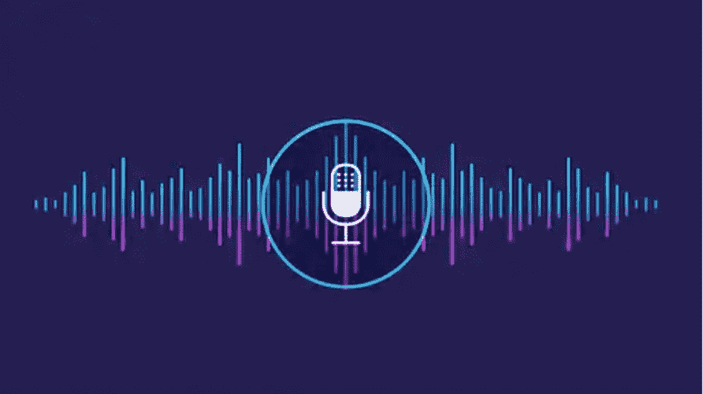
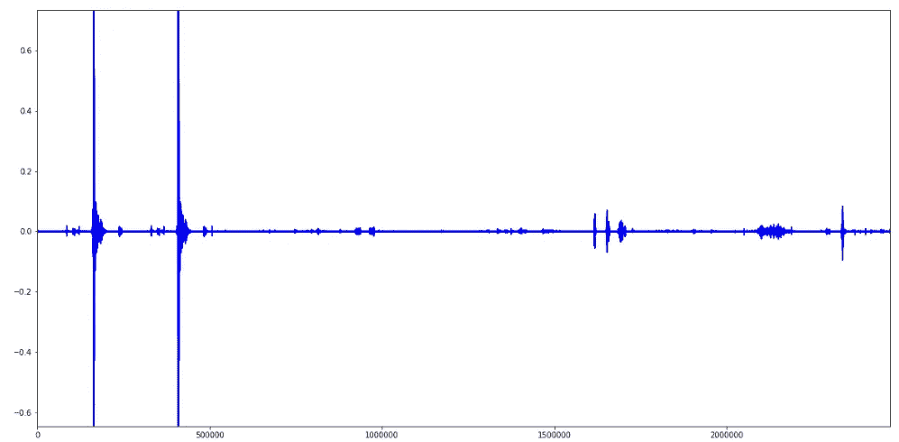

# 实时声音事件分类

> 原文：<https://towardsdatascience.com/real-time-sound-event-classification-83e892cf187e?source=collection_archive---------8----------------------->



我在之前的一篇文章中介绍了一种使用机器学习对声音事件进行分类的方法。在之前的帖子中，声音事件是作为小音频片段单独捕获的。因此，不需要分割过程。这些独立的音频片段被用来训练神经网络并对其进行测试。在这篇文章中，我将介绍一种对声音事件进行分类的方法，这些声音事件在一个音频片段(或一个音频流)中按顺序连接在一起。我们必须对事件进行分类，并给它们一个标签，以及相关音频片段或音频流的时间戳。让我们称之为时间标签。注意，这里将重复使用用于分类孤立声音事件的相同程序。所以我强烈推荐你先看完[上一篇](https://medium.com/@chathuranga.15/sound-event-classification-using-machine-learning-8768092beafc)。

让我们来看看一个样本音频片段的波形，我们将对其进行时间标记。



A sequence of sound events

时间标记的建议方法如下。

1.使用普通噪声样本降低噪声

2.将音频剪辑拆分成包含音频剪辑的单个声音事件

3.修剪单个声音事件音频片段的开头和结尾静音。

4.使用先前训练的神经网络对单个声音事件片段进行分类

5.输出时间标签。

该过程适用于没有两个声音事件同时发生的情况。这是因为我们在这里使用的预测模型只针对孤立的声音事件进行训练。让我们假设噪声在整个声音事件系列中保持不变。让我们来看看用单个声音事件连接片段执行上述步骤。然后，在文章的最后，我将介绍一种使用麦克风的音频流实时分类声音事件的方法。

您可以通过连接一些单个音频片段来准备样本，如下所示。

```
raw_audio = numpy.concatenate((raw_audio,data))
```

按如下方式降低均匀分布的噪声。

```
noisy_part = raw_audio[0:50000]  # Empherically selected noisy_part position for every sample
nr_audio = nr.reduce_noise(audio_clip=raw_audio, noise_clip=noisy_part, verbose=False)
```

# 分割音频剪辑

现在，我们已经到了连续声音事件识别的核心思想。对声音事件序列进行分类的挑战在于确定这些声音事件的起点和终点。几乎总是在两个声音事件之间有一个无声部分。请注意，在一些声音事件中，可能会有静默。我们可以用这些无声部分来分割一系列声音事件。看看下面用来完成任务的代码。注意到参数`tolerence`用于调整分割灵敏度。从而一个声音事件内的小无声部分不会被用来进一步分割相应的声音事件。

```
# Split a given long audio file on silent parts.
# Accepts audio numpy array audio_data, window length w and hop length h, threshold_level, tolerence
# threshold_level: Silence threshold
# Higher tolence to prevent small silence parts from splitting the audio.
# Returns array containing arrays of [start, end] points of resulting audio clips
def split_audio(audio_data, w, h, threshold_level, tolerence=10):
    split_map = []
    start = 0
    data = np.abs(audio_data)
    threshold = threshold_level*np.mean(data[:25000])
    inside_sound = False
    near = 0
    for i in range(0,len(data)-w, h):
        win_mean = np.mean(data[i:i+w])
        if(win_mean>threshold and not(inside_sound)):
            inside_sound = True
            start = i
        if(win_mean<=threshold and inside_sound and near>tolerence):
            inside_sound = False
            near = 0
            split_map.append([start, i])
        if(inside_sound and win_mean<=threshold):
            near += 1
    return split_map
```

该算法使用具有跳跃长度`h`的固定大小的窗口`w`。窗口在给定音频上滑动，检查窗口的平均振幅。如果振幅低于给定的`threshold_level`，算法会增加一个名为`near`的内部参数。当参数`near`获得大于参数`tolerence`的值时，确定音频剪辑结束分割点。同样，音频剪辑起始分割点也是使用窗口平均振幅来确定的。注意，内部布尔参数`inside_sound`被维护以区分开始和结束分割点。

# 修剪单个声音事件音频片段

现在，我们已经将我们的音频剪辑分成单个声音事件。小音频片段需要修剪它们的前导和拖尾无声部分。让我们使用`librosa`来完成任务。

```
sound_clips = split_audio(nr_audio, 10000, 2500, 15, 10)
for intvl in sound_clips:
    clip, index = librosa.effects.trim(nr_audio[intvl[0]:intvl[1]],       top_db=20, frame_length=512, hop_length=64)
```

注意`split_audio`仅提供时间标记间隔。我们需要在`nr_audio[intvl[0]:intvl[1]]`之前获得实际的音频剪辑。

# 对声音事件进行分类

为了对孤立的声音片段进行分类，我们可以使用来自[先前帖子](https://medium.com/@chathuranga.15/sound-event-classification-using-machine-learning-8768092beafc)的经过训练的神经网络模型。

```
#Load segment audio classification model
model_path = r"best_model/"
model_name = "audio_NN3_grouping2019_10_01_11_40_45_acc_91.28"# Model reconstruction from JSON file
with open(model_path + model_name + '.json', 'r') as f:
    model = model_from_json(f.read())# Load weights into the new model
model.load_weights(model_path + model_name + '.h5')
```

创建该模型是为了使用标签编码器预测标签。我们还需要在这里复制标签编码器。

```
# Replicate label encoder
lb = LabelEncoder()
lb.fit_transform(['Calling', 'Clapping', 'Falling', 'Sweeping', 'WashingHand', 'WatchingTV','enteringExiting','other'])
```

为了使用加载的模型对音频剪辑进行分类，我们需要绝对平均 STFT 特征。看看下面完成这项任务的代码。注意，该函数接受标签编码器`lb` 作为输入，以产生一个有意义的标签作为声音事件。

```
def predictSound(X, lb):
    stfts = np.abs(librosa.stft(X, n_fft=512, hop_length=256, win_length=512))
    stfts = np.mean(stfts,axis=1)
    stfts = minMaxNormalize(stfts)
    result = model.predict(np.array([stfts]))
    predictions = [np.argmax(y) for y in result]
    return lb.inverse_transform([predictions[0]])[0]
```

现在，我们可以在上述修剪操作后立即对隔离的剪辑使用`predictSound`功能。访问 GitHub [库](https://github.com/chathuranga95/SoundEventClassification)获取完整代码和分类示例。

# 实时声音事件识别

到目前为止，我们一直在研究声音事件的记录序列。如果我们想做同样的事情，但不需要记录，而是实时的。为此，我们可以使用麦克风输入流缓冲到一个临时缓冲区，并在缓冲区上工作。IO 可以用 python 库轻松处理，比如 [PyAudio](https://pypi.org/project/PyAudio/) (文档[这里](https://people.csail.mit.edu/hubert/pyaudio/docs/))。查看 GitHub [库](https://github.com/chathuranga95/SoundEventClassification)的实现。

希望这篇文章对你有用。