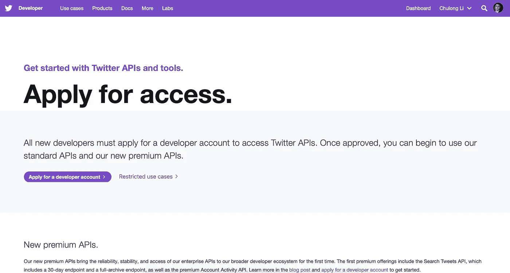
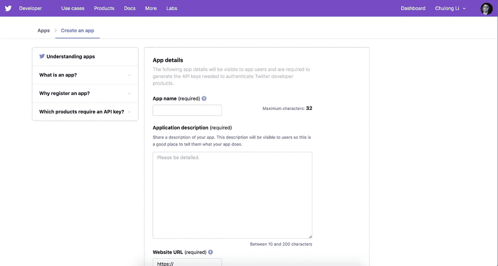
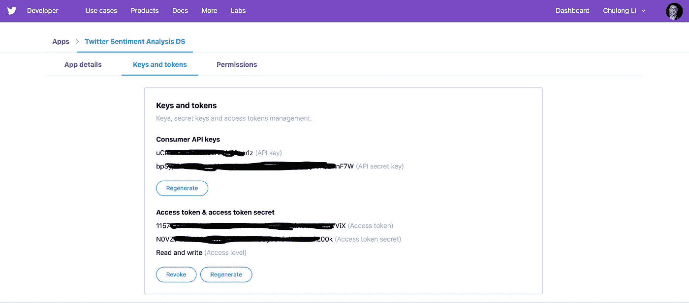

# 用于品牌提升和话题跟踪的实时 Twitter 情感分析(第 1/3 章)

> 原文：<https://towardsdatascience.com/real-time-twitter-sentiment-analysis-for-brand-improvement-and-topic-tracking-chapter-1-3-e02f7652d8ff?source=collection_archive---------5----------------------->

## 行业中的数据科学

## 通过 Tweepy、MySQL 和 Python 使用流 Twitter API 收集 Twitter 数据


Photo by [Riccardo Chiarini](https://unsplash.com/@riccardoch?utm_source=medium&utm_medium=referral) on [Unsplash](https://unsplash.com?utm_source=medium&utm_medium=referral)

这是一个全面的分步教程，教你如何建立一个端到端的实时 Twitter 监控系统，通过识别情绪波动，分析趋势话题和地理细分，检测丑闻的异常，跟踪客户对品牌的行为，并考虑提高品牌的客户参与度和保留率。


[https://twitter-analysis-web-app.herokuapp.com](https://twitter-analysis-web-app.herokuapp.com)

你可以试试这个很棒的[网络应用](https://twitter-analysis-web-app.herokuapp.com)并找到[的完整代码](https://github.com/Chulong-Li/Real-time-Sentiment-Tracking-on-Twitter-for-Brand-Improvement-and-Trend-Recognition)！

**技术栈:** Python，Tweepy，Numpy，Pandas，Seaborn，Plotly，Dash，Scala Kafka，Spark，MySQL，RE，TextBlob，NLTK，HTML，CSS，Flask，JavaScript，React.js 和 Git

由于这是一个全面的端到端 Twitter 监控系统，我将把它分成 3 章来解释引擎盖下的细节和行动背后的直觉。

*   **第 1 章(你来了！):**通过 Tweepy、MySQL、& Python 使用流 Twitter API 收集 Twitter 数据
*   [**第二章**](http://bit.ly/2PzXG5M) **:** 使用 RE、TextBlob、NLTK 和 Plotly 的 Twitter 情感分析和交互式数据可视化
*   [**第三章**](http://bit.ly/2msOUbR) **:** 使用 Python 中的 Dash & Plotly 在 Heroku 上部署一个实时的 Twitter 分析 Web App
*   **第 4 章**(可选) **:** 使用 Scala、Kafka 和 Spark 流媒体实现流媒体 Twitter 情感分析的并行化

这个系统是什么？这个实时的端到端 Twitter 监控系统是为企业设计的，用于评估 Twitter 数据，为商业决策提供信息。正如我们所知，twitter 是一个实时高通量数据源的好地方，平均每秒 6000 条推文，我们可以用它来发现突发新闻故事，识别行业趋势，并及时采取行动。在实践中，实时跟踪关于某个品牌的所有相关 Twitter 内容，随着话题或问题的出现进行分析，并通过警报检测异常情况。通过监控 Twitter 上的品牌提及，品牌可以通知执行机构，并为全球客户提供更好的体验。

## 访问 Twitter API——成为一名出色的 Twitter 开发者



Apply for a developer account

为了开始使用 Twitter APIs，我们需要先[申请一个开发者账户](https://developer.twitter.com/en/apply-for-access)。它允许你访问 Twitter APIs 和其他工具。



Create an app

然后我们[创建一个应用](https://developer.twitter.com/en/apps)来生成两个 API 密匙和两个访问令牌。这是调用 Twitter APIs 最重要的部分。整个过程可能需要几分钟，但应该很容易完成。



Consumer API keys and Access token & access token secret

现在，在右上角您的 Twitter 名称下的**应用程序**中，点击您的应用程序右侧的**详细信息**按钮(这不是仪表板按钮)。然后点击副标题中的**键和令牌**。创建一个名为 *credentials.py* 的文件，并将&粘贴到该文件中。

```
#credentials.py
API_KEY = 'XXXXXXXXXX'
API_SECRET_KEY = 'XXXXXXXXXXXXXXXXXXXX'ACCESS_TOKEN = 'XXXXXXXXXXXXXXXXXXXXXXX'
ACCESS_TOKEN_SECRET = 'XXXXXXXXXXXXXXXXXXX'
```


Photo by [Sebastian B](https://unsplash.com/@sebastianb?utm_source=medium&utm_medium=referral) on [Unsplash](https://unsplash.com?utm_source=medium&utm_medium=referral)

## 使用 Tweepy、MySQL 和 Python 流式传输 Twitter 数据

我们将使用一个名为 [**Tweepy**](https://github.com/tweepy/tweepy) 的 python 库来监听流 Twitter 数据。创建一个名为 *Main.ipynb* 的新文件，让我们开始吧。注:我用 Jupyter 笔记本是为了更好的开发探索，你也可以用。改为 py。如果你感兴趣，你可以通过 Tweepy 的 Tweepy 在线文档来查看这个[流。你可以在这里查看我的**全代码版本**](http://docs.tweepy.org/en/latest/streaming_how_to.html)。

首先，我们需要创建一个 Tweepy 的 **StreamListener** ，它具有用于接收 tweets 的 **on_status** 方法和用于由于速率限制而停止抓取数据的 **on_error** 方法。推文被称为“状态更新”。因此
Tweepy 中的**状态**类具有描述 tweet 的属性。

```
# Part of **MyStreamListener** in *Main.ipynb*
*# Streaming With Tweepy* 
*# Override tweepy.StreamListener to add logic to on_status*
**class** **MyStreamListener**(tweepy.StreamListener):

    **def** on_status(self, status):
 *# Extract info from tweets*
        id_str = status.id_str
        created_at = status.created_at
        user_created_at = status.user.created_at
        # ...... and more! 
        # I'll talk about it below! (Or check full-code link above) **def** on_error(self, status_code):
        *'''*
 *Since Twitter API has rate limits, 
        stop srcraping data as it exceed to the thresold.*
 *'''*
        **if** status_code == 420:
            *# return False to disconnect the stream*
            **return** **False**
```

然后，使用 Tweepy 中的 [Oauth 进行认证，向 Twitter 注册我们的应用程序。](http://docs.tweepy.org/en/latest/auth_tutorial.html#auth-tutorial)

```
# **Oauth** part in *Main.ipynb* # *Import api/access_token keys from* credentials.pyimport credentials.py
auth  = tweepy.OAuthHandler(credentials.API_KEY, \
                            credentials.API_SECRET_KEY)
auth.set_access_token(credentials.ACCESS_TOEKN,  \
                      credentials.ACCESS_TOKEN_SECRET)
api = tweepy.API(auth)
```

现在，用 Oauth 启动**流线型监听器**。在**过滤器**方法中，设置推文语言偏好和**跟踪单词**，后者是一个单词列表(例如[‘脸书’])。目前，我们使用 Twitter 的免费标准流。查看 [Twitter 流 API 文档](https://developer.twitter.com/en/docs/tweets/filter-realtime/overview)以了解不同的流具有不同的功能和限制。

```
myStreamListener = MyStreamListener()
myStream = tweepy.Stream(auth = api.auth, listener = myStreamListener)
myStream.filter(languages=["en"], track = settings.TRACK_WORDS)*# However, this part won't be reached as the stream listener won't stop automatically. Press STOP button to finish the process.*
```

然后，创建并连接 **MySQL** 本地数据库，以便进一步分析和存储。你可以在这里下载最新版本的[。我们用的版本是 MySQL 社区版，非常流行的开源数据库。根据内置指南设置 MySQL 数据库，数据库信息如下。](https://dev.mysql.com/downloads/mysql/)

```
mydb = mysql.connector.connect(
    host="localhost",
    user="root",
    passwd="password",
    database="TwitterDB",
    charset = 'utf8'
)
```

如果表不存在，我们需要创建一个新表。当然第一次的时候应该是不存在的。所以我们用下面的自动检查代码创建它。

```
**if** mydb.is_connected():
    mycursor = mydb.cursor()
    mycursor.execute("""
        SELECT COUNT(*)
        FROM information_schema.tables
        WHERE table_name = '**{0}**'
        """.format(TABLE_NAME))
    **if** mycursor.fetchone()[0] != 1:
        mycursor.execute("CREATE TABLE **{}** (**{}**)" \
            .format(TABLE_NAME, TABLE_ATTRIBUTES))
        mydb.commit()
    mycursor.close()
```

在 **on_status** 方法中指定接收和预处理 Twitter 数据的细节。**状态**中的属性与[推文对象](https://developer.twitter.com/en/docs/tweets/data-dictionary/overview/tweet-object)中的属性相同。

*   *id_str* 是 Tweets Id 的字符串格式
*   *created_at* 是创建推文的时间
*   *文字*是推文的内容
*   *极性&主观性*是使用 **TextBlob** NLP 库进行核心情感分析的情感值

像 *user_created_at* 、 *user_location* 、 *user_description* 和 *user_followers_count* 这样的属性在[用户对象](https://developer.twitter.com/en/docs/tweets/data-dictionary/overview/user-object)中，它是 Tweet 对象的一部分。此外，c *坐标*包括*经度*和*纬度*是 JSON 格式的另一个对象 [Geo 对象](https://developer.twitter.com/en/docs/tweets/data-dictionary/overview/geo-objects)。

```
*# Extract info from tweets* **def** on_status(self, status):
    **if** status.retweeted:
        *# Avoid retweeted info, and only original tweets will 
        # be received*
        **return** **True**
    *# Extract attributes from each tweet*
    id_str = status.id_str
    created_at = status.created_at
    text = deEmojify(status.text)    *# Pre-processing the text* 
    sentiment = TextBlob(text).sentiment
    polarity = sentiment.polarity
    subjectivity = sentiment.subjectivity

    user_created_at = status.user.created_at
    user_location = deEmojify(status.user.location)
    user_description = deEmojify(status.user.description)
    user_followers_count =status.user.followers_count
    longitude = **None**
    latitude = **None**
    **if** status.coordinates:
        longitude = status.coordinates['coordinates'][0]
        latitude = status.coordinates['coordinates'][1]

     retweet_count = status.retweet_count
     favorite_count = status.favorite_count # Quick check contents in tweets
     print(status.text)
     print("Long: **{}**, Lati: **{}**".format(longitude, latitude))

     *# Store all data in MySQL*
     **if** mydb.is_connected():
         mycursor = mydb.cursor()
         sql = "INSERT INTO **{}** (id_str,created_at,text,polarity,\
            subjectivity, user_created_at, user_location,\
            user_description, user_followers_count, longitude,\
            latitude, retweet_count, favorite_count) VALUES \
            (**%s**, **%s**, **%s**, **%s**, **%s**, **%s**, **%s**, **%s**, **%s**, **%s**, **%s**, **%s**, **%s**)" \ 
            .format(TABLE_NAME)
          val = (id_str, created_at, text, polarity, subjectivity,\
             user_created_at, user_location, user_description,\ 
             user_followers_count, longitude, latitude,\ 
             retweet_count, favorite_count)
          mycursor.execute(sql, val)
          mydb.commit()
          mycursor.close()
```

最后，为了允许 tweet 文本存储在 MySQL 中，我们需要做一点处理，通过剥离所有非 ASCII 字符来删除**表情符号**，即使数据库的字符集是 utf8。

```
**def** deEmojify(text):
    **if** text:
        **return** text.encode('ascii', 'ignore').decode('ascii')
    **else**:
        **return** **None**
```

这是我的第一篇技术文章，我感谢任何反馈！