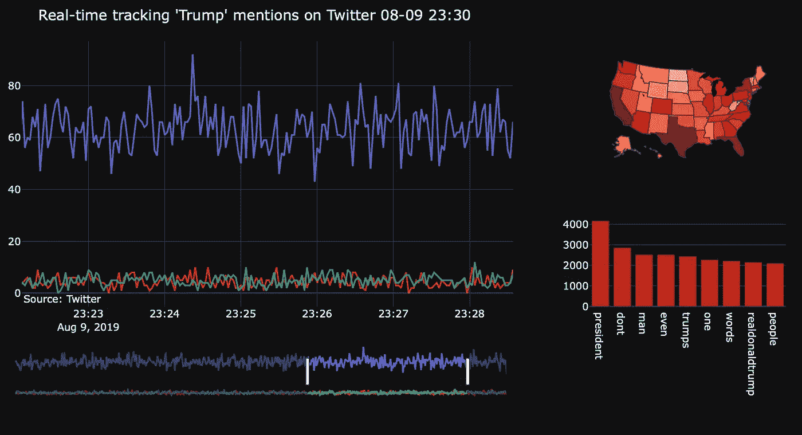
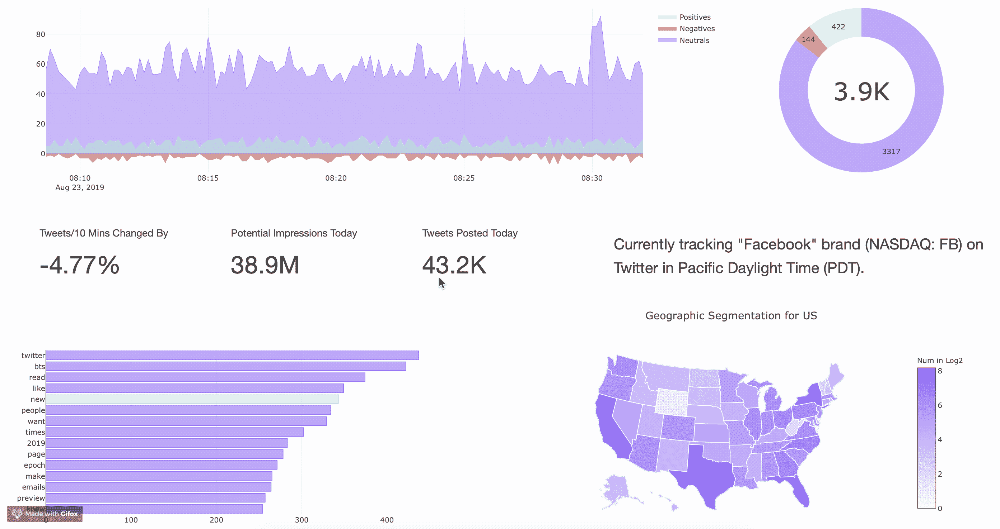
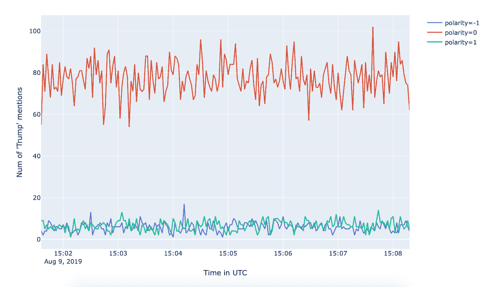
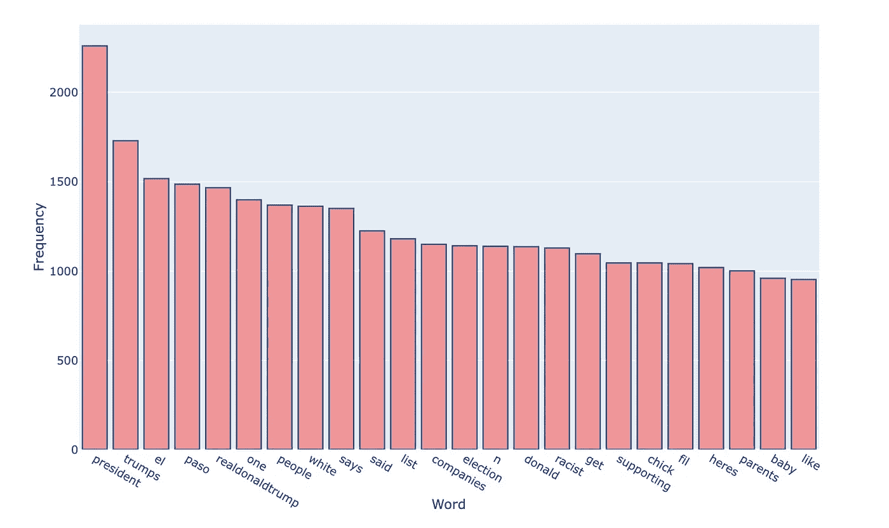
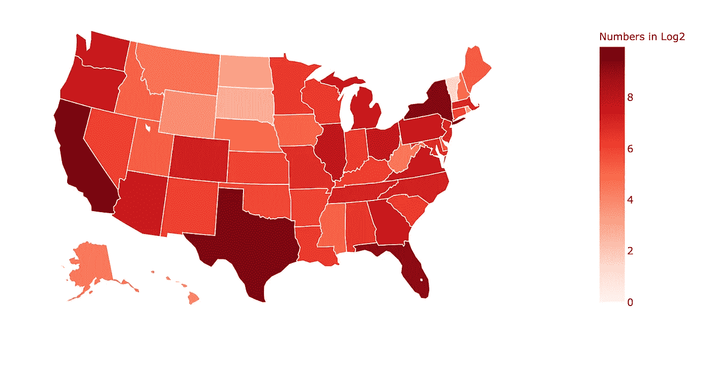
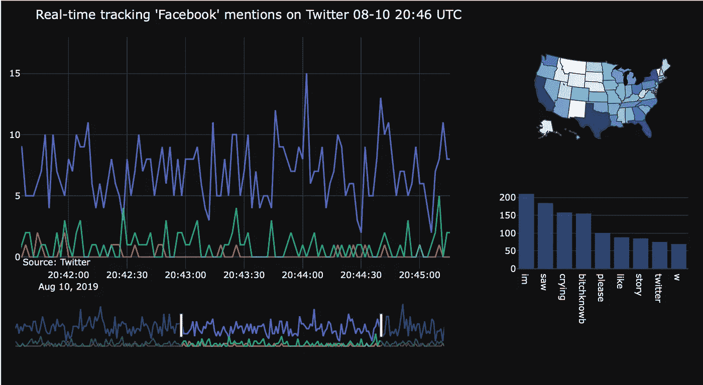

# 用于品牌提升和话题跟踪的实时 Twitter 情感分析(第 2/3 章)

> 原文：<https://towardsdatascience.com/real-time-twitter-sentiment-analysis-for-brand-improvement-and-topic-tracking-chapter-2-3-1caf05346721?source=collection_archive---------6----------------------->

## 行业中的数据科学

## 使用 RE、TextBlob、NLTK 和 Plotly 进行 Twitter 情感分析和交互式数据可视化


Photo by [Jonatan Pie](https://unsplash.com/@r3dmax?utm_source=medium&utm_medium=referral) on [Unsplash](https://unsplash.com?utm_source=medium&utm_medium=referral)

教程将教你如何一步一步地在 Twitter 数据上应用 1) **自然语言处理**和**情感分析**，2)利用 **Plotly** 构建一个**交互式数据可视化**。

这是一个独立的组件，用于执行情绪分析和话题跟踪，并在 Jupiter Notebook 上构建分析仪表板，尽管它是我的综合实时 Twitter 监控系统教程的第二部分。在前一章中解释并实现了流 Twitter 数据收集。

*   [**第 1 章**](/real-time-twitter-sentiment-analysis-for-brand-improvement-and-topic-tracking-chapter-1-3-e02f7652d8ff) **:** 使用 Tweepy、MySQL、& Python 的流 Twitter API 收集 Twitter 数据
*   **第二章(你来了！):**使用 RE、TextBlob、NLTK 和 Plotly 进行 Twitter 情感分析和交互式数据可视化
*   [**第三章**](http://bit.ly/2msOUbR) **:** 使用 Python 中的 Dash & Plotly 在 Heroku 上部署一个实时的 Twitter 分析 Web App
*   **第 4 章**(可选) **:** 使用 Scala、Kafka 和 Spark Streaming 实现流媒体 Twitter 情感分析的并行化



Data Visualization based on Plotly in this Chapter

上面的[](https://nbviewer.jupyter.org/github/Chulong-Li/Real-time-Sentiment-Tracking-on-Twitter-for-Brand-Improvement-and-Trend-Recognition/blob/master/Trend_Analysis_Complex.ipynb)**分析仪表板(带完整代码)就是我们今天要做的，它为下一章的 [**实时 Twitter 监控 Web App**](http://bit.ly/30VS87a) 奠定了基础，因为 Dash(python framework for analytical Web apps)是在 Plotly 之上编写的。查看我的 [**GitHub 回购**](http://bit.ly/33UKT12) 了解更多详情。**

****

**Web App based on Dash-Plotly in next chapter**

****第**章的技术栈:RE，NLTK，TextBlob，Plotly，MySQL，Python (time，datetime，math，itertools)**

*   **[**RE**](https://docs.python.org/3.7/library/re.html) : **正则表达式**识别给定字符序列中是否存在模式的操作**
*   **[**NLTK**](https://www.nltk.org) : **自然语言**工具包，构建 Python 程序处理人类语言数据的领先平台**
*   **[**TextBlob**](https://textblob.readthedocs.io/en/dev/) : **自然语言处理**库，用于处理文本数据，提供一个**简单的 API** 用于潜入普通的 NLP。**
*   **[](https://plot.ly/python/)**:一个**交互式**，开源的，基于浏览器的**Python 图形库******

## ****加载和准备 Twitter 数据****

****首先，我们需要从数据源中提取 Twitter 数据。简单起见可以直接从`sample_data.csv`开始读。****

```
**df = pd.read_csv("sample_data.csv")**
```

****或者以一种更正式的方式，从我们的 MySQL 数据库中提取数据，该数据库已经在第 1 章中建立并填充了实时 Twitter 数据。****

```
**db_connection = mysql.connector.connect(
    host="localhost",
    user="root",
    passwd="password",
    database="TwitterDB",
    charset = 'utf8'
 )
time_now = datetime.datetime.utcnow()
time_10mins_before = datetime.timedelta(hours=0,minutes=10)) \
    .strftime('%Y-%m-%d %H:%M:%S'
time_interval = time_now - time_10mins_before**
```

****读取过去 30 分钟内发布的数据，并通过 SQL 查询将其加载到 Pandas DataFrame 中。****

```
**query = "SELECT id_str, text, created_at, polarity,          \
         user_location FROM **{}** WHERE created_at >= '**{}**'"     \
        .format(settings.TABLE_NAME, time_interval)
df = pd.read_sql(query, con=db_connection)**
```

****然后把 DATETIME (MySQL 数据类型)转换成 Datetime (Pandas 数据类型)。****

```
***# UTC for date time at default*
df['created_at'] = pd.to_datetime(df['created_at'])**
```

## ****使用[文本块](https://textblob.readthedocs.io/en/dev/)进行情感分析****

****情感分析的核心是使用 TextBlob，以便从 tweet 文本中提取**极性** & **主观性**，这实际上是上一章为了更好地存储数据而进行的数据预处理。负面推文代表-1，正面推文代表+1，中性推文代表 0。****

```
**from **textblob** import TextBlob
sentiment = TextBlob(tweet_text).sentiment
polarity = sentiment.polarity
subjectivity = sentiment.subjectivity**
```

****将整个时间序列转换为 2 秒一组，并计算每个时间间隔组中每种极性(例如-1、0 和 1)的情绪数量。****

****应用**拆栈**技术以确保每组中的所有类别都被显示，即使其中一个类别没有任何值。因为我们只显示最近 30 分钟内发布的实时推文，所以在实践中，2 秒间隔的组最好显示在屏幕上。之后，重命名这些列，使它们能够自我解释。****

```
***# Clean and transform data to enable time series*
result = df.groupby(                                        \
      [pd.Grouper(key='created_at', freq='2s'), 'polarity'] \
    ).count().unstack(fill_value=0).stack().reset_index()

result = result.rename(columns=                             \
    { "id_str": "Num of '{}' mentions".format(TRACK_WORD),  \
      "created_at":"Time in UTC" })**
```

****以 2 秒的间隔记录时间序列，以便进一步使用索引。****

```
**time_series = result["Time in UTC"][result['polarity']==0]  \ 
    .reset_index(drop=**True**)**
```

****使用简单的[**Plotly Express**](https://plot.ly/python/plotly-express/)快速可视化折线图。注意:Plotly Express 是一个简洁、一致、高级的`plotly.graph_objects`包装器，用于快速数据探索和图形生成。****

```
**import **plotly.express** as px
fig = px.line(result, x='Time in UTC',                      \
    y="Num of '{}' mentions".format(TRACK_WORD),            \
    color='polarity')
fig.show()**
```

********

****Line Chart for Sentiment Analysis****

## ******使用 RE 的自然语言处理的主题跟踪& NLTK******

****为了跟踪推文中最热门的词或最常用的符号，我们加入所有推文，删除 URL，清除“RT”和“T36”(也称为“T37”)amp；。)符号，并将所有字符转换成小写。****

```
**content = ' '.join(df["text"])
content = re.sub(r"http\S+", "", content)
content = content.replace('RT ', ' ').replace('&amp;', 'and')
content = re.sub('[^A-Za-z0-9]+', ' ', content)
content = content.lower()**
```

****第一次使用 python 脚本从 NLTK 下载这两个文件。 [**Punkt 句子分词器**](https://www.nltk.org/api/nltk.tokenize.html#module-nltk.tokenize.punkt) 用于通过使用无监督算法将文本分成一系列句子。****

```
***import nltk
nltk.download('punkt')*
*nltk.download('stopwords')***
```

****然后**从所有推文中对整个文本进行**分词，使用 [**停用词**](https://www.geeksforgeeks.org/removing-stop-words-nltk-python/) 去除常用词，并提取所有词的 [**频率分布**](http://www.nltk.org/api/nltk.html?highlight=freqdist#nltk.probability.FreqDist) 中最常见的 10 个词。****

```
**from **nltk.probability** import FreqDist
from **nltk.tokenize** import word_tokenize
from **nltk.corpus** import stopwordstokenized_word = word_tokenize(content)
stop_words=set(stopwords.words("english"))
filtered_sent=[]
**for** w **in** tokenized_word:
    **if** w **not** **in** stop_words:
        filtered_sent.append(w)
fdist = FreqDist(filtered_sent)
fd = pd.DataFrame(fdist.most_common(10),                    \
    columns = ["Word","Frequency"]).drop([0]).reindex()**
```

****再次使用简单的 [**图形表达**](https://plot.ly/python/plotly-express/) 快速可视化条形图。****

```
**import **plotly.express** as px
fig = px.bar(fd, x="Word", y="Frequency")
fig.update_traces(marker_color='rgb(240,128,128)',          \
    marker_line_color='rgb(8,48,107)',                      \
    marker_line_width=1.5, opacity=0.8)
fig.show()**
```

********

****Bar Chart for Topic Tracking****

## ****文本处理中的地理分割识别****

****为了探索用户的地理分布，我们需要通过他们的**用户资料**来识别他们的**位置**，而不是附有推文的位置，因为只有不到 1%的人会附上他们的推文位置。然而，根据用户简档中的位置，它们可能包括一个或多个县、城市、州、国家或星球。因此，将这些数据过滤成美国州级位置是地理分段识别的核心。****

****将所有**状态名**及其**缩写**设置为常量，用于进一步的缩写-名称转换。****

```
**STATES = ['Alabama', 'AL', 'Alaska', 'AK',                    \ 
    ...... # Text hided for readability                       \
    'WV', 'Wisconsin', 'WI', 'Wyoming', 'WY']STATE_DICT = dict(itertools.zip_longest(*[iter(STATES)] * 2, fillvalue=""))
INV_STATE_DICT = dict((v,k) **for** k,v **in** STATE_DICT.items())**
```

****通过**迭代**州名列表和用户位置列表，从他们的位置提取州信息。****

```
**is_in_US=[]
geo = df[['user_location']]
df = df.fillna(" ")
**for** x **in** df['user_location']:
    check = **False**
    **for** s **in** STATES:
        **if** s **in** x:
            is_in_US.append(STATE_DICT[s] **if** s **in** STATE_DICT **else** s)
            check = **True**
            **break**
    **if** **not** check:
        is_in_US.append(**None**)

geo_dist = pd.DataFrame(is_in_US, columns['State'])           \
    .dropna().reset_index()**
```

****统计美国各州发布的推文数量，用**对数**数字避开**极值**(如加州 500+，北达科他州 3)更好的可视化。****

```
**geo_dist = geo_dist.groupby('State').count().                 \ 
    rename(columns={"index": "Number"}).sort_values(          \
    by=['Number'], ascending=**False**).reset_index()
geo_dist["Log Num"] = geo_dist["Number"]                      \
    .apply(**lambda** x: math.log(x, 2))**
```

****为稍后仪表板上的悬停文本添加说明性文本信息。****

```
**geo_dist['Full State Name'] = geo_dist['State']               \
    .apply(**lambda** x: INV_STATE_DICT[x])
geo_dist['text'] = geo_dist['Full State Name'] + '<br>' +     \
    'Num: ' + geo_dist['Number'].astype(str)**
```

****这一次，我们使用 **Plotly** (不是 Plotly Express)来可视化美国地图。****

******注** : `plotly.graph_objects`是 Plotly 库的核心，包含更多通用函数，用于更复杂的用途。`locationmode`是“仓位”中仓位匹配条目的集合。`text`是悬停文本。`marker_line_color`是状态间线条标记的颜色。设置`geo_scope`将地图范围限制在美国。****

```
**import **plotly.graph_objects** as go
fig = go.Figure(data=go.Choropleth(
    locations=geo_dist['State'], *# Spatial coordinates*
    z = geo_dist['Log Num'].astype(float), *# Data to be color-coded*

    locationmode = 'USA-states', 
    colorscale = "Reds",
    text=geo_dist['text'],
    marker_line_color='white', *# line markers between states*
    colorbar_title = "Numbers in Log2"
))

fig.update_layout(
    geo_scope='usa', 
)

fig.show()**
```

****************

****Photo by [Karsten Würth (@karsten.wuerth)](https://unsplash.com/@karsten_wuerth?utm_source=medium&utm_medium=referral) on [Unsplash](https://unsplash.com?utm_source=medium&utm_medium=referral)****

## ****带有 [Plotly](https://plot.ly/python/) 的交互式分析仪表板****

****现在我们可以使用`Plotly.subplots`将所有数据可视化部分集成到一个**仪表板**中。同时显示多个图形可以大大提高阅读效率，增强多个见解之间的可比性。****

********

****首先创建一个包含 2 个 **×** 2 个**支线剧情**的**剧情图**，左边是**线图**，右上角是**贴图**，右下角是**条形图**。****

```
**from **plotly.subplots** import make_subplots
fig = make_subplots(
        rows=2, cols=2,
        column_widths=[1, 0.4],
        row_heights=[0.6, 0.4],
        specs=[[{"type": "scatter", "rowspan": 2}, 
                {"type": "choropleth"}],
               [**None**, {"type": "bar"}]]
        )**
```

****使用`add_trace`和`go.Scatter`在第一个子情节中添加三行**负片、中性片和正片**。另外，`row`和`col`代表这个支线剧情在大图中的位置。****

```
**fig.add_trace(go.Scatter(
    x=time_series,
    y=result["Num of '**{}**' mentions"                     \
        .format(settings.TRACK_WORDS[0])]               \
        [result['polarity']==0].reset_index(drop=**True**), \
    name="Neural",
    opacity=0.8), row=1, col=1) fig.add_trace(go.Scatter(
    x=time_series,
    y=result["Num of '**{}**' mentions"                     \
        .format(settings.TRACK_WORDS[0])]               \ 
        [result['polarity']==-1].reset_index(drop=**True**),
    name="Negative",
    opacity=0.8), row=1, col=1)fig.add_trace(go.Scatter(
    x=time_series,
    y=result["Num of '**{}**' mentions"                     \
        .format(settings.TRACK_WORDS[0])]               \
        [result['polarity']==1].reset_index(drop=**True**), \
    name="Positive",
    opacity=0.8), row=1, col=1)**
```

****使用`add_trace`和`go.Bar`添加主题频率分布的**条形图**。您可以使用`rgb(xx,xx,xx)`或`rgba(xx,xx,xx,x)`改变图中某些元素的颜色。****

```
**fig.add_trace(go.Bar(x=fd["Word"], y=fd["Frequency"],       \
    name="Freq Dist"), row=2, col=2)

fig.update_traces(marker_color='rgb(59, 89, 152)',          \
    marker_line_color='rgb(8,48,107)',                      \
    marker_line_width=0.5, opacity=0.7, row=2, col=2)**
```

****然后在右上角插入**地图**，并设置位置和每个位置的编号。****

```
**fig.add_trace(go.Choropleth(
    locations=geo_dist['State'], *# Spatial coordinates*
    z = geo_dist['Log Num'].astype(float), *# Data to be color-coded*
    locationmode = 'USA-states', 
    colorscale = "Blues",
    text=geo_dist['text'], *# hover text*
    showscale=**False**,
    geo = 'geo'
    ), row=1, col=2)**
```

****在我们的图的布局中添加**标题**，缩小我们地图的**地理范围**，将**模板主题**变为暗，使用`go.layout.Annotation`为布局添加 [**标注**](https://plot.ly/python/text-and-annotations/) 。****

```
**fig.update_layout(
    title_text =                                            \
      "Real-time tracking '**{}**' mentions on Twitter **{}** UTC"  \
      .format(settings.TRACK_WORDS[0]        
        ,datetime.datetime.utcnow().strftime('%m-%d %H:%M') \
      ),
    geo = dict(
        scope='usa',
    ),
    template="plotly_dark",
    margin=dict(r=20, t=50, b=50, l=20),
    annotations=[
        go.layout.Annotation(
            text="Source: Twitter",
            showarrow=**False**,
            xref="paper",
            yref="paper",
            x=0,
            y=0)
    ],
    showlegend=**False**,
    xaxis_rangeslider_visible=**True** )**
```

****最后，显示单一图形中的所有支线剧情。****

```
**fig.show()**
```

******作者的话**:这一章有点复杂，因为它使用 NLP 和情感分析方法将数据点转化为洞察力。通过使用先进的自然语言处理方法，可以实现对主题跟踪的进一步改进。****

****下一章将是最激动人心的部分，使用 Dash 在 Heroku 服务器上集成和部署所有功能。一如既往，我感谢您的任何反馈！😃****

******9 月 20 日更新:** [第三章](http://bit.ly/2msOUbR)已出版！****