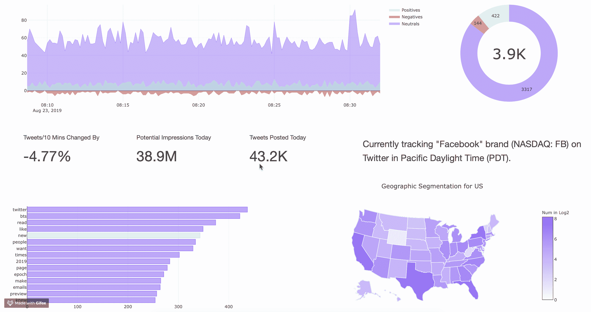

# 用于品牌改进和话题跟踪的实时 Twitter 情感分析(第 3/3 章)

> 原文：<https://towardsdatascience.com/real-time-twitter-sentiment-analysis-for-brand-improvement-and-topic-tracking-chapter-3-3-3b61b0f488c0?source=collection_archive---------6----------------------->

## 行业中的数据科学

## 使用 Python 中的 Dash & Plotly 在 Heroku 上部署一个实时 Twitter 分析 Web 应用程序


Photo by [Kalen Emsley](https://unsplash.com/@kalenemsley?utm_source=medium&utm_medium=referral) on [Unsplash](https://unsplash.com?utm_source=medium&utm_medium=referral)

本教程将教你 1)如何在 [**Heroku**](https://www.heroku.com) 云应用平台上部署所有**数据分析**，以及 2)如何使用 Python 中的 **Dash** 将基于 **Plotly** 的数据可视化迁移到**分析仪表板 web 应用**。



[https://twitter-analysis-web-app.herokuapp.com](https://twitter-analysis-web-app.herokuapp.com)

**注** : **实时 Twitter 数据收集**和**数据分析&情感分析**在前面章节已经完成。

*   [**第 1 章**](http://bit.ly/2Zohn01) **:** 使用 Tweepy、MySQL、& Python 的流 Twitter API 收集 Twitter 数据
*   [**第二章**](http://bit.ly/2PzXG5M) **:** 使用 RE、TextBlob、NLTK 和 Plotly 的 Twitter 情感分析和交互式数据可视化
*   **第三章(你来了！):**使用 Python 中的 Dash & Plotly 在 Heroku 上部署一个实时 Twitter 分析 Web 应用程序
*   **第 4 章**(可选) **:** 使用 Scala、Kafka 和 Spark Streaming 实现流媒体 Twitter 情感分析的并行化

## 为什么是 Dash？

*   [**Dash**](https://dash.plot.ly) 是一个用于构建 web 应用程序的高效 Python 框架。Dash 基于 [**Flask**](http://flask.palletsprojects.com/en/1.1.x/) 、 [**Plotly.js**](https://plot.ly/javascript/) 和 [**React.js**](https://reactjs.org) 编写，非常适合用纯 Python 构建具有高度定制用户界面的数据可视化应用。
*   [**Dash 核心组件**](https://dash.plot.ly/dash-core-components)**【DCC】**为交互用户界面提供增压组件。
*   [**Dash Html 组件**](https://dash.plot.ly/dash-html-components) **(html)** 围绕 Html、CSS、JavaScript 提供纯 Python 抽象。

## **为什么是 Heroku？**

*   [**Heroku**](https://www.heroku.com) 是一个平台即服务(PaaS)，使开发者能够完全在云中构建、运行和操作应用。

为了运行实时 twitter 监控系统，我们将使用两个脚本(或者两个 dynos，或者两个 app)。一个用于**采集流数据**，另一个用于**数据分析和实时可视化**。在处理高吞吐量的 Twitter 文本数据时，这种方法可以有效地减少数据管道的延迟。

## **创建 Heroku 账号&设置环境**

这部分是写给初学者如何从头开始建立新的 Heroku 应用程序环境。如果你熟悉 Heroku 平台，你可以考虑跳过这一部分。

两份**重要**部署指南供参考:

*   Dash App 部署指南:[https://dash.plot.ly/deployment](https://dash.plot.ly/deployment)
*   Heroku 部署指南:[https://devcenter.heroku.com/articles/git](https://devcenter.heroku.com/articles/git)

**在 [**Heroku:云应用平台**](https://www.heroku.com) 上注册**你的账号


**查看您的电子邮件**确认您的帐户，然后**登录** Heroku 平台。


点击**新建**按钮**创建新的 app** 。应用程序名称必须是唯一的，因为应用程序发布后，每个人都可以通过该名称访问 web 应用程序。


## 1.安装 Heroku CLI

首先下载并安装 [**Heroku CLI**](https://devcenter.heroku.com/articles/heroku-command-line) 。Heroku 命令行界面(CLI)是一个基本组件，允许我们通过终端创建和管理 Heroku 应用程序。

然后，登录您的 Heroku 帐户，按照提示创建一个新的 SSH 公钥。

```
$ heroku login
```

## 2.创建一个新的 **Git** 仓库

Heroku 使用 Git 对应用程序的开发进行版本控制。

```
$ mkdir Real-time-Twitter-Monitoring-System
$ cd Real-time-Twitter-Monitoring-System
```

## 2.用`git`和`virtualenv`初始化文件夹

```
$ git init        *# initializes an empty git repo* 
$ virtualenv venv *# creates a virtualenv called "venv"* 
$ source venv/bin/activate *# uses the virtualenv*
$ Heroku git: remote -a **THIS-IS-YOUR-APP-NAME**
```

`virtualenv`创建一个新的 Python 实例。你将需要使用此虚拟重新安装你的应用的依赖项新:

```
$ pip install dash 
$ pip install plotly
$ pip install gunicorn
```

注意:`gunicorn`是部署 app 的新依赖项。

## 3.设置几个必需的文件

用一个示例应用程序(`app.py`)、一个`.gitignore`文件、`requirements.txt`和一个`Procfile`来初始化文件夹，以便进行部署

**一、创建一个名为** `**app.py**` **的文件，填写样例演示代码。**

```
# Simple demo app only
import dash
app = dash.Dash(__name__)
server = app.server # the Flask app
```

**二。创建** `**.gitignore**`

```
venv
*.pyc
.DS_Store
.env
```

**三世。创建**和`**Procfile**`

```
web: gunicorn app:server
```

(注意`app`指的是文件名`app.py`。`server`是指该文件内的变量`server`。

**四。创建**和`**requirements.txt**`

然后让我们添加这个长依赖项。注意:其中一些可能不会直接使用，但在您尝试调整应用程序时会很有用。

```
Click==7.0
dash==1.1.1
dash-core-components==1.1.1
dash-html-components==1.0.0
dash-renderer==1.0.0
dash-table==4.1.0
Flask==1.1.1
Flask-Compress==1.4.0
gunicorn==19.9.0
itsdangerous==1.1.0
Jinja2==2.10.1
MarkupSafe==1.1.1
plotly==4.1.0
PyYAML==5.1.2
retrying==1.3.3
six==1.12.0
Werkzeug==0.15.5
pandas==0.25.0
nltk==3.4.4
textblob==0.15.2
tweepy==3.8.0
psycopg2-binary==2.8.3
Flask==1.1.1
```

## 4.部署应用程序

初始化 Heroku app，向 repo 添加并提交代码，使用 Git 推送到 Heroku cloud。

```
$ heroku create **THIS-IS-YOUR-UNIQUE-APP-NAME**
$ git add .
$ git commit -m 'Initial the app' 
$ git push heroku master # deploy code to heroku 
```

Heroku cloud 应该已经在一开始为你设置了一个 **dyno** ，一个运行你的应用的集群。如果没有，则手动创建一个 dyno。

```
$ heroku ps:scale web=1  # run the app with a 1 heroku "dyno"
```

## 5.更新代码并重新部署

为了将来在 Heroku cloud 上更新我们的应用程序，我们只需要添加、提交并再次推送我们的新代码。

```
$ git status # view the changes 
$ git add .
$ git commit -m 'a description of the changes' 
$ git push heroku master
```

现在我们需要写一些真正的代码。


Photo by [Jace & Afsoon](https://unsplash.com/@jacegrandinetti?utm_source=medium&utm_medium=referral) on [Unsplash](https://unsplash.com?utm_source=medium&utm_medium=referral)

## **将数据分析&可视化从 Plotly 迁移到 Dash**

为了将我们上一章的数据可视化放到 Heroku 应用程序上，我们需要用 Dash 框架包装我们基于 Plotly 的仪表板。所有的数据分析和可视化都将在文件`**app.py**` 中进行处理，您可以在这里 查看我的**完整代码**。

从一个新的应用服务器开始，使用 Dash 默认 CSS 表。注意:我推荐使用 [**Bootstrap**](https://getbootstrap.com) 来改善 web app 的外观。

```
external_stylesheets=['https://codepen.io/chriddyp/pen/bWLwgP.css'] app = dash.Dash(__name__, external_stylesheets=external_stylesheets)
app.title = 'Real-Time Twitter Monitor'server = app.server
```

Dash web app 的核心框架是使用 **app.layout** 作为背景布局。**注意**:点击下面的**两个链接**了解它们是如何工作的，并检查一些典型样品，因为它们对于使用 Dash**非常重要**。

*   [**破折号布局**](https://dash.plot.ly/getting-started) 允许我们显示集成的数据可视化以及其他文本描述。
*   [**破折号回调**](https://dash.plot.ly/getting-started-part-2) 使应用程序能够用实时数据一致地更新一切。

## [仪表板布局](https://dash.plot.ly/getting-started)

由于 **Dash** 构建在 **HTML** 之上，它以自己的方式使用 HTML(**Dash HTML 组件**)。但是一些 HTML 特性在 Dash 中是不允许的。

`html.Div(id='live-update-graph')`描述应用程序中仪表板的**顶部**部分，包括对推文数量和潜在印象的描述。`html.Div(id='live-update-graph-bottom')`描述 web app 中仪表板的**底部**部分。

`dcc.Interval`是允许应用程序定期更新信息的关键。虽然**数据收集器、**将在后面解释，但在另一个 dyno 上**分析仪表板**实时工作，由于利用**聚合数据**进行可视化，并考虑到**的成本效益**，所以只分析和可视化每 **10 秒**的数据。

```
app.layout = html.Div(children=[    

    *# Parts of Title hided*
    html.H2('This-is-your-tittle'), html.Div(id='live-update-graph'),   
    html.Div(id='live-update-graph-bottom'),

    # Parts of Summary hided
    html.Div( 
        dcc.Markdown("Author's Words: ...... ")
    ) # Timer for updating data per 10 seconds
    dcc.Interval(        
        id='interval-component-slow',
        interval=1*10000, # in milliseconds        
        n_intervals=0    
    )    

  ], style={'padding': '20px'})}
```

对于 Dash 的 HTML 中的每个 Div，它都有`className`、`children`和`style`。`children`是`dcc.Graph`([**仪表板核心部件**](https://dash.plot.ly/dash-core-components) 中的图形)、`dcc.Markdown`、`html.Div`、`html.H1`以及其他交互按钮(如`dcc.Dropdown`、`dcc.Slider`)的列表。

```
html.Div(
    className='row',        
    children=[             
        dcc.Markdown("..."),     
        dcc.Graph(...),
        html.Div(...)
    ],
    style={'width': '35%', 'marginLeft': 70}    
)
```

`style`对于构建良好的布局和确保几个可视化图形之间的适当距离很重要，但调整细节可能很耗时。

下面举一个`dcc.Graph`的例子( [**仪表板核心部件**](https://dash.plot.ly/dash-core-components) 中的图形)。`dcc.Graph`有属性`id`和`figure`。在`figure`下有`'data'`，包含 Plotly 中不同种类的图形(如`go.Scatter`和`go.Pie`),`'layout'`，它只是这个图形的布局而不是`app.layout`。

```
# import dash_core_components as dcc
# import plotly.graph_objs as godcc.Graph(                            
  id='pie-chart',                            
  figure={                                
    'data': [                          
       go.Pie(                                        
         labels=['Positives', 'Negatives', 'Neutrals'],
         values=[pos_num, neg_num, neu_num],                                        
        )                              
     ],
     'layout':{
       'showlegend':False,
       'title':'Tweets In Last 10 Mins',
       'annotations':[
         # ...                                
       ]
     }                             
  }                        
)
```

`'[**annotations**](https://plot.ly/python/text-and-annotations/)'`是保证当前标签的另一个重要部分。**注意**:[**Dash 中标注**](https://plot.ly/python/reference/#layout-annotations) 的引用相当**、**由于参数可能需要表示为`go.layout.Annotation`、一个字典`dict(...)`，有时还有一个列表。

## [**破折号回调**](https://dash.plot.ly/getting-started-part-2)

在 Dash app 布局中，**反应型**和**功能型** Python 回调提供输入和输出之间的连接，允许**可定制的**声明型 ui。

**注**:我们**跳过了上一章解释的所有数据分析部分**，尽管可能会有一点点差异(或改进)。因此，我们**直接进入基于 Dash 的数据可视化部分**，它是通过复杂的 Plotly graphs `**plotly.graph_objs**`实现的(又名 **go** )。

```
# Multiple components can update everytime interval gets fired.
@app.callback(
    Output('live-update-graph', 'children'),
    [Input('interval-component-slow', 'n_intervals')]
  )
def update_graph_live(n): # Lots of nested Div to ensure the proper layout
  # Graphs will be explained later
  # All codes are hided return children
```

三个**线图**都使用`go.Scatter`和**堆栈组**来确保同一图形中线下的**重叠区域**。

```
# import plotly.graph_objs as go
go.Scatter(
  x=time_series,
  y=result["Num of A-Brand-Name mentions",
  name="Neutrals",
  opacity=0.8,
  mode='lines',
  line=dict(width=0.5, color='rgb(131, 90, 241)'),
  stackgroup='one'
)
```

**饼状图**在上面`dcc.Graph`的例子中解释过。

对于**文本描述**(例如每 10 分钟的 Tweet 数量变化)，我们使用两个 HTML 段落来嵌入数据信息。通过比较之前的 10 分钟间隔和当前的 10 分钟间隔，我们可以生成这样的结果。

```
html.P(
  'Tweets/10 Mins Changed By',
  style={'fontSize': 17}
),html.P(
  '{0:.2f}%'.format(percent) if percent <= 0        \
      else '+{0:.2f}%'.format(percent),
  style={'fontSize': 40}
)
```

对于今天的**潜在印象**，我们想知道最多有多少人有机会看到这些推文。通过计算发布这些推文的人的**追随者数量的总和**，我们可以得到潜在的印象。增加一个**动态数字单元**以更好地在非常大的范围内显示该值。

```
html.P(
  '{0:.1f}K'.format(daily_impressions/1000) \
  if daily_impressions < 1000000 else \
  ('{0:.1f}M'.format(daily_impressions/1000000) 
    if daily_impressions < 1000000000 \
    else '{0:.1f}B'.format(daily_impressions/1000000000)), style={'fontSize': 40}
)
```

通过在每次应用数据更新中存储和累加推文数量，计算每日推文数量**是一种简单的方法。并且该值将在午夜重置为零。**

```
html.P(
  '{0:.1f}K'.format(daily_tweets_num/1000),
  style={'fontSize': 40}
)
```

底部仪表盘的**回调函数**与第一个类似。

```
@app.callback(Output('live-update-graph-bottom', 'children'),
              [Input('interval-component-slow', 'n_intervals')])
def update_graph_bottom_live(n): # Lots of nested Div to ensure the proper layout
  # Graphs will be explained later
  # All codes are hidedreturn children
```

**最热门话题追踪条形图**。将`orientation`设置为水平，以便更好地显示条形和相关的单词名称

```
go.Bar(
  x=fd["Frequency"].loc[::-1],
  y=fd["Word"].loc[::-1],
  name="Neutrals",
  orientation='h',
  marker_color=fd['Marker_Color'].loc[::-1].to_list(),
  marker=dict(
    line=dict(
      color=fd['Line_Color'].loc[::-1].to_list(),
      width=1
    ),
  )
)
```

通过设置`'layout': {'geo':{'scope':'usa'}}`将范围聚焦在**州级地图**上

```
go.Choropleth(
  locations=geo_dist['State'], # Spatial coordinates
  z = geo_dist['Log Num'].astype(float), # Color-coded data
  locationmode = 'USA-states',
  text=geo_dist['text'], # hover text
  geo = 'geo',
  colorbar_title = "Num in Log2",
  marker_line_color='white',
  colorscale = ["#fdf7ff", "#835af1"]
)
```

为了**在一行中并行多个图形**，您可以考虑使用以下。`width`应该是 1/N 百分比(N =图形数量)，我们可以减去 1%以给出图形之间足够的间隙。

```
style={'display': 'inline-block', 'width': '33%'}
```


Photo by [Banter Snaps](https://unsplash.com/@bantersnaps?utm_source=medium&utm_medium=referral) on [Unsplash](https://unsplash.com?utm_source=medium&utm_medium=referral)

## 实现实时 Twitter 数据收集器

为了在不支付的情况下运行另一个与 web(用于互联网连接)**连接的脚本，我们需要**设置另一个应用**，除了`app.py`和`gunicorn`之外，配置完全相同。或者你可以花钱买一个新的 dyno 在原来的应用程序中运行。**

**注意**:由于两个应用程序的消耗，免费计划每月只能运行**大约 3 周**，如果 30 分钟不活动，web 应用程序可能会休眠，尽管数据收集器不会。

1.  在新应用程序中创建一个新的应用服务器`scraping_server.py`，并在下面添加。

```
from os import environ
from flask import Flaskapp = Flask(__name__)
app.run(environ.get('PORT'))
```

2.在新应用程序中创建一个数据采集器文件`scraping.py`，该文件与第 1 章中的[文件非常相似。然而，这次我们将使用](http://bit.ly/2Zohn01)[**Heroku PostgreSQL**](https://www.heroku.com/postgres)而不是 MySQL，这也要求我们对 SQL 查询进行一点点更新。您可以在这里查看 [**代码**](https://github.com/Chulong-Li/Real-time-Sentiment-Tracking-on-Twitter-for-Brand-Improvement-and-Trend-Recognition/blob/master/dash_app/scraping.py) 。

```
# Due to the similar code, check [Chapter 1](http://bit.ly/2Zohn01) for detailed explanation.
```

3.移除`app.py`，更新`gunicorn`如下。

```
worker: python scraping.py
web: python scraping_server.py
```

***注意:**别忘了创建`credentials.py`和`settings.py`，就像第一章中的[一样。](http://bit.ly/2Zohn01)

## 通过 Heroku PostgreSQL 连接两个服务器/脚本/dyno

要**在应用程序之间共享**同一个 Postgres 数据库，请遵循本 [**指南**](https://devcenter.heroku.com/articles/heroku-postgresql#sharing-heroku-postgres-between-applications) :

```
$ heroku addons:attach my-originating-app::DATABASE --app sushi
```

## 新方法:

Heroku 现在允许一个新的**数据管道**特性，所以你可以考虑利用这个优势，而不是使用我的两个应用程序连接一个 PostgreSQL 的方法。

## 作者的话:

感谢阅读！针对我的实时 Twitter 监控系统的这一系列文章已经结束，但是新技术的开发不会停止。第 4 章将在 10 月份作为独立文章发表。希望下次能见到你！