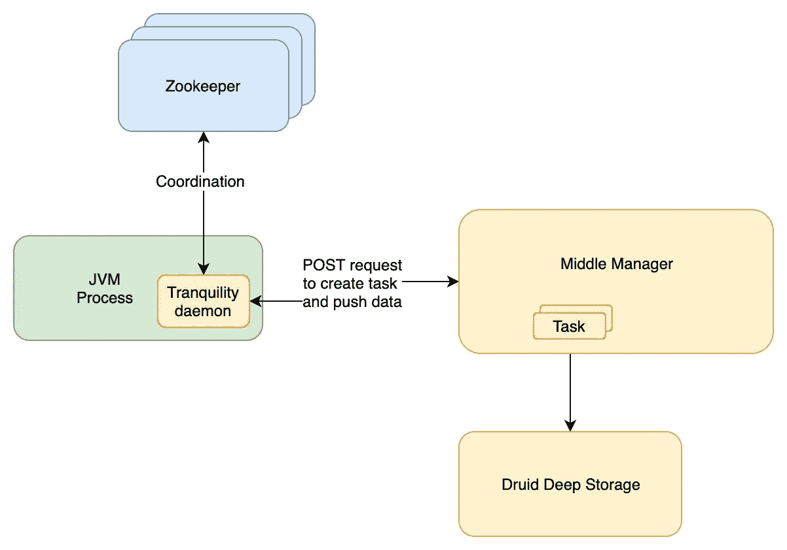
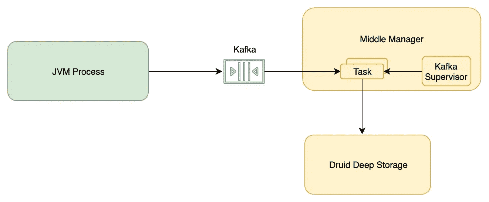

# Apache Druid 中的实时数据—选择正确的策略

> 原文：<https://towardsdatascience.com/realtime-data-in-apache-druid-choosing-the-right-strategy-cd1594dc66e0?source=collection_archive---------14----------------------->

## 为什么你应该使用卡夫卡索引而不是宁静

Photo by [Luke Chesser](https://unsplash.com/@lukechesser?utm_source=medium&utm_medium=referral) on [Unsplash](https://unsplash.com?utm_source=medium&utm_medium=referral)

在实时数据流中存储数据一直是一个挑战。解决方案取决于您的使用案例。如果你想为每日或每月的分析存储数据，你可以使用分布式文件系统，并在其上运行 [Hive](https://hive.apache.org/) 或 [Presto](https://prestodb.io/) 。如果你要运行一些简单的实时分析，你可以将最近的数据存储在 [Elasticsearch](https://www.elastic.co/what-is/elasticsearch) 中，并运行 [Kibana](https://www.elastic.co/products/kibana) 来获取图表。

[Apache Druid](https://druid.apache.org/) 是为了同时解决上述两种用例而设计的。它可以作为每日或每月分析的持久数据存储。它还可以作为快速可查询数据存储，允许您实时推送和检索数据。

然而，早期版本的 Apache druid 的问题是从数据库的流中获取数据。让我们来看看开发人员早先面临的挑战。

# 平静

[宁静](https://druid.apache.org/docs/latest/ingestion/tranquility.html)是 Apache Druid 提供的摄取实时数据的包。宁静并不完全等同于 JDBC 或卡珊德拉司机。它为您处理分区、复制、服务发现和模式翻转。用户需要关心他需要使用的数据和数据源。

Ingesting realtime data using Tranquility

宁静解决了用户可能面临的许多问题。然而，它也伴随着自身的一系列挑战。

## 不完全是一次

在某些情况下，宁静会创建重复的记录。它不提供任何一次性的保证。在某些情况下，比如 POST 请求数据超时或者没有收到 ack，宁静会产生重复的记录。

在这种情况下，用户需要承担消除重复数据的责任。如果您正在使用 Apache 超集，它甚至会导致其中的图形不正确。

## 数据丢失

宁静最关心的问题是数据丢失。有各种情况下，宁静故意或由于错误无法插入数据。[官方文件](https://github.com/druid-io/tranquility/blob/master/docs/overview.md)中列出的一些案例是—

*   时间戳超出您配置的**窗口周期**的事件将被丢弃。
*   如果您遇到的 Druid 中级管理器故障多于您配置的副本数，一些部分索引的数据可能会丢失。
*   如果有一个持续的问题阻止了与 Druid 索引服务的通信，并且重试策略在此期间用尽，或者此期间持续的时间超过了您的 **windowPeriod** ，一些事件将被丢弃。
*   如果有一个问题阻止了宁静从索引服务接收确认，它将重试批处理，这可能导致重复的事件。

最糟糕的是，在大多数情况下，直到查询时，您才知道您的数据已经被删除。

## 错误处理

因为宁静守护进程运行在 JVM 内部，所以处理超时之类的错误是应用程序的责任。对于像 Apache Flink 这样的应用程序，如果不能有效地管理其中一个错误，就会导致不必要的重启。

在所有这些问题之上，宁静是为德鲁伊 0.9.2 构建的。将它与当前的 druid 版本 0.16.0 一起使用会产生无法识别的问题。

# 卡夫卡索引

为了解决上述所有问题，Apache druid 在 0.9.1 版本中添加了 Kafka Indexer。在版本 0.14 之前，索引器一直处于**实验**状态。

Kafka 索引服务首先根据您指定的配置启动一个管理程序。然后，管理员会定期启动新的索引任务，这些任务负责从 Kafka 消费数据，并将其发布到 Druid 中。

与宁静不同，Kafka 索引任务可以长期运行。在达到最小行数或字节数后，可以发布多个段，而无需启动新任务。

Kafka Indexer in Apache Druid

卡夫卡索引器旨在解决其前辈所面临的各种挑战。

## 恰好一次语义

Kafka 索引器为用户提供了一次精确的保证。这种保证是可能的，因为 Kafka 0.11.x 提供了对这种语义的现成支持。

## 发布延迟的数据

Kafka 索引器旨在发布延迟的数据。它不受宁静窗口期的影响。这种能力让用户可以自由地将 Kafka 中特定偏移量的数据回填到 Druid 中。

## 模式更新

尽管宁静也支持模式更新，但在 Kafka Indexer 中要容易得多。您只需要提交一个包含新模式的 POST 请求，主管将使用更新后的模式生成新任务。你不需要在生产者端做任何改变。
如果您添加了新的列，旧的行将在这些列中显示空值，但是这些行仍然是可查询的。

Kafka 索引器服务解决了开发人员在使用宁静时面临的许多问题。如果你想开始使用 Kafka 索引服务，你可以参考官方 Druid 文档中的 [Apache Kafka 摄取](https://druid.apache.org/docs/latest/development/extensions-core/kafka-ingestion.html)。