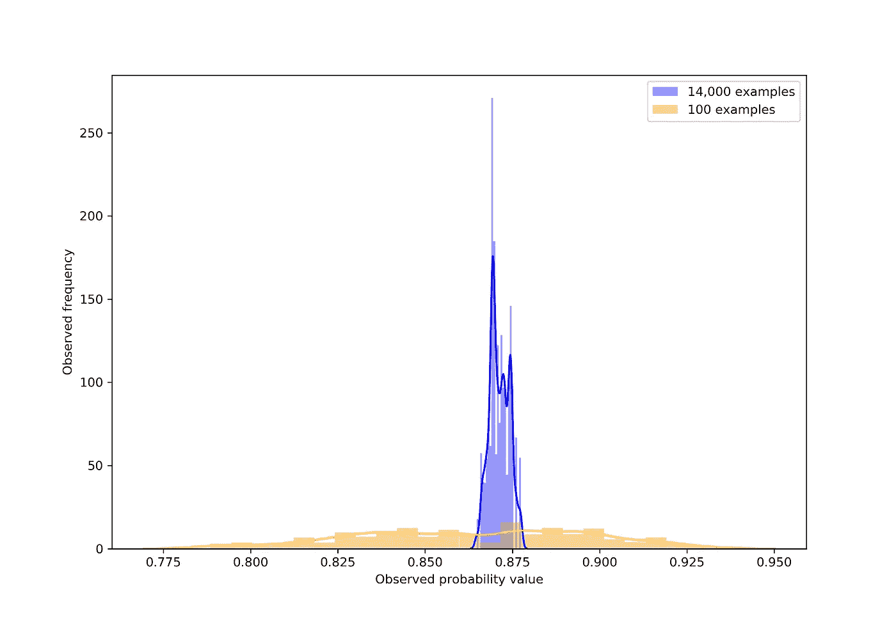

# 用概率和火焰推理——我的模型够好吗？

> 原文：<https://towardsdatascience.com/reasoning-with-probability-is-my-model-good-enough-1cfd27d5aed9?source=collection_archive---------28----------------------->

在其核心，概率编程是为了回答关于不确定性的问题。一些非常受欢迎的在线例子讨论了使用概率编程来帮助神经网络，并使它们更有能力处理他们没有训练过的新例子。然而，在本教程中，我将介绍概率编程可以帮助的最基本的功能。

这里的例子在很大程度上摘自扎克·安临来的演讲，他在演讲中介绍了使用 PyMC3 的概率编程。我将使用 [Pyro](http://docs.pyro.ai/en/1.1.0/index.html) ，因为我看到这个库在未来会起飞，我想探索它更多一点。

# **示例场景**

让我们考虑以下简单的工作流程:

*   获取数据(在这种情况下是一个样本数据集)
*   执行训练/测试分割
*   根据训练数据训练模型
*   测试模型的性能，决定性能好不好

Import required packages

Obtain our data

```
>>> (70000, 784)
>>> (70000,)
```

Split the data into train and test

```
>>> (56000, 784) (14000, 784)
>>> (56000,) (14000,)
```

Train a decision tree on our train data, and test its performance on the test data

```
>>> Accuracy is 87.06%
```

# **分析**

我们可以尝试提高模型的准确性，使其达到 87%以上，甚至采用更强的模型，如 CNN，但有一个稍微不太明显的问题。想想我们如何知道我们有 87%的准确率。

我们的测试集是 14000 个带标签的例子。这是一种真正的奢侈，因为对于一些数据科学问题，我们可能不会遇到这么多标记良好的例子。如果我们只有 100 个例子，而不是 14000 个，会怎么样？

```
>>> (100, 784) (100,)
```

Check accuracy again, but only on 100 test observations

```
>>> Accuracy is 86.00%
```

我们得到了一个稍低的数字，但仍然是可比的。

也就是说，虽然数字很接近，但相信基于 100 个例子的模型要比相信基于 14000 个例子的模型更难。

直觉上，随着测试集大小的增加，我们对测试集分数的信心也增加了。Pyro 允许我们从数字上估计我们的信心以及我们有多少出错的空间。

# **烟火模型**

Pyro 工作流程非常独特，需要三个组件

1.  模拟我们底层模型的模型函数(不是决策树，而是给我们正确或不正确标签的过程)。该功能从**先验分布**开始
2.  当观察到的例子由模型函数产生时，测量它们的似然性的核
3.  构建**后验分布**的采样器

首先我们需要定义我们对 Pyro 的观察。在我们的例子中，我们的观察是我们看到正确和不正确分类的情况。让我们同时考虑小测试集(100 个观测值)和大测试集(14，000 个观测值)。

现在我们必须定义模型函数。该函数接受我们的观察值，并尝试从先验分布中取样，并根据我们的观察值计算先验的可能性。然后，内核会将先验更新为更可能的后验分布。

它看起来不太像，但是在这个模型中发生了两个重要的事件。

*   首先，我们使用“pyro.sample”函数注册一个名为“p”的参数，作为 pyro 的可学习值。使用“pyro.sample”或“pyro.param”将结果值作为可学习值记录在 pyro 的内部存储器(一个特殊的类似字典的对象)中。在我们的例子中，我们已经说过“p”是一个可学习的分布。
*   我们还将每个观察记录为一个可学习的值，它应该符合我们提供给它的观察。

我们将注册该模型的内核(哈密顿蒙特卡罗内核)将查看该模型中定义的所有可学习值，并将尝试调整可学习分布，以便它们增加所提供的观测值的可能性。

我们将使用的采样器(马尔可夫链蒙特卡罗)将运行 HMC 核来寻找后验分布。

```
>>> Sample: 100%|█████████████████████████████████████████| 200/200 [03:46,  1.13s/it, step size=1.51e+00, acc. prob=0.916]
```

现在我们已经运行了我们的采样器，我们可以用我们得到的后验概率做几件事。首先，我们可能想把我们定义的概率“p”形象化。我们可以通过从我们的取样器取样来做到这一点。


The posterior distribution for our accuracy score given 100 examples

```
>>>     mean    std    median    2.5%    97.5%     n_eff     r_hat
>>> p   0.86   0.04      0.86    0.79     0.93    185.83      1.00

>>> Number of divergences: 0
```

不是一个很好的结果… 100 次观察并不足以确定一个好的结果。该分布似乎并不集中在一个特定的值上，当我们要求 95%的可信区间时，我们的真实值可以在 79%和 93%之间。对于我们的目的来说，这可能足够准确，也可能不够准确。

让我们看看当我们使用全部 14，000 个观察值时，我们对我们的模型有多大的信心

# **修改我们的模型**

如果我们通过同一个模型运行所有 14，000 个观察值，那么运行时间将会非常长。
这是因为我们在代码中循环遍历每个观察。

Pyro 包含一个更方便的、矢量化的方法来处理我们的模型。

首先，我们重新定义了模型函数，使其不接受任何观察值，而是返回自己的观察值

现在，我们定义了第二个函数，它将模型函数和观察值作为输入，并利用“pyro.poutine”在条件环境中运行模型函数。重要的是，我们在这里的观察值与它们在模型函数中的名称相同(“obs”)。

最后，我们重新运行 MCMC 采样器，但是现在使用我们的条件模型，我们发送我们的模型函数，以及我们的观察，作为参数

```
>>> Sample: 100%|█████████████████████████████████████████| 200/200 [01:47,  1.86it/s, step size=7.87e-01, acc. prob=0.984]
```


The posterior distribution for our accuracy score given 14,000 examples

```
>>>    mean    std    median      2.5%     97.5%     n_eff     r_hat
>>> p2 0.87   0.00      0.87      0.87      0.87      9.88      1.07

>>> Number of divergences: 0
```

现在，我们可以在 87%左右得到更紧密的配合。为了比较这两个分布，我们可以把它们画在一起。



The two posterior distributions for our accuracy based on the number of support examples

我希望你们都喜欢阅读这篇关于 Pyro 及其功能的简介。我当然期待尝试新的东西，更多地使用概率编程！