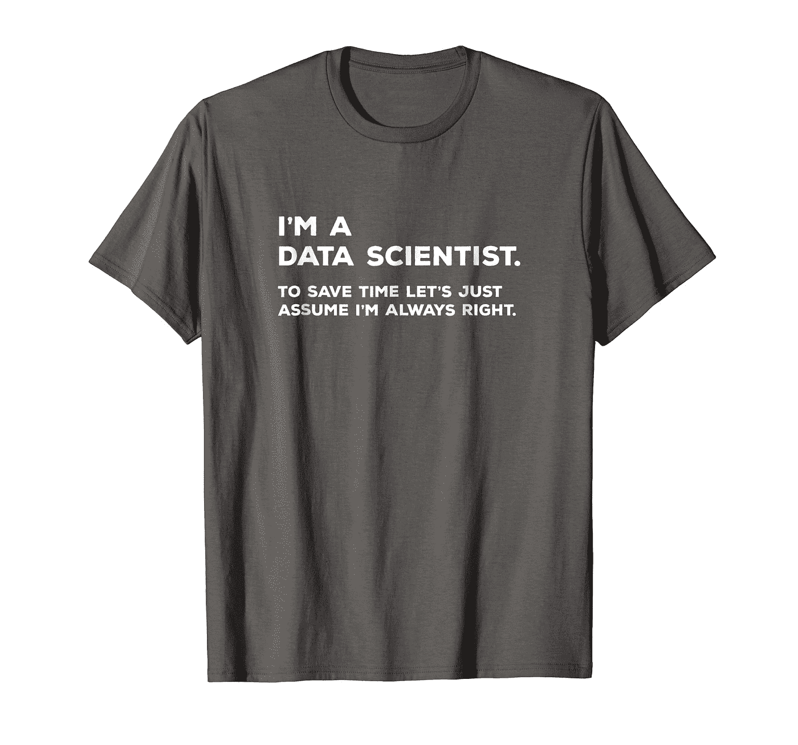
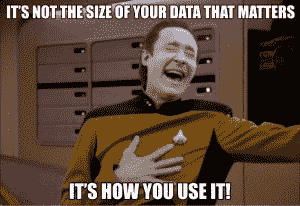

# 你不应该再考虑数据科学的理由。等等，我有说不应该吗！

> 原文：<https://towardsdatascience.com/reasons-why-you-shouldnt-consider-data-science-as-an-option-anymore-wait-did-i-say-shouldn-t-22154bd492fd?source=collection_archive---------21----------------------->

## **“信息是 21 世纪的石油，分析是内燃机。”**

[**大数据**](https://data-flair.training/blogs/what-is-big-data/) 和数据科学的力量正在从根本上改变世界。自从我们进入大数据时代以来，[**数据科学**](https://data-flair.training/blogs/data-science-tutorials-home/) 已经成为增长最快、价值数百万美元的公司之一。如今一切都被数据淹没了。数据存在于每个数字和电子设备中。无论是电脑、手机、笔记本电脑、相机还是手表。

> ***公司正在收集数据进行分析，并从中得出真知灼见。***

当你在购物中心或任何商店购物，或者你去餐馆时，他们会给你一份反馈表让你填写。或者他们要求您对他们提供的产品和服务进行反馈。你提供的反馈或他们收集的反馈只不过是数据。

因此， [***数据科学***](https://data-flair.training/blogs/what-is-data-science/) 就是收集数据，分析数据，并借助数据做出决策的过程。它是一个研究领域，涉及借助科学方法和算法从原始数据中提取有意义的见解，然后有效地传达这些见解，从而产生价值。

## **数据形式:**

数据就像冰一样，就像三种形式的冰一样，它有三种状态(一个糟糕的笑话，但会帮助你理解)。:P

**数据可以是结构化的、非结构化的和半结构化的:**

***1)结构化*** *-*

它是用于分析过程的有组织的数据。它是经过处理的数据。例如:关系数据。

***2)半结构化-***

它有一些组织属性，但是不适合数据库系统。例如:XML/RDF 数据。

***3)非结构化-***

它是不以任何方式组织的数据，是最灵活的数据形式。例如:Word、PDF、Text。

我想这个形象是如此贴切和不言自明。数据科学是计算机科学、数学和统计学的混合体。一个愿意从事数据科学职业的人需要在数学、计算机编程和统计学方面有坚实的基础。优秀的教育背景，R 或 Python 等各种编程语言的知识，最重要的是，成为一名数据科学家需要时间和努力。

# 关键组件

随着对数据洞察力的需求不断增加，数据科学对于每个领域都是必要的。以下是数据科学角色的一些关键组成部分:

**1)收集和查询数据**:数据科学家在流程分析过程中收集、查询和消费数据。他们专注于数据的分析、预测和可视化。数据科学家必须查询数据，不管数据是如何存储的，也不管数据存储在哪里。查询数据包括编写命令从数据存储系统中提取信息。很多时候， [**SQL**](https://data-flair.training/blogs/master-sql-for-data-science/) (结构化查询语言)就是用来做这个的。

**2)从数学模型中获得洞察力**:数据科学家的工作需要数学技能，因为理解数据需要数学技能。这些是用来进行预测和决策的技能。数学方法也用于建立模型和生成近似值。

**3)将一些技能** **和一些统计方法应用于数据科学任务**:统计技能和方法对于验证假设和预测未来事件的预测是有用和必要的。了解一些基本的统计方法，如线性回归、相关性、贝叶斯定理和时间序列分析是必不可少的，有助于生成可能的数据结果。

**4)编码是游戏的一部分**:在使用数据科学时，编码是不可避免的。你需要能够编写代码来指示和指导计算机如何分析和可视化你的数据。虽然 SQL 对于查询数据是必要的，但是诸如[**【Python】**](https://data-flair.training/blogs/python-tutorial/)**R 等编程语言对于数据的分析和可视化是有用的。**

****5)将数据科学应用于主题领域**:数据科学家需要在他们工作的领域拥有主题专业知识。他们从给定的数据中产生深刻的见解，然后理解这些见解对于他们工作的领域意味着什么。主题专家正在使用数据科学来提高他们在各自行业中的表现:**

*****a)IT 行业* -** 工程师在现代建筑设计中使用机器学习。**

*****b)医疗行业*** *-* 临床数据科学家制定治疗计划，并使用医疗保健信息来预测处于风险中的患者未来的健康问题。**

*****c)电子商务*** [*-*](https://data-flair.training/blogs/data-science-at-flipkart/) 营销数据科学家使用回归和相关来预测消费者偏好的变化或消费者从一种产品或服务流失到竞争对手的产品或服务。**

****6)交流数据见解**:作为一名数据科学家，你必须有很强的口头和书面交流技能，并且能够交流这些技能，否则所有的知识和见解对你的组织都没有好处。数据科学家需要在沟通方式和方法上具有创造性和实用性。**

# **所有这些都是好的。但是，我将如何从学习数据科学中受益**

****1)它永远不会让你感到无聊** —在学习数据科学的过程中，你会被分配很多任务，让你专注于工作，很难对所有这些项目感到厌倦。**

**你有很多职业选择可以选择——数据管理在所有组织、所有级别都很重要。不仅大型 It 软件公司需要数据科学，银行和金融行业、零售行业、医疗保健行业等也需要数据科学。各种职位可以是分析工程师、分析经理、大数据工程师、业务分析师、数据架构师、数据分析师、数据工程师、数据科学家、数据可视化专家、统计学家。**

****

****3)有助于改善沟通** —学习数据科学也是学习如何向第三方传达结果和见解。沟通是你需要努力的事情，它不仅在数据科学领域，而且在任何地方都是一种伟大的品质！**

****4)巨大的需求** —数据科学是一个需要很多技能的领域，所以很难找到具备所有这些技能的人。数据科学专业人员很有价值，他们的需求也很高。**

**高薪——随着需求的增加，这是几乎所有国家中收入最高的职业之一。这个职业的工资范围(美国)在 65，000 美元到 150，000 美元之间。**

*****等等！你知道一个数据科学家的*** [***工资***](https://data-flair.training/blogs/data-scientist-salary/) ***吗？*****

****结论:****

**所有的公司都有数据，他们只需要弄清楚如何利用这些数据来为自己谋利。利用这些数据的人越来越多，因为今天一切都围绕着客户，让他们能够获得内容是最重要的事情。**

**数据科学家利用他们在数学、统计、编程和不同学科领域的技能来组织大型数据集。他们运用自己的知识和专业技能来发现隐藏在数据中的解决方案，以应对业务挑战并实现目标。**