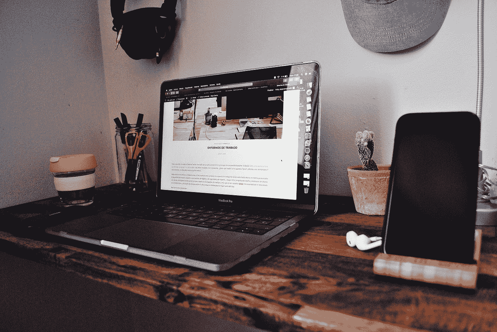

# 接收我们的时事通讯

> 原文：<https://towardsdatascience.com/receive-our-newsletters-681049ffa0cf?source=collection_archive---------24----------------------->

## 想要了解数据科学的最新动态，并在您的收件箱中收到我们提供的最佳信息吗？这里有几个你可能感兴趣的时事通讯选项。

Photo by [Alejandra Cifre González](https://unsplash.com/@alejanci?utm_source=medium&utm_medium=referral) on [Unsplash](https://unsplash.com?utm_source=medium&utm_medium=referral)

## 变量:

每周四，[Variable](https://medium.com/towards-data-science/newsletters/the-variable)都会带来最好的数据科学:从实践教程和前沿研究到你不想错过的原创功能。

## 我们的每周文摘:

我们的文摘为您提供个性化的推荐，每周五直接发送到您的收件箱**。**订阅很简单。只需点击左侧矩形中的“关注”按钮，并在您的[设置](https://help.medium.com/hc/en-us/articles/115004745947-Adjust-email-preferences)中打开“接收信件”即可关注我们的出版物。