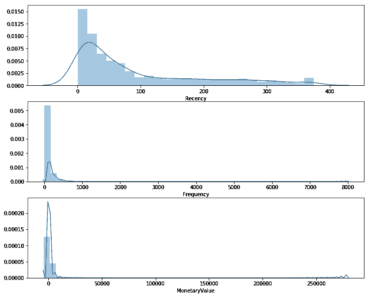
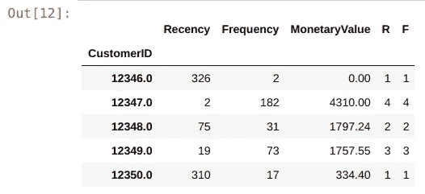
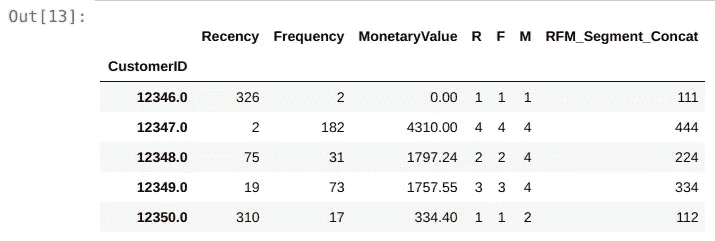
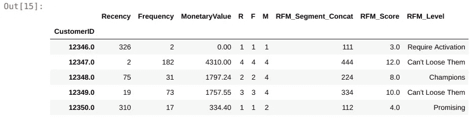
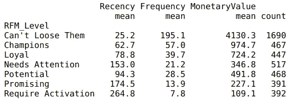
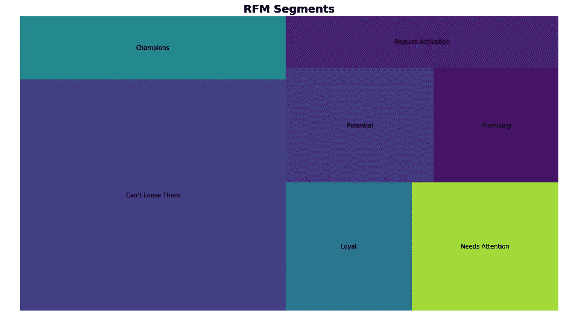

# Python 的新近性、频率、货币模型——以及丝芙兰如何使用它来优化他们的谷歌和脸书广告

> 原文：<https://towardsdatascience.com/recency-frequency-monetary-model-with-python-and-how-sephora-uses-it-to-optimize-their-google-d6a0707c5f17?source=collection_archive---------1----------------------->

上次我们使用群组分析方法分析了我们的在线购物者数据集。我们围绕我们的队列数据集发现了一些有趣的观察结果。虽然群组分析为我们提供了长期的客户行为并了解了保留率，但我们还希望能够根据他们的行为对我们的数据进行细分。今天，我们将探索零售商使用的流行的 RFM 模式，如[丝芙兰](https://data.luxola.com/post/2017-09-13-spider-updated-audiences/)，将店内和网上购买相结合，以细分客户，获得更好的个性化广告内容。我强烈推荐关注丝芙兰博客的[数据科学，以获得更深入的数据见解。你也可以看看这篇由 Jimmy Joe 撰写的](https://data.luxola.com/post/2017-09-13-spider-updated-audiences/)[文章](https://iterable.com/blog/the-secret-to-customer-lifetime-value-rfm/)，他在文章中深入探讨了利用 RFM 实现客户终身价值的[秘密](https://iterable.com/blog/the-secret-to-customer-lifetime-value-rfm/)。

# 什么是 RFM？

通过 3 个重要特征进行行为细分:

1.  最近——自上次购买以来的天数
2.  频率——特定时期内的交易数量
3.  货币——在给定时间内花费的金额

然后，我们必须按以下方式对这些功能进行分组:

1.  百分位数或分位数
2.  帕累托法则——80/20
3.  商业头脑

我们将对我们的方法实施百分位数分组。

现在让我们继续学习 Python。

这些是我们今天分析所需要的库。稍后，我们将使用 squarify 将我们的分割绘制成树形图。

```
# Import libraries
import pandas as pd
from datetime import timedelta
import matplotlib.pyplot as plt
import squarify
```

我们将再次分析我们的[在线购物者数据集](https://www.kaggle.com/fabiendaniel/customer-segmentation/data)，但这次是用我们的 RFM 模型。

```
# Read dataset
online = pd.read_csv('../data.csv', encoding = "ISO-8859-1")# Convert InvoiceDate from object to datetime format
online['InvoiceDate'] = pd.to_datetime(online['InvoiceDate'])
```

让我们仔细看看我们需要处理的数据。

```
**Input:**
print('{:,} rows; {:,} columns'
      .format(online.shape[0], online.shape[1]))print('{:,} transactions don\'t have a customer id'
      .format(online[online.CustomerID.isnull()].shape[0]))print('Transactions timeframe from {} to {}'.format(online['InvoiceDate'].min(),
                                    online['InvoiceDate'].max()))**Output:**
541,909 rows; 8 columns
135,080 transactions don't have a customer id
Transactions timeframe from 2010-12-01 08:26:00 to 2011-12-09 12:50:00**Input:**
# Drop NA values from online
online.dropna()
```

我们需要做的第一件事是根据最近、频率和货币价值对客户进行分类。为了计算最近，我们将把数据集的最后一个发票日期之后的一天作为快照日期'**2011–12–10 12:50:00 '**。日期差异将告诉我们最近一次交易是什么时候完成的。这样，我们就可以根据客户 ID 对**‘在线’**数据框进行分组，并将其分配给**‘数据处理’**进行数据预处理。

```
# --Group data by customerID--# Create TotalSum column for online dataset
online['TotalSum'] = online['Quantity'] * online['UnitPrice']# Create snapshot date
snapshot_date = online['InvoiceDate'].max() + timedelta(days=1)
print(snapshot_date)# Grouping by CustomerID
data_process = online.groupby(['CustomerID']).agg({
        'InvoiceDate': lambda x: (snapshot_date - x.max()).days,
        'InvoiceNo': 'count',
        'TotalSum': 'sum'})# Rename the columns 
data_process.rename(columns={'InvoiceDate': 'Recency',
                         'InvoiceNo': 'Frequency',
                         'TotalSum': 'MonetaryValue'}, inplace=True)
```

让我们看看目前为止的进展。

```
# Print top 5 rows and shape of dataframe
print(data_process.head())
print('{:,} rows; {:,} columns'
      .format(data_process.shape[0], data_process.shape[1]))**Output:**
            Recency  Frequency  MonetaryValue
CustomerID                                   
12346.0         326          2           0.00
12347.0           2        182        4310.00
12348.0          75         31        1797.24
12349.0          19         73        1757.55
12350.0         310         17         334.40
4,372 rows; 3 columns
```

太好了，我们有 4，372 条客户记录，根据他们购买的最近时间、频率、数量和购买的货币价值进行分组。现在我们可以进入事物的内部，使用。qcut()方法将相对百分位数分配给他们的 RFM 特征。但在此之前，让我们检查一下我们的近因、频率和货币的分布。

```
**# Plot RFM distributions**
plt.figure(figsize=(12,10))# Plot distribution of R
plt.subplot(3, 1, 1); sns.distplot(data_process['Recency'])# Plot distribution of F
plt.subplot(3, 1, 2); sns.distplot(data_process['Frequency'])# Plot distribution of M
plt.subplot(3, 1, 3); sns.distplot(data_process['MonetaryValue'])# Show the plot
plt.show()
```



这张图为我们提供了一些非常有趣的见解，以及我们的数据是如何扭曲的。这里需要注意的重要一点是，我们将用分位数对这些值进行分组。然而，当我们在接下来使用 K-Means 检查我们的客户细分时，确保我们将数据调整到均值和标准差的中心是非常重要的。下次会有更多。让我们继续。qcut()为我们的 RFM。

```
# --Calculate R and F groups--# Create labels for Recency and Frequency
r_labels = range(4, 0, -1); f_labels = range(1, 5)# Assign these labels to 4 equal percentile groups 
r_groups = pd.qcut(data_process['Recency'], q=4, labels=r_labels)# Assign these labels to 4 equal percentile groups 
f_groups = pd.qcut(data_process['Frequency'], q=4, labels=f_labels)# Create new columns R and F 
data_process = data_process.assign(R = r_groups.values, F = f_groups.values)
data_process.head()
```



我们为 f_labels 创建了一个 4 标签，其中 4 是“最佳”分位数。我们为我们的 f_label 做同样的事情。然后，我们创建新的列“R”和“F ”,并分别为它们分配 r_group 和 f_group 值。

接下来，我们对货币值进行同样的操作，使用。qcut()方法。

```
# Create labels for MonetaryValue
m_labels = range(1, 5)# Assign these labels to three equal percentile groups 
m_groups = pd.qcut(data_process['MonetaryValue'], q=4, labels=m_labels)# Create new column M
data_process = data_process.assign(M = m_groups.values)
```

最后，有了这 3 个分数，R，F 和 M，我们可以通过将下面的值连接在一起来创建我们的第一个 RFM 线段。让我们将 data_process 数据帧分配给新创建的 rfm 数据帧。

```
# Concat RFM quartile values to create RFM Segments
def join_rfm(x): return str(x['R']) + str(x['F']) + str(x['M'])
data_process['RFM_Segment_Concat'] = data_process.apply(join_rfm, axis=1)rfm = data_process
rfm.head()
```



从输出中，您可以看到我们已经准备好将连接的数据段用于分段，但是，等等，还有一个问题…

```
# Count num of unique segments
rfm_count_unique = rfm.groupby('RFM_Segment_Concat')['RFM_Segment_Concat'].nunique()
print(rfm_count_unique.sum())**Output:** 62
```

使用 concatenate 方法拥有 62 个不同的段对于任何实际应用来说都很快变得不实用。我们需要一种更简洁的方式来定义我们的细分市场。

# 合计分数

最直接的方法之一是将我们的分数相加为一个数字，并为每个分数范围定义 RFM 等级。

```
**# Calculate RFM_Score** rfm['RFM_Score'] = rfm[['R','F','M']].sum(axis=1)
print(rfm['RFM_Score'].head())**Output:**CustomerID
12346.0     3.0
12347.0    12.0
12348.0     8.0
12349.0    10.0
12350.0     4.0
Name: RFM_Score, dtype: float64
```

我们可以发挥创意，假设每个分数范围意味着什么，但在这个练习中，我将从一些常见的部分名称中获得灵感。

```
# Define rfm_level function
def rfm_level(df):
    if df['RFM_Score'] >= 9:
        return 'Can\'t Loose Them'
    elif ((df['RFM_Score'] >= 8) and (df['RFM_Score'] < 9)):
        return 'Champions'
    elif ((df['RFM_Score'] >= 7) and (df['RFM_Score'] < 8)):
        return 'Loyal'
    elif ((df['RFM_Score'] >= 6) and (df['RFM_Score'] < 7)):
        return 'Potential'
    elif ((df['RFM_Score'] >= 5) and (df['RFM_Score'] < 6)):
        return 'Promising'
    elif ((df['RFM_Score'] >= 4) and (df['RFM_Score'] < 5)):
        return 'Needs Attention'
    else:
        return 'Require Activation'# Create a new variable RFM_Level
rfm['RFM_Level'] = rfm.apply(rfm_level, axis=1)# Print the header with top 5 rows to the console
rfm.head()
```



最后，我们可以根据客户的 RFM 级别对他们进行分组。

```
# Calculate average values for each RFM_Level, and return a size of each segment 
rfm_level_agg = rfm.groupby('RFM_Level').agg({
    'Recency': 'mean',
    'Frequency': 'mean',
    'MonetaryValue': ['mean', 'count']
}).round(1)# Print the aggregated dataset
print(rfm_level_agg)
```



从这里，我们可以看到很大比例(~60%)的客户处于顶级 RFM 级别。商店必须做一些正确的事情来维持他们的忠诚度！

其余的 40%将需要一些工作。让我们探索使用一些广告来重新定位他们:

1.  潜在客户——很有可能进入我们的忠诚客户群，为什么不在他们下次购买时赠送一些赠品，以显示您对他们的重视！
2.  有希望——对他们购买的数量和价值表现出有希望的迹象，但距离他们上次从你这里购买已经有一段时间了。让我们针对他们的愿望清单项目和限时优惠折扣。
3.  需要关注—初次购买了一些商品，但之后就再也没有见过。是糟糕的客户体验吗？还是产品市场契合度？让我们花一些资源与他们一起建立我们的品牌意识。
4.  需要激活——我们的 RFM 模式中表现最差的。他们现在可能已经选择了我们的竞争对手，需要不同的激活策略来赢回他们。

但是在我们结束之前，让我们为我们的数据创建一个漂亮的可视化。

```
rfm_level_agg.columns = rfm_level_agg.columns.droplevel()
rfm_level_agg.columns = ['RecencyMean','FrequencyMean','MonetaryMean', 'Count']#Create our plot and resize it.
fig = plt.gcf()
ax = fig.add_subplot()
fig.set_size_inches(16, 9)squarify.plot(sizes=rfm_level_agg['Count'], 
              label=['Can\'t Loose Them',
                     'Champions',
                     'Loyal',
                     'Needs Attention',
                     'Potential', 
                     'Promising', 
                     'Require Activation'], alpha=.6 )plt.title("RFM Segments",fontsize=18,fontweight="bold")
plt.axis('off')
plt.show()
```

